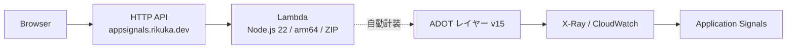
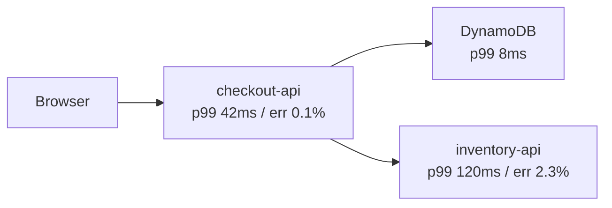
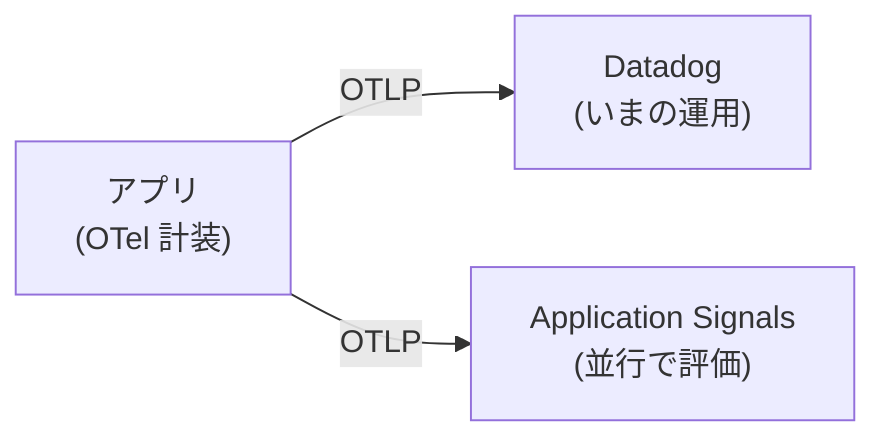

## はじめに

CloudWatch Application Signals は「コードを変更せずにアプリケーションの可観測性が得られる」と説明されます。実際どこまでゼロなのかを確かめたくて、**React Router(SSR)を Lambda に載せて**試しました。

結論を先に書くと、**アプリのコードは 1 行も触っていません**。ただしそこに至るまでに、ドキュメントを読んだだけでは気づきにくい壁が 2 つありました。

- **コンテナイメージの Lambda では使えない**
- **ESM のアプリは、そのままだと起動すらしない**

この記事では、その 2 つを踏んだ記録と、あわせて「Application Signals は結局 OpenTelemetry と何が違うのか」を整理します。

## 検証した構成



React Router 7 の SSR アプリを、**ZIP デプロイ**の Lambda に載せています。前段は HTTP API のカスタムドメイン。リージョンは東京です。

## 壁 1: コンテナイメージにはレイヤーを付けられない

Application Signals の Lambda 統合は、**ADOT のレイヤー**として配られます。コンソールで「Enable」を押すと、裏でこの 3 つが行われます。

1. ADOT レイヤーの追加
2. `AWS_LAMBDA_EXEC_WRAPPER=/opt/otel-instrument` の設定
3. 実行ロールへ `CloudWatchLambdaApplicationSignalsExecutionRolePolicy` の付与

ここで問題になるのが、**Lambda のコンテナイメージにはレイヤーを付けられない**という制約です。

SSR を Lambda で動かすとき、Lambda Web Adapter を使ってコンテナで配る構成はよくあります。私も普段はそうしています。しかし**その構成のままだと、このワンクリックが使えません**。

今回は検証対象がまさにそこなので、**ZIP デプロイに切り替えました**。React Router には API Gateway v2 のイベントを受けるアダプタがあるので、ハンドラはこれだけです。

```js
import { createRequestHandler } from "@react-router/architect";

export const handler = createRequestHandler({
  build: () => import("./build/server/index.js"),
  mode: process.env.NODE_ENV,
});
```

**これは計装ではなく、Lambda に載せるためのアダプタです。** 計装のために書いたコードはゼロ、という主張はここでは崩れていません。

なお、コンテナでどうしても行きたい場合は ADOT をイメージに焼き込む道はありますが、その時点で「ワンクリック」ではなくなります。

## 壁 2: ESM では起動しない

React Router のビルド出力は ESM です(`"type": "module"`)。そして AWS のドキュメントには、はっきりこう書かれています。

> To enable Application Signals, you recommend that you use the **CJS module format** because OpenTelemetry JavaScript's support of ESM is experimental and a work in progress.

ESM で使う場合は、この起動オプションが要求されます。

```
NODE_OPTIONS="--import @aws/aws-distro-opentelemetry-node-autoinstrumentation/register --experimental-loader=@opentelemetry/instrumentation/hook.mjs"
```

これを設定してデプロイしたところ、**500 が返り、関数が起動すらしませんでした**。

```
Error [ERR_MODULE_NOT_FOUND]: Cannot find package
'@aws/aws-distro-opentelemetry-node-autoinstrumentation' imported from /var/task/
INIT_REPORT Init Duration: 204.88 ms  Phase: invoke  Status: error
Error Type: Runtime.ExitError
```

原因は `imported from /var/task/` の部分です。**ESM の `--import` は、パッケージをアプリ側(`/var/task`)から解決します。** レイヤーは `/opt` に展開されるので、そこにあるだけでは見つかりません。

解決策は、**同じパッケージをアプリの依存としても入れる**ことでした。

```bash
npm install @aws/aws-distro-opentelemetry-node-autoinstrumentation @opentelemetry/instrumentation
```

これで起動し、レスポンスも返るようになりました。

```
$ curl -o /dev/null -w "%{http_code}\n" https://appsignals.rikuka.dev/
200
```

ドキュメントにも「ESM の場合はこの 2 つを依存に含めること」と書かれてはいます。ただ **「コンソールでワンクリック」からは最も遠い作業**で、ESM のアプリでは実質的に手作業が発生します。CJS 推奨と書かれている理由が実地で確認できました。

## 結果

反映まで 10 分ほど待つと、サービスとして認識されました。

```
$ aws application-signals list-services --region ap-northeast-1 ...
[
    {
        "Environment": "lambda:default",
        "Name": "appsignals-lab-ssr",
        "Type": "Service"
    }
]
```

オペレーション単位でも出ています。

```
$ aws application-signals list-service-operations ...
[
    "appsignals-lab-ssr/Invocation"
]
```

コンソール側(CloudWatch → Application Signals → Services)では、このサービスが一覧に並び、レイテンシ・リクエスト数・可用性・エラー率/フォルト率のグラフが出ます。Lambda の場合はオペレーションが `Invocation` の 1 つだけなので、**グラフは出るがマップは点が 1 つ**という状態です。

**アプリのコードは無改変です。** React Router のルートもコンポーネントも触っていません。その意味で「ゼロコード計装」は本当でした。

## IaC で書くと何が効いているか見える

コンソールの Enable はブラックボックスなので、SAM テンプレートに明示的に書きました。

```yaml
Ssr:
  Type: AWS::Serverless::Function
  Properties:
    Runtime: nodejs22.x
    Layers:
      - arn:aws:lambda:ap-northeast-1:615299751070:layer:AWSOpenTelemetryDistroJs:15
    Environment:
      Variables:
        # レイヤーを起動時に噛ませる。これが無いと計装されない
        AWS_LAMBDA_EXEC_WRAPPER: /opt/otel-instrument
        # 単なる X-Ray トレースではなく Application Signals として出す
        OTEL_AWS_APPLICATION_SIGNALS_ENABLED: "true"
        OTEL_SERVICE_NAME: appsignals-lab-ssr
    Policies:
      - arn:aws:iam::aws:policy/CloudWatchLambdaApplicationSignalsExecutionRolePolicy
```

環境変数の名前を見ると分かるとおり、**中身は OpenTelemetry です**。

## Application Signals は実質 OTel なのか

ほぼそうです。計装層は本物の OTel で、AWS 製の味付けが乗っています。

`@opentelemetry/instrumentation` は素の OTel パッケージですし、ADOT は OTel のディストリビューション(Amazon Linux が Linux であるのと同じ関係)です。**Go・PHP・Ruby に至っては、AWS が「標準の OTel SDK を使え」と明言しています。** ADOT すら用意されていません。

AWS 独自なのは 3 つです。

**保管先。** OTLP で吐いたものを、レイヤーや CloudWatch Agent が受けて **X-Ray のセグメントと CloudWatch メトリクスに変換**します。OTLP ネイティブで貯まるわけではありません。

**メトリクスの作り方。** span から Latency / Error / Fault / Request count を、決まった次元(`Service` / `Operation` / `RemoteService` / `RemoteOperation`)で自動生成します。`OTEL_AWS_APPLICATION_SIGNALS_ENABLED=true` が切り替えているのは主にここです。

**画面。** サービスマップと SLO は AWS 側の機能で、OTel には無い概念です。

### 新しいのはどこか

サービスマップ自体は X-Ray に前からありましたし、トレース・メトリクス・ログの統合画面も ServiceLens がやっていました。**大半は既存部品の組み合わせ**です。

新しいのは次の 3 つだと思います。

**span から RED メトリクスを生成する「規約」。** トレースは前からありましたが、そこから決まった次元でメトリクスを切り出すのは自前の作業でした。言語やプラットフォームが違っても同じ形で出てくるのが効きます。

**SLO とエラーバジェットが AWS のリソースになったこと。** CloudWatch にアラームはありましたが、SLO・達成率・バーンレートという原語はありませんでした。`AWS::ApplicationSignals::ServiceLevelObjective` として CFN で作れます。

**サービス識別のモデル。** X-Ray のサービスマップはトレースから推測したノードでしたが、Application Signals は `aws.local.service` という属性で**明示的に名乗らせます**。だから ECS でも Lambda でも EC2 でも同じ粒度で並びます。

## サービスマップは何を見ているか

サービス同士の呼び出し関係を、実際のトラフィックから自動で描いた図です。誰も構成を宣言しません。



span 1 本ごとに「自分が誰か」(`aws.local.service`)と「どこを呼んだか」(`aws.remote.service`)が属性で入っていて、それを集計するとグラフになります。AWS SDK の呼び出しも計装されるので、**DynamoDB や S3 もノードとして出ます**。

### 壊れる条件

**context を渡し損ねると線が切れて、ノードが孤立します。** これは実務でいちばん効く落とし穴です。

Go のドキュメントには、この注意が明示されています。

```go
http.NewRequest(...)              // ❌ traceparent が乗らない → 別トレース扱い
http.NewRequestWithContext(ctx,)  // ⭕️ 繋がる

db.Query(...)                     // ❌ SQL が親を見失う
db.QueryContext(ctx, ...)         // ⭕️
```

マップが分断されているときは、**サービスが落ちているのではなく context が落ちている**ことが多い。

## 言語によって「ゼロ度」が大きく違う

今回 Node.js で試して楽だったのは、AWS 製の ADOT があるからです。言語によって事情がかなり違います。

| 言語 | 計装 | Lambda |
|---|---|---|
| Java / Python / .NET / Node.js | AWS 製 ADOT | ⭕️ |
| Go / PHP / Ruby | **素の OTel + Transaction Search** | ❌(Lambda 統合の対象外) |

とくに Go は注意が要ります。Lambda 統合の対応ランタイムに含まれず、**Fargate でも eBPF が使えないため動きません**(ホストカーネルに触れない)。EC2 なら可能ですが、上に書いた `NewRequestWithContext` への書き換えや、AWS SDK への `otelaws.AppendMiddlewares` の追加が必要です。

```go
// 自動計装は AWS SDK を見ないので、ここは自分で書く
otelaws.AppendMiddlewares(&cfg.APIOptions)
```

**「ゼロコード計装」と言いつつ、Go ではコードを触ります。** 記事や公式のサンプルが Python なのは、おそらくそこが理由です。

さらに `db.system` 属性が未対応のため、依存先が `UnknownRemoteService` と表示される既知の制限もあります。

## Datadog APM から乗り換える価値はあるか

既に Datadog が回っているなら、**乗り換えの価値は薄い**というのが率直な感想です。

Application Signals が出すのは RED メトリクス・サービスマップ・SLO・トレースで、それだけです。Datadog にある継続プロファイラ、全 span のライブ検索、ログや RUM とのタグ横断相関、異常検知は含まれません。**「遅い」を見つけるところまでは両方できますが、「なぜ遅いか」を掘る道具の数が違います。**

そして移行コストは機能差より重い。計装を入れ替えるだけでは終わらず、ダッシュボード・モニター・SLO・アラートのルーティング・ランブックといった、**チームが画面を前提に作ってきたもの全部**が作り直しになります。

検討に値するのは次の条件が揃うときです。

- **コストが痛い**(ホスト課金 + span 課金はサービス数に比例する)
- **AWS だけ・サーバーレス中心・Java/Python/.NET/Node**

逆に **Go が多いなら止めたほうがいい**。上に書いたとおり、置き場所が EC2 に限られるうえコード修正が要ります。

### 中間の手

計装だけ OTel に寄せて、**バックエンドは Datadog のまま**にする手があります。Datadog は OTLP を受けられるので、運用を止めずに並行評価できます。



今回の検証で分かったのは、**ロックインしているのは計装ではなく「サービスマップと SLO の作り方」の側**だということです。であれば、先に計装を外に出しておくのが一番安全な順序になります。

## まとめ

- **アプリのコードは 1 行も触らずに済んだ。** その意味でゼロコード計装は本当
- ただし **コンテナイメージでは使えない**(レイヤーが付けられない)
- **ESM では起動すらしない。** パッケージをアプリ側の依存にも入れる必要がある
- 中身は OpenTelemetry。AWS 独自なのは **RED メトリクスの規約・サービス識別・SLO**
- **言語によってゼロ度が大きく違う。** Go はコードを触るし、Lambda では使えない
- 既存の Datadog からの全面移行は、コストが主動機でない限り釣り合いにくい

検証に使ったコードは手元の private リポジトリに置いてあります。SAM テンプレートにコンソールの Enable 相当を明示的に書いてあるので、何が効いているのかは読めば分かる形にしました。
