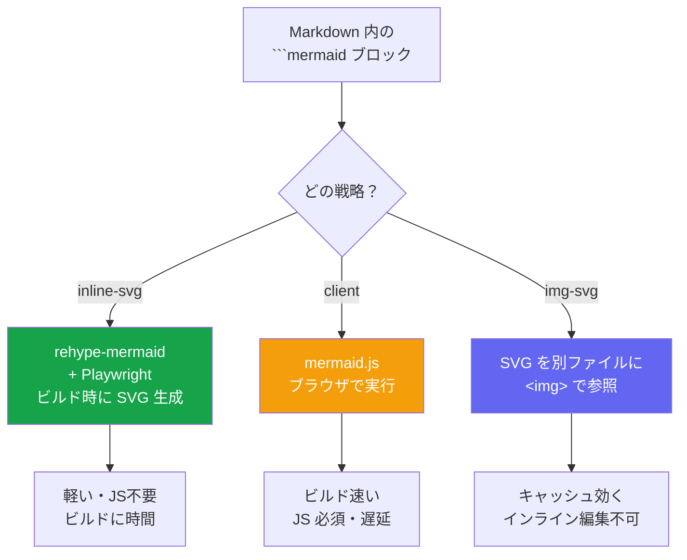
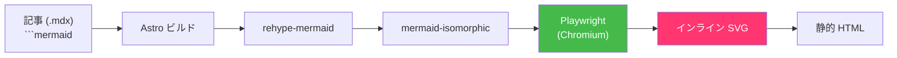
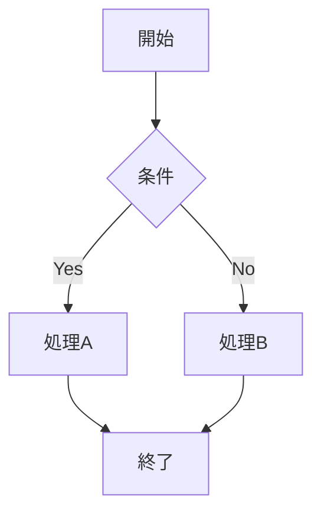
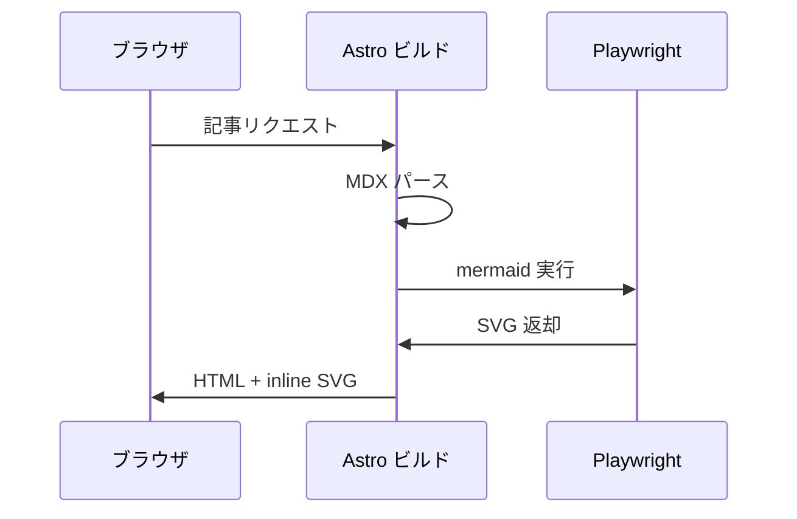
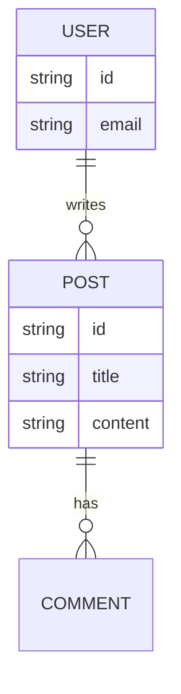
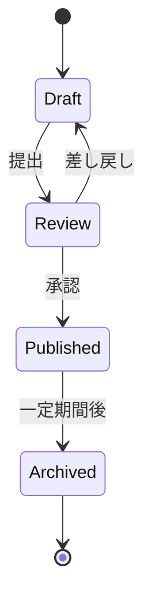

## はじめに

Astro で構築したブログに Mermaid 図を埋め込みたい。ただし：

- ページを軽くしたい（JS で実行したくない）
- 検索エンジンに読める形にしたい（SSR/SSG で SVG を埋め込む）
- Markdown/MDX の中にそのまま書きたい

これを満たすのが **rehype-mermaid + Playwright でビルド時に SVG 変換**する構成です。この記事では、選択肢の比較と具体的なセットアップを整理します。

## 選択肢の比較



| 戦略 | メリット | デメリット |
|------|---------|----------|
| **inline-svg (推奨)** | ページが軽い、JS 不要、SEO に強い | ビルド時間が伸びる、Playwright 依存 |
| **client** | ビルドが速い、ツール不要 | JS 必須、描画が一瞬遅れる、SEO が弱い |
| **img-svg** | キャッシュが効く | インライン編集できない、手間 |

## アーキテクチャ

今回の構成はこうなります。



ビルド時に Playwright でヘッドレスブラウザを起動し、Mermaid を実行して SVG を生成、HTML に埋め込みます。最終成果物は純粋な HTML + SVG なので、ユーザーのブラウザで JS は一切動きません。

## セットアップ手順

### 1. パッケージのインストール

```bash
npm install rehype-mermaid playwright
npx playwright install chromium
```

`rehype-mermaid` の内部で `mermaid-isomorphic` が Playwright を使うので、両方必要です。

### 2. astro.config.mjs を更新

```js
import { defineConfig } from 'astro/config';
import react from '@astrojs/react';
import mdx from '@astrojs/mdx';
import rehypeMermaid from 'rehype-mermaid';

export default defineConfig({
  integrations: [react(), mdx()],
  markdown: {
    syntaxHighlight: {
      type: 'shiki',
      excludeLangs: ['mermaid'],  // mermaid ブロックは Shiki でハイライトしない
    },
    rehypePlugins: [
      [rehypeMermaid, { strategy: 'inline-svg' }],
    ],
  },
});
```

ポイントは `excludeLangs: ['mermaid']`。これがないと Shiki が先に mermaid ブロックをシンタックスハイライトしてしまい、rehype-mermaid が処理できなくなります。

### 3. GitHub Actions で Playwright をインストール

CI でビルドする場合、Playwright の Chromium が必要です。

```yaml
# .github/workflows/deploy.yml
jobs:
  deploy:
    runs-on: ubuntu-latest
    steps:
      - uses: actions/checkout@v4
      - uses: actions/setup-node@v4
        with:
          node-version: 22
          cache: npm

      - run: npm ci

      # ← これを追加
      - name: Install Playwright Chromium
        run: npx playwright install --with-deps chromium

      - run: npm run build
```

`--with-deps` で Chromium 実行に必要な Linux ライブラリも自動インストールされます。

## 動作確認

ビルドして SVG が埋め込まれているか確認：

```bash
npm run build
grep -c '<svg' dist/blog/your-post/index.html
```

数字が出れば SVG が埋め込まれています。

## 記法

記事の中では普通の fenced code block として書くだけ。

````markdown

````

レンダリング結果：


## 対応している図の種類

Mermaid が対応している図なら何でも書けます。

### シーケンス図



### ER 図



### 状態遷移図



## 注意点

### ビルド時間が伸びる

記事数 × 図の数だけ Chromium が起動するので、大量の図があるとビルドが遅くなります。キャッシュ戦略も検討の余地あり。

### テーマのカスタマイズ

デフォルトのテーマが合わない場合、Mermaid の設定で変更できます。

```js
rehypeMermaid({
  strategy: 'inline-svg',
  mermaidConfig: {
    theme: 'dark',
    themeVariables: {
      primaryColor: '#6366f1',
      primaryTextColor: '#fff',
    },
  },
})
```

### Shiki との衝突

`syntaxHighlight.excludeLangs` で mermaid を除外しないと、Shiki が先にハイライト処理してしまって rehype-mermaid が動きません。これにハマりました。

```js
markdown: {
  syntaxHighlight: {
    type: 'shiki',
    excludeLangs: ['mermaid'],  // 必須
  },
}
```

### ローカル開発時

`npm run dev` でも Playwright が起動するので、初回は少し待たされます。以降はキャッシュされます。

## まとめ

- Astro の Markdown/MDX で Mermaid を扱うなら **rehype-mermaid の inline-svg 戦略**が最適
- Playwright の Chromium でビルド時に SVG を生成、HTML に埋め込み
- 成果物は純粋な HTML + SVG で、ブラウザで JS は動かない
- CI では `npx playwright install --with-deps chromium` を忘れずに
- `syntaxHighlight.excludeLangs: ['mermaid']` が落とし穴
- 対応する図の種類が豊富で、設計ドキュメントにも技術記事にも活用できる
