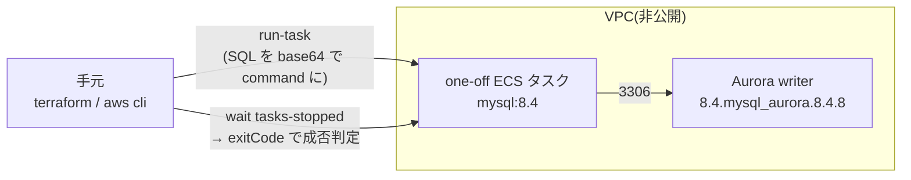
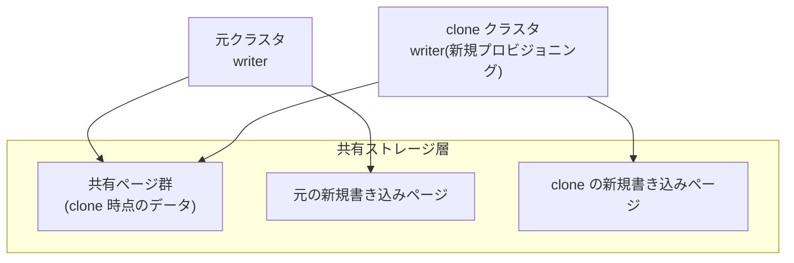

本番 DB を Aurora MySQL にする前提で、確かめたいことが2つあった。

**1つめ: ローカル MySQL で固めたマイグレーション規約が、Aurora でそのまま通用するか。**
[検証リポジトリ](https://github.com/rikukaInoue/greenfield)では「デプロイに同梱する
DDL は `ALGORITHM=INSTANT` で通る形に揃える。通らない変更は例外として個別計画する」
と決めていて、どの DDL が INSTANT で通るかはローカルの MySQL 8.4.11 で実測してある。
Aurora はストレージ層を独自実装した別物なので、**この判定が1つでも違えば規約は
本番で崩れる**。持ち込めるかどうかは測らないと分からない。

**2つめ: fast clone は何分で使えるか。** フィーチャーフラグとオンラインマイグレーション
で運用するとき Aurora clone が要るのか——要るとして、デプロイのたびに作る部品なのか、
たまに使うリハーサル環境なのか。これは機能の有無ではなく**所要時間**で決まる話なので、
実際に clone して計るしかない。

使い捨てのクラスタを立てて両方測った。

## 前提: オンライン DDL の3方式と、ALGORITHM を明示する理由

MySQL 8 系の `ALTER TABLE` には3つの実行方式があり、**どれで実行されるかで本番影響が桁で変わります**。

| 方式 | 何をするか | 所要とロック |
|---|---|---|
| **INSTANT** | メタデータの書き換えのみ。行データに触らない | 数十 ms。行数に依存しない |
| **INPLACE** | テーブルを再構築するが、多くは並行の読み書きを許す | 行数に比例。DML は概ね継続可 |
| **COPY** | テーブルを丸ごと作り直してコピー | 行数に比例して長い。並行 DML は制限される |

方式は DDL の種類ごとに決まっていて、指定しなければ MySQL が「通る中で一番軽いもの」を選びます。これが罠で、**軽い方式で通るつもりだった DDL が黙って COPY に落ちても、成功してしまう**。だからマイグレーション規約では `ALGORITHM=INSTANT` を明示します。通らない方式を明示すると `ERROR 1845` で**失敗する** — つまり「この DDL はどの方式か」という判定そのものがエラーの有無として返ってきます。本記事の測定でもこの性質をそのまま使っています。

もうひとつの前提として、リポジトリのマイグレーションは expand / contract の2系統に分かれています（新旧アプリが同居できる形に先に広げ、旧が消えてから縮める）。デプロイに同梱されるのは expand 側で、そこに置いてよい DDL を「INSTANT で通る形」に制限している、というのが冒頭の規約です。

## 交絡を消す: Aurora にも 8.4 互換版がある

Aurora MySQL の主流はバージョン 3 系（MySQL 8.0 互換）だが、それを選ぶと測定結果の差が
「Aurora の差」なのか「8.0 と 8.4 の差」なのか切り分けられない。エンジン一覧を見ると
**8.4 互換の `8.4.mysql_aurora.8.4.8`** が存在したので、これを選んで
Aurora だけを変数にした。比較対象は手元の MySQL 8.4.11（コンテナ）。

8.4 互換版があるかは、エンジン一覧を CLI で引くと分かります。

```sh
aws rds describe-db-engine-versions --engine aurora-mysql   --query 'DBEngineVersions[].EngineVersion' | grep 8.4
# → "8.4.mysql_aurora.8.4.8" が居る
```

構成は Terraform 約170行の使い捨てスタック（VPC + Aurora db.t4g.medium 1台 +
one-off ECS タスク）。DB は非公開のままにして、SQL は VPC 内の one-off タスク
（mysql:8.4 イメージ、スクリプトを base64 で command に渡す）で流す。



DB を公開せずに済み、測定の成否は one-off タスクの exit code で機械判定できます。
測定 DDL はこの形で流しました。

```sql
-- 2,097,152 行のテーブルに対して。通らない方式なら ERROR 1845 が返る
ALTER TABLE t ADD COLUMN c INT NULL, ALGORITHM=INSTANT;
ALTER TABLE t ADD CONSTRAINT ck CHECK (c >= 0), ALGORITHM=INPLACE; -- → 1845
ALTER TABLE t ADD CONSTRAINT ck CHECK (c >= 0), ALGORITHM=COPY, LOCK=SHARED;
```

apply → 計測 → destroy を当日で回し、費用は $0.3 前後だった。

## 実測1: ALGORITHM の判定は完全一致

2,097,152 行のテーブルに、マイグレーション規約が扱う典型の DDL を
ALGORITHM 明示で適用した。明示するのは、通らない方式なら ERROR 1845 で
**判定そのものが結果として返る**ため:

| DDL | Aurora 8.4.8 | MySQL 8.4.11 |
|---|---|---|
| ADD COLUMN（NULL 許容）INSTANT | ok 48ms | ok 58ms |
| ADD KEY INPLACE | ok 8.6s | ok 2.9s |
| ALTER COLUMN … SET DEFAULT INSTANT | ok 41ms | ok 35ms |
| ADD CHECK INSTANT | ERROR 1845 | ERROR 1845 |
| ADD CHECK INPLACE | ERROR 1845 | ERROR 1845 |
| ADD CHECK COPY, LOCK=SHARED | ok **56.4s** | ok 7.0s |
| DROP COLUMN INSTANT | ok 124ms | ok 44ms |

**どの方式が通るかは1行も違わなかった。** INSTANT で通る形に揃えるマイグレーション
規約は、RDS MySQL でも Aurora でもそのまま成り立つ。

所要時間の絶対値はハードが違うので横の比較はできない（手元は Apple Silicon、
向こうは db.t4g.medium）。読む価値があるのは COPY の絶対値の方で、
**2M 行で 56 秒**なら1億行では 45 分超の見積もりになる。「ADD CHECK は COPY のみ」は
本番規模では gh-ost / pt-online-schema-change か保守時間の計画対象、という判断が
Aurora でも変わらないことが確認できた。

## 実測2: fast clone は5分34秒、待ちの8割はインスタンス

fast clone は Aurora 固有の複製機能です。Aurora はストレージ層が計算ノードから
分離されているため、clone は**ストレージを物理コピーしない**。元クラスタと同じ
ストレージページを共有したまま新クラスタを作り、どちらかが書いた時点で
そのページだけ分岐します（copy-on-write）。



つまり「複製の速さ」はデータ量に依存せず、待ち時間の正体は**クラスタ作成と
インスタンスのプロビジョニング**になるはず。それを確かめるため、2M 行入りの
クラスタを実際に clone して区間ごとに計った:

```sh
aws rds restore-db-cluster-to-point-in-time   --source-db-cluster-identifier greenfield-74   --db-cluster-identifier greenfield-74-clone   --restore-type copy-on-write --use-latest-restorable-time ...
aws rds create-db-instance --db-cluster-identifier greenfield-74-clone ...
```

| 区間 | 所要 |
|---|---|
| clone クラスタが available になるまで | 60 秒 |
| clone 内の DB インスタンスが available になるまで | 274 秒 |
| **合計（接続可能になるまで）** | **5 分 34 秒** |

ストレージの複製は copy-on-write なので、最初の 60 秒は**データ量に依存しない**。
残りはインスタンスのプロビジョニングで、これもデータ量と無関係の固定費。つまり
fast clone の所要時間は、データが 2M 行でも 2 億行でもおおむねこの水準に留まる。

独立性も確認した。clone 側で `SELECT COUNT(*)` → 2,097,152 行をそのまま継承。
clone へ目印の行を INSERT → 元クラスタには現れない（行数・当該行とも波及なし）。
copy-on-write の「読みは共有・書きは分岐」がそのまま観測できる。

## 位置づけ: clone はデプロイの部品ではなくリハーサル用

測る前の問いは「フィーチャーフラグとオンラインマイグレーションで運用するなら
Aurora clone が要るのか」だった。数字が出ると答えは素直で:

- デプロイのたびに clone を作る運用は、毎回 5〜6 分 + clone 側インスタンスの課金が
  乗る。デプロイ側の答えは Blue/Green・カナリアとマイグレーションの失敗ゲート
  （[ECS ネイティブの実測](/blog/ecs-native-bluegreen-canary/)）であって、clone ではない
- clone の出番は**リハーサル**にある。本番同等データで COPY 系 DDL の所要時間を
  事前に測る、壊す予行をする、という用途なら、データ量に依存せず5分半で
  本番同等の使い捨て DB が出てくるのは十分に速い

## 自分の環境で確かめるなら

1. **規約の判定表を作る**: 自分のマイグレーションに出てくる DDL の種類を列挙し、開発 DB で `ALGORITHM=INSTANT` 明示で流す。1845 が返るものが「例外として個別計画する」対象
2. **COPY の絶対値を測る**: 対象テーブルの本番行数に近いデータで COPY 系を1回流し、保守時間に収まるか見積もる（この記事の 2M 行 56 秒が起点になる）
3. **本番規模での見積もりは fast clone で**: 本番と同じデータ量の使い捨て DB が約5分半で出てくる。DDL リハーサル・壊す予行はここでやる。終わったら clone クラスタごと削除（インスタンス課金だけが乗る）

## まとめ

- Aurora MySQL 8.4 互換版と MySQL 8.4.11 で、ALGORITHM の判定は完全一致。
  INSTANT 前提のマイグレーション規約はそのまま持ち込める
- ADD CHECK は Aurora でも COPY のみ。2M 行 56 秒という絶対値が計画の材料になる
- fast clone は接続可能まで 5 分 34 秒、所要はデータ量にほぼ依存しない。
  デプロイの部品ではなく、本番同等データでのリハーサル用
