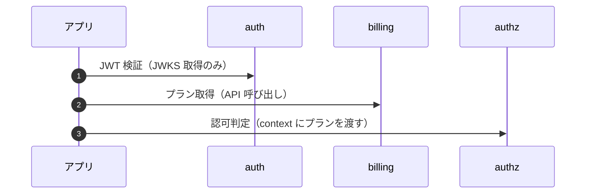
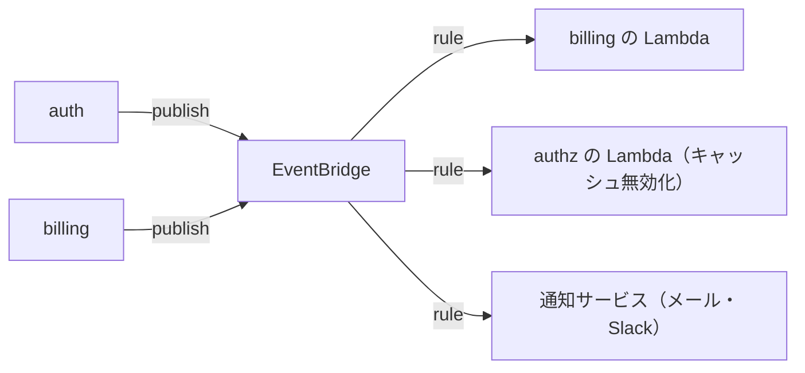
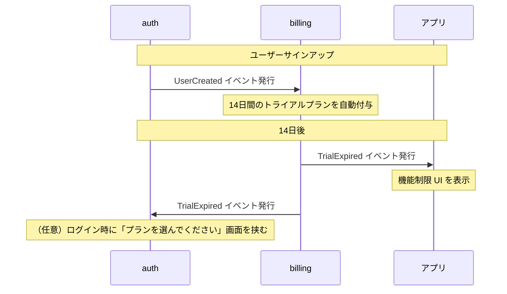
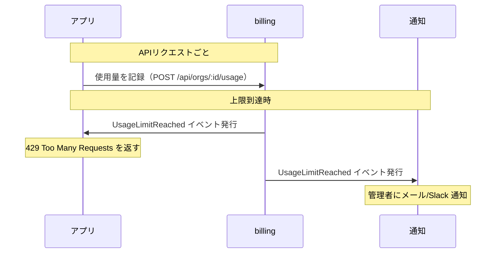
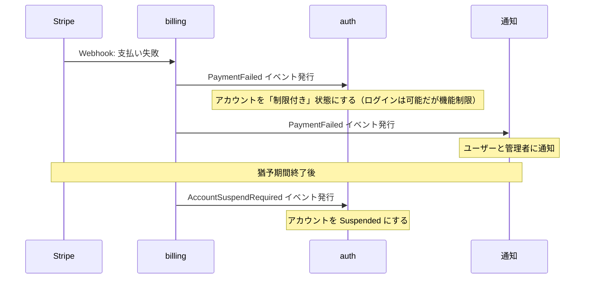
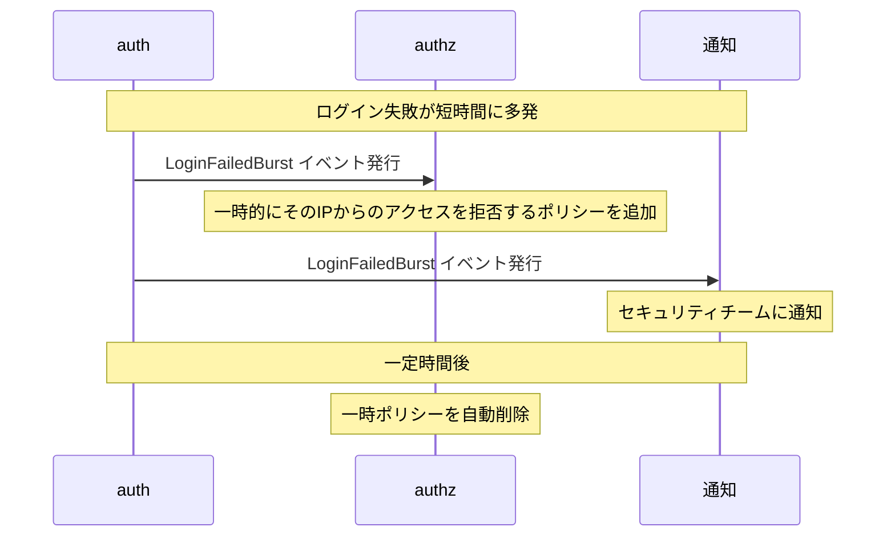
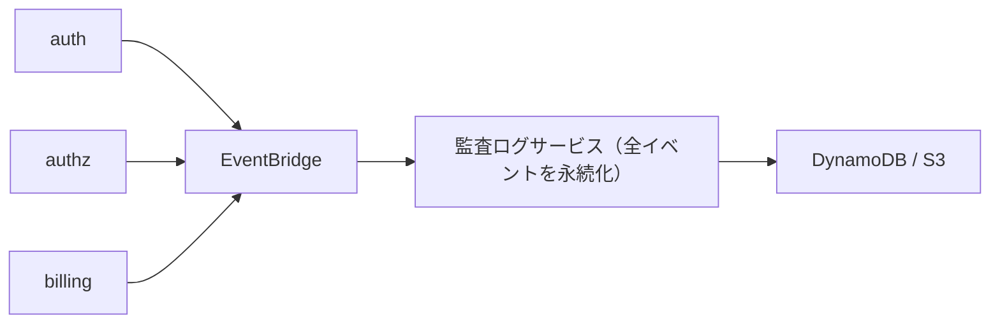
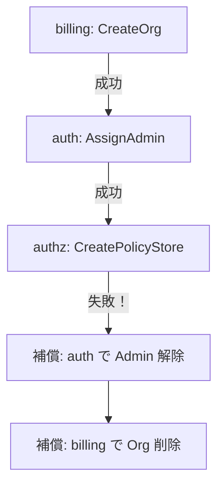
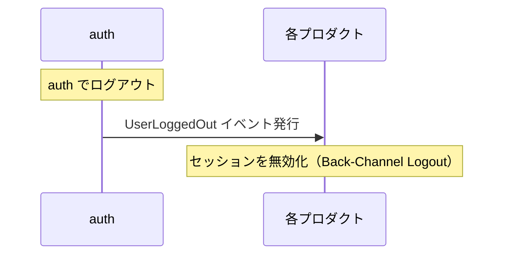
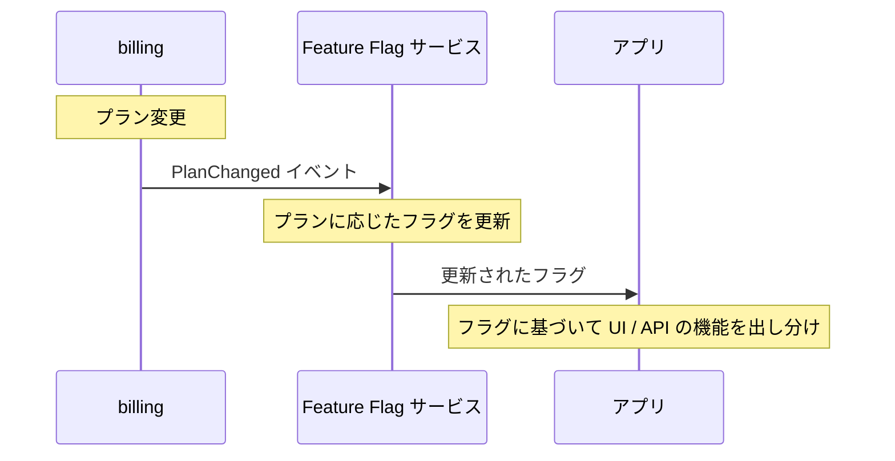

## はじめに

マルチプロダクト基盤を「認証・認可・課金」の3サービスに分離する設計は前回の記事で整理しました。次の問いは「この3つをどう繋ぐか」です。

選択肢は大きく3つ：

1. **同期 API** — リクエスト処理中に呼び出す
2. **イベント駆動** — 非同期で通知する
3. **共有データベース** — 同じ DB を読み書きする

この記事では、それぞれの特性と判断基準を整理した上で、現時点で実装済みの部分だけでなく **未実装だがいずれ必要になる要件** も含めた設計方針を示します。

## 大原則: アプリが組み立てる

3サービスが直接通信するのではなく、**プロダクト（アプリ）がオーケストレーターになる**のが基本設計です。



auth / authz / billing の3つは互いを知らない。アプリが「auth から得た sub」と「billing から得た plan」を組み合わせて、authz に context として渡す。

この設計の利点：

- 3サービス間に依存がない
- どれか1つを差し替えても他に影響しない
- 各サービスのテストが独立でできる

## 共有データベースを選ばない理由

「同じ DB に書けば簡単じゃない？」という誘惑がありますが、これは3つに分けた意味を根本から否定します。

| 問題 | 具体例 |
|------|--------|
| 結合度が最大 | billing のスキーマ変更で authz が壊れる |
| デプロイが連動 | 1つのマイグレーションで3サービス止まる |
| 責任境界が曖昧 | このテーブルはどのサービスが所有者？ |
| スケーリングが困難 | auth のトラフィックが billing の DB を圧迫 |
| 障害の伝播 | DB の障害で全サービスが同時に死ぬ |

**3つに分けたなら、データストアも分ける。** これは原則です。

## 同期 API とイベントの使い分け

| | 同期 API | イベント |
|---|---|---|
| いつ使う | リクエスト処理中に結果が必要 | 結果を待たなくていい |
| 例 | プラン取得、認可判定 | ユーザー削除通知、キャッシュ無効化 |
| 失敗時 | エラーをユーザーに返す | リトライ（DLQ で補償） |
| 結合度 | 中（API 仕様に依存） | 低（イベントスキーマだけ） |
| 一貫性 | 強い（同期なので即時反映） | 結果整合性（遅延あり） |

判断基準は単純です：

- **「この結果がないとレスポンスを返せない」** → 同期 API
- **「知っておいてほしいが、結果は待たなくていい」** → イベント

## 通信マトリクス（現状 + 将来）

### 同期 API（アプリ → サービス）

| 呼び出し | 用途 | 実装状況 |
|---------|------|---------|
| アプリ → auth | JWT 検証（JWKS） | 実装済み |
| アプリ → authz | 認可判定（IsAuthorized） | 実装済み |
| アプリ → billing | プラン取得 | 未実装 |
| アプリ → billing | 使用量取得（上限チェック） | 未実装 |
| アプリ → billing | エンタイトルメント取得 | 未実装 |

### イベント（サービス → サービス）

| イベント | 発行元 | 消費側 | 用途 | 実装状況 |
|---------|-------|-------|------|---------|
| UserCreated | auth | billing | 組織にデフォルトプラン設定 | 未実装 |
| UserDeleted | auth | billing | 組織の最後のユーザーなら課金停止検討 | 未実装 |
| UserSuspended | auth | billing, authz | アクティブユーザー数の更新、セッション無効化 | 未実装 |
| PlanChanged | billing | authz | 認可キャッシュの無効化 | 未実装 |
| PlanChanged | billing | アプリ | UI の機能制限切り替え | 未実装 |
| UsageLimitReached | billing | アプリ | 上限到達の通知、機能制限 | 未実装 |
| PolicyCreated/Deleted | authz | 監査ログ | ポリシー変更の記録 | 未実装 |
| LoginFailed (多数) | auth | authz, 通知 | 不正アクセス検知、アカウントロック | 未実装 |
| PaymentFailed | billing | auth, 通知 | 支払い失敗時のアカウント制限 | 未実装 |
| TrialExpired | billing | auth, アプリ | トライアル期限切れの処理 | 未実装 |

## イベント基盤の選択

### AWS での選択肢

| サービス | 特徴 | 向いてるケース |
|---------|------|-------------|
| **EventBridge** | ルールベースのルーティング、スキーマレジストリ | サービス間イベント（推奨） |
| **SNS + SQS** | Pub/Sub + キューイング | ファンアウト + バッファリング |
| **SQS 単体** | シンプルなキュー | 1対1の非同期処理 |
| **Step Functions** | ワークフローオーケストレーション | 複雑な多段処理 |

### 推奨: EventBridge

3サービス + 将来のサービス追加を考えると、**EventBridge が最適**です。



理由：

- Lambda との統合がネイティブ
- イベントパターンでフィルタリングできる（全イベントを全サービスが受け取る必要がない）
- スキーマレジストリでイベント定義を管理できる
- サーバーレスで固定費なし

### イベントスキーマの例

```json
{
  "source": "rellf-auth",
  "detail-type": "UserDeleted",
  "time": "2026-04-12T10:00:00Z",
  "detail": {
    "sub": "550e8400-e29b-41d4-a716-446655440000",
    "email": "user@example.com",
    "reason": "user_requested",
    "deletedBy": "admin:taishi"
  }
}
```

```json
{
  "source": "rellf-billing",
  "detail-type": "PlanChanged",
  "time": "2026-04-12T11:00:00Z",
  "detail": {
    "orgId": "org-abc",
    "previousPlan": "free",
    "newPlan": "pro",
    "changedBy": "admin:taishi",
    "effectiveAt": "2026-04-12T11:00:00Z"
  }
}
```

## 未実装だがいずれ必要になる要件

### 1. トライアル管理



トライアルの状態管理は billing の責任です。auth がトライアル期限を知る必要はなく、billing が「期限切れ」イベントを出せば、各サービスが反応する形になります。

### 2. 使用量ベースの制限



使用量の記録は**同期 API**で行いますが、上限到達の通知は**イベント**で行います。毎リクエストで上限チェックする場合は billing API を同期で叩く必要がありますが、レスポンス速度が気になるならキャッシュ + イベントで上限変更時だけ無効化する方式もあります。

### 3. 支払い失敗時のアカウント制限



支払い失敗でいきなりアカウントを停止するのではなく、**猶予期間**を設けるのが一般的です。この状態遷移は billing が制御し、auth はイベントを受けて実行するだけ。

### 4. 不正アクセス検知



auth 単体でのレート制限に加えて、authz と連携した動的なポリシー追加で多層防御を実現します。

### 5. 監査ログの統合



3サービスのイベントをすべて監査ログサービスに流して永続化します。SOC 2 や ISO 27001 の要件で「誰が何をいつしたか」を追跡可能にする必要がある場合に必須です。

### 6. マルチテナント対応

```
[テナント（組織）作成]
  billing: 組織を作成、デフォルトプランを付与
  auth: 組織に初期管理者を紐付け
  authz: 組織専用の Policy Store を作成
```

テナント作成はイベントだけでは足りず、**Saga パターン**（各サービスでの処理を順番に実行し、失敗時は補償トランザクション）が必要になる場面です。



これは Step Functions で実装するのが適切です。

### 7. SSO セッション連携



OIDC の Back-Channel Logout を実装する場合、auth が各プロダクトの `back_channel_logout_uri` に POST を送ります。これは同期通信ですが、失敗してもログアウトの UX に影響を与えない設計にする必要があります。

### 8. 機能フラグとの統合



エンタイトルメントと Feature Flag を統合すると、プラン変更が即座に機能の有効/無効に反映されます。LaunchDarkly などの Feature Flag サービスとの連携、または自前の仕組みで実装します。

## 段階的な実装ロードマップ

| フェーズ | 通信方式 | 実装内容 |
|---------|---------|---------|
| **Phase 1（現在）** | 同期 API のみ | アプリ → auth / authz / billing の API 呼び出し |
| **Phase 2** | + EventBridge | UserDeleted → billing、PlanChanged → authz キャッシュ無効化 |
| **Phase 3** | + 監査ログ | 全イベントの永続化 |
| **Phase 4** | + Saga | マルチテナント作成、支払い失敗時の状態遷移 |
| **Phase 5** | + Back-Channel | SSO ログアウト連携 |

Phase 1 で実運用を始めて、**実際の問題が発生したタイミング**で次のフェーズに進むのが現実的です。「ユーザー削除したのに billing にゴミが残る」が起きたら Phase 2 へ、「監査要件が来た」ら Phase 3 へ。

## イベント設計の原則

### 1. イベントは「何が起きたか」であって「何をしてほしいか」ではない

```
# 良い: 事実を伝える
{ "detail-type": "UserDeleted", "detail": { "sub": "user-123" } }

# 悪い: 命令を伝える
{ "detail-type": "DeleteBillingAccount", "detail": { "sub": "user-123" } }
```

事実を伝えれば、受信側が何をするかは受信側の責任です。発行側は受信側の存在を知らなくていい。

### 2. イベントに十分な情報を含める

受信側がイベントを処理するために発行元に API を叩き返す必要があるなら、イベントの情報が不足しています。

```json
// 良い: 必要な情報が揃ってる
{
  "detail-type": "PlanChanged",
  "detail": {
    "orgId": "org-abc",
    "previousPlan": "free",
    "newPlan": "pro",
    "effectiveAt": "2026-04-12T11:00:00Z"
  }
}

// 悪い: orgId だけだと billing API を叩き返す必要がある
{
  "detail-type": "PlanChanged",
  "detail": { "orgId": "org-abc" }
}
```

### 3. べき等に処理する

同じイベントが2回届いても結果が変わらないように設計します。EventBridge は at-least-once delivery なので、重複配信は前提です。

### 4. 失敗に備える

DLQ（Dead Letter Queue）を設定し、処理失敗したイベントを退避させます。後からリプレイできるようにしておくと、障害復旧が楽になります。

## まとめ

- **基本は「アプリが同期 API で組み立てる」**で十分。3サービスが直接通信する必要はほとんどない
- **共有データベースは使わない**。3つに分けた意味がなくなる
- **イベントは「副作用の通知」に使う**。ユーザー削除、プラン変更、不正検知など
- **EventBridge** がサーバーレス環境に最適。Lambda との統合がネイティブ
- **未実装の要件**（トライアル、使用量制限、支払い失敗、不正検知、監査ログ、マルチテナント）はイベント駆動で対応するものが多い
- **段階的に実装する**。Phase 1 の同期 API だけで運用を始め、実際の問題が発生したら次のフェーズへ
- イベントは「事実の通知」「十分な情報」「べき等処理」「DLQ による障害対策」の4原則で設計する
