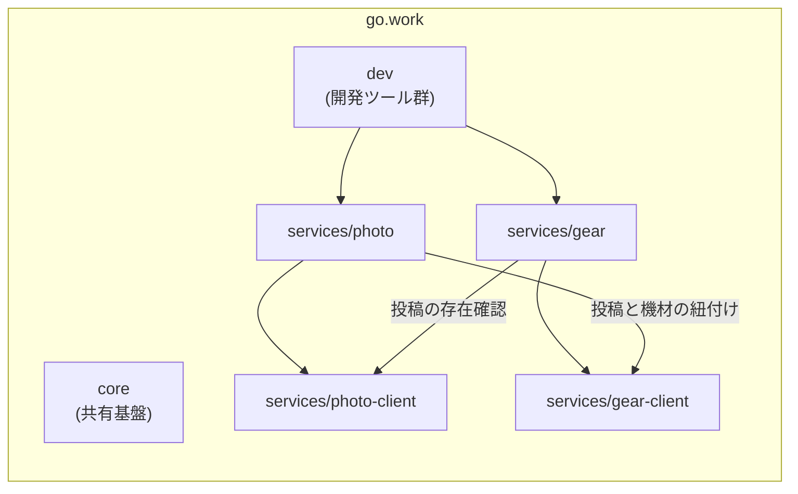
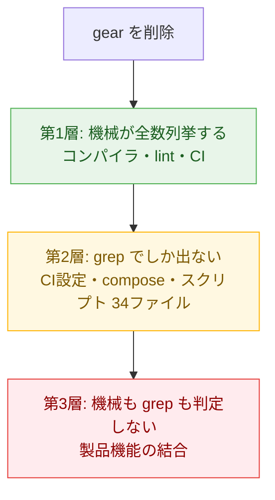

## はじめに

進化的アーキテクチャの議論は「変化に適応できる構造を作る」ことを目標に置きますが、実際にチェックされるのはたいてい**追加**です。新しいサービスを scaffold できるか、新しい境界を増やせるか。しかし進化の本丸は逆方向 — **境界を引き直す瞬間**にあります。ドメインの理解が進んで「この境界は間違いだった」と分かったとき、除却や切り出しが本当に安くできるのか。

私の検証環境（Go の9モジュールモノレポ）にも「go.work 内のモジュール再編は1PRで済み、安い」という一文が設計規約に**主張のまま**置いてありました。追加は検証済み、引き直しは未検証。そこで、実際にサービスを1つ消してみるドリルをやり、主張を実測値に置き換えました。この記事はその記録です。

## 実験の設定

対象は9モジュール構成のモノレポです。写真サービス（photo）と機材サービス（gear）が中心で、サービス間は公開 API 経由のみ・各サービスは Client モジュールを提供する、という境界規律を CI が機械的に強制しています。



やることは2方向です。

- **A. 除却ドリル**: gear をリポジトリから消したとき、何が・どの検出器で捕まるかを全数列挙する
- **B. 切り出しドリル**: gear を別リポジトリへ移す想定で、消費側（photo）の参照をローカル結線から公開バージョン参照に切り替えるコストを測る

どちらもブランチ上で完結させ、main には触れません。「消してみる」は破壊なしでできる実験です。

## A. 除却: diff は65ファイル、検出は3層に分かれる

`git rm` でサービス2モジュール（gear + gear-client）を消し、go.work から2行削除。diff は **65ファイル・−4,135行**でした。ここから起きることを追うと、残った参照の検出がきれいに3層に分かれます。



### 第1層: 機械が止める（ここは本当に安い）

コンパイラが残存参照を**全数**エラーとして列挙しました。photo の機材紐付けコード、dev ツールの参照 — 探す必要がなく、エラー一覧がそのまま作業リストになります。加えて、宙に浮いた `replace` ディレクティブを lint が3件検出し、モジュール間の結線に矛盾がある限り CI の変更判定ジョブ自体が落ちる。

ひとつ予想が外れた点があります。事前の期待は「CI の対象判定（affected）が gear を**自動で対象から外す**」でしたが、実際は結線の矛盾を検出した時点で**ハードフェイル**でした。黙って縮小するより安全側です — 追従漏れが green のまま滑り込む余地がない。

### 第2層: grep でしか出ない（作業の本体はここ）

コンパイルが通る領域に、**34ファイル・約230参照**が残りました。CI 定義に23、compose 一式（DB 初期化 SQL、認証設定、リバースプロキシ、監視）に約30、検証スクリプト12本に約90、API 仕様の生成物が3ファイル。

この層には検出器がありません。除却 PR のレビューは実質この grep 棚卸しがすべてで、**「1PR」の作業量の大半はコード削除ではなくここ**にあります。コードの境界はモジュール機構が守ってくれますが、CI・インフラ定義・運用スクリプトはその外側にいる。

### 第3層: 機械も grep も判定しない（プロダクト結合）

最後に残るのが、photo の「投稿と機材の紐付け」機能です。これは gear-client を import する**製品機能**であり、gear を完全に消して green にするには、この機能ごと消すという判断が要ります。それはアーキテクチャの問題ではなくプロダクトの問題で、どんな機構もこの判断を安くはできません。

ただし、機構ができることはあります: **その判断が必要であることを、コンパイルエラーの形で列挙する**こと。「gear を消すなら、この3箇所の機能について決めてください」という一覧が機械的に得られる — 除却ドリルの成果物として、これがいちばん価値がありました。

## B. 切り出し: go.mod 4行、コマンド2つ、コード変更ゼロ

次は逆に、gear を「消す」のではなく「別リポジトリへ引っ越す」想定です。焦点は消費側で、photo が使う gear-client の参照を、モノレポ内のローカル結線（`replace` ディレクティブ）から公開バージョン参照に切り替えます。

```
$ go mod edit -dropreplace github.com/.../services/gear-client
$ go get github.com/.../services/gear-client@<コミットSHA>
  → v0.0.0-20260930053423-7a34e3a に解決
$ GOWORK=off go build ./...
  → 成功。photo のコードは1文字も変えていない
```

diff は **go.mod 2行 + go.sum 2行**。タグを打つ必要すらありません（公開リポジトリなら任意コミットの pseudo-version がモジュールプロキシで解決できます)。

なぜこんなに安いのか。偶然ではなく、2つの規律の配当でした。

1. **CI が毎回 `GOWORK=off` で各モジュールを単体ビルドしていた**。go.work の束ねに依存した「モノレポ内でしか成立しない go.mod」を4ヶ月間ずっと禁止してきたので、公開消費に耐える形が最初からできていた
2. **サービス間の消費が Client モジュール経由に揃っていた**。切り替え点が1モジュールに集約されているので、依存の考古学（どこで何をどう参照しているかの発掘作業）が発生しない

副作用もひとつ見つかりました。同一リポジトリのプレフィックスを持つ依存が `replace` なしになるため、「ローカル結線の張り忘れ」を検出する既存の lint がこれを誤検出します。本当に切り出す日には、切り出し済みモジュールの許可リストを lint に足す手順が1つ増える — これも測ったから分かったことです。

## 「安い」の内実は層で違う

ドリル前の規約の一文はこうでした:

> go.work 内のモジュール再編（境界の引き直し）は同一リポジトリ内の1PRで済み、安い。

実測後、こう書き換えました:

> 1PRには収まる。ただし「安い」の内実は層で違う。コード結線はコンパイラと lint が残存参照を全数列挙するので実際に安い。CI・compose・スクリプトの参照（34ファイル）は grep 棚卸しが作業の本体。製品機能の結合はプロダクト判断としてモジュール機構の外に残る。

一般化すると: **モジュール機構が安くするのは配線までで、機能の結合は判断として残る。機構の仕事は、その判断を全数列挙して見えるようにすること**です。

もうひとつ、この種の主張は放っておくと現実から乖離します。たとえば「共有依存のバージョンは揃える」という運用宣言に対して、実際に測ったら共有依存71件中3件が乖離していました。宣言でなく機械に観測させる（全 go.mod を読んで乖離を毎 PR 報告する数十行のツールを CI に置く）ことで、規約文書が現実の観測結果と一致し続けます。この「制約を機械に住まわせる」考え方は[Architecture as Code という捉え方](/blog/architecture-as-code/)に書きました。

## 自分のリポジトリで測るには

このドリルはどんなリポジトリでも30分でできます。破壊はありません。

1. ブランチを切り、消したいモジュール/パッケージ/ディレクトリを `git rm` する
2. ビルドを走らせ、**コンパイラが列挙したエラーを全部記録する**（第1層の実測）
3. 消した名前で `git grep -c -i <名前>` し、コンパイラが挙げなかったファイルを数える（第2層の実測）
4. エラー一覧の中から「直せば済むもの」と「機能ごと消す判断が要るもの」を分ける（第3層の実測）
5. ブランチを捨てる。数字だけ持ち帰る

第2層が大きいほど、コードの外（CI・インフラ定義・スクリプト）に検出器のない結合が溜まっているサインです。第3層が空でないなら、それは境界設計の失敗ではなく、そこにプロダクトの意思決定が埋まっているという地図です。

## まとめ

- 進化的アーキテクチャの検証は「追加できるか」に偏りがち。本丸である**境界の引き直し**（除却・切り出し）は、ブランチ上のドリルで破壊なしに実測できる
- 除却の実測: 65ファイル・−4,135行。検出は3層に分かれ、機械が全数列挙する層は安い、grep でしか出ない34ファイルが作業の本体、製品機能の結合は機構の外
- 切り出しの実測: 消費側は go.mod 4行 + コマンド2つ・コード変更ゼロ。毎回の単体ビルド検証と Client モジュール経由の規律が、この安さの正体
- 「安い」と主張するなら測る。測れないなら、まだ主張ではなく願望

関連: [デプロイ分離はなぜ開発生産性を上げるのか](/blog/deploy-isolation-developer-productivity/)（この構造が日々の生産性に効く仕組み）、[モノリスのデータ切り出しは3段階で考える](/blog/monolith-data-carving-three-stages/)（データ側の切り出し）、[Architecture as Code という捉え方](/blog/architecture-as-code/)（制約を機械に住まわせる）
