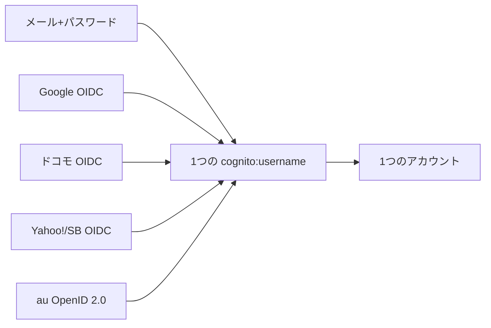
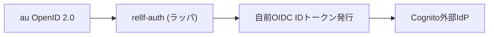
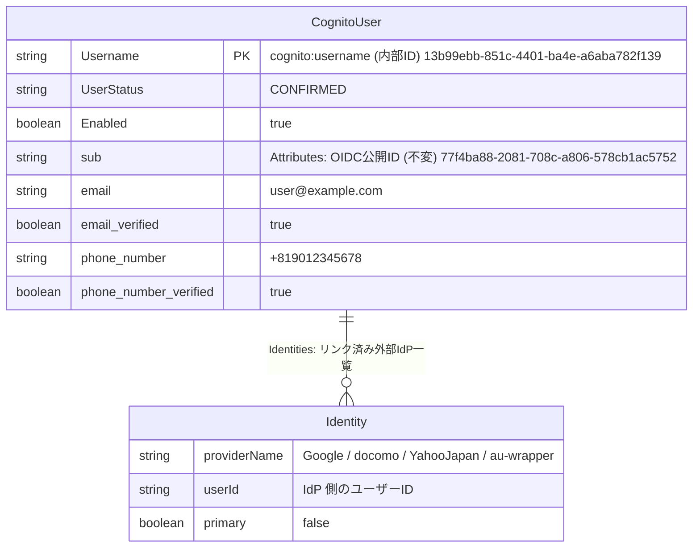
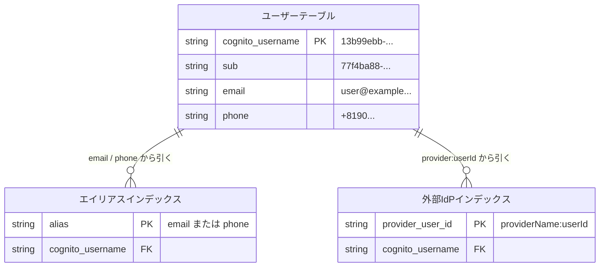
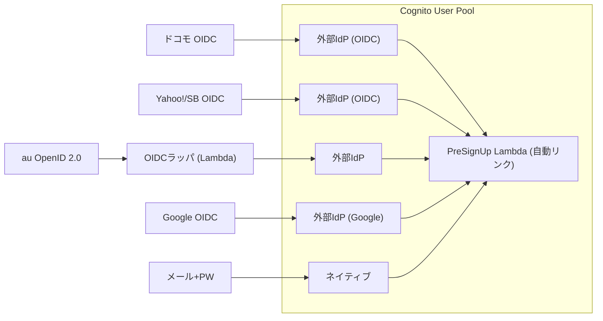
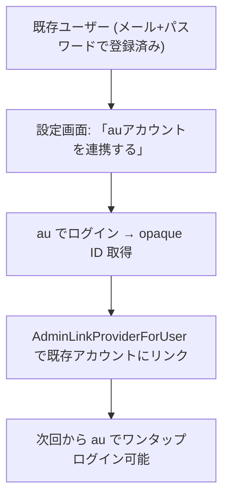
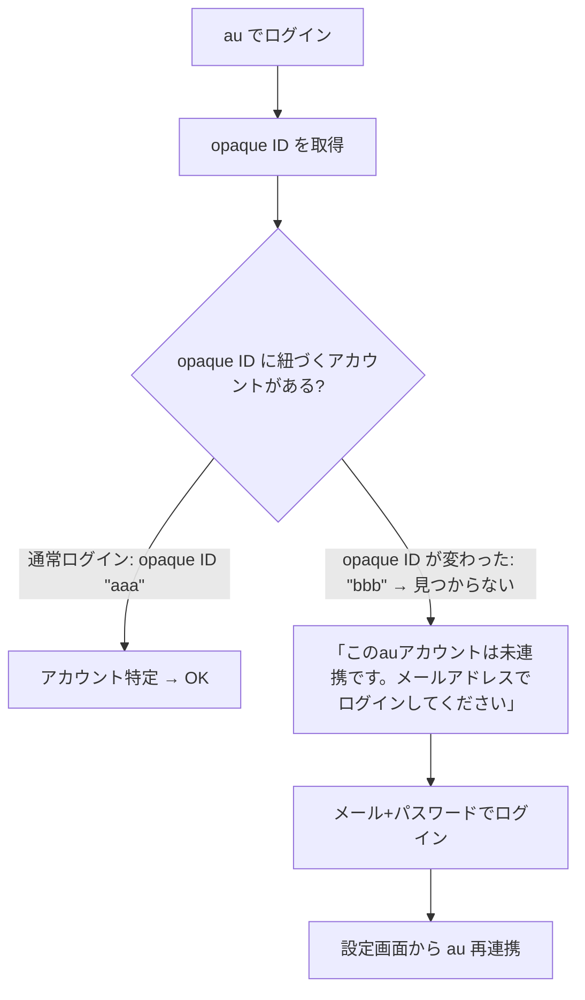

1人のユーザーが、メール+パスワード、Google、ドコモ、au、ソフトバンクのどれでログインしても同じアカウントにたどり着く — これをCognito User Poolの上で実現する設計を整理する。

---

## 目標



## 3キャリアのIdP仕様

まず現状を整理する。キャリアによって対応プロトコルと取得できる情報が全く違う。

| | ドコモ | au | ソフトバンク |
|---|---|---|---|
| **プロトコル** | OIDC (dアカウント・コネクト) | OpenID 2.0 | Yahoo! JAPAN YConnect v2 (OIDC) |
| **電話番号** | 取得可（有料属性） | **取得不可** | 要特別申請 |
| **メール** | 取得可（要認証取得） | **取得不可** | 取得可（openid email scope） |
| **返ってくるID** | OIDC sub（安定） | opaque ID（不安定） | OIDC sub（安定） |
| **署名方式** | HS256 | N/A | RS256 |
| **開発者登録** | 申請制（審査3営業日） | 契約必要 | セルフサービス |
| **ユーザー数** | dアカウント 9000万+ | — | Yahoo! JAPAN ID 5000万+ |

### ドコモ: dアカウント・コネクト

正規のOIDC。Cognitoに外部IdPとして直接登録できる。電話番号が取れるので、既存アカウントとの自動マッチングが可能。

ただし**IDトークンの署名がHS256**（共有シークレット方式）。CognitoのOIDC IdP連携がHS256を受け付けるか要検証。ダメな場合はrellf-auth側でトークンを検証してRS256で再署名するラッパが必要。

```
エンドポイント:
  Authorization: https://id.smt.docomo.ne.jp/cgi8/oidc/authorize
  Token:         https://conf.uw.docomo.ne.jp/common/token
  UserInfo:      https://conf.uw.docomo.ne.jp/common/userinfo
  Issuer:        https://conf.uw.docomo.ne.jp/
```

特筆すべきは**回線認証（かいせんにんしょう）**。ドコモ回線からアクセスすると、SIM情報で自動認証されてパスワード入力不要。Wi-Fi経由の場合はID+パスワード。

### au: OpenID 2.0（まだ）

一番厄介。2026年時点でもOpenID 2.0のまま。返ってくるのは:

- opaque ID（パートナーサイトごとに異なるランダムな識別子）
- ニックネーム
- 認証結果（成功/失敗）

**電話番号もメールも返さない。** opaque IDはau IDに紐づくが、au ID再設定やMNPで変わる可能性がある。

Cognitoに繋ぐにはOIDCラッパが必要:



### ソフトバンク: Yahoo! JAPAN YConnect v2

SoftBankユーザーは「スマートログイン」でYahoo! JAPAN IDと電話番号が紐づいている。サードパーティ向けにはYahoo! JAPAN YConnect v2（正規OIDC、RS256署名）を使う。

```
エンドポイント:
  Discovery: https://auth.login.yahoo.co.jp/yconnect/v2/.well-known/openid-configuration
  Issuer:    https://auth.login.yahoo.co.jp/yconnect/v2/
```

メールは取れる。電話番号は標準スコープでは取れず、特別申請が必要。

---

## Cognito 上のデータ構造

5つのログイン方法を統合すると、Cognitoのユーザーデータはこうなる。

`AdminGetUser` の結果をデータ構造として描くと以下になる（`sub` 以下は `Attributes`、`Identity` は `Identities` に対応）。



このユーザーにリンク済みの `Identities`:

| providerName | userId | primary |
|---|---|---|
| Google | 1234567890 | false |
| docomo | dac_xxxxxxxx | false |
| YahooJapan | yj_xxxxxxxx | false |
| au-wrapper | au_opaque_xxxxxxxx | false |

### Cognito 内部のインデックス構造（イメージ）



インデックスの中身はどれも同じ `cognito:username` を指す:

| インデックス | キー | → cognito:username |
|---|---|---|
| エイリアス | user@example.com | 13b99ebb-... |
| エイリアス | +819012345678 | 13b99ebb-... |
| 外部IdP | Google:1234567890 | 13b99ebb-... |
| 外部IdP | docomo:dac_xxxxxxxx | 13b99ebb-... |
| 外部IdP | YahooJapan:yj_xxxxxxxx | 13b99ebb-... |
| 外部IdP | au-wrapper:au_opaque_xx | 13b99ebb-... |

**どのログイン方法でも、同じ `cognito:username` に収束する。** これがCognitoのアカウント統合の全体像。

### IDトークンの変わる部分・変わらない部分

```json
// どのIdPでログインしても固定
{
  "sub": "77f4ba88-...",               // 常に同じ
  "cognito:username": "13b99ebb-...",  // 常に同じ
  "email": "user@example.com"          // 常に同じ
}

// ログイン方法で変わる
{
  "identities": "[{\"providerName\":\"Google\",...}]"  // Google経由
  "identities": "[{\"providerName\":\"au-wrapper\",...}]"  // au経由
  "identities": null  // メール+パスワード
}
```

`identities` クレームを見れば「今回どの方法でログインしたか」がわかるが、アプリ側のロジックでこれを気にする必要は基本ない。`cognito:username` で処理すれば入口の違いは吸収される。

`identities` を見る用途があるとすれば:
- **監査ログ**: 「今回はauからログインした」を記録
- **セキュリティ**: 普段と違うIdPからのログインを検知
- **設定画面UI**: 「Google連携中 ✓ / au連携中 ✓」の表示

---

## sub と cognito:username の違い（重要）

この設計で最もハマりやすいポイント。詳しくは[前回の記事](/blog/cognito-sub-vs-username/)に書いたが、要点だけ再掲する。

```json
{
  "sub": "77f4ba88-...",               // OIDC標準の不変ID。外部公開用
  "cognito:username": "13b99ebb-..."   // Cognito Admin APIの識別子。内部処理用
}
```

- **Admin API** (`AdminGetUser`, `AdminDisableUser` 等) → `cognito:username` を使う
- **外部公開** (OIDCトークンの sub, userinfo) → `sub` を使う

`sub` で `AdminGetUser` を呼ぶと `UserNotFoundException` になる。

---

## Cognito 統合アーキテクチャ



### Cognito IdP 登録

```hcl
# ドコモ
resource "aws_cognito_identity_provider" "docomo" {
  user_pool_id  = aws_cognito_user_pool.main.id
  provider_name = "docomo"
  provider_type = "OIDC"

  provider_details = {
    oidc_issuer       = "https://conf.uw.docomo.ne.jp/"
    client_id         = var.docomo_client_id
    client_secret     = var.docomo_client_secret
    authorize_scopes  = "openid email phone"
  }

  attribute_mapping = {
    email        = "email"
    phone_number = "phone_number"
    username     = "sub"
  }
}

# ソフトバンク (Yahoo! JAPAN)
resource "aws_cognito_identity_provider" "yahoo_japan" {
  user_pool_id  = aws_cognito_user_pool.main.id
  provider_name = "YahooJapan"
  provider_type = "OIDC"

  provider_details = {
    oidc_issuer       = "https://auth.login.yahoo.co.jp/yconnect/v2"
    client_id         = var.yahoo_client_id
    client_secret     = var.yahoo_client_secret
    authorize_scopes  = "openid email profile"
  }

  attribute_mapping = {
    email    = "email"
    username = "sub"
  }
}

# au (OIDCラッパ経由)
resource "aws_cognito_identity_provider" "au" {
  user_pool_id  = aws_cognito_user_pool.main.id
  provider_name = "au-wrapper"
  provider_type = "OIDC"

  provider_details = {
    oidc_issuer       = "https://auth.rikuka.dev/au-wrapper"
    client_id         = "au-internal"
    client_secret     = var.au_wrapper_secret
    authorize_scopes  = "openid"
  }

  attribute_mapping = {
    username = "sub"  # auのopaque ID
  }
}
```

---

## PreSignUp Lambda: 自動リンク戦略

新規ユーザーが外部IdPで来たとき、既存のネイティブアカウントと自動でリンクする。

```go
func preSignUp(event events.CognitoEventUserPoolsPreSignUp) {
    triggerSource := event.TriggerSource
    
    // 外部IdP経由のサインアップのみ処理
    if triggerSource != "PreSignUp_ExternalProvider" {
        return // ネイティブサインアップはスルー
    }
    
    provider := getProviderName(event)
    
    switch provider {
    case "docomo":
        // 電話番号で既存ユーザーを検索 → リンク
        phone := event.Request.UserAttributes["phone_number"]
        if phone != "" {
            linkByAttribute("phone_number", phone, event)
        }
        
    case "YahooJapan", "Google":
        // メールで既存ユーザーを検索 → リンク
        email := event.Request.UserAttributes["email"]
        if email != "" {
            linkByAttribute("email", email, event)
        }
        
    case "au-wrapper":
        // 電話番号もメールも取れない → 自動リンク不可
        // 新規アカウント作成。後からUI上で手動連携
    }
}

func linkByAttribute(attr, value string, event) {
    // 同じ属性値の既存ユーザーを検索
    users := cognitoClient.ListUsers(Filter: attr + " = \"" + value + "\"")
    
    if len(users) > 0 {
        // 既存アカウントにリンク
        cognitoClient.AdminLinkProviderForUser(
            DestinationUser: users[0].Username,
            SourceUser: {
                ProviderName: event.UserName のプロバイダー部分,
                ProviderAttributeValue: event.UserName のユーザーID部分,
            },
        )
    }
}
```

### 自動リンクの判断基準

| IdP | マッチングキー | 自動リンク | リスク |
|---|---|---|---|
| Google | メールアドレス | ✅ 可 | Googleがメール検証済みなので安全 |
| ドコモ | 電話番号 | ✅ 可 | キャリアが電話番号を検証済み。ただし番号再割当てリスクあり |
| Yahoo!/SB | メールアドレス | ✅ 可 | Yahoo!がメール検証済みなので安全 |
| au | なし | ❌ 不可 | opaque IDのみ。手動連携が必要 |

---

## 既存ユーザーへのIdP連携追加

新規登録より、既存ユーザーが後からキャリアを連携する方が自然なフロー。



```go
// POST /api/link/au
func LinkAu(c *gin.Context) {
    currentUser := getCurrentUser(c)  // ログイン中のユーザー
    auOpaqueID := c.Get("au_opaque_id")
    
    cognito.AdminLinkProviderForUser(
        DestinationUser: currentUser.CognitoUsername,
        SourceUser: {
            ProviderName:           "au-wrapper",
            ProviderAttributeValue: auOpaqueID,
        },
    )
}
```

rellf-auth に既にある `/api/link/google` と同じパターン。

---

## au の opaque ID の注意点

auのopaque IDは**安定した永続IDではない**。

- **au ID再作成** → opaque IDが変わる可能性
- **MNP（他社→au）** → 新しいau ID → 新しいopaque ID
- **解約→再契約** → 別のopaque ID
- **パートナーサイトごとに異なるID**（pairwise）

つまり opaque ID は「au IDのセッション的な識別子」であって、「この電話番号の持ち主」の永続的な識別子ではない。

### リカバリ設計



**メールか電話番号を1つ持っておけば、opaque IDが変わってもリカバリできる。** au連携はあくまで「便利なショートカット」として位置づけ、アカウントの軸にはしない。

---

## SECRET_HASH の計算（Confidentialクライアントの場合）

Cognitoクライアントにシークレットが設定されている場合、API呼び出しにSECRET_HASHを付ける必要がある。

```
SECRET_HASH = Base64(HMAC-SHA256(client_secret, USERNAME + client_id))
```

ここで `USERNAME` は **`InitiateAuth` に渡す値そのもの**。

```
メールでログイン    → computeSecretHash("user@example.com")
UUIDでログイン     → computeSecretHash("13b99ebb-...")
```

**`cognito:username` ではなく、リクエストに渡す値で計算する。** 同じユーザーでもログイン時の識別子が変われば SECRET_HASH も変わる。

SPAやモバイルアプリ（publicクライアント）ではシークレットなし + PKCEを使うので、SECRET_HASHの問題は発生しない。

---

## 実装の優先順位

| 優先度 | キャリア | 理由 |
|-------|---------|------|
| 1 | ドコモ | OIDC対応済み、電話番号取得可、dアカウント9000万+ |
| 2 | ソフトバンク | Yahoo! JAPAN OIDC経由、セルフサービスで開発可能 |
| 3 | au | OpenID 2.0ラッパ必要、属性ほぼなし、契約必要 |

auはOIDCに移行するまで見送るのも現実的な判断。opaque IDしか取れないなら、ユーザーにとっても「auでログイン → でもメール入力して」みたいなUXになり、メリットが薄い。

---

## まとめ

Cognitoの `AdminLinkProviderForUser` を使えば、複数のIdPを1つのアカウントに統合できる。ただし:

1. **自動リンクにはマッチングキーが必要** — メールか電話番号。auのように何も取れないIdPは手動連携のみ
2. **sub と cognito:username は別物** — Admin APIには cognito:username を使う
3. **SECRET_HASH はリクエストに渡すUSERNAMEで計算** — cognito:username ではない
4. **opaque ID に依存しすぎない** — リカバリ手段としてメールか電話番号を確保する
5. **既存ユーザーへの連携追加が先、新規登録の入口は後** — リスクが小さく、UXも自然
