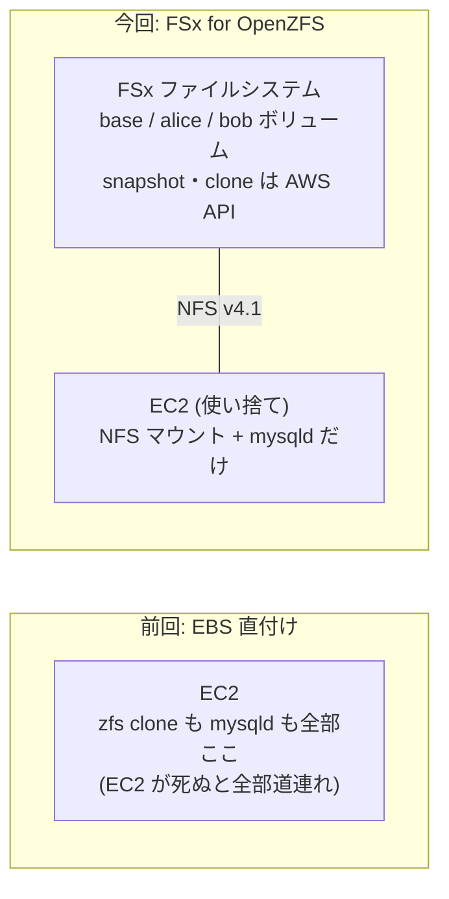
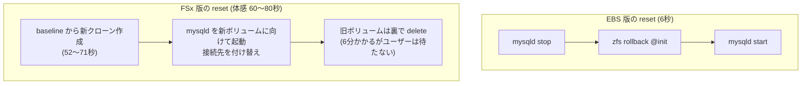
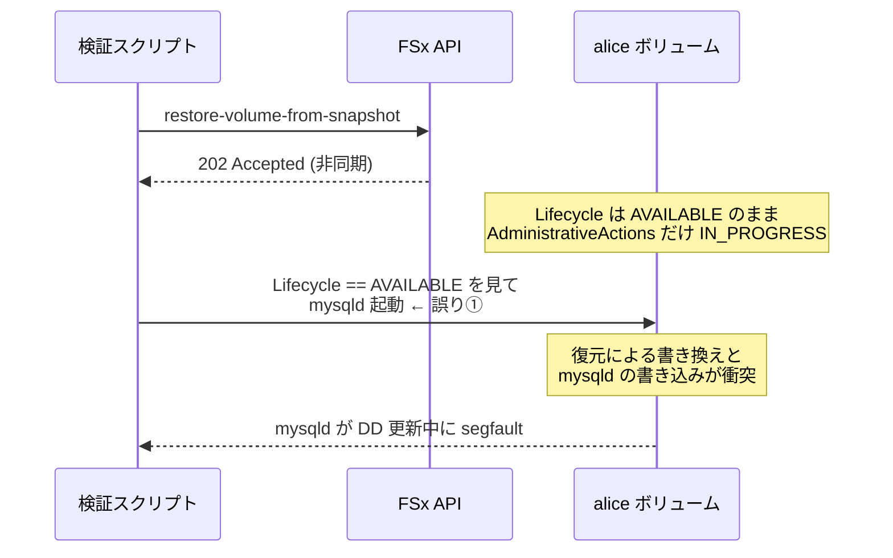

## 今北産業

1. ZFS のスナップショット/クローン(CoW)を使うと、MySQL のデータベースを **git のブランチのように「複製・壊す・巻き戻す・捨てる」できる**([MonotaRO Tech Blog の手法](https://tech-blog.monotaro.com/entry/2026/09/03/090000))
2. [前回](/blog/db-branch-zfs-mysql-poc/)、EC2 ローカルの ZFS で最小再現して **create 1.3 秒・コピーのディスク消費ほぼゼロ**を実測した
3. 今回ストレージを **FSx for OpenZFS に分離**して同じことをやったら、全操作が「秒」から「分」の世界になり、**reset の設計が根本から変わった**——という実測記録

## そもそも何が嬉しいのか

前提から書きます。開発や CI で「本物と同じスキーマ・同じデータ量の MySQL」を人数分・PR 数分だけ用意したい、という欲求は昔からあります。mysqldump からのリストアでは数分〜数十分かかるし、共有 DB を使い回すとテスト同士が汚染し合う。

そこで ZFS の Copy-on-Write が効いてきます。スナップショットからのクローンは**データをコピーせず差分だけを持つ**ので、何 GB の DB でも複製は一瞬・ディスク消費はほぼゼロ。クローンごとに mysqld を別ポートで立てれば、「PR ごとに使い捨ての本物 DB」が手に入ります。マイグレーションのレビューを実データ量で回せる(本番で長時間ロックする ALTER が事前に見つかる)のが一番おいしいところです。

前回はこれを EC2 に EBS を直付けした自前 zpool で最小再現しました。今回はその本命だった **FSx for OpenZFS 版**です。スナップショット/クローンを EC2 の中の `zfs` コマンドから `aws fsx` API に置き換えると、ストレージとコンピュートが分離され、DB ホストは「NFS マウントして mysqld を起動するだけ」の使い捨てになります。

構成は最小・最安で組みました。Single-AZ(gen1)・64GB SSD・64MB/s・自動バックアップ無効。東京リージョンでこの構成は**時間あたり約 6 円**なので、検証して即消しなら FSx でも缶ジュース以下です(実績: 約 1.5 時間で FSx + EC2 合わせて 20 円弱)。

## 結果: コントロールプレーンは「秒」ではなく「分」の世界

| 操作 | FSx 版 | EBS 直付け版 |
|---|---|---|
| ファイルシステム作成 | 5〜8 分(初回のみ) | zpool 数秒 |
| スナップショット | **37〜51 秒** | 瞬時 |
| クローン(create-volume) | **52〜71 秒** | 瞬時 |
| マウント + mysqld 起動 | 11〜12 秒 | 1.3 秒 |
| **create 合計(接続可能まで)** | **約 60〜80 秒** | **1.3 秒** |
| reset(restore-volume-from-snapshot) | **10 分超** | 6.1 秒 |
| delete(delete-volume) | **6 分 9 秒** | 1.1 秒 |
| 分離(alice 破壊 → bob 無傷) | ✅ 完璧 | ✅ 完璧 |

ZFS 本体の snapshot/clone は FSx の中でも瞬時のはずですが、FSx の API を通すと 1 操作 1〜6 分かかります。データパスの性能ではなくコントロールプレーンの待ち時間です。分離・データ整合性は EBS 版と同等に完璧で、NFS 越しの MySQL も普通に動きます(employees 30 万件の投入は 72 秒)。

つまり: **「PR open の 1 分後にブランチが生えている」は成立する。「対話的に秒で reset」は成立しない。** 同じ仕組みでも体験がまったく別物なので、用途で住み分けることになります。

## reset の設計が変わる

一番大きな設計変更はここです。EBS 版では `zfs rollback` が瞬時だったので「stop → rollback → start」で reset できました。FSx の対応物 `restore-volume-from-snapshot` は **10 分超かかる非同期処理**で、対話的な reset には使えません。

代わりに、クローン作成が 52〜71 秒である事実を使います。

**reset = 巻き戻し、ではなく reset = 作り直し + 付け替え。** 遅い操作(delete)を非同期に追い出して、ユーザーが待つのは速い操作(clone)だけにする。コントロールプレーンが遅い環境での定石がそのまま当てはまりました。

## 事故の記録: 復元中のボリュームに mysqld を起動してはいけない

正直に書くと、検証中に datadir を 1 回壊しました。原因は 2 つの誤りの合わせ技です。

- **誤り①: 完了判定に Lifecycle を見た。** restore 中もボリュームの Lifecycle は `AVAILABLE` のままで、進捗は `AdministrativeActions`(`VOLUME_RESTORE` の Status)にしか出ません。Lifecycle だけ見て「終わった」と判断し、復元中のボリュームに mysqld を起動してしまいました
- **誤り②: reset 用スナップショットを mysqld 稼働中に撮っていた。** 前回の教訓「ベースラインは正常終了後に撮る」を、ブランチの @init にも適用すべきでした(クローン直後・mysqld 起動前ならベースと同一のクリーン状態)

復旧はブランチの使い捨て性そのもので、delete + 再クローンの 7 分で完了。クリーンな baseline からの再クローンは、クラッシュリカバリゼロ・全データ健在で一発起動しました。壊しても数分で作り直せるという性質が、検証事故の復旧手段としてそのまま機能したのは面白いところです。

## 運用メモ(ハマりどころ)

- NFS export に `no_root_squash` が必要(datadir を `chown mysql` するため)。マウントは `nfsvers=4.1,rsize=1048576,wsize=1048576`
- FSx 用 SG は TCP/UDP の 111・2049・20001-20003 を、クライアント EC2 の SG 参照で開ける
- `delete-volume` のオプションは `DELETE_CHILD_VOLUMES_AND_SNAPSHOTS`。restore 用の `DELETE_INTERMEDIATE_SNAPSHOTS` と名前が紛らわしく、間違えると BadRequest
- 後片付けは `delete-file-system` に `SkipFinalBackup=true,Options=[DELETE_CHILD_VOLUMES_AND_SNAPSHOTS]` を付けると、全ボリューム・スナップショットごと一発で消える

## 結論

ストレージ/コンピュート分離という FSx 版の狙いは成立します。NFS 越しの MySQL は問題なく動き、クローンの正しさも EBS 版と同等。DB ホストが完全に使い捨てになるので、ホストを増やす・入れ替えるが自由になります。

ただし操作レイテンシが 2 桁違うので、こう住み分けるのが現実的です。

- **FSx 版**: PR 連動の自動プロビジョニング(open から 1〜2 分でブランチが生えれば十分な世界)
- **EBS 版 / ローカル ZFS**: 対話的に秒単位で create / reset したい開発者の手元・CI の中

次は PR 連動(GitHub Actions + SSM Run Command)で、この「分単位で生える」フローを実際に組んでみる予定です。
