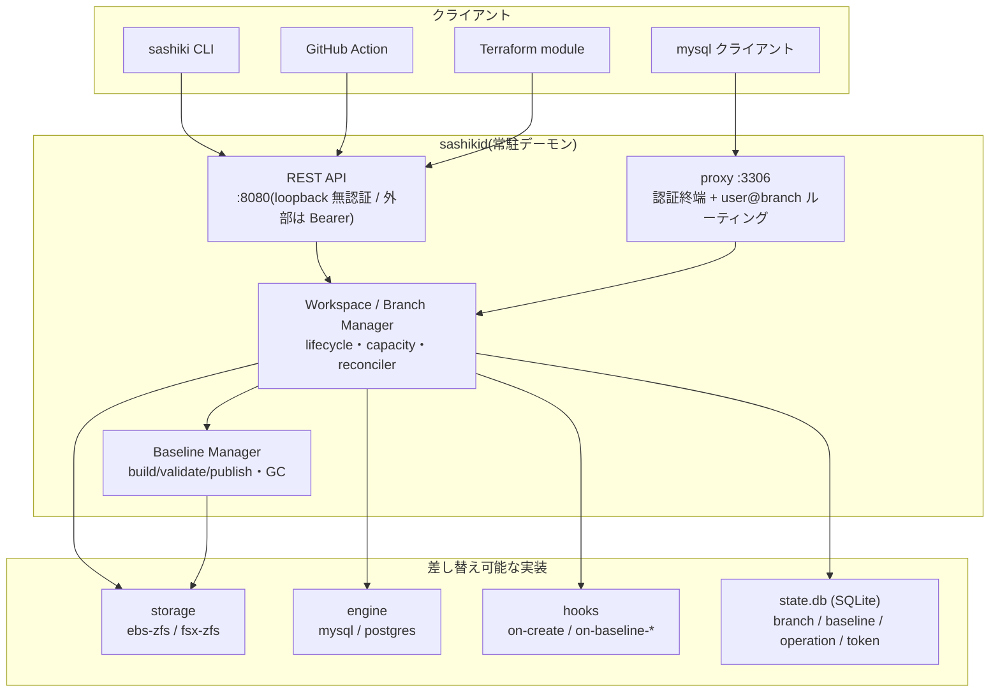
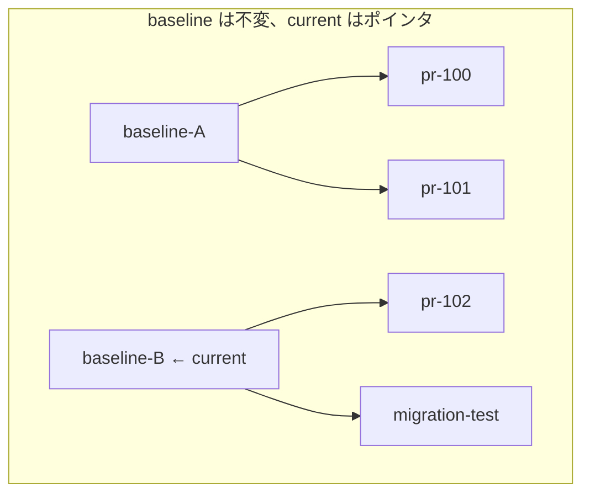
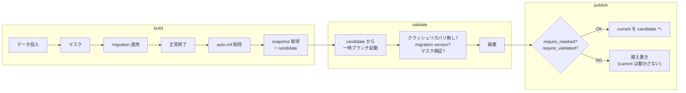
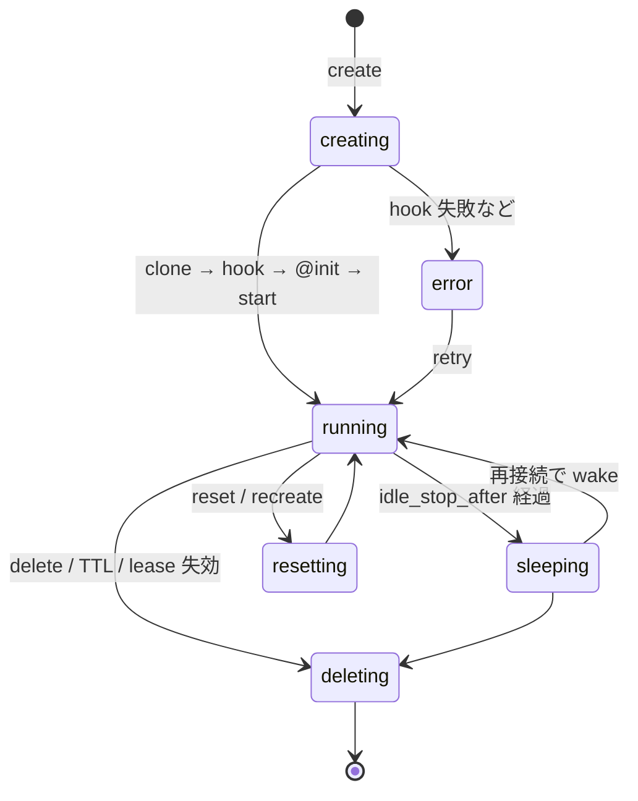
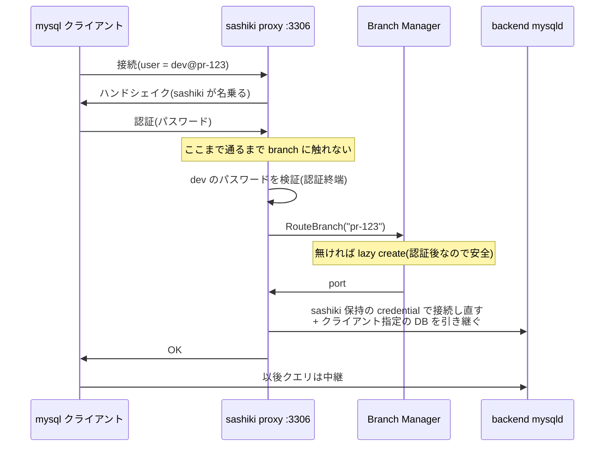
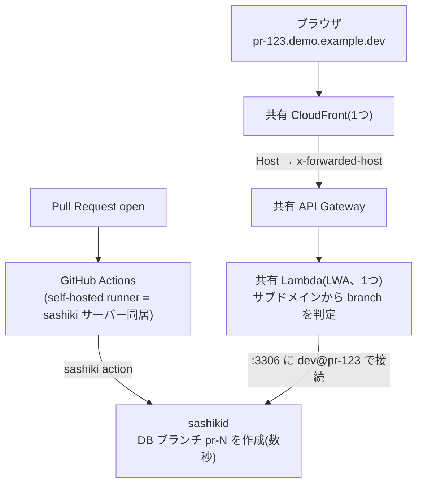
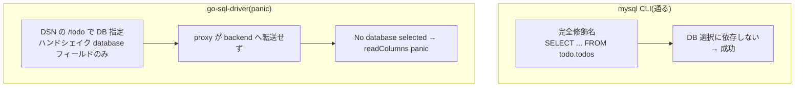

## TL;DR

1. ZFS のスナップショット/クローン(CoW)で MySQL を **git のブランチのように「複製・壊す・巻き戻す・捨てる」できる**話を、[PoC(EC2 ローカル ZFS で create 1.3 秒)](/blog/db-branch-zfs-mysql-poc/)→ [FSx for OpenZFS(全操作が分の世界)](/blog/db-branch-fsx-openzfs/)と検証してきた
2. これを**製品化して `sashiki` という OSS にし、v0.2.0 で公開した**。PR を開くと数秒で本物データ入りの MySQL プレビューが `pr-123.example.dev` のようなサブドメインで開くところまで AWS 実機で組んだ
3. その過程で **proxy の DB 転送バグ・接続の half-close** という「実運用でしか出ないバグ」を炙り出した——という記録。設計の学びと、正直な汎用性の限界も書く

> 📦 リポジトリ: **[github.com/rikukaInoue/sashiki](https://github.com/rikukaInoue/sashiki)**(Apache-2.0)

## PoC は「動く」、製品は「壊れても安全」

前々回・前回で「ZFS のクローンで DB ブランチが作れる」ことは実証しました。シェルスクリプト 100 行で `create foo` が動く。ではそれを毎日 PR プレビューで回せるかというと、全然別の話です。

PoC と製品の差は、ざっくり「動くこと」と「壊れても安全なこと」の差でした。PoC のスクリプトには、たとえばこういう穴があります。

- ポート割り当てを `ss -ltn`(listen 中のポート)で見ている → **アイドル停止したブランチは listen していないので、生きているブランチのポートを再割り当てしてしまう**
- ベースラインを稼働中の mysqld から撮ると、ブランチ起動のたびに InnoDB クラッシュリカバリが走る
- メモリが足りないと、新しいブランチが失敗するのではなく **既存の mysqld が OOM killer に殺される**(`max_branches` では防げない)
- 複数の PR が同時に接続してきたときのレース、デーモン再起動後の状態不整合、権限、認証……

こういう「ちゃんとやると必要になること」を全部詰めて、設計仕様としてまとめ直したのが製品版です。名前は `sashiki`(挿し木)にしました。ベースから枝を切って独立して育てる、というメタファがちょうど良かったので。

### sashiki は何か

一言でいうと **「開発環境向けの、ブランチできる RDS」** です。本番相当のサイズ・中身の MySQL を、Git のブランチのように数秒で作って壊して戻せる。ZFS の CoW を使うので何 GB でも複製は数百 KB。

Git との対応で見るのが一番わかりやすいと思います。

| Git | sashiki |
|---|---|
| main HEAD | current baseline |
| `git branch` | `sashiki create` |
| `git reset --hard` | `sashiki reset` |
| `git rebase main` | `sashiki recreate` |
| `git branch -D` | `sashiki delete` |

`reset` は「このブランチの作成直後に戻す」、`recreate` は「最新の baseline から作り直して追従する」。git の `reset --hard` と `rebase main` の違いがそのまま DB に対応します。

### 全体アーキテクチャ

コンポーネントの全体像はこうです。CLI / GitHub Action / Terraform はどれも同じ REST API(`sashikid`)を叩き、`sashikid` が storage / engine / hooks / state を束ねます。

**storage と engine はインターフェース**で、`Capabilities`(FastRollback / TypicalCreate / AsyncDelete …)を宣言し、コアがそれを見て挙動を切り替えます。同じ `reset` でも、ZFS の rollback は数秒、FSx は再クローン方式、と実装が変わるのはこのためです。

## 設計レビューで変わった 7 つのこと

PoC を製品仕様に起こすとき、設計レビューで大きく変わった判断がいくつもありました。技術的に面白かったものを挙げます。

### 1. baseline は immutable、current は単なるポインタ

PoC では baseline を上書き更新していましたが、これだと「更新中に既存ブランチが壊れる」問題が出ます。製品版では **baseline は `baseline-20260907-abc123` のような名前付きスナップショットで、一度作ったら不変**。`current` はそれを指すポインタにすぎません。

新しい baseline を publish しても、既に開いている PR のブランチの origin は変わりません(CoW なので古いスナップショットは参照されている限り残る)。**「main が進んでも他人の PR ブランチは勝手に rebase されない」** という git のメンタルモデルと同じです。

### 2. reset と recreate を分ける

FSx の記事で「reset = 巻き戻しではなく作り直し」に行き着いた話を書きましたが、製品ではさらに **reset(同じ baseline の作成直後に戻す)と recreate(最新 baseline から作り直す)を別コマンド**に分けました。既存ブランチを勝手に最新へ追従させない。追従は利用者が明示的に `recreate` を選ぶ。ここも git の `reset` と `rebase` の分離そのものです。

### 3. build → validate → publish の 3 段階

baseline の更新は「いきなり current を切り替えない」。データ投入 → マスク → migration 適用 → **正常終了** → スナップショット取得(candidate)→ candidate から一時ブランチを起動して検証 → 問題なければ publish、という 3 段階にしました。

これの何が嬉しいかというと、**壊れた migration が main に入っても、新規ブランチが全滅しない**。validate で落ちれば candidate は current にならず据え置かれるので、既存の PR プレビューは全部無傷のまま。`baseline set` で直前の正常版に即ロールバックもできます。

`auto.cnf` を削除しているのは、datadir をクローンすると `server_uuid` まで複製されて全ブランチが同一 UUID になるためです(削除しておけば各ブランチの初回起動で固有の UUID が振られる)。これも PoC で踏んだ罠の一つでした。

### 4. メモリ admission control

PoC の実測で分かった一番効く教訓がこれです。**メモリ不足のとき死ぬのは新しいブランチではなく、既存の mysqld(OOM killer)**。だから `max_branches`(ボリューム数の上限)とは別に、`max_running`(同時稼働 mysqld 数)と、create / wake / recreate の前に `MemAvailable > expected_rss + headroom` を確認する admission control を入れました。足りなければ「作らない」で既存を守る。

ディスクは CoW でほぼ増えませんが、mysqld はブランチごとに 1 プロセスなので、**コストは同時稼働数で決まる**。「100 ブランチあっても同時稼働 5 なら小さいインスタンスで足りる」という設計になり、アイドル停止(無接続で mysqld を止め、再接続で起こす)が最大のコスト対策になります。

ブランチのライフサイクルは、この状態機械になっています。メモリ admission が効くのは `creating` / `wake` / `recreate` の入口、アイドル停止が `running → sleeping`、TTL/lease が削除のトリガーです。

`@init` を「hook 実行後・正常終了後」に取るのがキモで、これで **hook で適用した migration がブランチの reset 戻り先に含まれる**(reset しても消えない)ようになります。

### 5. プロトコルプロキシと認証終端

`mysql -udev@pr-123 -h host -P3306` のように、**固定エンドポイント :3306 に `ユーザー@ブランチ名` で繋ぐとルーティングされる** proxy を入れました。ブランチごとにポートが変わらないので、プレビュー環境の設定が楽になります。

認証は「方式 A(認証終端)」を採用しました。proxy がクライアントのパスワードを検証し、**認証が通ってからバックエンドに接続し直す**。これで「存在しないブランチ名に繋ぐと自動で生える」lazy create を、認証後に限定できます(認証前に誰でもリソースを積み上げられる DoS 構造を潰せる)。

図の最後の「**クライアント指定の DB を引き継ぐ**」——ここが後述のバグ 1 で抜けていた部分です。この proxy が公開直前に 2 つのバグを吐きました。

### 6. hooks にアプリ固有処理を追い出す

migration の適用・データマスク・Git checkout・Slack 通知——こういう「自社/プロジェクト固有の処理」はコアに入れず、全部 hooks に追い出しました。コアがやるのは「hook を呼ぶ・タイムアウトする・ログと exit code を保存する」だけ。`on-create` hook は `@init` スナップショット取得の**前**に走るので、**hook で適用した migration は reset しても保持され、recreate で自動再適用される**、という綺麗な性質が出ます。

### 7. reconciliation と doctor

デーモンを再起動すると、state.db・ZFS のデータセット・mysqld プロセス・systemd ユニットは食い違い得ます。起動時に必ず突き合わせて(running なのにプロセスが死んでいたら sleeping に降格、データセットが無い行は error、逆に登録されていないデータセットは orphan として報告)整合させる。`sashiki doctor` で健全性を人間が確認できるようにもしました。

## 実際に動かす: PR を開くと数秒で本物 DB 付きプレビューが開く

設計だけでは机上の空論なので、AWS に実際のデモを組みました。目標は「**PR を開いたら `pr-123.demo.example.dev` のような URL がコメントされ、ブラウザで開くと本物データ入りの MySQL に繋がった Web アプリが見える**」ところまでです。アプリは Go の TODO アプリ(Lambda Web Adapter でコンテナ化)にしました。

### 構成: DB だけを PR ごとに、アプリは共有

最初は「PR ごとに Lambda + API Gateway + CloudFront を丸ごと作る」構成にしていたのですが、これだと **1 環境の作成に 5〜8 分**かかります(docker build + ECR push + CloudFormation + VPC Lambda の ENI 作成)。sashiki の DB ブランチ自体は数秒なのに、アプリのデプロイが全部を律速する。

そこで発想を変えて、**アプリは共有 Lambda を 1 個だけ常設**し、PR ごとに作るのは DB ブランチだけにしました。

アプリは URL のサブドメイン(`pr-123.…`)からブランチ名を判定して、proxy に `dev@pr-123` で接続する。**PR ごとに作るのは DB ブランチだけ**なので、プレビュー環境の作成は数秒で終わる。アプリコードが変わったときだけ共有 Lambda を更新します。

ワイルドカード証明書 + 共有 CloudFront + サブドメインルーティングという構成自体は、[以前書いた Lambda@Edge + Google OIDC の記事](/blog/pr-preview-lambda-edge-google-oidc/)の簡約版です。違うのは「PR ごとの API Gateway も DynamoDB ルーティングも要らない」点で、ブランチの分岐を sashiki 側(`user@branch` ルーティング)に寄せられるからです。

### 実測: PR open からブラウザで開くまで 4 秒

実際に計測用の PR を開いて、`pr-6.demo.example.dev` が HTTP 200 を返すまでを測りました。**4 秒**。lazy create が効いていて、Actions のジョブが走るより先に、ブラウザからの初回接続でブランチが clone されていました(ブランチの作成時刻と初回接続時刻が同じ秒)。

これは sashiki のデモとして一番おいしいポイントで、「PR を開く → 数秒で DB 付きの環境がブラウザで開く → 閉じるとブランチが消える」が、git の branch/delete と同じ体感速度で回ります。

### スキーマの違う PR も並べられる

sashiki の主役ユースケースは「PR ごとに違うスキーマを持てる」ことです。これも実演しました。

`ALTER TABLE todos ADD COLUMN priority ...` を含む migration を PR に入れると、その PR のブランチにだけ適用される(`_migrations` テーブルで冪等記録)。アプリは `information_schema` で priority カラムの有無を見て、あるブランチだけ優先度バッジを表示する schema-aware な作りにしました。結果:

- **priority カラムを足した PR** のプレビュー → バッジ付きで表示
- **比較用の別 PR** のプレビュー → 旧スキーマのまま、バッジなし

同じ共有 Lambda が、CoW クローンで分岐した別スキーマの DB を、URL のサブドメインだけで正しく出し分ける。**本番で長時間ロックする ALTER を、実データ量のプレビューで事前にレビューできる**というのが、この構成で実際に動いたわけです。

## 実運用が炙り出したバグたち(正直な記録)

ここからが本題かもしれません。設計をどれだけ丁寧にやっても、**実運用は必ず新しいバグを炙り出す**。デモを組む過程で踏んだものを正直に書きます。

### バグ 1: proxy が接続先 DB を引き継がない

デモのアプリ(Go の `go-sql-driver/mysql`)から proxy 経由で繋ぐと、ページが 500 になりました。ログを見ると `readColumns` で panic(`slice bounds out of range [3:2]`)。ところが、**`mysql` コマンドラインから同じ proxy 経由で同じクエリを叩くと成功する**。

この非対称の切り分けに一番時間を溶かしました。最終的に、EC2 上で go-sql-driver の最小プローブを何種類も作って比較した結果、原因は **proxy が認証終端でバックエンドに繋ぎ直すとき、クライアントが指定した接続先 DB(DSN の `/todo`)をバックエンドに引き継いでいなかった**ことでした。

go-sql-driver は明示的な `USE` を送らず、ハンドシェイクの database フィールドだけで DB を選びます。proxy がそれを転送しないので、バックエンドは DB 未選択のまま → `No database selected`(1046)→ 後続クエリのパースがずれて panic。**`mysql` CLI が通ったのは、完全修飾名(`todo.todos`)で DB 選択に依存していなかったから**でした。

切り分けは EC2 上で go-sql-driver の最小プローブを何種類も作って詰めました(DB 名なし/あり、単一列/複数列、都度接続/プール)。「同じ proxy・同じドライバなのに DSN に DB 名を付けた瞬間だけ落ちる」まで絞れて、ようやく原因に届きました。

これは修正一発で直りました。が、より重要な発見は「**CI の E2E が `mysql` CLI しか使っておらず、go-sql-driver の経路(`USE` なしで DB 名付き接続)を一度も検証していなかった**」という穴です。実アプリを繋いで初めて露呈する類のバグでした。

### バグ 2: データフェーズの half-close

上のバグを直しても、EC2 内のプローブでは全部通るのに Lambda 経由だけ 500 が残る、という不可解な状態が続きました(これは並行して別で解決されていて、原因は proxy がデータフェーズで接続を早く half-close してしまう問題 + TCP keepalive の欠如でした)。接続プールを持つ Lambda では出て、都度接続のプローブでは出ない、という症状の非対称がここでも効いていました。

### 教訓

どちらも共通しているのは「**普段のテストの経路では通ってしまう**」ことです。CLI では出ないが実アプリで出る、都度接続では出ないがプールで出る。設計レビューで潰せるのは想定できるバグで、想定の外は実運用でしか見つからない。だからこそ「壊れても数秒で戻せる」性質と、「本物を繋いで確かめる」検証が要る、という当たり前の結論に落ち着きました。

## 汎用性はどこまであるか(正直に)

「これ、任意のプロジェクトで使える?」という問いには、正直に層を分けて答えるべきだと思っています。

| 層 | 状態 |
|---|---|
| **コア**(baseline → ブランチ、reset/recreate、proxy、TTL、capacity) | 汎用。プロジェクト非依存 |
| **MySQL + GitHub PR プレビュー** | 実機検証済み(この記事の内容) |
| 各プロジェクトで書くもの | baseline 構築(本番コピー + マスク)、on-create hook での migration 適用(Rails/Django/Prisma 等)、profile 設定 |
| PostgreSQL | engine 対応済みだが proxy / lazy create は非対応(直接ポート接続) |
| FSx / multi-host / Spot | 実装済みだが本番運用実績なし |
| API / config の安定性 | 未固定。v0.x の間はマイナー版で破壊的変更があり得る |

率直に言うと、sashiki は「**汎用エンジン + MySQL/PR の完成した adapter**」です。**MySQL の PR プレビュー用途なら今すぐ実用**になりますが、「どんなプロジェクトでも設定 3 行で完成」の段階ではありません。「1 日で組めるフレームワーク」くらいが正確な表現です。

だから公開バージョンも、あえて **v0.2.0(public preview)** にしました。1.0.0 を名乗るのは「この API を長期サポートする」覚悟とセットで、あと数プロジェクトの実運用を積んでから、が誠実だと思っています。今日踏んだ proxy の 2 バグがまさに「実運用でしか出ない」もので、そういうのがもう少し出尽くしてからでいい。

## まとめ

- ZFS の CoW で MySQL を git ブランチのように扱う話を、PoC → FSx → **製品化(OSS)** まで持っていった
- 設計レビューで、immutable baseline / reset・recreate 分離 / メモリ admission / 認証終端 proxy / hooks / reconciliation といった「壊れても安全」にするための判断を積んだ
- AWS 実機で **PR を開くと 4 秒でサブドメインのプレビューが開く**ところまで組み、スキーマの違う PR を並べて比較できることも実演した
- その過程で proxy の DB 転送・half-close という「実運用でしか出ないバグ」を炙り出した。**CI が実クライアント経路を検証していなかった穴**も見つかった
- 汎用性は「MySQL の PR プレビューなら実用、汎用 DB 基盤を名乗るのはまだ早い」。だから public preview の v0.2.0 として公開した

リポジトリは公開しています。MySQL の PR プレビューで「本物サイズの DB がすぐ欲しい」場面があれば、試してフィードバックをもらえると嬉しいです。次は Postgres の proxy 対応か、主要 ORM 向けの hook サンプル集あたりを進める予定です。
