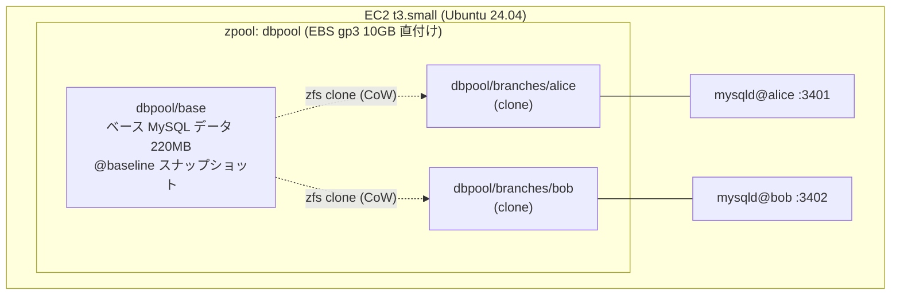
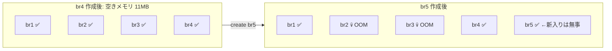
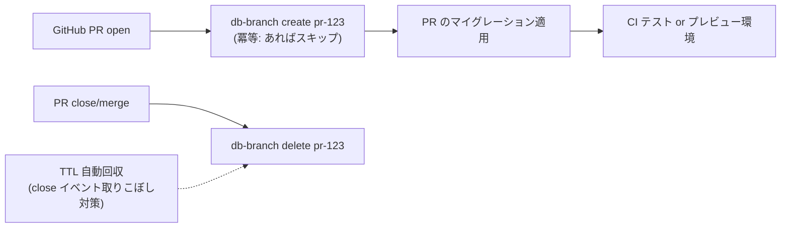

## やったこと

[MonotaRO Tech Blog の記事](https://tech-blog.monotaro.com/entry/2026/09/03/090000)で紹介されていた、ZFS のスナップショット/クローンを使って MySQL のデータベースを git のブランチのように複製・リセット・削除する仕組みを、EC2 1 台で最小再現しました。

確認したかったのは次の 5 点です。

- `db-branch create foo` で数秒以内に MySQL に接続できるブランチができる
- ブランチ内でデータを壊しても元データや他ブランチに影響しない
- `db-branch reset foo` で作成時点に戻る
- `db-branch delete foo` で消える
- クローン直後のディスク消費がごく小さい

構成はこうです。FSx for OpenZFS は使わず、EBS を丸ごと zpool にする一番安い形にしました。

- ベースデータは MySQL 公式サンプルの employees(30 万件、lz4 圧縮後 220MB)
- ブランチごとに systemd のテンプレートユニット(`mysqld@.service`)で別ポートの mysqld を起動
- CLI は 100 行弱のシェルスクリプト。`create` は `zfs clone` + `@init` スナップショット + `systemctl start`、`reset` は stop + `zfs rollback -r @init` + start、`delete` は stop + `zfs destroy -r`

ポイントは**ベースの MySQL を正常終了させてからスナップショットを撮る**ことです。稼働中に撮ると、ブランチを起動するたびに InnoDB のクラッシュリカバリが走って「秒で起動」が崩れます。

## 結果

| 操作 | 実測 | 備考 |
|---|---|---|
| create(接続可能まで) | **1.3 秒** | clone + snapshot + systemd start + ping 込み |
| reset | 6.1 秒 | ほぼ mysqld の正常停止待ち。rollback 自体は瞬時 |
| delete | 1.1 秒 | |
| クローン直後の USED | **80〜236 KB** | 「数 MB」の想定よりさらに小さい |
| 同時起動数 | 3 個 | t3.small(2GB)/ buffer pool 128M |

分離の確認は、alice で `DELETE FROM salaries`(284 万行)と `DROP TABLE titles` を実行し、bob 側が完全に無傷(284 万行そのまま・全テーブル健在)であることで取れました。reset 後は alice も元の件数に戻り、エラーログにクラッシュリカバリの痕跡なし。ゴールは全達成です。

ちなみにインスタンスを t3.large から t3.small に落とし、EBS も 10GB まで削ったので、検証全体のコストは **100 円未満**でした。

## 考察: 設計にフィードバックすべき 3 つの発見

### 1. メモリだけが線形に効く。そして限界は OOM killer で発覚する

ディスク消費はブランチあたり数百 KB とほぼタダですが、**ブランチ 1 個 = mysqld 1 プロセス ≈ 400MB**(buffer pool 128M 設定でも)が確実に積み上がります。

同時起動テストで 5 個目を作ったとき、何が起きたか。エラーで作成が拒否されるのではなく、**OOM killer が既存の br2 / br3 の mysqld を殺して、5 個目は普通に起動しました**。静かに、無関係なブランチが死ぬ。これが一番たちの悪い故障モードです。

教訓は 2 つ。

- create の入り口に「空きメモリ < buffer pool + 300MB なら拒否」のガードを入れる。事後の監視ではなく事前の拒否
- キャパシティ計画は実測から式が立つ: **同時ブランチ数 ≈ (RAM − 1GB) ÷ (buffer pool + 250MB)**。t3.large(8GB)なら 15〜18 個

さらに言えば、メモリを食うのは「動いている mysqld」であってブランチのデータではありません。アイドルブランチは mysqld を止めてデータだけ残す(再開は 1 秒)という中間状態を作れば、メモリ上限は「同時アクティブ数」だけに効くようになります。

### 2. 破壊的操作をすると CoW 差分はデータ本体並みに膨らむ

「クローンは差分だけ持つから軽い」は作成直後の話です。alice で 284 万行を DELETE したところ、ブランチの USED は **196MB** まで膨らみました。ベースの 220MB とほぼ同規模です。

InnoDB は DELETE でページを大量に書き換え、undo ログも書きます。ZFS から見ればそれは全部「ベースと違うブロック」なので、CoW 差分として実体化する。**行を消す操作が、ストレージ上では書く操作になる**わけです。

対策はシンプルで、reset すれば 80KB に戻ります。破壊的な使い方をするブランチは「使い捨てて、こまめに reset する」運用が正解で、逆に「ブランチを何日も育てる」使い方はこの仕組みと相性が悪い。

### 3. reset の 6 秒はほぼ graceful shutdown の時間

`zfs rollback` 自体は瞬時で、6 秒の大半は mysqld の正常停止待ちでした。ここで面白いのは、**巻き戻し先の `@init` スナップショットは正常終了状態で撮ってある**ため、停止を SIGKILL に変えてもロールバック後の起動にクラッシュリカバリは走らない、つまり安全性を落とさずに短縮できる点です。「スナップショットの一貫性が起動時間を決める」というベースライン設計の原則が、reset の高速化にもそのまま効いてきます。

## 次に考えていること

この仕組みを CI / 開発フローに組み込むなら、という続きの検討です。

- **PR 連動**: open で create、close で delete。名前は PR 番号で決め打ちにして冪等に。close イベントは取りこぼすので TTL 併用
- **API 化**: HTTP サーバーを立てる前に、SSM Run Command 経由(Actions は OIDC で AWS 認証)なら受け口もトークン管理も不要になる
- **マイグレーション適用**: ここが一番おいしい。実データ量に対して ALTER を流せるので、「本番で長時間ロックする ALTER」がレビュー段階で見つかる
- **順番**: プレビュー環境への接続情報受け渡しは重いので、先に「CI のテスト DB」としてブランチを使う方が小さく価値が出る

PII を含むデータを使うなら、マスキングはベースライン作成パイプラインの入り口に最初から入れる必要があります(後付けすると全ブランチ作り直し)。

そして本命は **FSx for OpenZFS 版**です。今回の構成はスナップショット/クローンを EC2 の中で完結させましたが、FSx に置き換えると同じ操作が `aws fsx create-snapshot` / `create-volume` の API になり、ストレージとコンピュートが分離されます。DB ホストは「NFS マウントして mysqld を起動するだけ」の使い捨てになり、ホストを複数台に増やす道も開ける。今回の PoC は、その FSx 版に進む前に「ZFS クローン + MySQL という組み合わせ自体が成立するか」を 100 円で確かめるステップでした。成立したので、次は FSx で同じ CLI を作り直します。
