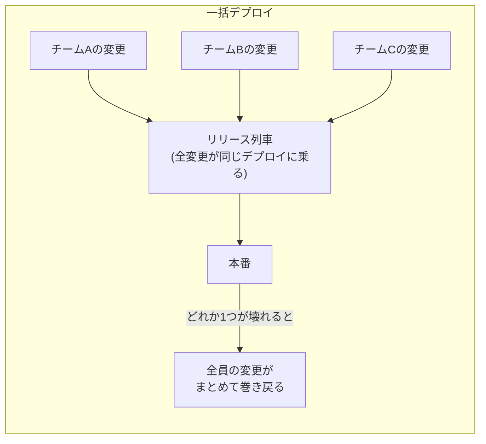
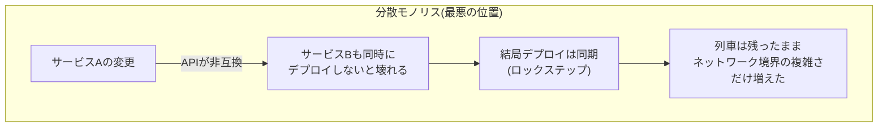

## はじめに

モノリスからの脱却は「スケールのため」と説明されがちですが、多くのチームで先に効くのは**開発生産性**の方です。もっと言えば、生産性を上げるのはサービスを分けること自体ではなく、**デプロイを分離すること**。この記事では、デプロイ分離が生産性に効くメカニズムを3つに分解し、それぞれを検証環境（Go の9モジュールモノレポ + ECS）の実測で確かめます。

先に結論の形を書いておくと:

- 効くメカニズムは「リリース列車の解体」「巻き込まれ事故の消滅」「検証時間が変更範囲に比例する」の3つ
- ただしデプロイ分離には前提条件（互換性の規律と境界の強制）があり、**前提を張らずにデプロイだけ分けると分散モノリスという最悪の位置に落ちる**
- リポジトリ分割もデータ分離も、デプロイ分離の必要条件ではない。モノレポのまま始められる

## 一括デプロイは「リリース列車」になる

モノリスのデプロイは、乗り合いの列車に似ています。次の発車（リリース）に間に合った変更が全部まとめて出る。



この形の問題は、壊れたときではなく**平常時から**発生しています。

1. **待ち行列**: 自分の変更が出るのは「次の列車」。リリースが週1なら、変更のリードタイムは平均3.5日底上げされる
2. **バッチサイズの肥大**: 1回のデプロイに乗る変更が多いほど、失敗時に「どの変更が原因か」の切り分けが難しくなり、切り分けが怖いからさらにリリース頻度を下げる、という悪循環に入る
3. **調整コスト**: 「今週の列車に乗せていいか」の合意形成そのものが仕事になる

デプロイ分離はこの列車を解体します。各サービスが自分のパイプラインで、自分のペースで出る。誰かのリリース判断が他チームの待ち時間にならない。

## メカニズム2: 「巻き込まれロールバック」が消える

一括デプロイでもっとも理不尽なのは、**自分の変更は正しいのに、同乗した他人の変更のせいで巻き戻される**ことです。ロールバックはデプロイ単位でしか行えないので、列車が戻れば全員戻る。

デプロイを分離すると、ロールバックの単位が「サービス」に縮みます。検証環境での実測では、壊れた版のロールバックは:

- デプロイの巻き戻し（ECS の `stopDeployment`）: **32秒**で当該サービスだけが旧版に戻る
- さらに昇格ゲート（本番トラフィックを当てる前のテスト経路検証）を常設すると、テストで再現できる壊れ方は被弾 **0 / 1,679 リクエスト**で本番前に自動停止する

このとき隣のサービスは何も知らずに動き続けています。障害半径とロールバック半径が一致する — これがデプロイ分離の防御面の価値で、詳しくは[プログレッシブデリバリー入門](/blog/progressive-delivery-intro/)に書きました。

## メカニズム3: 検証時間が「変更の大きさ」に比例するようになる

見落とされがちですが、日々いちばん体感に効くのはここです。モノリスの CI は変更が1行でも全体をビルド・テストします。コードベースの成長に比例して CI は遅くなり、**「変更の小ささ」が待ち時間に反映されない**。

検証環境では、モジュールの依存グラフから「今回の diff が影響するモジュール」を計算する小さなツール（`dev/affected`）を CI の先頭に置いています。実物の出力がこれです。

```
$ go run ./dev/affected -base main
./dev: ./services/photo に依存
./services/photo: 変更 services/photo/main.go
frontend: ./services/photo の API を使う
対象: Go 2 / 9 モジュール, frontend=true, keycloak=false
```

photo サービスだけを触った PR では、9モジュール中 **2個**（photo 本体と、photo に依存する dev ツール群）だけがビルド・テストされます。大事なのは「photo を触った」ではなく「**photo に依存するものまで**」を機械が計算していること — 巻き込みの判定を人間のフィルタ追記に任せると、追記漏れが必ず起きます。

実測の対比:

| PR の変更内容 | 動いたジョブ | CI 所要 |
|---|---|---|
| docs のみ | 判定ジョブのみ（全ビルド skip） | **20秒** |
| photo のみ | Go 2/9 モジュール + frontend | 中間 |
| core（全員が依存）| Go 9/9 + 統合ジョブ全部 | **約3分** |

この構造だと、CI 時間の意味が変わります。「リポジトリが大きいから遅い」ではなく「**広く依存されるものを触ったから遅い**」。CI の待ち時間がそのまま変更の影響範囲の告知になり、core を触る PR は自然と慎重に、レビューも厚くなる。逆に自分のサービスに閉じた変更は数十秒〜1分台で回るので、小さく刻んでデプロイする習慣がコスト面から支えられます。

## ただしタダではない: 前提を張らないと「分散モノリス」に落ちる

ここまでが利益。次が請求書です。デプロイを分離するとは、**バージョンの違うサービス同士が同時に動く**ことを許すという意味です。この前提を張らずにデプロイだけ分けると、こうなります。



分けたのにロックステップでしか出せないなら、得たものはゼロで、失ったもの（ネットワーク越しの障害モード、分散トレーシング、結果整合）だけが残ります。モノリスのままの方がましです。

独立デプロイを支える規律は、突き詰めると2つです。

**1. 隣接バージョン互換（N-1 互換）。** 自分の新版は、隣のサービスの旧版とも新版とも会話できること。API は「広げてから縮める」— フィールド追加はいつでもよいが、削除は消費者がいなくなってから。DB スキーマも同じ構造で、expand（互換を保って広げる）と contract（旧版が消えてから縮める）を別リリースに分けます。この規律の実装と実測は[モノレポの無停止移行とデプロイ分離](/blog/online-migration-and-deploy-isolation/)に書きました。

**2. 境界の機械的強制。** 「サービスAはBの内部を触らない」を規約文書で言っても1行の import で静かに破られます。検証環境では、他サービスへのアクセスは公開 API 経由のみという規約を3層で強制しています — モジュールグラフ（他サービスの内部 package は import 自体が不可能）、DB 権限(他ドメインのテーブルには SELECT 権限すら無い)、コード生成（他ドメインのテーブルを参照するクエリは生成時に失敗）。境界が機械で守られているから、「隣は勝手に変わる」前提でデプロイを分離できます。

つまり順番はこうです: **境界の強制と互換の規律が先、デプロイ分離はその上に載る**。

## リポジトリ分割もデータ分離も要らない

「デプロイ分離 = マイクロサービス化 = リポジトリもDBも分割」と一塊に考えると、着手コストが巨大に見えます。実際には独立に選べるレバーで、デプロイ分離に必要なのは上の2つの規律だけです。


検証環境は今も**単一リポジトリ・単一 DB インスタンス**のまま、①〜③を運用しています。④はコストが大きく、しかも待つほど安くなる性質がある（消費者が Client モジュール経由に揃っていれば、切り出しは参照の切り替えだけで済む — [実測は4行+2コマンドでした](/blog/boundary-redraw-cost-measured/)）。データ側の分離を進める判断をする場合の段階論は[モノリスのデータ切り出しは3段階で考える](/blog/monolith-data-carving-three-stages/)にあります。

## まとめ

- デプロイ分離が生産性に効くメカニズムは3つ: **リリース列車の解体**（待ち行列と調整コストの消滅）、**巻き込まれロールバックの消滅**（障害半径=ロールバック半径、実測32秒）、**検証時間の変更範囲比例**（affected CI で 2/9 モジュール、docs 変更は20秒）
- 前提は2つ: **N-1 互換の規律**と**境界の機械的強制**。これを張らずにデプロイだけ分けると、列車が残ったまま分散の税金だけ払う「分散モノリス」に落ちる
- リポジトリ分割・データ分離は必要条件ではない。モノレポ・同一 DB のまま、モジュール分割 → affected CI → パイプライン分割の順で始められる

関連: [プログレッシブデリバリー入門](/blog/progressive-delivery-intro/)（デプロイ1回の中の安全装置）、[モノレポの無停止移行とデプロイ分離](/blog/online-migration-and-deploy-isolation/)（互換規律の実装）、[境界の引き直しは安いのか](/blog/boundary-redraw-cost-measured/)（この構造を後から変えるコストの実測）
