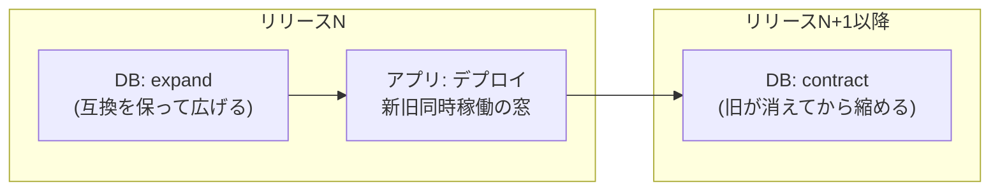
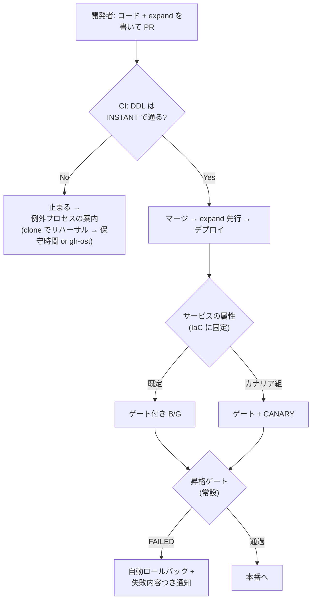

## はじめに

デプロイ戦略の記事はたいてい「Blue/Green とは」「カナリアとは」の説明で終わります。でも実務の問いはその先で、**「で、この変更はどれで出すのか」**です。

この問いに答えるために、検証環境で数字を取ってきました。

- [プログレッシブデリバリー入門 — 置く・当てる・見せる](/blog/progressive-delivery-intro/) — 全体地図と語彙、2本の巻き戻しレバー（デプロイ32秒 / フラグ14秒）
- [アプリと DB でプログレッシブは別物](/blog/progressive-delivery-app-vs-db/) — 各層の仕組みと実測。同じ壊れた版で被弾 **0/1,679**（昇格ゲート）vs **69/2,880**（カナリア+アラーム）、DDL 方式の判定、COPY は 2M 行 56 秒

この記事はその総集編です。**変更の種類ごとの組み合わせ表**と、表を作った後に気づいた**もっと大事なこと** — この表を開発者に渡してはいけない — を書きます。

## 前提: 2つのレイヤーは独立に進む、が噛み合っている

アプリのデプロイ戦略と DB マイグレーションは別のレイヤーですが、独立に選べるわけではありません。B/G もカナリアも bake も、**新旧のアプリが同じ DB に同時に接続する時間**を作ります。

だから DB 側は expand / contract の2系統に分ける — **新旧どちらのバイナリでも動くスキーマに先に広げ（expand）、旧バイナリが消えてから縮める（contract）**。この互換が守られている限り、アプリ側は好きな戦略で何段構えにでもできます。逆に言うと、互換を壊す DDL を expand に混ぜた瞬間、どのデプロイ戦略を選んでも新旧同時稼働の窓で壊れます。

「旧バイナリが expand 済みスキーマで本当に動くのか」は言葉でなく実測で確認済みです（列追加**前**のコミットからビルドした旧イメージを、追加**後**のスキーマに接続して投稿・一覧が正常動作）。

## 変更の種類 × 組み合わせ表

実測値から逆算した組み合わせです。

| 変更の種類 | DB 側 | アプリ側 | 根拠 |
|---|---|---|---|
| **通常のロジック変更**（大半） | なし | **B/G + 昇格ゲート + bake 中アラーム** | ゲートが被弾 0/1,679・103秒で落とす。テストで再現できる壊れ方にカナリアの窓時間（+5分）を払う価値がない |
| **スキーマ expand を伴う変更** | **expand 先行**（デプロイ前ジョブ、INSTANT で通る DDL のみ） | 同上 | 旧バイナリ×新スキーマの同時稼働は実測済み。contract は後続リリースで |
| **実トラフィックでしか壊れない懸念**（クエリ性能・実データ依存・キャッシュ） | 同上 | **ゲート + CANARY + アラーム連動** | ゲートで落とせる分を先に落とし、カナリアは残りの保険（被弾を 2.4% に閉じる）。n% は「アラームが評価できるトラフィック量」が下限 |
| **COPY にしかならない DDL**（ADD CHECK 等） | **例外運用**: fast clone で本番同等データのリハーサル → 保守時間 or gh-ost | 通常 B/G | 2M 行 56 秒 → 1億行 45 分超。デプロイ戦略で吸収する話ではない |
| **最重要経路**（決済相当） | expand 先行 | ゲート + CANARY + **bake 長め** + `stopDeployment` 待機 | bake はロールバック先の温存料（1 API・32秒で戻れる） |

横断の判断が2つあります。

**昇格ゲートは常設、カナリアは選択制。** ゲートのコストは Lambda 1本と +1〜2分だけで、リターンが「テストで再現できる壊れ方の被弾ゼロ」。一方カナリアは毎回窓時間を払います。「全変更カナリア」は遅いだけの運用になりがちで、0/1,679 と 69/2,880 の対比がその根拠です。

**「ユーザーへの見せ方」のカナリアはデプロイでやらない。** 段階公開したいのが機能の見え方なら、正しいレバーはフィーチャーフラグ（デプロイとリリースの分離）。デプロイのカナリアは「バイナリが壊れていないか」の保険であって、機能の段階公開装置として使うと、デプロイ巻き戻しとリリース巻き戻しという独立した2本のレバーが混ざります。

## ここからが本題: この表を開発者に渡してはいけない

表を作って満足しかけたところで、気づきます。**この表、普通の開発者が毎回のデプロイで判断できるのか？**

「今回の変更は実データ依存の failure mode を持つか？」— この問いに毎回正しく答えるには、デプロイ機構と障害モードの両方の理解が要ります。機能を作る開発者にそれを毎回要求する運用は、判断ミスと「面倒だから毎回同じを選ぶ」形骸化の両方に倒れます。選択肢を並べた規約は、たいてい選択肢を並べた時点で失敗している。

そこで、表の中身を**人の判断が要らない形**に組み替えます。

### 原則1: 既定は1本

全サービスの既定 = **expand 先行 + ゲート付き B/G**。開発者は push するだけで、strategy も bake もカナリア % も、選ぶ画面すら存在しない。ゲートは常設なので「付けるか」という判断も存在しない。

### 原則2: カナリアは「デプロイの選択肢」ではなく「サービスの属性」

CANARY にするかどうかは、IaC のサービス定義に**固定**します。判断の主語が「この変更」から「このサービス」に変わるのがポイントで、判断の頻度が「デプロイごと（毎日）」から「サービスの性格が変わったとき（年に数回）」に落ちる。低頻度の判断だけが人間に残り、それはインフラ PR のレビューでちゃんと議論できます。判断理由はその行のコメントに書いて残す。

### 原則3: 機械で判定できるものは機械が止める

- COPY にしかならない DDL → CI が `ALGORITHM=INSTANT` 検査で止め、例外プロセスを案内する（人が「気づく」必要がない）
- migrate の失敗 → ジョブグラフが release 工程を始めない
- 壊れた版 → ゲートが本番前に落とす

### 開発者の一日

この形にすると、普通の開発者の体験はこうなります。

**やること**: コードと expand マイグレーションを書く → PR → マージ。以上。

**遭遇するもの**（選択ではなく、起きたら向き合うだけ）:
- CI が「この DDL は INSTANT で通らない」と止める → 案内される例外プロセスへ（判断ではなく手順）
- デプロイが勝手にロールバックして通知が来る → 「テストトラフィックで書き込みが 500」まで書いてあるので、直して再 push

要求される追加知識はゼロ。守るべきは「expand は互換を壊さない形で書く」という規約1つで、それも破れば CI が教えてくれる側です。

## まとめ

- 組み合わせは**変更の種類**で決まる。既定は「expand 先行 + ゲート付き B/G」、カナリアは実トラフィックでしか出ない壊れ方への保険、COPY 系 DDL はデプロイでなく計画の問題
- ただし、その判断を**毎回のデプロイで開発者にさせない**。既定1本・カナリアはサービス属性・機械で判定できるものは機械が止める、に組み替えると、人間に残る判断は「このサービスをカナリア組に入れるか」だけになる
- 戦略の選択肢が豊富であることと、選択を日常業務に露出させることは別。**選べる機構の上に、選ばせない運用を組む**のが着地でした
