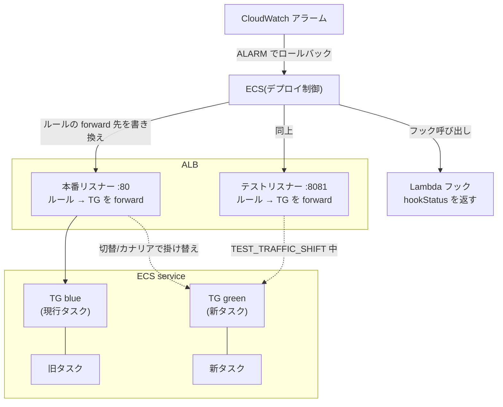
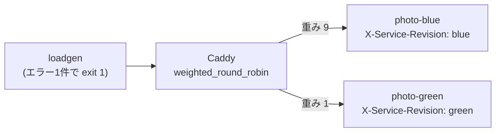
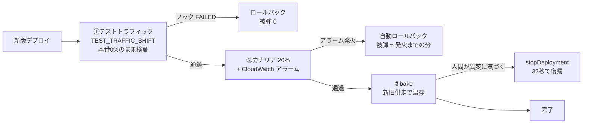

## はじめに

「カナリアデプロイを入れたので安心です」— 本当でしょうか。カナリア中に新版へ流れたリクエストは、新版が壊れていれば**失敗します**。カナリアはその失敗を消してくれません。

では何のためにあるのか。それを言葉ではなく数字で確かめるため、**同じ壊れた版**を3つの防衛層でデプロイして、それぞれの被弾数を測りました。先に結果を出します。

| 防衛層 | 被弾（失敗/総リクエスト） | 復旧まで |
|---|---|---|
| テストトラフィックの昇格ゲート | **0 / 1,679** | 103秒（自動） |
| カナリア 20% + アラーム自動ロールバック | **69 / 2,880（2.4%）** | 4分50秒（自動） |
| カナリア 10% + 手動切り戻し（ローカル予行） | 6 / 60（10%） | 人間の反応速度に依存 |

この差の理由と、測る過程で踏んだ罠を書きます。

## 検証対象の「壊れた版」

検証用のマイクロサービス基盤（Go + ECS Fargate + ALB + RDS）に、失敗注入の仕組みを仕込んであります。環境変数 `PHOTO_FAULT=before_commit` を与えると、**ヘルスチェックは正常のまま、書き込み系 API だけが確実に 500 を返す**版になります。

この「healthz は緑、でも壊れている」が要点です。現実の障害はたいていこの形をしています — プロセスは起動する、ポートは開く、でも DB への経路やマイグレーション前提が壊れている。ヘルスチェックだけを信じるデプロイ機構は、この版を平気で昇格させます。

## 前提: ECS ネイティブ B/G の仕組み

2025-10 から、ECS は CodeDeploy なしで Blue/Green・Canary・Linear デプロイをネイティブにサポートしています。仕組みの中心は **ALB のリスナールールと2枚のターゲットグループ（TG）を ECS が掛け替える**ことです。



サービス定義に次の3点を渡すと、この形が動きます。

- `loadBalancers[].advancedConfiguration`: 2枚目の TG（`alternateTargetGroupArn`）、本番用リスナールール、**テスト用リスナールール**、ECS が ALB を操作するためのロール
- `deploymentConfiguration.strategy`: `BLUE_GREEN` / `CANARY` / `LINEAR`（B/G と CANARY は**別 strategy** で、API が排他を強制します）
- `deploymentConfiguration.lifecycleHooks / alarms`: 後述のゲートとアラーム連動

デプロイは次の段階（ライフサイクルステージ）を進みます。今回使うのは太字の3つです。

| 段階 | 何が起きるか |
|---|---|
| SCALE_UP | 新版タスクを起動（トラフィックなし） |
| **TEST_TRAFFIC_SHIFT** | **テストリスナーの forward 先だけ**を新版へ。本番は旧版 100% のまま |
| POST_TEST_TRAFFIC_SHIFT | ここに**フック**を置ける。FAILED を返すとロールバック |
| PRODUCTION_TRAFFIC_SHIFT | 本番リスナーを掛け替え（CANARY なら n% → 100% の2段） |
| **BAKE_TIME** | 新旧が併走したまま監視する猶予。**アラーム**はこの間も効く |
| CLEAN_UP | 旧版を落として完了 |

## 観測口を先に作る: どの版が応答したか

分割・切替・ロールバックの検証には、**「いまどの版が応答したか」を外から見る手段**が先に必要です。同じイメージから起動した新旧2つのタスクは、応答からは区別できません。

全応答にデプロイ識別子のヘッダを載せる変更を入れました。

```go
// リビジョンは全応答に載せる(healthz・401 含む)。認証より外に置くのは、
// カナリア検証がまさに「認証前に落ちる応答」も含めてどちらの版かを見るため
r.Use(func(next http.Handler) http.Handler {
    return http.HandlerFunc(func(w http.ResponseWriter, req *http.Request) {
        w.Header().Set("X-Service-Revision", revision) // SERVICE_REVISION env から
        next.ServeHTTP(w, req)
    })
})
```

ECS ではタスク定義の env にリビジョンを渡すだけで、ローカルの Caddy 予行でも実機でも同じ観測口が使えます。これが無いと、検証は「重みを**設定した**」で止まります。設定と実測は別物です。

## まずローカルで予行する（Caddy weighted_round_robin）

いきなり AWS に行く前に、Caddy の重み付きロードバランシングで photo サービスを blue/green 並走させ、切替の観測方法と検査項目を固めました。



| 予行の測定 | 結果 |
|---|---|
| B/G 一斉切替をまたぐ 239 リクエスト | 非200 ゼロ |
| 重み 9:1 で 400 リクエスト | green ちょうど 10% |
| 壊れた green へ 9:1 で 60 書き込み | **6 件失敗（10%）**、切り戻しで 0 に |

ここで出た「6/60 は消せない」が、実機検証の問いになりました。**この 6 件をゼロにする層はあるのか？**

## 実機: 3つの防衛層

ECS は 2025〜2026 年でデプロイ機構が大きく進化しています。CodeDeploy 不要のネイティブ Blue/Green・Canary（2025-10 GA）、デプロイライフサイクルフック、`stopDeployment` API。この 3 つを順に測りました。



### 層① 昇格ゲート: TEST_TRAFFIC_SHIFT + Lambda フック

ECS ネイティブ B/G には `TEST_TRAFFIC_SHIFT` というライフサイクル段階があります。**本番トラフィックを1件も流す前に**、ALB のテストリスナー（別ポート）経由で green にテストトラフィックを 100% 当て、Lambda フックが検証して `hookStatus: SUCCEEDED / FAILED` を返す仕組みです。

組み立ては3点セットです。①ALB にテストリスナー（:8081）とルールを足す、②検証用 Lambda と「ECS がそれを呼ぶためのロール」を作る、③サービスにフックを取り付ける。

```hcl
# ① テストリスナー。本番と同じ ALB の別ポート
resource "aws_lb_listener" "test" {
  load_balancer_arn = aws_lb.main.arn
  port              = 8081
  protocol          = "HTTP"
  default_action { # 実トラフィックはルールが運ぶ(ECS はルールを書き換えるため default では管理できない)
    type = "fixed-response"
    fixed_response { status_code = "404" content_type = "text/plain" message_body = "no rule" }
  }
}

# ③ フックは deploymentConfiguration に載せる(update-service の JSON)
"deploymentConfiguration": {
  "strategy": "BLUE_GREEN",
  "bakeTimeInMinutes": 2,
  "lifecycleHooks": [{
    "hookTargetArn": "arn:aws:lambda:...:function:gate-hook",
    "roleArn":       "arn:aws:iam::...:role/hook-invoke",   // ecs.amazonaws.com を信頼し lambda:InvokeFunction を許可
    "lifecycleStages": ["POST_TEST_TRAFFIC_SHIFT"]
  }]
}
```

フックの中身が勝負どころでした。Lambda は `hookStatus` を返す契約です。

```python
# healthz だけでは PHOTO_FAULT(書き込みのみ壊れる)を素通しするので、書き込みまでやる
def check():
    for _ in range(3):
        urlopen(base + "/healthz")          # 到達性(base はテストリスナー :8081)
    POST(base + "/v2/photos", ...)          # 書き込み(DB 経路まで通す)

def handler(event, context):                # event には lifecycleStage と対象リビジョンが入る
    ok = check()
    return {"hookStatus": "SUCCEEDED" if ok else "FAILED"}
```

壊れた版をデプロイした結果:

```
verdict: create 500
status: ROLLBACK_SUCCESSFUL
reason: "... POST_TEST_TRAFFIC_SHIFT lifecycle hook(s) failed.
         Lifecycle hook target ... returned FAILED status."
```

デプロイ全体をまたいで 4rps の実 API 負荷（認証付き読み書き）を流し続けましたが、**本番 1,679 リクエスト、エラー 0**。開始からロールバック完了まで 103 秒。

healthz だけを見るフックなら、この版は素通りしていました。**ゲートの価値は検証の深さで決まります**。テストトラフィックで書き込みまでやるから、「healthz は緑だが壊れている」を本番前に落とせる。

### 層② カナリア + アラーム自動ロールバック

次に、ゲートを外して（= テストトラフィックでは検知できない壊れ方の代役）、同じ壊れた版を CANARY 20% + ALB 5xx アラーム連動で流しました。設定は2つ: CloudWatch アラームを1本作り、デプロイ設定で名前を渡すだけです。

```hcl
# 「ユーザーに 5xx が漏れているか」そのものを見る。green/blue の TG は入れ替わるので ALB 単位
resource "aws_cloudwatch_metric_alarm" "target_5xx" {
  namespace           = "AWS/ApplicationELB"
  metric_name         = "HTTPCode_Target_5XX_Count"
  dimensions          = { LoadBalancer = aws_lb.main.arn_suffix }
  statistic           = "Sum"
  period              = 60
  evaluation_periods  = 1
  threshold           = 3
  comparison_operator = "GreaterThanOrEqualToThreshold"
  treat_missing_data  = "notBreaching"
}
```

```json
"deploymentConfiguration": {
  "strategy": "CANARY",
  "canaryConfiguration": { "canaryPercent": 20.0, "canaryBakeTimeInMinutes": 3 },
  "bakeTimeInMinutes": 2,
  "alarms": { "alarmNames": ["target-5xx"], "enable": true, "rollback": true }
}
```

```
20:13:22 デプロイ開始
20:17:44 アラーム OK→ALARM、同刻に ROLLBACK_IN_PROGRESS
20:18:28 ROLLBACK_SUCCESSFUL
reason: "Service deployment rolled back because of one or more active alarms."
```

被弾は **69 / 2,880 リクエスト（2.4%）**。アラーム発火とロールバック開始が同刻だったのは収穫で、ECS はアラーム状態を即応で拾っています。遅延の内訳はほぼ「メトリクス集計の 60 秒周期 + ALB 計測の遅延」。**被弾 69 件の正体は検知の窓そのもの**で、縮めたければアラームの period を縮めるしかありません。

### 層③ stopDeployment: 人間用の非常ブレーキ

最後に、健全な新版を bake 長めでデプロイし、bake 中に 1 API で止めました。

```
20:27:33 aws ecs stop-service-deployment --stop-type ROLLBACK
20:28:05 本番の X-Service-Revision が旧版に戻る（32秒）
reason: "Service deployment rolled back by user."
```

32 秒で戻れるのは、bake 中は旧タスクが生きているからです。ロールバック = ターゲットグループの向き先変更だけで済む。**bake 時間はロールバック先を温存する保険料**という理解が実測で腑に落ちました。

## 数字が教える「層の順序」

| | 昇格ゲート | カナリア+アラーム | 手動 |
|---|---|---|---|
| 被弾 | 0 / 1,679 | 69 / 2,880 | 6 / 60（10%） |
| 検知するもの | テストで再現できる壊れ方 | 実トラフィックでしか出ない壊れ方 | 人間にしか分からない異変 |
| 復旧 | 103秒 | 4分50秒 | 反応速度次第 + 32秒 |

（条件は同一ではありません: 手動列はローカル予行でカナリア 10%・切り戻しは即時に人間が実行、実機2列はカナリア 20%・4rps。比べているのは比率と「復旧が何に依存するか」です。）

3つの層は代替関係ではなく**直列**です。

1. **テストで落とせる壊れ方は、本番に1件も触らせない**（ゲート）
2. ゲートを抜けた壊れ方だけを、カナリアが「全量事故」から「2.4% の事故」に縮める
3. どちらも抜けたら、人間が 1 API で 32 秒で戻す

カナリアだけ入れて安心するのは、①を省略して 69 件を受け入れる選択です。逆にゲートだけだと、テストトラフィックで再現しない壊れ方（実データ依存・負荷依存）が全量に届きます。**どの層が何を守るかを数字で知ってから、どこまで組むかを決める**のが正しい順序でした。

## 踏んだ罠

- **ヘルスチェックを信じすぎない**。healthz が返すのは「プロセスが起動してポートが開いている」まで。デプロイゲートの検証は業務の書き込みまで通すこと
- **IaC が知らない設定は IaC に剥がされる**。ライフサイクルフックやアラーム連動を CLI で付けた場合、Terraform がサービスを管理していると次の apply で黙って消える。どちらを正にするか決めてから運用に入る（今回は取り付けの正を API に置き、デプロイのたびに明示で渡した）
- **ロードバランサの「重み 0」は表現できないことがある**。Caddy の weight は正整数のみで、cutover は upstream から外す形になる。ECS ネイティブ B/G も切替は重みでなくターゲットグループの掛け替えなので、意味論はむしろこちらが近い
- **プロセスを kill する検証は事故のもと**（予行で実感）。kill したはずの旧コンシューマや、可視性タイムアウトで戻ってくる in-flight リクエストが結果を静かに汚す。今回 ECS 実機で「gear 停止中」が必要な場面では、**起動順**で自然に作れる状態を使い、プロセス操作を避けた

## 自分のサービスで始めるなら

全部を一度に組む必要はありません。効果の大きい順に:

1. **リビジョンヘッダ**（数行）。これが無いと何も観測できない
2. **アラーム連動**（アラーム1本 + デプロイ設定に3行）。ECS ネイティブ B/G/CANARY を使っているなら、これだけで「全量事故」が「n% の事故」になる
3. **昇格ゲート**（テストリスナー + Lambda + ロール）。デプロイ頻度が高い・書き込みが壊れると痛いサービスから。検証は必ず**業務の書き込みまで**通すこと
4. `stopDeployment` は組むものではなく**知っておくもの**。bake を数分取っておけば、いつでも 30 秒で戻れる

## まとめ

- ECS ネイティブのデプロイ機構（B/G・Canary・ライフサイクルフック・stopDeployment）は、CodeDeploy なしで「昇格ゲート → カナリア → 非常ブレーキ」の3層をそのまま組める状態になっている
- 3層は直列であり、それぞれ守るものが違う。**被弾 0/1,679 と 69/2,880 の差**が、ゲート層を省略するコストの実測値
- 検証はローカル予行（Caddy + リビジョンヘッダ）で観測方法を固めてから実機に行くと、実機側は差分（アラーム連動・フック・stopDeployment）だけに集中できる。今回の AWS 費用は **$0.1 程度**（1.5 時間で destroy）

## 参考

- [Amazon ECS built-in Linear and Canary deployments](https://aws.amazon.com/about-aws/whats-new/2025/10/amazon-ecs-built-in-linear-canary-deployments)（2025-10）
- [Gradual deployments in Amazon ECS with linear and canary strategies](https://aws.amazon.com/blogs/containers/gradual-deployments-in-amazon-ecs-with-linear-and-canary-strategies/)
- [Amazon ECS canary deployments — lifecycle stages](https://docs.aws.amazon.com/AmazonECS/latest/developerguide/canary-deployment.html)
- [Amazon ECS real-time deployment observability](https://aws.amazon.com/about-aws/whats-new/2026/09/amazon-ecs-console-deployment-observability/)（2026-09）
