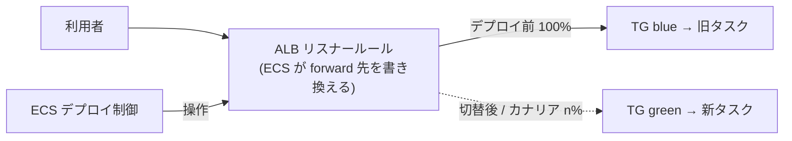
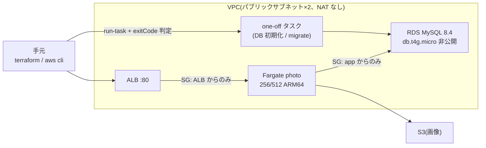

[検証リポジトリ](https://github.com/rikukaInoue/greenfield)のデプロイ先は
これまで手元マシンの docker compose だった。設計時から「デプロイ先を ECS へ
差し替えるだけの形にしてある」と主張してきたが、主張は測るまで主張でしかない。
Phase 7（AWS 検証。使い捨て前提、予算上限を決めてから立てる）で実測したので記録する。

先に結果の要約:

- **アプリコードの変更 0 行・イメージのリビルド 0 回**で ECS に載った
- ECS ネイティブ（CodeDeploy なし）の Blue/Green は**リクエスト503件で非200ゼロ**の無停止
- カナリア 20% の重みを ALB ルール上で実測（`200/800`）
- そして **BLUE_GREEN と CANARY は「B/G のオプション」ではなく別の strategy** だった

## 前提: ECS ネイティブデプロイの仕組み

CodeDeploy を使わない ECS ネイティブのデプロイ（2025-10 GA）は、**ALB のリスナールールの forward 先を、ECS 自身が2枚のターゲットグループ（TG）の間で掛け替える**ことで成立しています。



用語を2つだけ。**strategy** はデプロイの進め方（`BLUE_GREEN` = 一斉切替 / `CANARY` = n% → 100% の2段 / `LINEAR` = 等分で段階的）。**bake** は切替後も旧タスクを落とさずに併走させる監視時間で、この間なら旧 TG に戻すだけで即ロールバックできます。

この仕組みが分かっていると、後述の「必要な部品が多い」理由も読めます — TG が2枚要るのは掛け替えの両側だから、明示のリスナールールが要るのは ECS が**ルールを**書き換える設計だから、専用ロールが要るのは ECS が ELB API を叩くからです。

## 7.1: 使い捨ての最小構成

Terraform 約300行で、単一 VPC + ALB + ECS Fargate + RDS MySQL 8.4 + S3 + ECR。
使い捨てなので state はローカル、`apply → 検証 → destroy` を当日で回す。
ランレートは実測で **約 $0.06/h**（ALB + Fargate 256/512 + db.t4g.micro）。



コスト・形の設計判断は3つ。

**NAT Gateway を置かない。** タスクはパブリックサブネットで public IP を持ち、
到達制御は SG で行う（アプリの 8080 は ALB の SG からのみ、DB の 3306 は
アプリの SG からのみ）。NAT は $0.062/h + 転送費で、この構成では最大の固定費になる。

**RDS は非公開のまま。** 最初は手元から初期化するために公開を試みたが、
「パブリックサブネットに居る」と「公開されている」は別（`publicly_accessible`）で、
どうせフラグを触るならと**初期化も migrate も VPC 内の one-off ECS タスク**に寄せた。
結果的にこれが正解で、migrate は本番でも「デプロイ前に ECS タスクで流す」形なので、
その予行になった。

**SQL はイメージに焼かず、タスクの command で運ぶ。** DB 初期化（database /
ユーザー / GRANT）は mysql:8.4 イメージの one-off タスクに base64 で渡す:

```sh
B64=$(base64 < init.sql | tr -d '\n')
aws ecs run-task --task-definition bootstrap \
  --overrides '{"containerOverrides":[{"name":"mysql","command":
    ["sh","-c","echo '$B64' | base64 -d | mysql -h $DBHOST -uroot -p..."]}]}'
aws ecs wait tasks-stopped ... && exitCode を判定
```

migrate も同様に、アプリのイメージへ `command: ["migrate","expand"]` を
override するだけ。**exit code を待って判定する**ので、成否が機械判定できる。

検証結果: ALB 経由で `/healthz` 200、認証付き一覧 200、トークン無し 401。
CloudWatch Logs には手元と同じ canonical log line（trace_id 付き）が
そのまま出た。**ログ基盤も AWS で無変更**。

## 7.2: ECS ネイティブ Blue/Green

CodeDeploy を使わない ECS 本体のデプロイ戦略。必要な部品が地味に多い:

```hcl
resource "aws_ecs_service" "photo" {
  # ...
  load_balancer {
    target_group_arn = aws_lb_target_group.photo.arn   # 本番用
    advanced_configuration {
      alternate_target_group_arn = aws_lb_target_group.photo_alt.arn  # 2枚目
      production_listener_rule   = aws_lb_listener_rule.photo.arn     # ルール必須
      role_arn                   = aws_iam_role.ecs_infra.arn         # 専用ロール
    }
  }
  deployment_configuration {
    strategy             = "BLUE_GREEN"
    bake_time_in_minutes = 2
  }
}
```

- ターゲットグループは**2枚**。ECS が交互に使う
- ALB の **default_action では管理できない**。明示のリスナールールが必須で、
  ECS がその forward 先を書き換えるため tf 側は `ignore_changes = [action]`
- ELB を操作する **ECS 専用のインフラロール**
  （`AmazonECSInfrastructureRolePolicyForLoadBalancers`）が要る

0.5秒間隔の可用性ループを回しながらデプロイした結果:

| 測定 | 結果 |
|---|---|
| リクエスト503件中の非200 | **0件** |
| ALB ルールの重み | `100/0` → `0/100`（ターゲットグループの掛け替え） |
| bake | 2分後に SUCCESSFUL（この間は即時ロールバック可能） |

## 発見: BLUE_GREEN と CANARY は別物

「B/G のカナリアオプション」のつもりで `strategy = "BLUE_GREEN"` に
`canary_configuration` を書いたが、何度サンプリングしても 20% の重みが出ない。
CLI で直接設定して原因が確定した:

```
InvalidParameterException: Canary configuration can only be present
with CANARY deployment strategy
```

**カナリアは B/G の設定項目ではなく、独立した strategy** だった。
さらに厄介なのは Terraform provider（aws 6.x 系）の挙動で、この**無効な組を
黙って受理して canary だけを落とす**。plan も apply も成功し、AWS 側は null、
tf state にも残らない。[fail open](/blog/checks-fail-open/) の典型で、
「設定できなかった」が「成功」として出てくる。3秒間隔のサンプリングで
重みが出ないことからしか気づけなかった。

`strategy = "CANARY"` に直して再デプロイした実測:

```
12 サンプル  w=0/100    (旧が全量)
16 サンプル  w=200/800  (= 新20% : 旧80%。カナリア窓 ≈1分)
33 サンプル  w=100/0    (全量切替 → bake 2分)
 1 サンプル  SUCCESSFUL
```

ALB 上では 20% が `200/800` という整数比で表現される。可用性は引き続き非200ゼロ。
もうひとつ細かい罠: provider は **BLUE_GREEN の完了は待つのに CANARY は待たない**
（apply が数秒で返る）。デプロイの完了判定は tf の終了ではなく
`aws ecs list-service-deployments` の status で行う必要がある。

## ゲートと直列性の再演

ローカルの CI で実測済みだった2つの性質を ECS 上で再演した。

**migrate が失敗したらデプロイを始めない**: わざと壊れた DSN で migrate タスクを
流す → exit 1 → ゲートが release 工程をスキップ → サービスの taskdef は不変。
one-off タスクの exit code がそのままゲートになる。

**同一サービスのデプロイは直列**: デプロイ進行中に `--force-new-deployment` を
投げると受理され、新しいデプロイが古いものを **supersede** する（待ち合わせでは
なく置き換えの直列化）。別サービスの並列は、ECS ではサービスが独立リソースなので
構造的に干渉しない。

## destroy

`terraform destroy` 一発で30リソース削除。ALB / RDS / VPC の残存ゼロを実測で確認
（残るのは INACTIVE のタスク定義のみ。ECS の仕様上削除できず、課金もない）。
ここまでの費用は **$1 未満**。

## 自分のサービスで始めるなら

1. **前提を満たす**: TG をもう1枚、ALB の default_action でなく**リスナールール**でルーティング、ECS インフラロール（`AmazonECSInfrastructureRolePolicyForLoadBalancers`）。既存サービスならこの3点の追加だけ
2. **strategy を選ぶ**: まず `BLUE_GREEN` + bake 数分。カナリアが要るなら `CANARY` は**別 strategy** であることを忘れずに（B/G に canary_configuration を足しても黙って無視される）
3. **完了判定は tf の終了でなく API で**: `aws ecs list-service-deployments` の status を見る（provider は CANARY の完了を待たない）
4. アプリ側は「ポートで HTTP を受ける・設定は env・migrate はサブコマンド」を守っていれば変更ゼロで載る

この構成の続きとして、テストトラフィックの昇格ゲート（ライフサイクルフック）・CloudWatch アラーム連動の自動ロールバック・`stopDeployment` を同じスタックで実測した記事が
[カナリアは失敗を消さない — ECS 3層防衛の実測](/blog/ecs-deployment-gates-measured/) です。

## まとめ

| 変更対象 | 量 |
|---|---|
| インフラ（Terraform 新規） | 約300行 |
| B/G・カナリア追加 | +75行 |
| **アプリコード** | **0行**（イメージ再ビルドも0回） |

アプリ0行が今回の主眼だった。「アプリはポートで HTTP を受けるだけ、設定は env 注入、
migrate はサブコマンド」という形を守っていれば、compose のデプロイスクリプトの
ジョブグラフ（migrate → release → healthcheck）は ECS の one-off タスク +
サービス更新に構造ごと写像できる。

そして今回も、一番の収穫は予想外の側にある。ドキュメントを読むだけなら
「B/G とカナリア」をオプションの関係だと思い込んだままだったし、
provider が無効な設定を黙って落とすことには一生気づかなかった。
重みが出ないという**観測**だけが、思い込みと実装のずれを教えてくれた。
