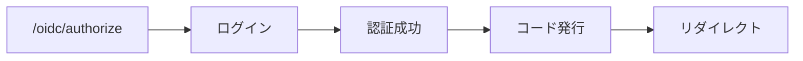
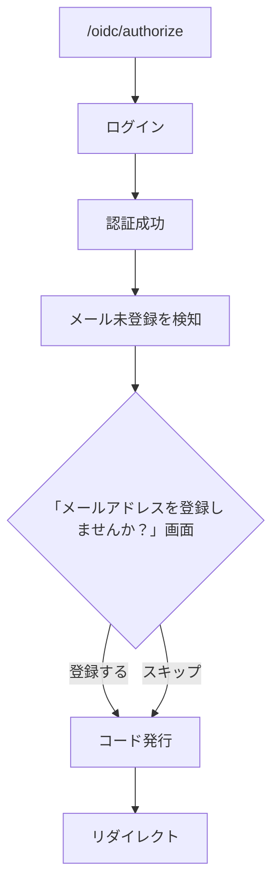
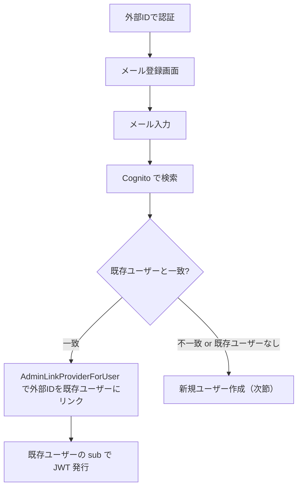
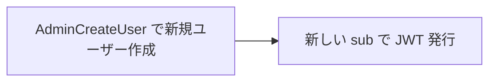
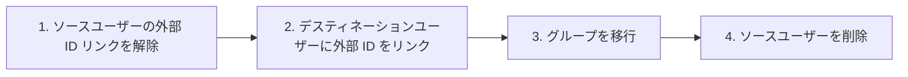

## 課題

認証基盤を外部 IdP（OpenID 2.0 など）と連携させると、メールアドレスが返ってこないケースが出てきます。携帯キャリアの認証などでは、識別子（URL や ID）は返るがメールは提供されない。

また、ユーザー名 + パスワードだけで ID を持つ既存ユーザーも、メールが未登録の状態でログインしてくる可能性があります。

### メールが必須だと何が困るか

- 外部 ID 認証のユーザーがそもそも登録できない
- パスワードリセットができない
- 通知が送れない
- 既存ユーザーとの紐づけ（メール一致による自動リンク）が使えない

### メールを完全に任意にすると何が困るか

- パスワードリセット手段がなくなる
- アカウント復旧ができない

## 設計判断: メールは任意、ただし登録を促す

メールを必須にはしないが、**ログイン時にメール未登録のユーザーに対して登録を促す画面を表示する**。

### Cognito User Pool の変更

`username_attributes = ["email"]`（メールがユーザー名）から `alias_attributes = ["email"]`（メールはエイリアス）に変更しました。

```hcl
resource "aws_cognito_user_pool" "main" {
  alias_attributes         = ["email"]
  auto_verified_attributes = ["email"]

  username_configuration {
    case_sensitive = false
  }

  schema {
    name     = "email"
    required = false   # メールは任意に
    mutable  = true
  }
}
```

**注意:** この変更は User Pool 再作成が必要です。`username_attributes` と `alias_attributes` は作成後に変更できない Cognito の制約です。

## OIDC フローの変更

通常の Authorization Code Flow:



メール未登録ユーザーの場合:



### OIDC パラメータの引き回し

メール登録画面を挟む際、OIDC のパラメータ（`client_id`, `redirect_uri`, `state`, `nonce`, `code_challenge` 等）を保持する必要があります。

既存の認可コード暗号化の仕組み（AES-GCM）をそのまま再利用して、OIDC パラメータとユーザー情報を暗号化トークンに詰めてhiddenフィールドで引き回します。

```go
// メール未登録を検知したら、OIDCパラメータを暗号化してトークンに
regPayload := &AuthCodePayload{
    Sub:           sub,
    Groups:        groups,
    ClientID:      clientID,
    RedirectURI:   redirectURI,
    // ... 他のOIDCパラメータ
    ExpiresAt:     time.Now().Add(10 * time.Minute).Unix(),
}
token, _ := codec.Encode(regPayload)

// テンプレートにトークンを渡す
templates.ExecuteTemplate(w, "register_email.html", gin.H{
    "Token": token,
})
```

メール登録またはスキップ後、トークンを復号して通常のコード発行フローに合流します。

### エンドポイント

```
POST /oidc/register-email       メールアドレスを登録して続行
POST /oidc/register-email-skip  スキップして続行
```

どちらも最終的に `issueCodeAndRedirect()` を呼んで、通常の Authorization Code を発行してクライアントにリダイレクトします。

## ログイン画面の対応

メールアドレスだけでなくユーザー名でもログインできるようにしました。

```html
<label for="email">メールアドレスまたはユーザー名</label>
<input type="text" id="email" name="email"
       placeholder="you@example.com またはユーザー名">
```

`type="email"` → `type="text"` に変更し、ユーザー名入力を受け付けます。

## 既存ユーザーとの紐づけ

外部 ID で初回ログインしたユーザーがメールを登録した場合、そのメールで既存の Cognito ユーザーを検索できます。

### メール一致時のフロー



### メール不一致 or 既存ユーザーなし



## 2つのアカウントができてしまった場合

スキップを選んだ場合やタイミングによって、同一人物の2アカウントが作成される可能性があります。

統合手順については別途ドキュメント（`docs/account-merge.md`）に記載しています。基本的な流れ:



## まとめ

| 判断 | 選択 | 理由 |
|---|---|---|
| メールの必須/任意 | 任意（登録を促す） | 外部 ID 認証ユーザーに対応するため |
| 促進のタイミング | ログイン時（OIDC フロー内） | ユーザーの導線上で自然に促せる |
| パラメータ引き回し | AES-GCM 暗号化トークン | 既存の認可コード暗号化を再利用 |
| User Pool 設定 | alias_attributes | ユーザー名自由 + メールはオプショナルエイリアス |
