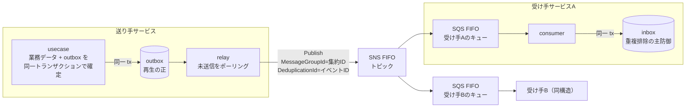
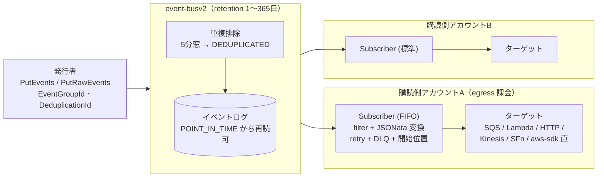
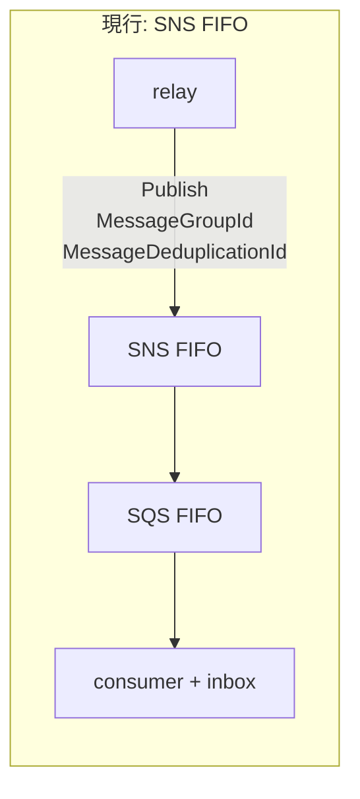

## はじめに

検証用のマイクロサービス基盤で、サービス間のイベント配送を **outbox + relay + SNS FIFO → SQS FIFO** で組んでいます。業務データと同一トランザクションで outbox に書き、relay がポーリングして SNS FIFO へ publish、受け手はサービスごとの SQS FIFO キューを購読する、教科書どおりの構成です。

そこへ 2026-09-24、EventBridge に大型アップデートが来ました。**enhanced custom event bus**。順序保証・重複排除・リプレイをバス本体が持つという、いままで「EventBridge は順序を保証しないので FIFO が要るなら SNS/SQS」と言われてきた前提を崩す内容です。

このバスは SNS/SQS FIFO を置き換えられるのか。**実測済みの要件を物差しにして**仕様を突き合わせました。結論を先に書くと「意味論は完全に満たす。それでも今は乗り換えない」です。

## 前提: 何が要件か

比較の物差しは、既に動いているイベント基盤で実測してきた性質です。抽象的な機能比較ではなく「うちの設計が成立するか」だけを見ます。

| 要件 | 現行（SNS/SQS FIFO）での実現 |
|------|------|
| 集約内の順序保証 | `MessageGroupId` = 集約ID（例 `photo:123`） |
| バス側の重複排除 | `MessageDeduplicationId` = イベントID（5分窓） |
| at-least-once + 受信側冪等 | 配送は at-least-once 前提、受信側の inbox テーブルが主たる防御 |
| 再生の正は outbox | SQS は replay できないため、outbox から再 publish する管理コマンドを持つ |
| ローカル代替 | LocalStack（FIFO の順序・重複排除・可視性タイムアウト・DLQ・ファンアウトを実測して採用） |

現行構成を図にするとこうです。

ポイントは物差しの最後の 2 つです。「再生の正はバスに置かない」「ローカルで同じ経路を組めること」は、機能表には出てこないが設計の成立条件になっている要件です。

## enhanced custom event bus とは

従来の EventBridge（ルール + ターゲット）とは**別物の新 API 系**です。サービス名前空間からして違います。

- API は `eventsv2`（SDK モジュールは `eventbridgev2`、API バージョン 2025-05-15）
- リソースは `event-busv2`。既存のバスは "Custom event bus – classic" として並存し、移行の強制はない
- 発行は `PutEvents`（JSON）または `PutRawEvents`（Avro / Protobuf / 任意バイナリ）
- 購読は **Subscriber** という新リソース。フィルタ・変換（JSONata）・リトライ・DLQ を 1 リソースに束ね、コンシューマ側のアカウントでセルフサービス作成できる
- 課金は per-GB（ingress $0.18/GB、egress $0.05/GB/購読者）で、**発行側と購読側で請求が分かれる**

モデルを図にするとこうです。SNS の「トピック + サブスクリプション」に似ていますが、フィルタ・変換・リトライ・DLQ・開始位置がぜんぶ Subscriber という 1 リソースに寄っているのが特徴です。

## 物差しとの突き合わせ

### 順序: EventGroupId で同型

`PutRawEvents` のエントリに `SystemMetadata.EventGroupId`（1〜128字）を載せ、Subscriber を `--type FIFO` で作ると、**グループ単位で発行順どおりに配送**されます。スループットはグループ数でスケールする、という説明まで含めて SQS FIFO の `MessageGroupId` と同じ意味論です。

判定: **✓ 同型**。

### 重複排除: 5分窓まで同じ

`SystemMetadata.DeduplicationId` を明示するか、コンテンツハッシュによる自動判定。窓は **5分**。重複した publish は `DEDUPLICATED` という**成功コード**で返ります。

窓の長さまで SQS FIFO と同じなので、SQS FIFO で踏んだ罠もそのまま持ち込まれます。うちでは「outbox からの意図した再生（republish）が、5分以内のイベントをバスの重複排除に**黙って**落とされて空振りする」事故を実測しており、再生時だけ DeduplicationId を実行ごとの値に変える迂回を入れています。enhanced bus に乗り換えてもこの迂回はそのまま必要です。

ドキュメント側も「重複排除は producer リトライ対策であり exactly-once ではない」と明言しています。

判定: **✓ 同型**（罠まで同型）。

### 配送保証: inbox 前提は変わらない

配送は push 型で、`RetryPolicy`（既定 5 回 / 300 秒）を使い切ると `OnFailureConfiguration` の SQS キュー（DLQ）へ落ちます。exactly-once は謳われていないので、**受信側の inbox（処理済みイベントIDの永続化）が主たる防御**という設計はそのまま活きます。

1 つ注意があり、FIFO グループ内で配送に失敗したイベントは、**リトライしている間そのグループの後続をブロック**します。これは自前 relay の「失敗した集約の後続をスキップする」判断と同じ性質がバス側にもある、ということです。順序付き Subscriber はリトライ窓を短めにして DLQ と組み合わせるのが定石になりそうです。

判定: **✓ 前提変わらず**。

### 再生: バスにも replay があるが、正は outbox のまま

enhanced bus は 1〜365 日の retention を持ち、Subscriber を `StartingPosition: POINT_IN_TIME` で作ると過去のイベントから読み始められます。SQS には無かった機能で、「新規購読者の初期構築」がバス機能だけでできるようになります。

ただし、うちの設計は「再生の正は outbox テーブル」で確定させています。バスの retention は課金対象（$0.08/GB-月）ですし、365 日を超える再生や「イベント設計を変えた上での再構築」はどのみち outbox からしかできません。バス replay は補助として嬉しい、程度の位置づけです。

判定: **✓ 設計変更不要**（むしろ補助が増える）。

### ローカル代替: ここで止まる

**現時点で無し。** これが結論を決めました。

LocalStack には「EventBridge v2 provider」（`PROVIDER_OVERRIDE_EVENTS=v2`）がありますが、これは**旧 events API の内部実装を書き直したもの**で、`eventsv2` という新サービスとは別物です。GA から数日の API をエミュレータが追えているはずもなく、`event-busv2` / Subscriber / `PutRawEvents` をローカルで組む手段は今のところありません。

うちはローカルエミュレータを採用するとき「検証したい経路がローカルで組めるか」を実測して決めています（LocalStack の SQS FIFO は順序・重複排除・可視性タイムアウト・DLQ・SNS ファンアウトの 5 性質を全部実測してから採用しました）。その物差しで、enhanced bus は現時点で候補になりません。

判定: **✗**。

## 乗り換えるとしたら、差分はどれくらいか

意味論が同型なので、実は差分がとても小さいことも分かりました。想定アーキテクチャを現行と並べます。

```mermaid
graph LR
    subgraph 想定["想定: enhanced bus（変わるのは色付きの2箇所だけ）"]
        R2["relay<br/>（送信アダプタのみ差し替え）"] -- "PutRawEvents<br/>EventGroupId=集約ID<br/>DeduplicationId=イベントID" --> EB["event-busv2"]
        EB --> SUB["FIFO Subscriber<br/>SqsParameters:<br/>MessageGroupId =<br/>&#123;% $events.SystemMetadata.EventGroupId %&#125;"]
        SUB --> Q2a["SQS FIFO"] --> C2a["consumer + inbox<br/>（無変更）"]
    end
    style R2 fill:#7c3aed,color:#fff
    style EB fill:#7c3aed,color:#fff
    style SUB fill:#7c3aed,color:#fff
```

Subscriber のターゲットには SQS を指定でき、JSONata で `EventGroupId` を SQS FIFO の `MessageGroupId` に写せます。つまり **受信側（SQS ポーリング + inbox）は 1 行も変えず**、送信アダプタ 1 つと IaC の差し替えで済む。SNS FIFO が座っていた場所に EventBridge が入るだけです。

送信側インターフェースを `Bus interface { Publish(ctx, Event) error }` の 1 メソッドに絞ってあったことが、この見積もりの小ささに効いています。バスの乗り換え検討が「アダプタ 1 実装ぶん」で見積もれるのは、差し込み口を薄く保ってきた配当です。

## 細かい落とし穴メモ

ドキュメントと解説記事から拾った、ハマりそうな点を記録しておきます。

- **フィルタは publish API 依存**。`PutEvents` のイベント向けに書いたパターンは `PutRawEvents` のイベントにマッチしない。片方の API を前提にフィルタを書くと、もう片方の発行者が現れた日に静かに取りこぼす
- **Subscriber の作成・削除はバスごとに直列**。並行すると `ConcurrentModificationException`。IaC を並列適用する CI はここで落ちる
- `StartingPosition: LATEST` の新規 Subscriber は過去イベントを見ない（当たり前だが、SNS 購読の感覚でいると「購読した瞬間から」の意味を取り違える）
- **publish の 200 は配送確認ではない**。「バスが保管した」まで。ドキュメント自身が `FilterEvaluated` / `FilterMatched` / `EventsDelivered` メトリクスでの切り分け手順を用意している

## 結論

| 観点 | 判定 |
|------|------|
| 順序・重複排除の意味論 | SNS/SQS FIFO と同型（5分窓・グループブロックの性質まで同じ） |
| 移行コスト | 送信アダプタ 1 つ + IaC。受信側無変更 |
| ローカル代替 | 現時点で無し |
| 今の判断 | **乗り換えない。ただし「FIFO の代替にならない」からではない** |

「EventBridge は順序を保証しないから FIFO 用途では候補外」という長年の前提は、2026-09-24 で崩れました。機能面ではもう置き換えられます。

それでも今は乗り換えません。理由は機能ではなく**開発の前提**です。ローカルで同じ経路を組めないバスは、クラウド費用ゼロでローカル一気通貫を回す開発スタイルと両立しない。LocalStack が `eventsv2` に対応した時点で、このバランスは変わります。

一方、プロダクションの文脈では別の計算が働きます。per-GB 課金（旧来の $1/100万件と比べて小さいイベントを大量に流すほど有利）と、発行側・購読側の**課金分離**（チーム別チャージバックがそのまま成立する）は、複数チームでバスを共有する組織ほど効きます。「順序が要るから SNS/SQS FIFO」で思考停止せず、実機検証のタイミングで両方を同じ物差しで測る予定です。

## 参考

- [Building event-driven applications at scale with Amazon EventBridge](https://aws.amazon.com/blogs/compute/building-event-driven-applications-at-scale-with-amazon-eventbridge/)（AWS Compute Blog、2026-09-28）
- [Introducing enhanced custom event buses in Amazon EventBridge](https://aws.amazon.com/blogs/aws/introducing-enhanced-custom-event-buses-in-amazon-eventbridge-for-enterprise-scale-event-driven-applications/)（公式発表、2026-09-24）
- [PutRawEvents API リファレンス](https://docs.aws.amazon.com/eventbridgev2/latest/APIReference/API_PutRawEvents.html)
- [Subscribing to events on a Custom Event Bus](https://docs.aws.amazon.com/eventbridge/latest/userguide/eb-custom-bus-subscribers.html)
- [EventBridge's new custom event bus（解説記事、料金の具体値）](https://dev.to/matias_martinez_185d9e0ee/eventbridges-new-custom-event-bus-one-bus-for-the-whole-org-with-ordering-replay-and-per-gb-3k2g)
