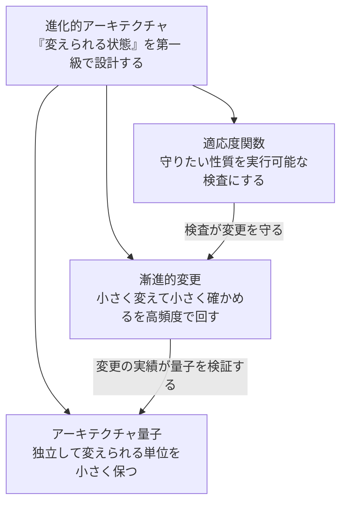

## はじめに: なぜこれを最初に読むのか

モノリスからサービスを分離していくとき、個別の道具はたくさん出てきます。
モジュール境界、CI の分離、expand / contract のマイグレーション、
FK の棚卸し、段階的な切り出し。どれも単体で説明できますが、
**なぜその形なのか**は、裏側にある1つの概念から来ています。

それが**進化的アーキテクチャ（Evolutionary Architecture）**です。出典は
Neal Ford / Rebecca Parsons / Patrick Kua の
『Building Evolutionary Architectures』（邦訳『進化的アーキテクチャ』、オライリー）。
定義はこうです:

> 進化的アーキテクチャは、**複数の次元にわたる、誘導された漸進的な変更**を
> 第一級の関心事として支援する。

言い換えると、アーキテクチャの良し悪しを「いまの要件にどれだけ合っているか」
ではなく、**「要件が変わったときにどれだけ安全に変えられるか」**で測る、
という立場です。モノリスからの分離はまさに「変え続ける」プロジェクトなので、
この概念が全道具の共通の親になります。

本や講演の語彙は3つに集約できます。**適応度関数**、**漸進的変更**、
そして**アーキテクチャ量子**。以下、それぞれを定義 → なぜ要るか →
実装例（[検証リポジトリ greenfield](/blog/greenfield-overview/) の実物と実測値）
の順で見ていきます。

## 適応度関数（fitness function）: 守りたい性質を実行可能にする

**定義**: アーキテクチャの特性（結合の制約、互換性、可用性…）を
客観的に評価できる検査のこと。進化計算の用語からの借用で、
「この変更を受け入れてよいか」を人の記憶でなく機械が判定します。

なぜ要るのか。アーキテクチャは図ではなく
[「変更に晒されても保たれる制約の集合」](/blog/architecture-as-code/)で、
文書にしか存在しない制約は最初の締め切りで静かに破られるからです。
「サービス間で DB を直接参照しない」と規約に書くだけなら1行で破れる。
CI がそれを検出して落とすなら、破れは構造的に main に入れない。

greenfield では、守りたい性質のそれぞれに対応する検査を CI に常設しています:

| 守りたい性質 | 適応度関数（実物） |
|---|---|
| サービス間の結合はコード境界を跨がない | 越境 import がコンパイル不能（モジュール分割 + go.mod） |
| データの結合は database を跨がない | 跨ぎ FK の検査。移行中は警告モードで「残り本数」を進捗として出す |
| 意図したコードが検証されている | replace 忘れの検査（公開版を黙って拾う事故を止める） |
| API の後方互換 | oasdiff。破壊的変更はメジャー未更新で CI が落ちる |
| マイグレーションの無停止性 | DDL が `ALGORITHM=INSTANT` で通るかの検査（通らない方式はエラーで返る） |
| デプロイされる版が壊れていない | テストトラフィックの昇格ゲート（healthz でなく業務の書き込みまで検証） |

1つ注意があって、**適応度関数そのものが壊れると、失敗でなく成功として
出てきます**。検査は放っておくと通る側に倒れる——これは
[fail open](/blog/checks-fail-open/) として別記事にまとめた、
適応度関数を運用する上での最重要の罠です。「ずっと成功し続けている検査」こそ
定期的に破ってみせて確かめる。

## 漸進的変更（incremental change）: 小さく変えて、小さく確かめる

**定義**: ビッグバンでなく、小さな変更を高頻度に、それぞれ検証しながら
積む進め方。適応度関数が「1歩ごとの安全確認」を担うことで初めて成立します。

これはデリバリーの形にそのまま現れます。greenfield の実測では:

- CI は変更範囲に比例する — 9 モジュール中、変更に関係する 2 個だけ動く
  （[デプロイ分離と生産性](/blog/deploy-isolation-developer-productivity/)）
- デプロイの巻き戻しは 32 秒、リリース（フラグ）の巻き戻しは 14 秒 —
  1歩が安全に戻せるから小さく踏める
  （[プログレッシブデリバリー入門](/blog/progressive-delivery-intro/)）
- DB は expand / contract に割って、無停止のカラム改名を負荷継続中に
  エラー 0 件で完走（[アプリとDBの各層実測](/blog/progressive-delivery-app-vs-db/)）

モノリス分離の文脈で大事なのは、
[データの切り出しを3段階に割る](/blog/monolith-data-carving-three-stages/)のも
同じ概念の適用だということです。「一気に別インスタンスへ」でなく、
コードの所有権 → database 分離 → 物理分離、と1歩ずつ進めて、
各歩に検査（FK 棚卸し・検算）を置く。漸進的変更をデータに適用した形が
あの3段階です。

## アーキテクチャ量子（architectural quantum）: 独立して変えられる単位

**定義**: 独立してデプロイできる、高機能凝集な最小単位（『Software Architecture:
The Hard Parts』で精緻化された語彙）。量子が大きい = どこを変えても全体を
デプロイし直すことになる、が古典的なモノリスの姿です。

進化的アーキテクチャの実践は、この**量子を小さく保つ**ことに集約されます。
ただし greenfield で実測して分かったのは、量子の小ささは
「マイクロサービスにすること」と同義ではない、ということでした:

- [Go モノレポをシングルプロセスで動かしながら](/blog/local-dev-hostname-optional/)、
  モジュール境界・DB 分離・API 契約は本番同様に保てる。**量子を小さく保つことと、
  分けて配備することは別の決定**で、後者は後から変えられる
- 量子が本当に小さいかは「追加」では検証できない。
  [除却と切り出しのドリル](/blog/boundary-redraw-cost-measured/)——サービスを
  1つ消す・1つ切り出す——をやって初めて、境界が本物だったと言える

モノリスからの分離とは、**量子1個の巨大なシステムを、量子 N 個へ段階的に
分割し直す作業**です。各段階のアーキテクチャ（モジュラーモノリス、
database 分離、別インスタンス）は量子の大きさが違うだけで、
守るべき性質（結合の制約）と確かめ方（適応度関数）は一貫しています。

## まとめ: 3要素は循環する

- **適応度関数**が変更の1歩ずつを守り、
- 守られているから**漸進的変更**を高頻度で踏めて、
- 変更の実績（除却・切り出し・差し替えが実際に安いこと）が
  **量子の小ささ**を証明し続ける

この循環が回っている状態が「進化的」です。逆にどれか1つが欠けると——
検査が fail open している、変更がビッグバンに戻る、量子が密結合で膨らむ——
残り2つも連鎖して崩れます。

モノリスからの分離を考えている人は、この記事のあとに
[greenfield の全体像](/blog/greenfield-overview/)（実装例の目次）と
[データ切り出しの3段階](/blog/monolith-data-carving-three-stages/)（移行の手順）へ
進むのがおすすめです。個々の道具がどれも「変えられる状態を保つ」ための
実装例であることが、読みながら繋がっていくはずです。
