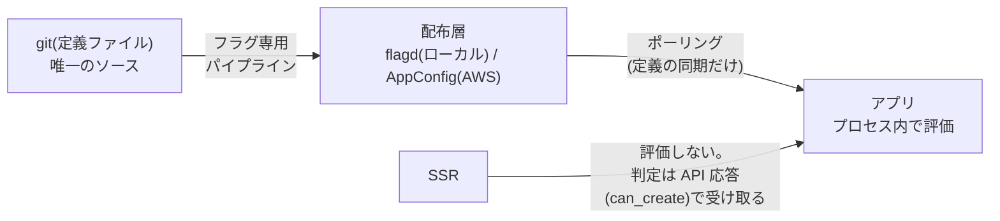

## はじめに

[デプロイ戦略の選び方の記事](/blog/deploy-strategy-selection/)で、巻き戻しには独立した2本のレバーがある、と書きました。

- **デプロイの巻き戻し**: バイナリが壊れていた → ECS `stopDeployment`（実測 32 秒で本番復帰）
- **リリースの巻き戻し**: 機能の見せ方を引っ込めたい → フィーチャーフラグ

前者は実測済みでした。今回は後者 — フラグ側のレバーが本当に「デプロイと独立に、速く」動くのかを AWS AppConfig で実測します。結果は**切替 14 秒・再起動なし・アプリ変更 0 行**でした。数字と、そこに至る設計判断を書きます。

## 前提: なぜ2本に分けるのか

「新機能の公開」をデプロイでやると、公開を止めるにはデプロイを巻き戻すしかなくなります。逆にデプロイ事故をフラグで隠すと、壊れたバイナリが本番に居座り続けます。守るものが違う操作は、レバーも別であるべきです。

| | デプロイのレバー | リリースのレバー |
|---|---|---|
| 対象 | バイナリ・スキーマ | 機能の見せ方・キルスイッチ |
| 巻き戻し | `stopDeployment`（32秒） | フラグ反転（**14秒**） |
| 主な使い手 | デプロイ機構（自動）+ 運用 | プロダクト側 + 運用 |

段階公開（「新 UI を 10% のユーザーに」）をデプロイのカナリアでやりたくなりますが、あれは「バイナリが壊れていないか」の保険装置です。ユーザー体験の段階公開はフラグの仕事 — この分担を守ると、どちらのレバーも単独で引けます。

## 設計判断: 評価はプロセス内、定義は配布する

フラグ基盤の分かれ道は「**評価をどこでやるか**」です。

- **評価はプロセス内**。リクエストごとに外部のフラグサービスへ問い合わせる形（リモート評価）にすると、全リクエストがフラグ基盤の可用性とレイテンシに結合します。アプリは定義をポーリングで同期し、評価は手元でやる
- **定義は git が唯一のソース**。フラグの変更は PR レビューを通り、フラグ専用パイプライン（アプリのデプロイと独立）が配布層へ届ける
- **評価箇所はサービス側の1つだけ**。SSR にも評価ライブラリを入れたくなりますが、同じフラグを2箇所で評価すると、タイミング差で「API は受け付けるのに UI は出さない」type の不整合が生まれます。SSR は API の応答（`can_create` のような判定済みの値）を受け取るだけにする

この形にしておくと、配布層（flagd ↔ AppConfig）の差し替えがアプリに波及しません。それを実測で確かめるのが今回の主題です。

## 実装: AppConfig 用の OpenFeature プロバイダは自作

アプリは [OpenFeature](https://openfeature.dev/)（フラグ評価の標準インターフェース）越しにフラグを見ます。配布層ごとの差は provider が吸収する設計ですが、**AppConfig 用の Go provider は公式コントリビュート集（go-sdk-contrib）に存在しません**でした。自作した provider の要件は4つ:

1. AppConfig をポーリングして定義を同期、評価はプロセス内
2. 取得に失敗しても**直前の定義で評価を続ける**（stale 継続）
3. 一度も取得できていなければ `NOT_READY` を返し、**コードに書いた既定値**へ倒す
4. 差し替えは合成ルート（DI の配線）だけで済み、usecase / handler に触れない

3 が安全設計の核です。フラグ基盤が死んだとき、評価は「宣言済みの既定値」に落ちる。キルスイッチ系のフラグは「既定 = 機能有効」で書いておけば、フラグ基盤の障害がサービス停止に化けません（逆に「既定 = 無効」で書くべきものもある — 既定値はフラグごとの安全側を宣言する場所です）。

## 実測

| 確認 | 結果 |
|---|---|
| flagd → AppConfig の差し替えで usecase / handler | **変更 0 行**（配線の分岐と新モジュールのみ） |
| フラグ切替がユーザーに届くまで | **14 秒**、アプリの再起動・デプロイなし |
| AppConfig から取得できない状態で起動 | WARN ログ + 宣言既定値で通常稼働 |
| AppConfig の段階デプロイ（50% × 2分 + ベイク）中の評価 | 193 サンプル中、値の遷移は**1回だけ**（フリップフロップしない） |

4つ目は地味に重要で、AppConfig 自体が設定の段階デプロイ機能を持つため、「配布が段階的に進む間、1つのアプリの評価結果が行ったり来たりしないか」を見ています。ポーリング+プロセス内評価なら、各インスタンスは自分が取得した版で一貫して評価するので、遷移は取得タイミングの1回だけになります。

キルスイッチの通し（フラグ反転 → API の `can_create` が false → SSR の投稿ボタンが消える）は、ローカルの E2E で毎回機械検査しています。今回の 14 秒はその経路の「配布層を AWS にしたときの伝播時間」です。

## 踏んだ罠

- **AppConfig のフラグキーは `.` を受け付けない**（`^[a-z][a-zA-Z0-9_-]{0,63}$`）。`ops.photo_disable_uploads` のようなドット区切りの命名規約は AWS に持ち込めず、`ops_photo_disable_uploads` へ**規約ごと変更**になった。命名規約を決めるときは、将来の配布層の制約まで見ておくべきだった（ローカルの flagd は何でも通すので気づけない）
- **deletion protection が destroy を止める**。直近1時間にポーリングされた AppConfig リソースは削除が拒否される。使い捨て検証では `--deletion-protection-check BYPASS` が要る（Terraform provider にはこの口が無く、CLI で消すことになる）
- 定義ファイルの二重管理に注意。ローカル（flagd 用）と AWS（AppConfig 用）で定義を別ファイルにすると必ずズレる。**git の1ファイルを唯一のソース**にして、パイプラインが AppConfig の形式へ変換する

## 2本のレバー、そろって実測

これでデプロイ側・リリース側の両レバーが数字で揃いました。

| 事象 | 引くレバー | 実測 |
|---|---|---|
| バイナリが壊れていた | `stopDeployment` | 32 秒で本番復帰 |
| 機能の見せ方を引っ込めたい | フラグ反転 | 14 秒で全ユーザーへ伝播 |
| フラグ基盤自体が死んだ | 何もしない | 宣言既定値で稼働継続 |

「フラグの方が速いなら全部フラグでいいのでは」とはなりません。フラグで隠せるのは**コードが正しく動く前提での見せ方**だけで、壊れたバイナリはフラグの後ろでも壊れ続けます（ログ・メトリクス・リソースを汚しながら）。事象がどちらのレバーの管轄かを迷わないために、2本は独立に保ちます。

## まとめ

- リリースの巻き戻しはデプロイと別のレバーとして持つ。実測: フラグ反転 14 秒 vs `stopDeployment` 32 秒 — どちらも速いが、守るものが違う
- 評価はプロセス内・定義は git を唯一のソースにして配布。この形なら配布層の差し替え（flagd → AppConfig）はアプリ変更 0 行で済む
- 既定値は「フラグ基盤が死んだときの安全側」を宣言する場所。フラグごとにどちらが安全側かを決めて書く
- 命名規約は配布層の制約（AppConfig はドット不可）まで見てから決める

デプロイ側の実測は [ECS ネイティブ B/G・カナリアの使い分け](/blog/ecs-native-bluegreen-canary/)と[3層防衛の実測](/blog/ecs-deployment-gates-measured/)、選び方の全体像は[選ばせない運用](/blog/deploy-strategy-selection/)へ。
