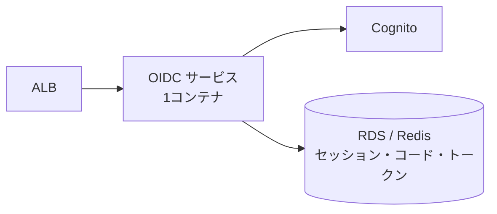
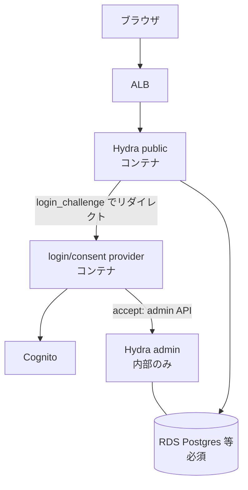

## 前提 — 土俵を揃える

ここまで2本書いた。

1. [OIDC のセッションは3層あり、SSO = OP セッションを単一の権威として持つこと](/blog/oidc-session-and-sso-design/)
2. [その OP セッションを誰が実装するか — 自作・fosite・Hydra](/blog/op-session-self-vs-fosite-vs-hydra/)

2本目で fosite と Hydra を比べたとき、判断を歪めていた要因が1つあった。**「Lambda 前提」**だ。fosite はストレージ必須なので Lambda だとステートフル化が重く、Hydra は常駐サーバなのでそもそも Lambda で動かない。この非対称が比較を曇らせていた。

そこで前提を変える。**サービスをコンテナ化して ECS で動かす**。すると:

- fosite の「ストレージ必須」は、常駐コンテナ + RDS/Redis が当たり前の世界では**難点ではなくなる**
- Hydra の「常駐サーバ必須」も、**まさに ECS の用途**になる

つまり serverless 制約が外れ、fosite と Hydra が**対等な土俵**に乗る。この記事は、その上での一騎打ちだ。

## ECS にして消えた差・残った差

| 論点 | Lambda 前提 | ECS 前提 |
|---|---|---|
| fosite のストレージ必須 | △ DynamoDB 必須・往復増が懸念 | ◎ RDS/Redis が普通。気にならない |
| Hydra の常駐サーバ | ✗ 動かない | ◎ ECS の定番用途 |
| OP セッションの保存先 | DynamoDB 一択気味 | Postgres でも Redis でも自由 |
| **サービスの数** | — | **ここだけ差が残る** |

消えなかったのはただ1つ、**サービスの数**だ。これが ECS 後の本質的な分岐になる。

## 本質は2軸に圧縮される

土俵が揃った結果、fosite vs Hydra はこの2軸だけに圧縮される。

1. **1サービス(fosite)か、2サービス + headless 連携(Hydra)か** — 運用のシンプルさ
2. **OP セッションを書くか(fosite)、買うか(Hydra)** — 制御 vs 既製

DB はどちらも要る(差は消えた)。Cognito 連携と login UI はどちらでも自作(共通資産)。残るのは上の2軸だけ。

## fosite on ECS — 1サービス + DB

既存の自前 OIDC Provider をそのままコンテナ化し、自分で書いていたプロトコルの中身だけを fosite に差し替える。



1つのコンテナの中に全部入る:

- OIDC プロトコル(fosite — コード/トークン/grant/PKCE/エラー応答)
- **OP セッション**(cookie + ストア。自分で書く)
- login / consent UI
- Cognito 連携

```go
// fosite は「認証済みか」を判断しない。OP セッションは自前のまま。
sess := h.currentSession(c)            // ← 自作の OP セッション
if sess == nil { h.renderLogin(c); return }

ar, _ := provider.NewAuthorizeRequest(ctx, req)
oidcSession := &openid.DefaultSession{ /* sub, auth_time, claims */ }
resp, _ := provider.NewAuthorizeResponse(ctx, ar, oidcSession) // ← プロトコルは fosite
provider.WriteAuthorizeResponse(ctx, w, ar, resp)
```

| | 評価 |
|---|---|
| デプロイ単位 | 1サービス。既存構造をそのまま育てられる |
| OP セッション | 自分で書く(全制御。トークン形式・セッション設計を握れる) |
| プロトコルの正しさ | 認定済みライブラリに移譲。自作の最大リスクが消える |
| ストレージ | RDS でも Redis でも DynamoDB でも自由(自分で Storage 実装) |
| 学習コスト | Storage インターフェースが多く配線が多い。ドキュメント薄め |

## Hydra on ECS — 2サービス + DB

Hydra は ECS で自然に動く。ただし **headless(login/consent UI を持たない)**という性質は ECS にしても消えない。だから login/consent を別サービスに割る。



- **Hydra 本体**(public:4444 / admin:4445)。OP セッション・consent・logout を**所有する**
- **login/consent provider**(自作コンテナ)。Hydra からのリダイレクトを受け、Cognito で認証し、Admin API で accept を返す
- **RDS 必須**(Postgres / MySQL / CockroachDB)。Hydra のステートはここ

| | 評価 |
|---|---|
| デプロイ単位 | 2サービス(Hydra + login/consent provider)+ DB |
| OP セッション | **書かなくていい**(Hydra が所有。SSO/consent/logout 込み) |
| プロトコルの正しさ | OIDC 認定をそのまま得る |
| ストレージ | リレーショナル DB 固定(Postgres 等) |
| 学習コスト | login/consent provider の実装 + Hydra 運用の習得 |

OP セッションという「自前 OIDC で一番面倒な部分」を**製品として買える**のが Hydra の価値。代償は2サービス運用と、Hydra の login/consent の流儀に乗ること。

## ECS 前提での比較表

| 関心事 | fosite | Hydra |
|---|---|---|
| デプロイ単位 | **1サービス** + DB | **2サービス**(Hydra + provider)+ DB |
| OP セッション(SSO) | 自分で書く(全制御) | Hydra が所有(既製) |
| consent | 自分で書く | Hydra 管理(provider は自作) |
| logout / back-channel | 自分で書く | Hydra 提供 |
| トークン形式の自由度 | ◎ 自由 | △ Hydra の流儀 |
| ストレージ選択 | ◎ 自由(RDS/Redis/Dynamo) | △ リレーショナル DB 固定 |
| Cognito 連携・login UI | 自作(共通) | 自作(共通) |
| OIDC 認定 | 自分で担保 | ✅ 製品で担保 |
| 既存サービスの扱い | そのまま育てる | login provider に格下げ + Hydra 追加 |

## どちらが勝つか

ユースケースで割れる。

**fosite が勝つ**:
- 自社マルチプロダクト・first-party 中心で、**consent はほぼ素通し**でいい
- 1サービスで運用をシンプルに保ちたい
- Cognito 隠蔽・トークン形式・セッション設計を**自分で握りたい**
- 既存の自前 Provider の構造(handler / usecase / Cognito 連携)を活かしたい

**Hydra が勝つ**:
- **third-party クライアント**に開放し、consent 画面を作り込む必要がある
- back-channel / front-channel logout を**自分で保守したくない**
- OIDC 認定を製品としてそのまま欲しい
- 2サービス + DB の運用を許容できる

自社マルチプロダクトの自前 OIDC Provider という文脈だと、consent はほぼ素通しで third-party 開放も当面ない。この場合 **Hydra の旨味(consent/logout/認定を買える)が出にくく、2サービス運用のコストだけが効いてくる**。だから fosite が素直だ。

## ロックインしない — Hydra の橋は焼けない

「fosite で始めると Hydra を捨てることになる」は誤解。両アプローチで必要になる **login/consent provider(UI + Cognito 認証)は共通資産**だから、後から載せ替えられる。

- fosite で先に進める → 運用して「OP セッション/logout の保守がコストに見合わない」と感じたら Hydra に委譲
- そのとき捨てるのは「自作した OP セッション」だけ。login UI と Cognito 連携はそのまま Hydra の provider になる

つまり **fosite は「今の構造を活かす安い一手」かつ「後で Hydra に逃げられる」**。最初から Hydra にすると、Lambda 由来の今の構造思想とズレた状態で2サービス運用を背負う。順序として fosite が先で損がない。

## まとめ

- **ECS でコンテナ化すると fosite vs Hydra は対等になる**。fosite のステートフル化も Hydra の常駐も、もう難点ではない。
- 消えずに残る差は2つだけ — **サービスの数(1 vs 2)** と **OP セッションを書くか買うか**。
- **fosite = 1サービスで OP セッションを自分で握る**。既存構造を活かせ、制御が効く。
- **Hydra = OP セッション/consent/logout を買う代わりに2サービス + DB**。third-party や consent 作り込みが要るなら強い。
- 自社マルチプロダクト・first-party 中心なら **fosite が素直**。Hydra の旨味が出にくく、運用コストだけ残る。
- **fosite で始めても Hydra の橋は焼けない**(login/consent provider は共通)。順序として fosite が先で損がない。
