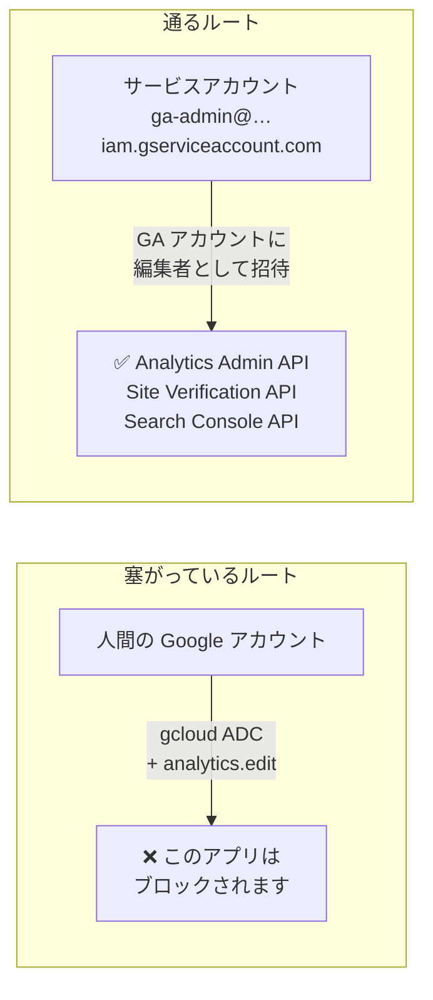
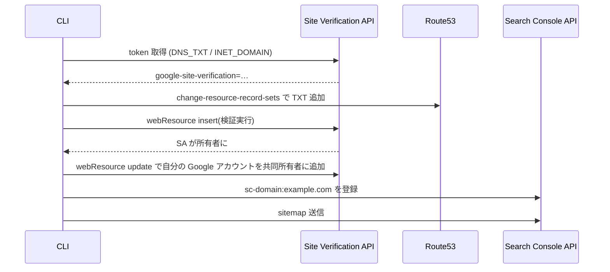

## TL;DR

1. GA4 のプロパティ作成〜測定 ID 取得、Search Console のドメイン登録〜sitemap 送信は**全部 API で完結できる**(Analytics Admin API / Site Verification API / Search Console API)
2. ただし `gcloud auth` に analytics スコープを足す王道ルートは**「このアプリはブロックされます」で死ぬ**。正解形は**サービスアカウントを GA に招待する**方式
3. ブラウザが本当に必要なのは「GA アカウントの初回作成(規約同意)」と「SA を GA に招待する 1 クリック」だけ——という切り分けの記録

## 動機

このブログにアクセス解析を入れたくなった。GA4 のセットアップ手順を検索すると「管理画面を開いて、プロパティを作成して、ウェブストリームを追加して……」というスクリーンショット満載の記事ばかり出てくる。やりたくない。プロパティも測定 ID もただのリソースなのだから、API で作れるはずである。

結論から言うと作れる。ただし素直なルートが 1 つ塞がっていて、そこで一度死んだ。

## ハマり 1: gcloud 標準クライアントは analytics スコープでブロックされる

GA4 の管理系 API は [Analytics Admin API](https://developers.google.com/analytics/devguides/config/admin/v1) で、必要なスコープは `https://www.googleapis.com/auth/analytics.edit`。まず誰もが考えるのは ADC にスコープを足すルートだと思う。

```bash
gcloud auth application-default login \
  --scopes=https://www.googleapis.com/auth/analytics.edit,https://www.googleapis.com/auth/cloud-platform
```

これはブラウザの同意画面まで進んだところで、Google にこう言われて終わる。

> **このアプリはブロックされます**
> このアプリが、Google アカウントのプライベートな情報にアクセスしようとしました。アカウントを安全に保つため、Google によりこのアクセスはブロックされました。

自分のアカウント設定の問題ではない。**gcloud が使っている OAuth クライアント自体が、cloud-platform 系以外の機密スコープを要求することを Google に承認されていない**。gmail 系スコープなどでも同じ現象が起きる、gcloud の既知の仕様である。

回避策として「自前の OAuth クライアントを作って `--client-id-file` で渡す」ルートもあるが、同意画面の設定・テストユーザー登録・クライアント種別(デスクトップ必須)と罠が多く、1 つ間違えると同じブロック画面に戻される。ここで消耗するより、最初から**人間の OAuth を諦める**方が早い。

## 正解形: サービスアカウントを GA に「ユーザーとして」招待する

発想の転換はこうだ。GA のアクセス管理は Google アカウントをメールアドレスで招待する仕組みだが、**サービスアカウントのメールアドレスもそこに突っ込める**。SA には OAuth 同意画面が存在しないので、ブロック問題ごと消滅する。



セットアップは 3 手。

```bash
# 1. SA とキーを作る(プロジェクトは何でもいい。API のクォータ計上先になるだけ)
gcloud iam service-accounts create ga-admin --project=my-project
gcloud iam service-accounts keys create ~/.config/gcloud/ga-admin.json \
  --iam-account=ga-admin@my-project.iam.gserviceaccount.com

# 2. Admin API を有効化
gcloud services enable analyticsadmin.googleapis.com --project=my-project
```

3 手目だけブラウザ作業になる。GA の管理画面 → アカウントのアクセス管理 → SA のメールアドレスを**編集者**で追加。30 秒で終わる。なお GA アカウント自体を一度も作ったことがない場合は、最初の 1 個だけウィザードで作る必要がある(利用規約同意があるため。API にも `provisionAccountTicket` はあるが、結局リダイレクト先のブラウザで同意する設計なので手間は変わらない)。

以降、トークンはこう取る。`--scopes` でスコープを差し替えられるのがポイント。

```bash
export GOOGLE_APPLICATION_CREDENTIALS=~/.config/gcloud/ga-admin.json
TOKEN=$(gcloud auth application-default print-access-token \
  --scopes=https://www.googleapis.com/auth/analytics.edit)
```

## GA4 プロパティ作成〜測定 ID 取得

ここからは素直な REST 3 連発で終わる。

```bash
# アカウント確認(SA を招待できていれば見える)
curl -s -H "Authorization: Bearer $TOKEN" \
  "https://analyticsadmin.googleapis.com/v1beta/accounts"

# プロパティ作成
curl -s -X POST -H "Authorization: Bearer $TOKEN" -H "Content-Type: application/json" \
  -d '{"parent":"accounts/123456789","displayName":"example.com",
       "timeZone":"Asia/Tokyo","currencyCode":"JPY","industryCategory":"TECHNOLOGY"}' \
  "https://analyticsadmin.googleapis.com/v1beta/properties"

# ウェブストリーム作成 → レスポンスに measurementId (G-XXXXXXXXXX) が入っている
curl -s -X POST -H "Authorization: Bearer $TOKEN" -H "Content-Type: application/json" \
  -d '{"type":"WEB_DATA_STREAM","displayName":"example.com web",
       "webStreamData":{"defaultUri":"https://example.com"}}' \
  "https://analyticsadmin.googleapis.com/v1beta/properties/555555555/dataStreams"
```

返ってきた `G-XXXXXXXXXX` を gtag スニペットに入れてデプロイすれば計測が始まる。管理画面を開いたのは招待の 30 秒だけ。

## ハマり 2: API で作ったプロパティは「データ収集の確認」が未承認

計測の疎通確認を Measurement Protocol でやろうとして、シークレット作成 API が謎のエラーを返した。

```
FAILED_PRECONDITION: The User Data Collection Acknowledgement must be
attested on this property before measurement protocol secrets may be created.
```

UI のウィザードでプロパティを作ると自動で通る「ユーザーデータ収集の確認」(エンドユーザーへのプライバシー開示を行っているという宣誓)が、**API 作成のプロパティでは未承認のまま残る**。これも API で承認できるが、`acknowledgement` フィールドに規定の英文を一言一句そのまま入れる必要があるという珍しい設計になっている。

```bash
curl -s -X POST -H "Authorization: Bearer $TOKEN" -H "Content-Type: application/json" \
  -d '{"acknowledgement":"I acknowledge that I have the necessary privacy disclosures and rights from my end users for the collection and processing of their data, including the association of such data with the visitation information Google Analytics collects from my site and/or app property."}' \
  "https://analyticsadmin.googleapis.com/v1beta/properties/555555555:acknowledgeUserDataCollection"
```

宣誓する以上は実体も必要なので、ブログ側にはプライバシーポリシーページ(GA の使用・Cookie・オプトアウト手段の開示)を追加した。

## 検証も CLI で閉じる: 204 は成功を意味しない

Measurement Protocol でテストイベントを送ると `HTTP 204` が返るが、**`/mp/collect` は api_secret が間違っていても不正なペイロードでも 204 を返す**。fire-and-forget 設計なので、送信側のステータスコードでは何も検証できない。

受信の確認は Data API のリアルタイムレポートで行う。これなら「送った → GA に届いた」がリクエスト 2 本で閉じる。

```bash
# テストイベント送信(常に 204)
curl -s -X POST \
  "https://www.google-analytics.com/mp/collect?measurement_id=G-XXXXXXXXXX&api_secret=$SECRET" \
  -d '{"client_id":"cli-test.1234567890","events":[{"name":"cli_pipeline_test"}]}'

# 受信確認(scope は analytics.readonly、API は analyticsdata.googleapis.com)
curl -s -X POST -H "Authorization: Bearer $TOKEN" -H "Content-Type: application/json" \
  -d '{"dimensions":[{"name":"eventName"}],"metrics":[{"name":"eventCount"}]}' \
  "https://analyticsdata.googleapis.com/v1beta/properties/555555555:runRealtimeReport"
```

数十秒待つと `cli_pipeline_test` が行として出てくる。ついでに本物のブラウザ訪問の `page_view` も並ぶので、gtag タグ側の疎通も同時に確認できた。

## Search Console も同じ SA で: DNS 検証を Route53 で自動化

勢いがついたので Search Console 登録も CLI でやった。構図は GA と同じで、**SA が検証済み所有者になれば Search Console API が全部使える**。ドメインの DNS が Route53 にあるなら、所有権検証の TXT レコード追加まで含めて完結する。



コマンドはこう(スコープは `siteverification` と `webmasters` の 2 つ)。

```bash
# 検証トークン取得
curl -s -X POST -H "Authorization: Bearer $TOKEN" -H "Content-Type: application/json" \
  -d '{"site":{"identifier":"example.com","type":"INET_DOMAIN"},"verificationMethod":"DNS_TXT"}' \
  "https://www.googleapis.com/siteVerification/v1/token"

# Route53 に TXT を張って伝播を待ったら、検証実行
curl -s -X POST -H "Authorization: Bearer $TOKEN" -H "Content-Type: application/json" \
  -d '{"site":{"identifier":"example.com","type":"INET_DOMAIN"}}' \
  "https://www.googleapis.com/siteVerification/v1/webResource?verificationMethod=DNS_TXT"

# Search Console にドメインプロパティ登録 + sitemap 送信(どちらも 204 で成功)
curl -s -X PUT -H "Authorization: Bearer $TOKEN" \
  "https://www.googleapis.com/webmasters/v3/sites/sc-domain%3Aexample.com"
curl -s -X PUT -H "Authorization: Bearer $TOKEN" \
  "https://www.googleapis.com/webmasters/v3/sites/sc-domain%3Aexample.com/sitemaps/https%3A%2F%2Fexample.com%2Fsitemap-index.xml"
```

地味に嬉しい発見だったのが**共同所有者の追加**。検証直後の所有者は SA だけなので、このままだと人間が Search Console の画面で何も見られない。`webResource` の update で owners 配列に自分の Google アカウントを足すと、ブラウザ側の Search Console にもドメインプロパティが現れる。人間の OAuth を一度も通さずに、人間へ所有権を配れる。

```bash
curl -s -X PUT -H "Authorization: Bearer $TOKEN" -H "Content-Type: application/json" \
  -d '{"site":{"identifier":"example.com","type":"INET_DOMAIN"},
       "owners":["ga-admin@my-project.iam.gserviceaccount.com","me@gmail.com"]}' \
  "https://www.googleapis.com/siteVerification/v1/webResource/dns%3A%2F%2Fexample.com"
```

TXT レコードは検証後も**消してはいけない**(Google が定期的に再チェックし、消えると所有権を失う)。

## まとめ: どこまで CLI で行けるのか

| 作業 | CLI | 備考 |
|---|---|---|
| GA アカウント初回作成 | ❌ | 規約同意。最初の 1 回だけ |
| SA を GA に招待 | ❌ | 管理画面で 30 秒 |
| GA4 プロパティ / ストリーム作成・測定 ID 取得 | ✅ | Analytics Admin API |
| データ収集の確認(宣誓) | ✅ | `acknowledgeUserDataCollection` |
| 計測の疎通確認 | ✅ | MP 送信 + Data API リアルタイム |
| ドメイン所有権検証 | ✅ | Site Verification API + Route53 |
| 人間アカウントへの所有権付与 | ✅ | owners 配列に追加するだけ |
| Search Console 登録 / sitemap 送信 | ✅ | Search Console API |
| 集計・レポート取得 | ✅ | Data API(今後の楽しみ) |

ブラウザ作業は本当に 2 箇所だけだった。そして一度 SA を招待してしまえば、この先のプロパティ追加・設定変更・レポート取得はすべて再現可能なコマンドになる。「先月の PV を出して」を API 一発で返せる状態が手に入ったのが、スクリーンショット手順書に従うのとの一番の違いだと思う。
