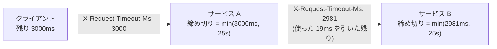

## はじめに

サービスの「止まり方」と「待ち方」は、普段は誰も気にしません。デプロイのたびにプロセスは止まり、依存先が遅ければリクエストは待たされますが、問題が起きるまで見えないからです。

[検証リポジトリ](https://github.com/rikukaInoue/greenfield)で、この2つを規約にして実装し、実測しました。対象は Go の HTTP サービスと、非同期のイベント連携を担う常駐プロセス2つです。

- **relay**: DB の outbox テーブルに溜まったイベントを取り出してメッセージバス（SNS）へ送る
- **consumer**: キュー（SQS）からイベントを受け取り、業務処理をしてから削除する

この2つは outbox / inbox パターンで作ってあり、途中で止まっても**データは失われません**（送れていないイベントは DB に残り、重複して届いたイベントは受け側が弾く）。この「壊れはしない」が、止まり方の問題を見えにくくしていました。

## グレースフルシャットダウン

### 直す前に何が起きていたか

コードを読んで確認した状態です。

| 対象 | 問題 |
|---|---|
| HTTP サーバ | `Shutdown` のエラーを捨てていた（`_ = s.Shutdown(ctx)`）。上限は 5 秒固定で、処理中のリクエストを待ちきれたのか切ったのか区別できない |
| relay | 停止指示（SIGTERM）で処理中の送信バッチが途中で止まる |
| consumer | 同じく、受け取ったメッセージの処理と削除が途中で止まる |
| relay / consumer | SIGTERM で終了コード 1 を返す |

relay と consumer の問題は、データの欠損ではなく**重複**として現れます。relay がバスへの送信に成功した直後、「送信済み」と DB に記録する前に止まると、次に起動したとき同じイベントをもう一度送ります。consumer が業務処理を終えた直後、キューから削除する前に止まると、しばらくして同じメッセージが再配信されます。受け側の inbox が重複を弾くので壊れませんが、**止めるたびに再配信を自分で作っていた**わけです。

終了コード 1 の問題は別の場所に効きます。コンテナ基盤（ECS）は、デプロイで古いタスクを止めるたびに「異常終了」を記録することになります。

### 入れたもの

**HTTP サーバ**: SIGTERM を受けたら新規の受付を止め、処理中のリクエストが終わるのを待ち、**それから DB を閉じる**順にしました。処理中のクエリの途中で DB 接続を閉じないためです。待つ上限は 25 秒で、ECS が SIGTERM から SIGKILL までに与える猶予（既定 30 秒）の内側に置いています。待ちきれなかった場合はその旨を警告ログに出し、完了時は `graceful shutdown 完了 clean=true` を出します。メトリクスの公開はリスナーを止めた**後**に止めます。先に止めると、停止処理の失敗を観測する手段が無くなるためです。

**relay / consumer**: 停止指示が来ても、**処理中のバッチと受け取り済みのメッセージは最後まで処理する**ようにしました。Go では、停止用のコンテキストから締め切りだけ引き継がない派生コンテキストを作れます。

```go
// 停止指示(ctx のキャンセル)が来ても、このバッチは最後まで送る。
// ただし送信先が応答しない場合に備えて上限(既定 20 秒)は掛ける
batchCtx, cancel := context.WithTimeout(context.WithoutCancel(ctx), r.drainTimeout())
n, err := r.RunOnce(batchCtx)
cancel()
```

relay は停止時に未送信の件数をログに残します（`relay: 処理中を完了させて停止 unsent=50`）。止まるたびに残っている仕事の量が分かります。そして**正常な停止は終了コード 0** にしました。

### 実測

| 確認 | 結果 |
|---|---|
| HTTP: コミット直前で 3 秒待つリクエストを 8 本処理中に SIGTERM | **8 本とも 201 で完了**、`clean=true` |
| HTTP: 同じ条件で SIGKILL（比較用） | **8 本とも切断** |
| relay: 150 件を積み、最初のバッチ（100 件）の途中で SIGTERM | バッチは完了し、**送信済み 100 + 未送信 50 = 150** で件数が一致。終了コード 0 |
| consumer: 処理中に SIGTERM | 受け取り済みを完了して終了コード 0 |
| 止めた後に再開して全件を流し切る | inbox は 150/150 件、**重複スキップ 0 回** |

最後の行が要点です。重複スキップが 0 回ということは、止めたことによる再配信が1件も起きていないということです。

## タイムアウトヒエラルキー

### 原則は「内側ほど短く」

HTTP の呼び出しは入れ子になります。ロードバランサ → サービス A → サービス B → DB。このとき**内側の待ち時間ほど短く**しておくと、失敗は必ず内側から順に表に出ます。逆に内側の方が長いと、外側がタイムアウトしてクライアントに失敗を返した後も内側は動き続け、「失敗と伝えたのに処理は完了していた」が起きます。

英語では timeout hierarchy / nested timeouts と呼ばれる構造で、実装を読むとサーバ側のタイムアウトは**すべて無制限**、DB の接続プールも**無制限**でした。

| 層 | 値 | 根拠 |
|---|---|---|
| ロードバランサ（ALB）の idle | 60 秒（既定） | 基準。ここは変えない |
| サーバ `ReadHeaderTimeout` | 5 秒 | ヘッダを送らずに接続を保持し続けるクライアントを切る |
| サーバ `WriteTimeout` | 30 秒 | ハンドラの実行時間の上限 |
| サーバ `IdleTimeout` | **65 秒** | **ALB より長くする**。短いと、ALB が再利用しようとした接続をサーバが先に閉じ、断続的に 502 が出る |
| 内部 HTTP クライアント | 10 秒 | サーバの 30 秒の内側 |
| DB 接続プール | 最大 25 本・寿命 300 秒 | 寿命があると、DB のフェイルオーバー後に古い接続先を使い続けない |

`IdleTimeout` だけは「内側ほど短く」の例外で、ロードバランサより**長く**します。keep-alive の接続を閉じる権利を、常にロードバランサ側に持たせるためです。

### 実測: 依存先が遅いとき

写真サービスは投稿時に機材サービスへ紐付けを依頼します。この依頼は投稿の成否に関係なく後から回収できる設計（失敗したら「未確定」の状態で残し、回収ジョブが後で確定させる）にしてあります。機材サービスの代わりに**20 秒応答しないスタブ**を置いて投稿しました。

| 確認 | 結果 |
|---|---|
| 投稿の成否 | **201** |
| 応答時間 | **10.1 秒**（内部クライアントの 10 秒で打ち切り。依存先の 20 秒を待たない） |
| 紐付けの状態 | 「未確定」のまま残り、回収ジョブの対象になる |

## デッドライン伝播

### 固定値の階層だけでは足りない

タイムアウトヒエラルキーは各層に固定値を配るだけなので、ある問題が残ります。呼び出し元のクライアントがあと 2 秒しか待たないとしても、サービス A は下流のサービス B を 10 秒待ててしまいます。2 秒後には誰も結果を待っていないのに、残りの 8 秒は無駄な処理です。

さらに調べると、サーバのハンドラが受け取るコンテキストには**締め切りが無い**状態でした。`WriteTimeout` はコンテキストに反映されないため、ハンドラの中の DB クエリや下流呼び出しは、クライアントが諦めた後も動き続けられます。

**デッドライン伝播**（deadline propagation）は、呼び出し元の残り時間を下流へ渡して、下流がその時間内で動くようにする仕組みです。gRPC は `grpc-timeout` ヘッダとしてこれを標準で持っています。HTTP には標準が無いので、同じ考え方で入れました。

### 入れたもの



- **送る側**（内部 HTTP クライアント）: コンテキストの残り時間をミリ秒で `X-Request-Timeout-Ms` に入れて送る。残りが 0 以下なら送らずにエラーを返す
- **受ける側**（全サービス共通のミドルウェア）: `min(受け取った残り時間, 自分の上限 25 秒)` をコンテキストの締め切りにする。残り 0 以下で届いたら処理せず 504。値が壊れていたら無視して自分の上限だけを使う

残り時間を**相対時間**（あと何ミリ秒）で送るのは、絶対時刻（何時何分まで）だとサーバ間の時計のずれがそのまま締め切りの誤差になるからです。値が壊れていても 400 を返さないのは、経路の途中にある中継の1つが壊れた値を付けただけでサービスが止まるのを避けるためです。

### 実測

| 確認 | 結果 |
|---|---|
| 残り 3000ms のヘッダ付きで投稿（依存先は 20 秒応答しない） | **3.1 秒で応答**（固定値だけのときは 10.1 秒） |
| 依存先が受け取った残り時間 | **2981ms**（サービス A 内の処理で使った 19ms が引かれている） |
| ヘッダ無しで投稿したとき依存先が受け取った値 | 9999ms |

3行目は最初、実装の漏れかと思いましたが正しい挙動でした。Go の `http.Client` に `Timeout: 10 * time.Second` を設定すると、Go はリクエストのコンテキストに 10 秒の締め切りを付けます。呼び出し元に締め切りが無くても、**このクライアントが待てる時間**（10 秒）が下流に伝わるので、下流はそれより長く処理を続けません。

### 検証中の罠: 単一スレッドのスタブ

最初の実測では、依存先が受け取った残り時間が 3000 以下でなく 9999 と記録されました。原因は検証用スタブの側でした。Python の `http.server.HTTPServer` は1本ずつしか処理しないため、前の手順の呼び出しで 20 秒待っている間は次の接続を読めず、3000ms のヘッダは記録されないまま写真サービスが 3 秒で打ち切っていました。`ThreadingHTTPServer` に変えて正しく測れました。検証用の部品が、検証したい性質を隠していた例です。

## まとめ

- outbox / inbox があれば、処理中に止めてもデータは壊れない。ただし止めるたびに再配信を自分で作る。グレースフルシャットダウンは損失対策ではなく、**重複を減らし、止まった状態を観測できるようにする**ためのもの
- SIGTERM での正常な停止は終了コード 0 にする
- タイムアウトは内側ほど短く。例外は `IdleTimeout` で、ロードバランサより長くする
- 固定値の階層に加えて、呼び出し元の残り時間を**相対時間**で下流へ渡すと、誰も待っていない処理を下流で続けなくなる
