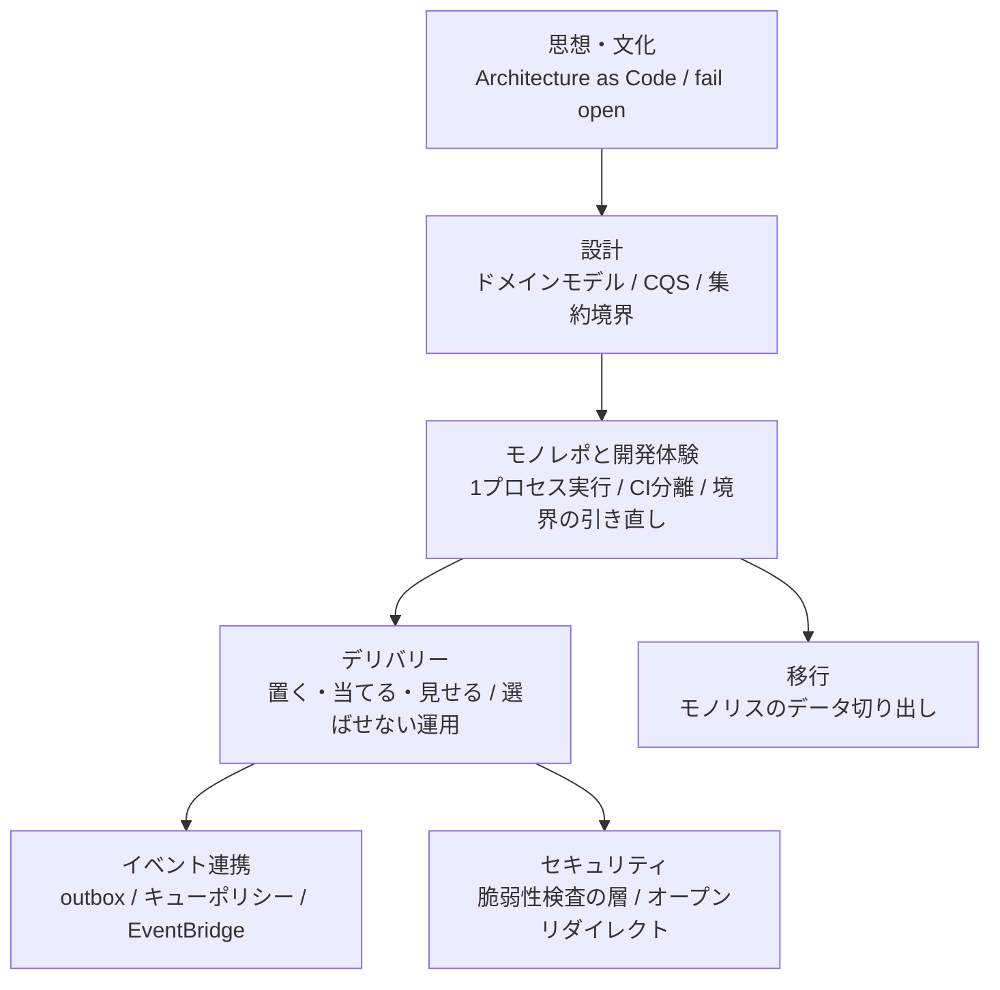

## greenfield とは

[greenfield](https://github.com/rikukaInoue/greenfield) は、マルチドメイン API
モノレポの**プロダクション設計の主張を、動くコードと実測で検証する**ための
リポジトリです。Go のサービス群 + TypeScript のフロントエンドで、認可
（OpenFGA）・イベント連携（outbox + SNS/SQS）・オンラインマイグレーション・
CI/CD 分離・AWS 実機（ECS / Aurora / AppConfig）までを一体で作りました。

進め方は「主張 → それを確かめる実験」のチェックリスト駆動で、（任意）を除く
**29項目を全部消化**して成功条件を宣言しています。AWS を使う検証は使い捨て
（apply → 計測 → 当日 destroy）で、費用は**合計 $2.5 未満**。

通底する文化は3つだけです。

1. **測れることは測ってから主張する** — 「無停止のはず」ではなく非200ゼロを数える
2. **規約は機械でも止める** — 文章だけの禁止は1行で静かに破られる
3. **成功し続けている検査を疑う** — 検査は壊れると失敗でなく成功として出てくる

この検証から生まれた記事を、地図にして並べます。

## 地図

## 思想・文化

- **[Architecture as Code という捉え方](/blog/architecture-as-code/)** —
  アーキテクチャは図でなく「変更に晒されても保たれる制約の集合」。
  判断（ADR）・強制（検査）・証拠（実測）の3点セットをコードで持つ。
  greenfield 全体の設計方針そのもの
- **[fail openを意識する](/blog/checks-fail-open/)** — 検査自体が壊れると
  失敗でなく成功として出てくる。実測した事例の分類と、fail closed に
  書き直す3つの技法。検証中に**7例**を実測した、このリポジトリの背骨

## 設計

- **[ドメインモデルは書き込みの道にだけ置く](/blog/domain-model-on-write-path-only/)** —
  5層構造の要点は、書きと読みで道が分かれていること。読みは Entity を経由しない
- **[CQSが効くのはスキーマを動かすとき](/blog/cqs-pays-off-at-migration/)** —
  読み書き分離の本当の配当はオンラインマイグレーションとの組み合わせで出る
- **[既存DBの外部キーから集約境界を掘り出せないか（アイディア）](/blog/fk-graph-as-aggregate-hint/)** —
  FK とトランザクションログを「設計の化石」として読む思いつき

## モノレポと開発体験

- **[マイクロサービスとしても動くGoモノレポをシングルプロセスで動かす](/blog/local-dev-hostname-optional/)** —
  デプロイ粒度とコロケーションを後から変えられることが進化的アーキテクチャの中心。
  ローカルは全サービス1プロセス、ホスト名は正しさに関与させない
- **[デプロイ分離はなぜ開発生産性を上げるのか](/blog/deploy-isolation-developer-productivity/)** —
  リリーストレインの解体・巻き込まれロールバックの消滅・CI が変更範囲に比例、
  の3メカニズムを実測で（9モジュール中2個だけ CI が動く、独立ロールバック32秒）
- **[境界の引き直しは楽にできるのか — 除却と切り出しの実測](/blog/boundary-redraw-cost-measured/)** —
  「追加」でなく「除却・切り出し」をドリルで実測。除却は65ファイル・検出3層

## デリバリー（読み順のあるシリーズ）

1. **[プログレッシブデリバリー入門 — 置く・当てる・見せる](/blog/progressive-delivery-intro/)** —
   B/G・カナリア・昇格ゲート・bake・フラグの語彙整理から
2. **[アプリとDBでプログレッシブは別物 — 各層の実測](/blog/progressive-delivery-app-vs-db/)** —
   トラフィックは割合で割れるがスキーマは1つしかない。両層の実測値の本体
3. **[B/Gとカナリアの選び方、そして選ばせない運用](/blog/deploy-strategy-selection/)** —
   総集編。既定1本・カナリアはサービス属性・開発者は何も選ばない
4. **[モノレポの無停止移行とデプロイ分離](/blog/online-migration-and-deploy-isolation/)** —
   Parallel Change と CI 分離の深掘り（シリーズより前に書いた原型）
5. **[AppConfig用のOpenFeatureプロバイダを自作した](/blog/openfeature-appconfig-provider/)** —
   リリース側レバーの実装。エコシステムに無かったので書いた

## イベント連携

- **[キューポリシーのないSNSとSQSの末路](/blog/sns-sqs-queue-policy/)** —
  Publish は成功し、配送だけが痕跡なく消える。LocalStack では検査されない認可の穴
- **[EventBridge の新カスタムバスは SNS/SQS FIFO を置き換えられるか](/blog/eventbridge-enhanced-bus-vs-sns-sqs-fifo/)** —
  順序・重複排除の意味論は同型。それでも今は乗り換えない理由

## 認可

- **[OpenFGAで認可を実装してみた。ScopeとRelationによる権限制御](/blog/authn-authz-m2m/)** —
  JWT 検証・関係タプル・Can/ListAccessible・M2M まで、実物のコードで追う

## 移行

- **[モノリスのデータ切り出しは3段階で考える](/blog/monolith-data-carving-three-stages/)** —
  境目は「1つのトランザクションが新旧両方に届くか」。greenfield の機構
  （FK 棚卸し・expand/contract・outbox）が移行のどの段階の道具かを対応づける

## セキュリティ

- **[継続的脆弱性検査は層で回す](/blog/continuous-vulnerability-scanning/)** —
  依存・更新・イメージ・静的解析・DAST の5層を頻度を変えて回す設計
- **[バックスラッシュ1本でログイン後の戻り先が奪われる](/blog/open-redirect-returnto-validation/)** —
  returnTo 検証が `/\evil.com` で抜けた実測。既製の検査からは出てこない類の穴

## 数字で見る greenfield

| 実測 | 値 |
|---|---|
| 昇格ゲートありの壊れた版デプロイ | 被弾 **0 / 1,679** |
| カナリア20% + アラーム自動ロールバック | 被弾 69 / 2,880（2.4%） |
| デプロイの巻き戻し（stopDeployment） | 32 秒 |
| リリースの巻き戻し（フラグOFF） | 14 秒・再起動なし |
| オンライン改名一式（負荷継続中） | エラー 0 件・新旧一致率 100% |
| COPY にしかならない DDL（ADD CHECK） | 2M 行 56 秒（Aurora 実測） |
| Aurora fast clone（データ量非依存） | 接続可能まで 5 分 34 秒 |
| affected CI | 9 モジュール中、変更に関係する 2 個だけ実行 |
| fail open の実測 | 7 例 |
| チェックリスト | 29 項目消化（任意2項目を除く全部） |
| AWS 費用 | 合計 $2.5 未満（予算 $15、毎回当日 destroy） |

## 還流物（コードとして持ち帰れるもの）

- `flagprovider/appconfig` — AWS AppConfig の OpenFeature プロバイダ（エコシステムに無い）
- outbox / relay / inbox / 再送 / 検算のイベント連携一式と、実バスでの検証スクリプト
- 跨ぎ FK 検査の enforce / warn 2モード（移行の進捗メーター）
- 使い捨て Terraform スタック3種（ECS+RDS、Aurora、AppConfig）と one-off タスクで SQL を流す型
- マイグレーションツール比較（golang-migrate / goose）の ADR
- そして一番持ち帰りたいのは個々のコードでなく、**工程間の遷移を全部機械の関所にして、
  人間の判断をリリースのペース配分だけに圧縮する**という判断の設計
