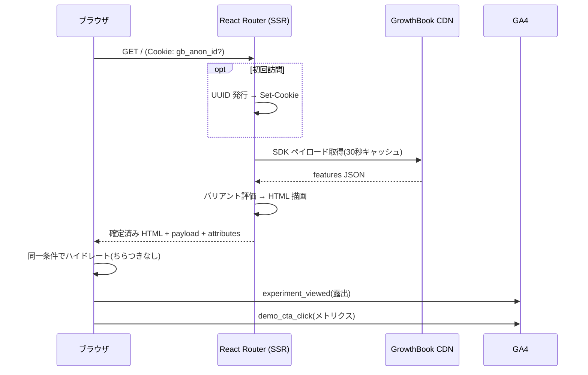
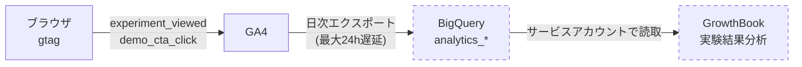

## はじめに

A/B テストを SPA でナイーブに実装すると、ページ表示後にバリアントが切り替わる「ちらつき(flicker)」が発生する。デフォルトの UI が一瞬見えてから実験パターンに差し替わるあれで、UX を損なうだけでなく実験結果にもバイアスが乗る。

SSR でバリアントを確定させてから HTML を返せばちらつきは原理的に消える。今回は GrowthBook と React Router v7(framework mode / SSR)でこれを実装し、実験パターンをいくつか試した。使ったものは:

- **GrowthBook Cloud**(Starter プラン・無料)— feature flag と実験の管理
- **React Router v7** — SSR フレームワーク
- **@growthbook/growthbook-react** — SDK(サーバー・ブラウザ共用)
- **GA4** — 露出イベントの計測

GrowthBook はセルフホストも簡単で、`growthbook/growthbook` + MongoDB の docker compose を書けばローカルで完結する。今回は手軽さ優先で Cloud にした。切り替えは環境変数 2 つ(`GB_API_HOST` / `GB_CLIENT_KEY`)だけの設計にしている。

## SSR 統合の設計

全体のリクエストフローを図にするとこうなる。



ポイントは 3 つある。

### 1. feature 定義はサーバーで取得してプロセス内キャッシュ

SDK ペイロード(feature 定義の JSON)は `https://cdn.growthbook.io/api/features/<clientKey>` から取得できる。リクエスト毎に叩くとレイテンシに乗るので、TTL 付きでキャッシュする。

```ts
// app/lib/growthbook.server.ts
let cache: { payload: unknown; fetchedAt: number } | null = null;
const TTL_MS = 30_000;

export async function getGrowthBookPayload(): Promise<unknown | null> {
  if (cache !== null && Date.now() - cache.fetchedAt < TTL_MS) {
    return cache.payload;
  }
  try {
    const res = await fetch(`${API_HOST}/api/features/${CLIENT_KEY}`);
    if (!res.ok) throw new Error(`GrowthBook API responded ${res.status}`);
    const payload = await res.json();
    cache = { payload, fetchedAt: Date.now() };
    return payload;
  } catch (e) {
    console.error("[growthbook] failed to fetch SDK payload:", e);
    return cache?.payload ?? null; // 失敗時は古いキャッシュで fail-open
  }
}
```

取得に失敗したら古いキャッシュ、それも無ければ `null` を返す。`null` のときはフォールバック値で描画されるだけでアプリは落ちない(fail-open)。実験基盤の障害がサービス障害に波及しない、は絶対に守りたい性質。

### 2. バケッティング用の匿名 ID をサーバーで cookie 発行

「同じ人には常に同じバリアント」を保証するため、初回アクセス時にサーバーで UUID を発行して cookie に入れる。サーバー評価もクライアント評価も、この ID を属性として使う。

```ts
export const anonIdCookie = createCookie("gb_anon_id", {
  maxAge: 60 * 60 * 24 * 365,
  sameSite: "lax",
  path: "/",
});

export async function getOrCreateAnonId(request: Request) {
  const existing = await anonIdCookie.parse(request.headers.get("Cookie"));
  if (typeof existing === "string" && existing !== "") {
    return { id: existing, setCookieHeader: null };
  }
  const id = crypto.randomUUID();
  return { id, setCookieHeader: await anonIdCookie.serialize(id) };
}
```

### 3. 同一ペイロード+属性でハイドレート(ここが flicker 対策の本体)

root の loader でペイロードと属性をクライアントに渡し、サーバーとブラウザの両方で**同期的に**同じ GrowthBook インスタンスを作る。評価条件が完全に一致するので、サーバーが描いた HTML とハイドレーション結果が必ず一致する。ちらつきも hydration mismatch も起きない。

```tsx
// app/root.tsx
export async function loader({ request }: Route.LoaderArgs) {
  const { id, setCookieHeader } = await getOrCreateAnonId(request);
  const payload = await getGrowthBookPayload();
  return data(
    { payload, attributes: { id } },
    setCookieHeader !== null
      ? { headers: { "Set-Cookie": setCookieHeader } }
      : undefined,
  );
}

export default function App() {
  const { payload, attributes } = useLoaderData<typeof loader>();
  const gb = useMemo(() => {
    const instance = new GrowthBook({ attributes, trackingCallback });
    if (payload !== null) {
      instance.initSync({ payload: payload as never, streaming: false });
    }
    return instance;
  }, [payload, attributes]);

  return (
    <GrowthBookProvider growthbook={gb}>
      <Outlet />
    </GrowthBookProvider>
  );
}
```

コンポーネント側は SDK のフックを使うだけ。

```tsx
const bannerText = useFeatureValue("demo-banner-text", "フォールバック文言");
```

## GA4 への露出イベント送信

実験の勝敗を分析するには「誰がどのバリアントに入ったか(露出)」の記録が要る。`trackingCallback` から GA4 に送る。

```ts
trackingCallback: (experiment, result) => {
  if (typeof window !== "undefined" && typeof window.gtag === "function") {
    window.gtag("event", "experiment_viewed", {
      experiment_id: experiment.key,
      variation_id: result.key,
      gb_anon_id: String(attributes.id),
    });
  }
},
```

設計判断が 1 つ: 露出はサーバー評価時とハイドレーション時の両方で発生するが、**送信はブラウザ側だけ**にした。両方から送ると 1 ページビューが 2 露出になる。ハイドレーションで必ず同じ評価が走るので、ブラウザ側だけで取りこぼしはない。gtag のインラインスタブは head で先に定義されるため、ライブラリのロード完了前でも dataLayer にキューされる。

計測データが実験結果になるまでのパイプラインの全体像はこう。



点線部分(BigQuery 以降)が本記事執筆時点で未完の部分。初回エクスポートのラグ待ちで、これは続編で扱う。

## REST API で実験を作る

管理画面をポチポチせず、REST API(`api.growthbook.io/api/v1`)で feature と実験ルールを作った。ここにハマりどころが集中していたので記録しておく。

### 更新 API の実験ルールは `condition` が必須

公開されている OpenAPI スペックのレスポンス側スキーマ(`FeatureExperimentRule`)を見て組み立てたリクエストが `Invalid input` で弾かれ続けた。原因は**リクエスト側スキーマがレスポンス側と別物**だったこと。更新 API の実験ルールは:

- `condition` が必須(全員対象でも `"{}"` を明示)
- バリアント配列のキーは `values`(`value` は deprecated)

```json
{
  "environments": {
    "production": {
      "enabled": true,
      "rules": [
        {
          "type": "experiment",
          "condition": "{}",
          "description": "A/B test (50/50)",
          "enabled": true,
          "trackingKey": "demo-banner-text-experiment",
          "hashAttribute": "id",
          "coverage": 1,
          "values": [
            { "value": "パターンA", "weight": 0.5, "name": "A" },
            { "value": "パターンB", "weight": 0.5, "name": "B" }
          ]
        }
      ]
    }
  }
}
```

### feature 新規作成は `owner` が必須

Secret API Key 認証の場合、`POST /api/v1/features` には `owner` フィールドが必須(PAT 認証なら省略可)。エラーメッセージが親切なのですぐ分かる。

### SDK Connection と feature の environment を一致させる

これが一番時間を食った。feature を作って publish したのに CDN のペイロードが `"features":{}` のまま更新されない。原因は **SDK Connection が `dev` 環境に紐づいているのに、feature は `production` でしか有効にしていなかった**こと。

ペイロードの `dateUpdated` が feature の publish 時刻より古いままなら、キャッシュ待ちではなく紐付けの問題を疑うとよい。environment のほか、Project の絞り込みでも同じ symptom になる。

## 実験パターン

### 文字列の A/B テスト

feature `demo-banner-text`(string)に 50/50 の実験ルール。もっとも基本の形。

### JSON フラグでデザイン一式をテスト

文言だけでなく「色×ラベル」のような設定オブジェクトごと A/B する。

```json
{ "value": "{\"color\":\"#0284c7\",\"label\":\"詳細を見る\"}", "weight": 0.5 },
{ "value": "{\"color\":\"#dc2626\",\"label\":\"今すぐチェック\"}", "weight": 0.5 }
```

アプリ側は型を付けて受けるだけ。

```tsx
type CtaStyle = { color: string; label: string };
const ctaStyle = useFeatureValue<CtaStyle>("demo-cta-style", {
  color: "#0284c7",
  label: "詳細を見る",
});
```

1 点だけ TypeScript の罠: `useFeatureValue<T>` の型制約は index signature を要求するので、`interface` で定義すると弾かれる。`type` エイリアスなら通る。

### 複数実験の同時実行と独立バケッティング

文言実験と CTA スタイル実験を同時に走らせると、同じ `id` 属性でハッシュしていても trackingKey ごとにシードが変わるため、割り当ては独立になる。実際に複数ユーザーの SSR 出力を見ると「文言 A × 赤ボタン」「文言 B × 青ボタン」が直交して現れる。

このほか Starter(無料)プランでも、段階的ロールアウト、属性ターゲティング、カバレッジ調整(実験対象をトラフィックの一部に限定)、QA 用の force ルールあたりは全部使える。壁に当たるのは Visual Editor・URL リダイレクトテスト・prerequisites などで、いずれも Pro 以上。

## テストトラフィック生成と GA4 のボットフィルタ

パイプライン検証用に Playwright でトラフィックを流した。毎回新規コンテキスト(=新規ユーザー)で訪問し、バリアントに応じた確率で CTA をクリックする。

ここで面白いハマり方をした。**ヘッドレスで 40 訪問流したのに GA4 の Realtime にほぼ何も出ない**。エラーは一切出ていない。原因はヘッドレス Chrome の User-Agent に含まれる `HeadlessChrome` を GA4 が既知ボットとして**黙って**捨てていたことだった。

```js
// ヘッドありで起動すると通常の UA になり、普通に計測される
const browser = await chromium.launch({
  channel: "chrome-canary",
  headless: false,
});
```

「送った側は成功に見えて、受けた側にはゼロ」という計測系デバッグの典型パターン。送信側のログだけ見ていても永遠に気づけないので、Realtime レポートで受信側を確認する癖をつけたい。

## curl では GA4 にデータは飛ばない(あたりまえだけど)

SSR の動作確認自体は curl で足りる。バリアントごとの HTML が返るし、Set-Cookie も検証できる。ただし curl は JS を実行しないので gtag は発火せず、**GA4 には何も届かない**。「SSR の検証」と「計測の検証」は別物として、後者は実ブラウザ(それもヘッドあり)で行う必要がある。

## まとめ

- SSR で評価 → 同一ペイロード+属性でハイドレート、の形にすればちらつきゼロの A/B テストができる
- 実験基盤は fail-open に作る(GrowthBook が落ちてもフォールバック値で描画継続)
- 露出イベントはサーバー/ブラウザの二重送信に注意。片側に寄せる
- GrowthBook REST API はリクエスト側スキーマに独自の必須項目がある(`condition`、`owner`)
- GA4 はヘッドレスブラウザのトラフィックを黙って捨てる

残タスクとして、GA4 → BigQuery エクスポートを GrowthBook のデータソースに接続して実験結果(勝敗判定)を見るところが未完。日次エクスポートのラグ待ちなので、つながったら続編を書く予定。
