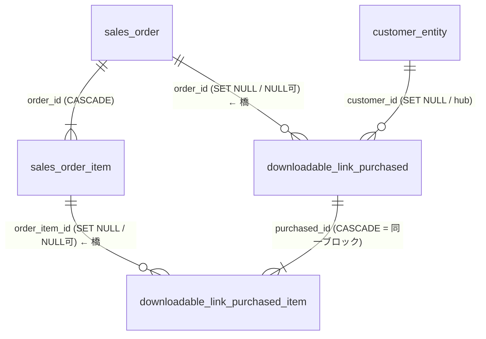
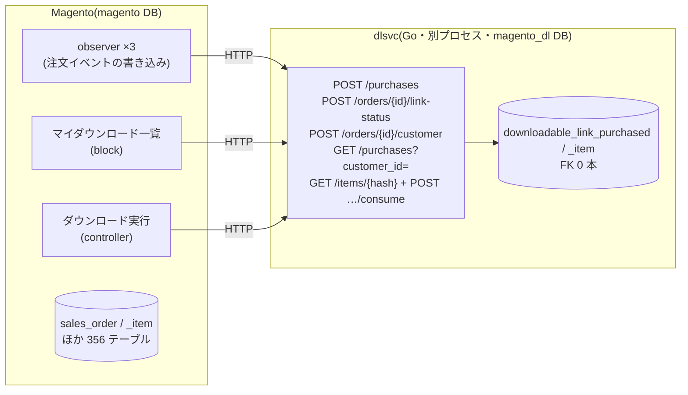
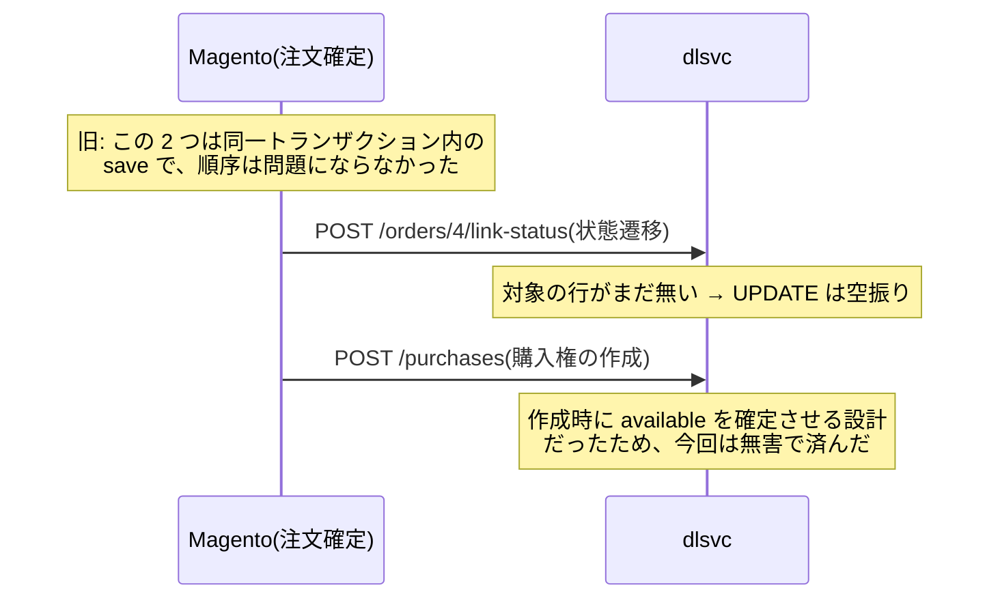

[前回](/blog/fk-graph-as-aggregate-hint/)、「既存DBのFKを設計の化石として読み、境界の候補を機械で出せないか」
というアイディアを書いた。結びは「分割前のDBを読む機構は、それが動いてから考える」だった。

作った。[habakiri](https://github.com/rikukadev/habakiri) という CLI で、v0.1.0 を公開した。
この記事はそれを **Magento 2 に向けて、出てきた切断点を実際に切り、
最後は別プロセス + 別DBの HTTP サービスに分離するまで**の実験記録。

## habakiri がやること

`information_schema` だけを読んで(読み取り専用)、3 段のパイプラインを通す。

1. **hub 除去** — 次数の高いテーブル(`store`、`eav_attribute` など)は shared kernel。
   分割の議論から外し、共有 or 複製と割り切る
2. **CASCADE 縮約** — `ON DELETE CASCADE` はライフサイクル共有の宣言。親子を 1 ノードに潰す
3. **橋検出(Tarjan)** — 残ったグラフで、1 本切るだけで塊が分離するエッジを列挙する

FK には重みを付ける。`CASCADE(3) > NOT NULL(2) > NULLABLE(1)`。
この順序が後で効いてくる。

順序には一度失敗した。最初は縮約を hub 除去より先にやっていて、
`store` への「掃除目的の CASCADE」が推移閉包で繋がり、**190 テーブルが 1 つの
ライフサイクルに融合**した。CASCADE が意味するのは親子の従属であって、
hub への CASCADE は集約の証拠ではない。順序を入れ替えた途端、境界が現れた。

## Magento 2 に向けたら、モジュール構造が出てきた

295 テーブル / 382 FK のサンプル DB に向けた結果:

| 出力 | 数 | 中身 |
|---|---|---|
| 孤立テーブル | 69 | インデックス表・ログ表。今日でも動かせる |
| shared kernel | 6 | store / catalog_product_entity / eav_attribute など |
| CASCADE 集約 | 32 | sales系 / quote系 / customer系… ほぼモジュール単位 |
| **橋** | **2** | ここが本題 |

橋の 1 本目は `downloadable_link_purchased ×— sales`。
「ダウンロード商品の購入権」と「注文」をつなぐ FK 2 本で、どちらも
`SET NULL / NULL可`(重み 1)。つまり **切っても存在保証が要らない**候補。

切断前の ER はこう。橋になっているのは上の 2 本だけで、購入権の親子
(CASCADE)は同一ブロック、customer は hub なので分割の議論から外れている。



面白かったのは、このダンプは 2015 年頃の Magento 2.0 世代のものだったこと。
現行の 2.4.9 をインストールして同じスキャンをかけたら、**橋は同じ場所に同じ 2 本**あった。
10 年間、この境界は動いていない。

## 実際に切る — そして FK が勝手に生き返る

2.4.9 を実インストール(PHP 8.4 / MySQL 8.4 / OpenSearch)し、ダウンロード商品の
注文を流しながら切った。ここからが「測るまで見えない」の連続だった。

### DB で DROP しても戻ってくる

```sql
ALTER TABLE downloadable_link_purchased
  DROP FOREIGN KEY DOWNLOADABLE_LINK_PURCHASED_ORDER_ID_SALES_ORDER_ENTITY_ID;
```

これで切れた、と思ったら `bin/magento setup:upgrade` で**復活した**。
現行 Magento は declarative schema(`db_schema.xml`)が正であり、DB への直接の
ALTER は次のデプロイで巻き戻る。正しい切断は宣言側から外すこと —
外した途端、今度は Magento が**自分で** FK を DROP した。

これは Magento 固有の話に見えて、そうではない。Rails の schema.rb も Prisma の
schema も同じ構造を持つ。**DB がスキーマの正とは限らない**ので、habakiri が
指した切断点の「実施」はスキーマ定義側でやる必要がある。

### 復活時、既存データは検査されない

もっと嫌な発見。親なし `order_id` (dangling) を抱えた状態で `setup:upgrade` を打つと、
セットアップは `foreign_key_checks=0` で走るため、**不整合データを抱えたまま FK が張られる**。
「FK があるのに親がいない」という、FK の存在意義が反転した状態が黙って成立する。
切断→復元を試す人はここを踏む。

### アプリは最初から「注文が消えても生きる」設計だった

FK を切った状態で注文を作り、注文行だけ DELETE して dangling を作り、
顧客向けページを叩いた。結果:

- マイダウンロード一覧: **200**。`order_increment_id` などが購入権テーブル側に
  非正規化されていて、sales を JOIN していない
- 存在しない注文への「注文を見る」リンク: **302** で注文履歴へ逃げる
- ダウンロード実行: **200**。注文を一切見ない

つまり Magento 自身が、この境界を「いつか切れる」ように書いてある。
habakiri が重み 1(NULL可のみ)= 難易度「易」と付けた判定が、
コード側の実装とぴったり一致した。テストも通る
(unit 197 件 pass。integration の失敗は PHP 8.4 起因で、ログに FK/整合性エラーは 1 件も無い)。

## 最後は HTTP ごしに — 分離の本体はアプリ層だった

ここまでで分かるのは、**FK を切っただけではユーザー可視の変化がゼロ**だということ。
アプリは何事もなく動き続ける。FK 切断は「分離」ではなく**分離の許可証**で、
結合はまだ全部アプリ層に残っている。

なので仕上げとして、切り出した 2 テーブルを **Go 製ミニサービス(専用DB)** に移し、
Magento 本体からはテーブルを DROP した。分離後の形はこう。



ER 図にあった FK は 1 本も残っていない。`order_id` や `customer_id` は
ただの値になり、存在保証は「参照時点で存在した」に弱まった
(前回の記事で書いた「弱める」の実物)。境界を渡っていたコードは 5 箇所:

| 箇所 | 旧(モノリス) | 新(HTTP) |
|---|---|---|
| 注文確定で購入権発行 | observer が同一トランザクションで INSERT | `POST /purchases` |
| 注文状態→リンク状態遷移 | コレクション UPDATE | `POST /orders/{id}/link-status` |
| ゲスト注文の顧客紐付け | コレクション UPDATE | `POST /orders/{id}/customer` |
| マイダウンロード一覧 | 2 コレクション SELECT | `GET /purchases?customer_id=` |
| ダウンロード実行 + 消費 | 行ロード + save | `GET /items/{hash}` + `POST …/consume` |

### 改変の実物

diff の総量は **6 ファイル、+71 / −80 行**。橋が細ければアプリ側の外科手術も
このサイズで済む、というのが今回いちばん伝えたい数字かもしれない。

HTTP クライアントは 1 クラス追加しただけ(実験なので素の `file_get_contents`)。

```php
namespace Magento\Downloadable\Model;

class DlsvcClient
{
    private const BASE = 'http://127.0.0.1:30090';

    /** @return array{status:int, data:array} */
    public static function call(string $method, string $path, ?array $body = null): array
    {
        $ctx = stream_context_create(['http' => [
            'method'  => $method,
            'header'  => "Content-Type: application/json\r\n",
            'content' => $body === null ? '' : json_encode($body),
            'ignore_errors' => true,
            'timeout' => 5,
        ]]);
        $raw = @file_get_contents(self::BASE . $path, false, $ctx);
        // ... ステータス行のパースと json_decode(省略)
    }
}
```

**書き込み側**の置換はほぼ機械的だった。observer はモデルを組み立てて `save()` する
構造なので、`save()` を「データを集めて 1 回 POST」に差し替えるだけで済む。
いちばん小さい `UpdateLinkPurchasedObserver` の diff がこれ。

```diff
         if (!$orderId || !$customerId) {
             return $this;
         }
-        $purchasedLinksCollection = $this->getPurchasedCollection((int)$orderId);
-        foreach ($purchasedLinksCollection as $linkPurchased) {
-            $linkPurchased->setCustomerId($customerId)->save();
-        }
+        // dlsvc 分離: 顧客紐付けは HTTP(旧: コレクション経由の直接 UPDATE)
+        \Magento\Downloadable\Model\DlsvcClient::call(
+            'POST',
+            '/orders/' . $orderId . '/customer',
+            ['customer_id' => $customerId]
+        );
```

購入権を作る `SaveDownloadableOrderItemObserver` も、モデル組み立てのロジックは
一切触らず、末尾の `save()` を配列への積み込みに変えて最後に 1 回 POST する形。

```php
// 旧: $linkPurchasedItem->...->setUpdatedAt($orderItem->getUpdatedAt())->save();
$itemsPayload[] = $linkPurchasedItem->getData();
// ループを抜けたら:
\Magento\Downloadable\Model\DlsvcClient::call('POST', '/purchases', [
    'purchased' => $linkPurchased->getData(),
    'items'     => $itemsPayload,
]);
```

**読み取り側**は ORM のコレクションを JSON からの再水和(rehydration)に置き換える。
マイダウンロード一覧の block はこうなった。テンプレートは
`$_item->getPurchased()->getOrderIncrementId()` のようなマジックゲッターで
読んでいるので、`DataObject` に詰め直せば **テンプレートは 1 行も変えずに済む**。

```php
protected function _construct()
{
    parent::_construct();
    $resp = DlsvcClient::call(
        'GET',
        '/purchases?customer_id=' . (int)$this->currentCustomer->getCustomerId()
    );
    $collection = ObjectManager::getInstance()->create(Collection::class);
    foreach ($resp['data'] as $purchasedData) {
        $items = $purchasedData['items'] ?? [];
        unset($purchasedData['items']);
        $purchased = new DataObject($purchasedData);
        foreach ($items as $itemData) {
            $item = new DataObject($itemData + ['id' => $itemData['item_id']]);
            $item->setPurchased($purchased);
            $collection->addItem($item);
        }
    }
    $this->setItems($collection);
}
```

ダウンロードのコントローラも同型で、`load($id, 'link_hash')` が
`GET /items/{hash}`、ダウンロード成功後の `save()`(使用回数加算)が
`POST /items/{hash}/consume` になる。所有者チェックは応答に同梱された
purchased の `customer_id` で行う — **N+1 の HTTP 呼び出しを避けるため、
サービス側が親子を 1 レスポンスに畳む**。この判断は ORM の遅延ロードを
そのまま HTTP に写すと往復が爆発する、という分離あるあるの裏返しでもある。

注文 → 一覧 → ダウンロード → 使用回数加算 → 他人の権利の拒否、まで全旅程が
HTTP ごしで完走した。**FK 2 本の橋が、API 6 本の境界にそのまま写った。**

### 失った原子性は、初回のログにもう現れた

サービス側のログがこれ。

```
19:56:30 link-status: order=4 updates=1      ← 状態遷移が先に届く
19:56:30 purchase created: purchased_id=4    ← 行の作成が後
```

モノリスでは同一トランザクションだったから見えなかった順序依存が、HTTP に
した瞬間「**まだ存在しない行への UPDATE**」として実体化した。



今回は作成時に状態を確定させる設計だったので無害だが、本番の分離では
非同期メッセージ + 冪等コンシューマ + 突合が必須になる。

## 重みは「切断後の API 契約の強さ」に裏返る

前回の記事で「切る FK の 1 本ごとに、それが守っていたものの置き場を決める」と書いた。
今回の実験で、habakiri の重みヒエラルキーがそのままその対応表になることが分かった。

| 重み | DB 上の意味 | 切断後の HTTP 契約 |
|---|---|---|
| NULLABLE (1) | 消えても良い参照 | 結果整合・非同期で足りる(今回の downloadable) |
| NOT NULL (2) | 存在依存 | 存在保証 API = 同期呼び出し or マスタ複製 |
| CASCADE (3) | ライフサイクル共有 | 切ると分散トランザクション。**切らない** |

橋の細さは API 面積の予測になり、橋の重みは API 契約の強さの予測になる。
ツールが教えられるのはここまでで、「その契約でビジネスが困らないか」は人が決める。

## まとめ

- **FK 切断とアプリ層の分離はセット**。前者だけでは何も分離されていない
- DB がスキーマの正とは限らない。切断はマイグレーション/宣言の層で行う
- 制約の復元は既存データを検査しないことがある。「FK があるのに不整合」は成立する
- よく設計されたモノリスは、切れる場所が既に疎に書いてある。ツールはそれを
  記憶ではなく網羅で見つけるためにある

[habakiri v0.1.0](https://github.com/rikukadev/habakiri/releases/tag/v0.1.0) は
MySQL 専用・読み取り専用。前回書いた「FKなし・共起あり」(アプリ層の暗黙の結合)は
まだ見えないので、クエリログ由来の共起で重みを補正するのが次の拡張になる。
