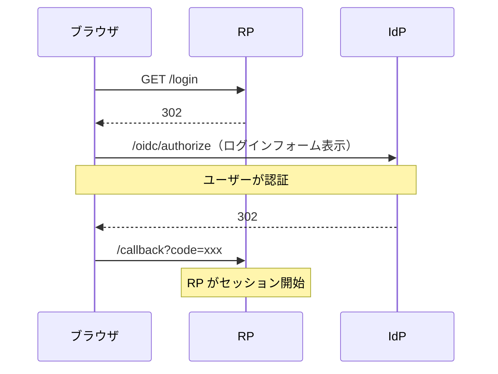
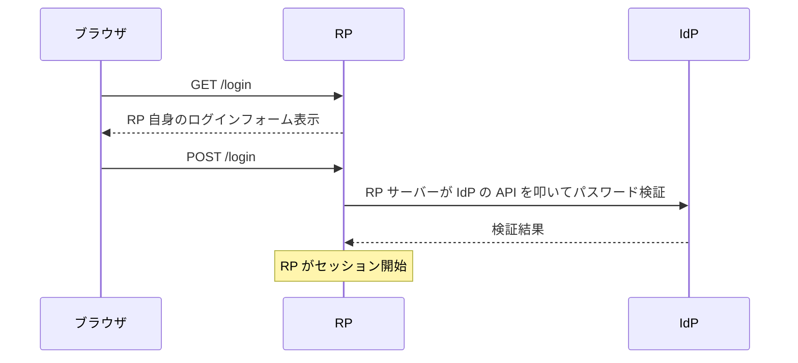
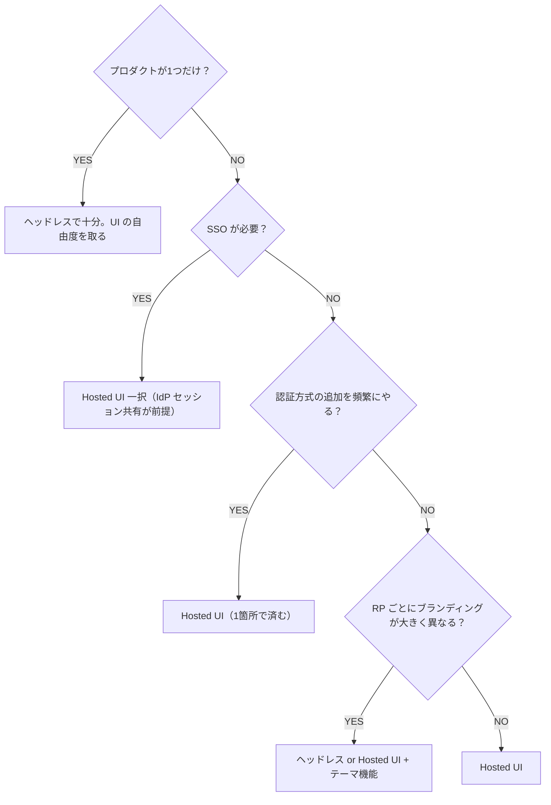
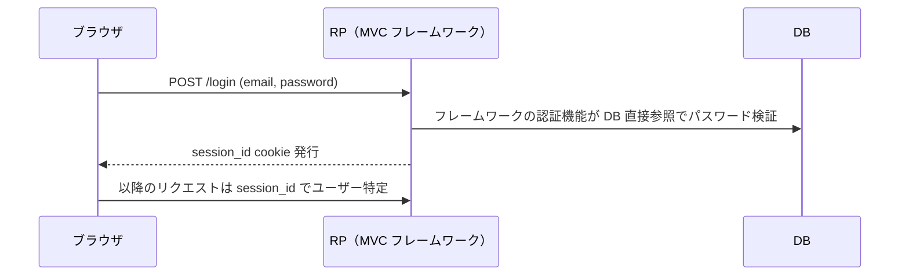
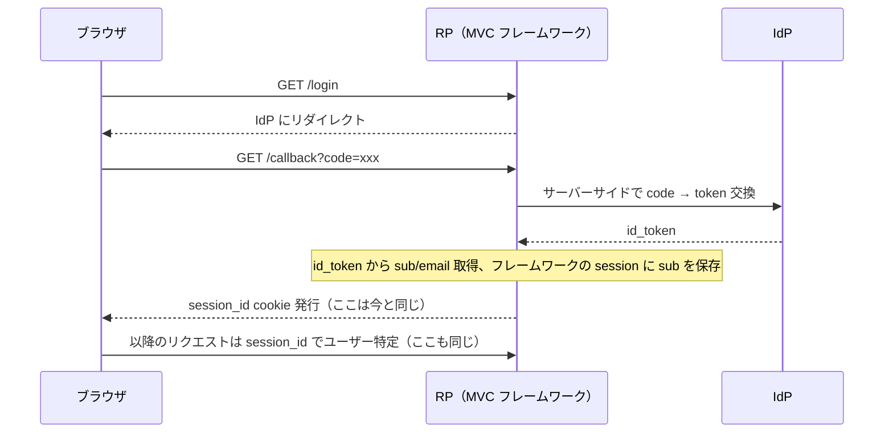

## 問い

自前の OIDC プロバイダー (rellf-auth) がある。RP（プロダクト）にログイン機能を提供する際、**認証 UI を IdP が持つべきか、RP が持つべきか**。

既存プロダクトは MVC フレームワーク（Yii / Rails 系）で、`POST /login` → フレームワーク組み込みの session 開始、という密結合な構造。これを OIDC に移行する際のトレードオフと判断基準を整理する。

## 2つの選択肢

### A. Hosted UI（IdP が UI を持つ）

IdP がログインフォーム、登録、パスワードリセット等の UI を持つ。Auth0 の Universal Login、Cognito の Hosted UI と同じモデル。

### B. ヘッドレス（IdP は API だけ）

IdP はトークン発行 API だけ提供し、UI は RP が自由に作る。

## トレードオフ比較

| 観点 | Hosted UI (A) | ヘッドレス (B) |
|---|---|---|
| RP 側の実装コスト | 低（リダイレクトだけ） | 高（RP ごとにログイン UI を実装） |
| 認証方式追加 (MFA, パスキー) | IdP 1箇所の変更で全 RP に反映 | 全 RP のフロントを改修 |
| クレデンシャルの経路 | IdP にしか送られない | RP のフロントを経由する |
| RP の UI 自由度 | 低（IdP のデザインに縛られる） | 高（完全にカスタム可能） |
| 既存 URL の維持 | `/login` はリダイレクトになる（入口 URL は維持可能） | 完全に維持できる |
| ブランディング | IdP 側でテーマ対応が必要 | RP ごとに自由 |
| SSO | 自然に実現（IdP のセッションを共有） | RP ごとに個別実装が必要 |
| セキュリティ監査 | 認証 UI の監査が1箇所 | RP の数だけ監査対象 |

## 調査項目チェックリスト

### 1. 既存プロダクトの現状

- 既存の認証フローはどうなっているか
  - `POST /login` でフレームワーク組み込みの認証 → session 開始？
  - session の仕組み（cookie 名、ストア、期限）は何か
  - CSRF トークンがログインフォームに紐づいているか
- 認証に関わる UI はどこまであるか
  - ログイン / 登録 / パスワードリセット / アカウント設定 / プロバイダー連携
  - これらの UI にカスタムロジック（独自バリデーション、利用規約同意等）があるか
- 現在のログインページの URL をブックマークしているユーザーがいるか

### 2. プロダクトの数と多様性

- 現在の RP 数、今後の見込み
- 全プロダクトが同じ技術スタックか、バラバラか
- ブランディングの要件（プロダクトごとにデザインが違うか、統一か）
- SSO の要件があるか（1回のログインで複数プロダクトに入れる必要があるか）

### 3. 認証方式の将来計画

- MFA / パスキー / キャリア IdP 連携等の追加予定
- 追加するたびに全 RP を改修する余裕があるか

### 4. セキュリティ要件

- クレデンシャルが RP のフロントを経由することが許容されるか
- 認証 UI のセキュリティ監査はプロダクトごとか、一括か

### 5. 移行の制約

- 段階的移行が可能か（一部プロダクトだけ先行移行できるか）
- 既存セッションとの並行運用期間をどれくらい取れるか
- ユーザーへの影響（再ログインが必要になるか）

## 判断フロー

## MVC フレームワークからの移行パス

既存が MVC フレームワーク（Yii / Rails 系）の場合、**Hosted UI 方式の方が移行が小さい**。

### Before

### After (Hosted UI)

### 変わるもの・変わらないもの

| | 変わる | 変わらない |
|---|---|---|
| ログインの入口 | ✅ IdP にリダイレクト | |
| パスワード検証 | ✅ IdP に委譲 | |
| session の仕組み | | ✅ cookie 名、期限、ストアそのまま |
| `current_user` ヘルパー | | ✅ session から引くだけ |
| 認可（権限チェック） | | ✅ ログイン後の仕組みは不変 |
| 全ページのテンプレート | | ✅ 触らない |

### やること（最小構成）

1. `/callback` エンドポイントを1つ追加（code exchange → session 開始）
2. 既存の `/login` を IdP へのリダイレクトに差し替え
3. 既存のパスワード検証ロジックを削除

### 触らなくていいもの

- session の仕組み全体
- ログイン後の全ページ・全機能
- 認可ロジック
- フレームワークの middleware / filter

### Cookie まわりの確認事項

- **session cookie は影響なし** — 発行するのは変わらず RP サーバーで、ドメインもパスも同じ
- **CSRF トークン** — RP のログインフォームに埋めていた CSRF トークンは不要になる（OIDC の `state` パラメータが CSRF を防ぐ）
- **サードパーティ cookie** — IdP が別ドメインでも、code flow はリダイレクトベースなのでサードパーティ cookie に依存しない（iframe / silent refresh を使わなければ）
- **既存セッションとの並行運用** — 移行中は旧方式と新方式のセッションが混在する。旧 cookie が残っている間は両方受け入れて、期限切れで自然に消える設計にする

### MVC フレームワークなら OIDC ライブラリがある

| フレームワーク | ライブラリ |
|---|---|
| Rails | `omniauth-openid_connect` |
| Yii2 | `yii2-authclient` (OpenID Connect) |
| Laravel | `socialite` + OIDC provider |
| Django | `mozilla-django-oidc` |
| Spring | `spring-security-oauth2-client` |

callback の実装もライブラリに任せられるので、RP 側の実装は設定ファイルに issuer URL と client\_id/secret を書く程度。

## 段階的移行の進め方

1. **IdP 側の準備** — rellf-auth の Hosted UI（ログインフォーム）を整備。テーマ対応が必要なら先にやる
2. **1つのプロダクトで試行** — 最も影響の小さいプロダクトで OIDC 移行。callback エンドポイント追加 + ログインリダイレクト
3. **並行運用期間** — 旧ログイン（`POST /login`）と新ログイン（OIDC）を両方生かす。既存セッションは期限切れまで有効
4. **旧ログイン廃止** — 全ユーザーが OIDC 経由になったことを確認して旧エンドポイントを削除
5. **残りのプロダクトに展開** — 1で得た知見をもとに横展開

## まとめ

- **プロダクト複数 or SSO 必要** → Hosted UI
- **プロダクト1つで UI 自由度重視** → ヘッドレス
- **MVC からの移行** → Hosted UI の方が影響が小さい（session の仕組みを触らない）
- 迷ったら Hosted UI で始めて、ブランディング要件が出たらテーマ機能を足す
- 移行は段階的に。**変わるのはログインの入口だけ**で、session・認可・全ページは不変
