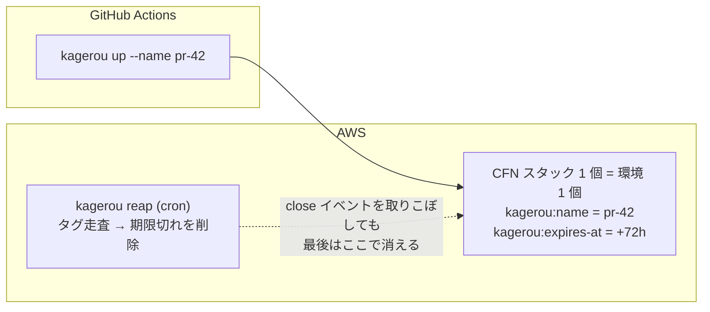

## TL;DR

1. **PR を開くとプレビュー環境が生え、閉じるか寿命が来ると消える** OSS
   [kagerou](https://github.com/rikukadev/kagerou) を作った。Vercel の PR プレビュー体験を、
   自分の AWS アカウント・任意のバックエンド構成で再現するもの
2. 設計は**ステートレス CLI + AWS タグが真実の源 + TTL 必須**。
   [sashiki](/blog/db-branch-sashiki-oss/)(DB ブランチ)とはコードの依存ゼロ、
   **名前の規約だけ**で繋がる
3. 検証アプリ 2 つのドッグフーディングで出た摩擦が `validate` / `post_up` /
   `url_template` を生み、そのまま契約(CONTRACT.md)を鍛えた、という記録

## 動機: preview.yml が 260 行あった

[sashiki のデモ](/blog/db-branch-sashiki-oss/)で「PR を開くと本物データ入りの
プレビュー環境が生える」workflow を書いたとき、preview.yml は **約 260 行**ありました。
DB ブランチの作成、SAM スタックの上げ下げ、URL の PR コメント(冪等更新)、
close での後片付け、fork PR の拒否……。中身はアプリ固有ではなく、
**どのリポジトリでも同じことを書く**類のものです。

この 260 行を宣言 1 枚に畳むのが kagerou です。名前は陽炎(heat shimmer)と
蜉蝣(一日で消える虫)から。現れて、揺らめいて、消える環境。

```yaml
# kagerou.yaml — これが preview.yml 260 行の代わり
project: todo
template: packaged.yaml
region: ap-northeast-1
name_prefix: todo-
ttl: 72h
env:
  KAGEROU_ENV: "{name}"
  DB_USER: dev@{name}
hooks:
  pre_up: sashiki create {name}
  post_down: sashiki delete {name}
```

```bash
kagerou up --name pr-42    # 環境が生える(冪等)
kagerou down --name pr-42  # 消える(冪等)
```

## 設計の核: 状態を持たない

一番大きな決定は「**専用の状態ストアを持たない**」ことです。環境の一覧も寿命も、
AWS リソースのタグ(`kagerou:name` / `kagerou:expires-at` 等)と CloudFormation
スタックから復元します。

sashiki は ZFS や mysqld プロセスという「API で列挙できないもの」を管理するので
デーモン + 状態 DB が要りましたが、kagerou の管理対象は **それ自体が API で列挙できる
AWS リソース**。状態の二重持ちは負債にしかなりません。`kagerou list` も TTL 回収の
`kagerou reap` も、タグを走査するだけのステートレス CLI で成立します。



もう 1 つの柱が **TTL 必須**です。すべての環境は生まれた瞬間から死ぬ予定があり
(既定 72h、無期限は明示オプトイン)、close イベント駆動の削除が失敗しても
Reaper が最後の網になります。イベントは必ず取りこぼすので、寿命を一級市民にする。

## sashiki とは「名前の規約」だけで繋がる

kagerou のコードは sashiki を import しません。それでも組み合わせると
「PR を開くと本物データ入りのフルスタック環境」になります。鍵は sashiki 側の
username routing(固定エンドポイントに `dev@pr-42` で繋ぐとブランチへ振り分け)で、
**接続情報が名前から導出できる**こと。動的な値の受け渡しが最初から不要なんです。

- 作成: hooks の `pre_up: sashiki create {name}`(汎用フック。sashiki は設定の文字列にしか現れない)
- 削除: **連携コードなし**。両者が自分の TTL で勝手に蒸発する(揃えるのは規約だけ)

DB を使わないアプリ、共有 RDS、SQLite 同梱 — kagerou から見ればどれも
「env の出どころが違うだけ」です。

実 AWS に載せる過程では、ローカルでは出ない罠をいくつも踏みました。デバッグの
過程ごと逆引き記事に分けてあります:
[GitHub Actions OIDC の ID 入り sub クレーム](/blog/github-actions-oidc-id-sub-claim/)と、
[エミュレータでは通るのに実機で死ぬやつら](/blog/emulator-passes-real-aws-fails/)。

## ドッグフーディングが契約を鍛えた

検証アプリを 2 つ(SSR 単層 / SPA+API+RDB の 3 層)作ってみると、
**単層は素直に書けるのに、分離構成になった途端に利用者の記述量が増える**ことが
分かりました。増えた分はアプリ固有ではなく「分離したら誰でも当たること」。
そこから 3 つの機能が生まれました。

| 摩擦 | 解決 |
|---|---|
| 契約違反(パラメータ宣言忘れ等)がデプロイまで沈黙する | `kagerou validate` — オフラインで検査、環境名は正規化候補も提示 |
| API の URL はスタックを作るまで分からないので、SPA の config.json 生成と配置を全員が自作する | `post_up` フック — Outputs が `KAGEROU_OUTPUT_<KEY>` 環境変数で届く |
| テンプレート内で自分の URL を参照すると循環参照(CORS 許可元・OAuth コールバック) | `url_template` — URL を**作成前に**環境名から確定し、テンプレートに渡す |

```yaml
url_template: "https://{name}.preview.example.com"
hooks:
  post_up: |
    printf '{"apiBaseUrl":"%s"}' "$KAGEROU_OUTPUT_APIURL" > web/dist/config.json
    aws s3 sync web/dist/ "s3://$KAGEROU_OUTPUT_WEBBUCKETNAME/" --delete
```

導入も `kagerou init` のウィザードに寄せました。リポジトリを読んで
(git remote・フレームワーク・DB 依存・AWS 認証・設定済み Variables)既定値を埋め、
質問は 4 つ。mysql2 を検出したら sashiki 連携が最初から選ばれています。
AWS 側の準備(OIDC ロール・ECR・Variables)は「その場で適用 / スクリプトに保存 /
手動」から選べて、最短経路は **enter を 5 回押すと全部できてる**、です。

```
kagerou init  rikukadev/myapp · react-router · db:mysql2 · aws:199410355960

[1/4] Which database?
 ❯ sashiki — a DB branch per PR (detected mysql2)
   none — wire it later with --env
```

## いま出来ること・まだ無いもの

出来ること(v0.3 時点 + 直近の main): `up / down / list / url / reap / validate / init`、
GitHub Actions 用 composite action(PR コメント冪等更新つき)、post_up / url_template。
実 AWS での E2E は SSR 単層・sashiki 連携フルスタックの両方で確認済みです。

まだ無いもの: 静的配信専用の `static` driver、共有 CloudFront + サブドメインの共通化、
Backstage 連携の読み取り口(`kagerou serve`)。このあたりが次です。

同じ轍を踏む人(未来の自分を含む)のために書き残しました。リポジトリは
[rikukadev/kagerou](https://github.com/rikukadev/kagerou)、DB ブランチ側は
[rikukadev/sashiki](https://github.com/rikukadev/sashiki) です。
