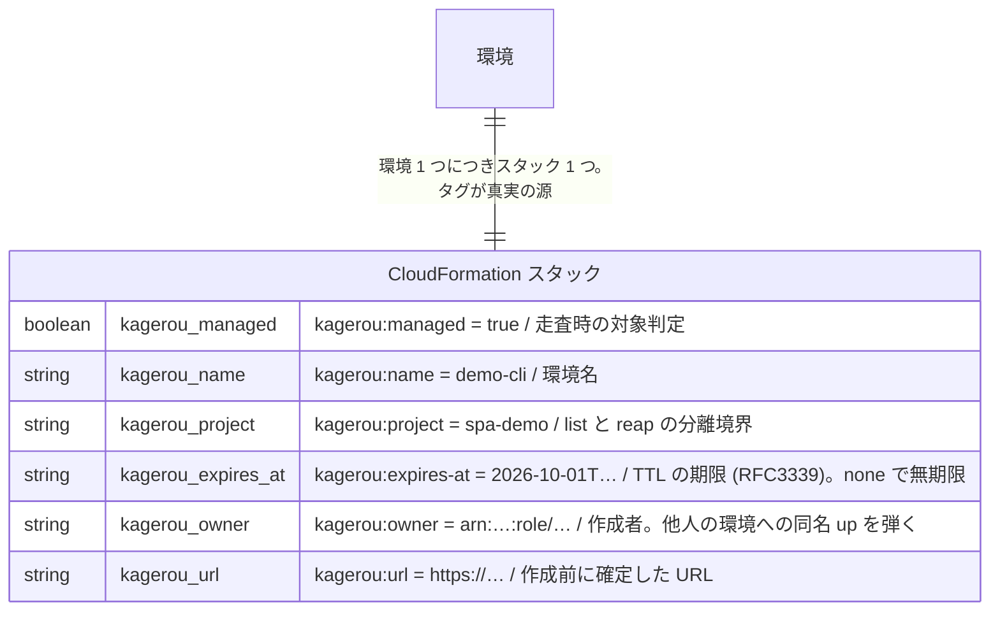
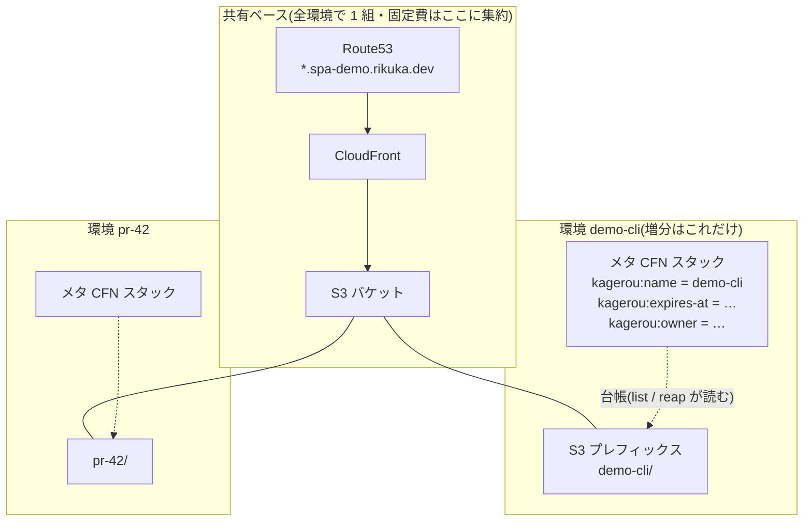
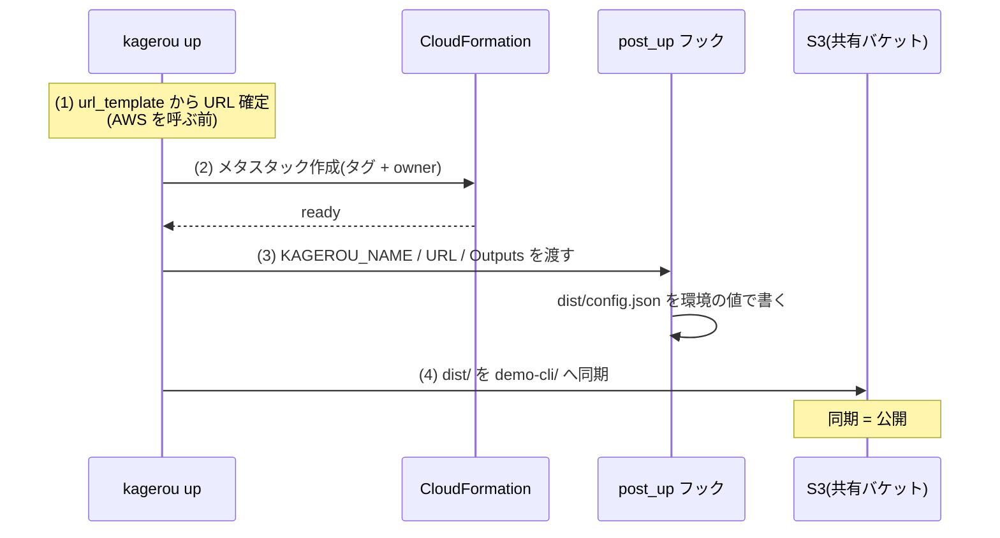
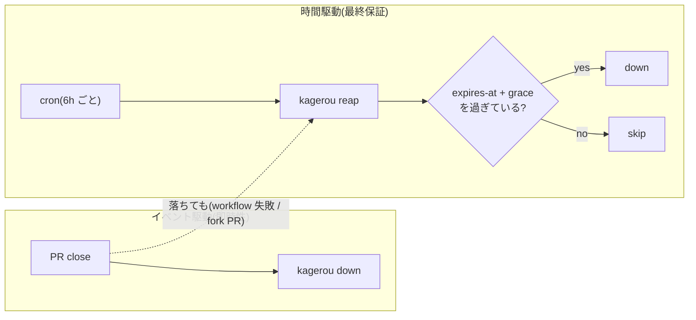
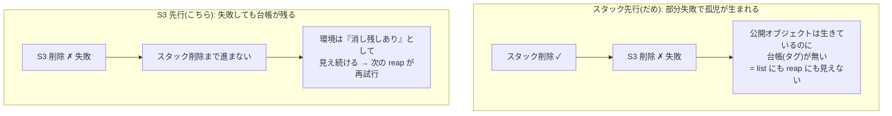
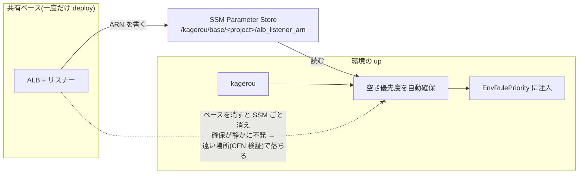

## はじめに

[kagerou](https://github.com/rikukadev/kagerou) は PR ごとの使い捨て環境を作る自作 OSS で、[設計の動機は以前書いた](/blog/kagerou-ephemeral-environments)。この記事はその各論にあたる。実際に環境を 1 周(作る → 確かめる → 消す)させ、**各段階で内部が何をしているか**を掘る。

実測はすべて [kagerou-spa-demo](https://github.com/rikukadev/kagerou-spa-demo)(サーバを持たない SPA)+ v0.18.2 のもの。

## 前提: 環境 = CloudFormation スタック 1 個、状態ストアなし

kagerou は専用のデータベースや状態ファイルを持たない。**環境 1 つにつき CloudFormation スタックを 1 つ作り、そのタグを真実の源にする**。



環境 1 つの全体像はこうなる。共有ベース(CloudFront / DNS / バケット)は全環境で 1 組しかなく、環境の増分は「タグ付きの極小スタック」と「S3 のプレフィックス」だけだ。



この設計の含意は 2 つある。第一に、**kagerou 自身が落ちても壊れる状態が無い**。`list` も `reap` も AWS への問い合わせだけで再構成できる。第二に、環境の発見・回収・期限判定がすべて「タグを読む」に還元されるので、コンポーネント間の契約が小さい。

面白いのは compute を持たない static driver でもスタックを作ることだ。S3 のプレフィックスに直接タグは打てないので、**タグの担い手として実リソースをほぼ持たない極小スタックを作る**。「環境 = スタック 1 個」という不変条件を守ると、list / reap / TTL のコードパスが driver に依らず共通になる。例外を作らないためのダミーである。

## up の 34 秒に何が起きるか

```console
$ kagerou up --name demo-cli
kagerou: creating spa-demo-demo-cli (30s)
kagerou: creating spa-demo-demo-cli done (30s)
wrote dist/config.json for demo-cli
demo-cli	ready	https://demo-cli.spa-demo.rikuka.dev
kagerou up  … 33.994 total
```

順に分解する。全体の流れを先に図にすると:



### (1) URL の確定 — 作る前に決まっている

`kagerou.yaml` の `url_template: "https://{name}.spa-demo.rikuka.dev"` から、`{name}` を展開した URL が **CloudFormation を呼ぶ前に**決まる。DNS はワイルドカード(`*.spa-demo.rikuka.dev` → 共有 CloudFront)で受けているので、名前が決まれば到達性も決まる。

これは見た目より効く設計で、理由は循環参照にある。「スタックを作るまで URL が分からない」方式だと、CORS の許可元・OAuth のコールバック・CSP の connect-src といった「URL を要求する設定」をテンプレートに書けない。同一スタック内の Output を参照しようとすると、リソースの依存が循環する。先に確定していれば、URL はただの入力パラメータ(`EnvKagerouUrl`)として渡せる。

### (2) メタスタック作成 — タグと owner 検査

スタック作成時にタグ一式を打つ。このとき `kagerou:owner` に呼び出し元の IAM プリンシパルを記録する。assumed-role のセッション ARN は呼び出しごとに変わるので、ロール ARN に正規化してから入れる(CI は全員同じデプロイロール = 同一 owner になり、PR への push で同じ環境を更新し続けられる)。

同名の環境が既にある場合、owner が違えば**名前衝突として拒否**する。「別チームの `staging` を上書きした」を構造的に防ぐ。

### (3) post_up フック — ビルド成果物は同一、環境の値は後入れ

静的サイトはビルド時に環境を知らない。環境ごとに違う値(API の URL など)をビルドに焼き込むと「URL が決まるまでビルドできない」という順序の縛りが生まれ、成果物のキャッシュも環境数ぶん割れる。

kagerou の解は、**成果物は全環境で同一に保ち、環境固有の値は同期の直前にフックで 1 ファイルだけ差し込む**こと。

```console
$ curl -s https://demo-cli.spa-demo.rikuka.dev/config.json
{"env": "demo-cli", "apiBaseUrl": "…", …}
```

フックには `KAGEROU_NAME` / `KAGEROU_URL` / `KAGEROU_OUTPUT_<KEY>`(CFN Outputs)が環境変数で渡る。順序が post_up → 同期なのは、static では「同期 = 公開」なので、公開より後に書いても反映されないからだ。

### (4) S3 同期

`dist/` を `s3://<bucket>/demo-cli/` へ、ローカルに無いものは消しつつ同期する。環境の増分はこのプレフィックスだけなので、環境あたりの追加コストはストレージ数 MB ぶんしかない。

## TTL と reap — 「消し忘れ」を構造から消す

```console
$ kagerou list
demo-cli	ready	2026-10-01T14:02:24Z	https://demo-cli.spa-demo.rikuka.dev
```

一覧の日時は `kagerou:expires-at` そのもの。kagerou では **TTL がすべての環境に必須**で、削除は二段構えになっている。

1. **イベント駆動**: PR close → `kagerou down`
2. **時間駆動**: cron の `kagerou reap` が `expires-at + grace` を過ぎた環境を回収



1 だけだと close イベントの取りこぼし(workflow の失敗、fork PR、手動作成)で環境が漏れる。2 だけだと消えるまで最大 TTL ぶん待つ。両方あると、1 が普段の即時性を、2 が最終保証を持つ。`--grace 1h` は「作成直後の環境を期限判定の境界で巻き込まない」ための猶予だ。

常設したい環境(後述の peer の供給源など)は `--ttl none` を明示する。既定を無期限にしないのは意図的で、**例外(消えない環境)を作る側に宣言コストを払わせる**設計になっている。

## down の 31 秒 — 削除順序は正しさの問題

```console
$ kagerou down --name demo-cli
kagerou: deleting spa-demo-demo-cli done (30s)
$ aws s3 ls s3://…/demo-cli/
(空)
```

残骸ゼロ。ここには順序の議論がある。消すものは「S3 プレフィックス」と「メタスタック」の 2 つで、**S3 が先、スタックが後**でなければならない。



逆(スタック先行)だと、S3 の削除が途中で失敗したときに致命的な状態になる。公開オブジェクトは生きているのに、環境を発見する唯一の台帳であるスタック(のタグ)が消えている。`list` にも `reap` にも出てこないので、以後どの自動処理からも見えない。**公開されたまま、誰にも見つけられない孤児**だ。

S3 先行なら、途中で失敗してもスタックが残る。環境は「消し残しあり」として見え続け、次の reap が再試行する。使い捨て環境の削除は高頻度で走るので、部分失敗は「起きるか」ではなく「起きたとき何が残るか」で設計する必要がある。

もう 1 つ、`DeleteObjects` API の罠がある。この API は **HTTP 200 を返しながら、要素ごとの失敗を response body の `Errors` で返す**。ここを見ずに err だけ見ていると、消えていないオブジェクトを消したことにしてしまう。down では公開物が残り、差分同期では古いファイルが公開され続ける。地味だが、「消したはず」が信用できなくなる類のバグなので、1 件でも `Errors` があれば失敗として返す。

## CI への接続 — 仕組みの再利用

```yaml
- uses: rikukadev/kagerou/action@v0
  with:
    name: pr-${{ github.event.pull_request.number }}
```

pr-preview は、ここまでの up / down を PR の open / close に紐付けただけで、CI 専用の経路は無い。手元で検証した挙動がそのまま CI の挙動になる。action は release バイナリを checksums.txt と突き合わせてから実行する(CI は AWS 資格情報を持った状態で走るので、配信経路の検証は省けない)。

実測では、この SPA 構成の pr-preview が約 1 分、Lambda コンテナ + SNS/SQS の構成([pub](https://github.com/rikukadev/kagerou-pub-demo)/[sub](https://github.com/rikukadev/kagerou-sub-demo))で 3 分前後だった。

## 設計の裏面 — 前提を消すと何が起きるか

このデモ群を最小権限の IAM で通す作業の中で、環境ではなく**前提**の側で 2 回つまずいた。どちらも設計の性質が裏返って出たもので、仕組みの理解として残しておく。

### 共有ベースの寿命は環境より長い、を破ると

ALB のような固定費のかかる入口は環境ごとに作らず、**共有ベース**として一度だけ deploy する。ベースは接続情報(リスナー ARN など)を SSM Parameter Store の規約されたキーに書き、環境側はそれを読む。ベースと環境の境界は、この **SSM のキー契約**だけだ。

このベースをコスト整理で消すと、環境側は一見無関係なエラーで落ちる。

```
ValidationError: Parameters: [EnvRulePriority] must have values
```



実際に踏んだもので、因果はこうなる。ALB のリスナールールには一意な優先度が要り、kagerou はテンプレートが `EnvRulePriority` を宣言していて値が来ていないとき、**共有リスナーの空き優先度を自動確保して埋める**。その確保はリスナー ARN を SSM から引けることが前提。ベースが消えると SSM ごと消え、自動確保が静かに不発になり、CloudFormation のパラメータ検証という遠い場所でエラーになる。

エラーの出る場所と原因の場所が離れているのは、疎結合(SSM 契約でしか繋がっていない)の代償でもある。

### TTL の網羅性は、常設したい環境に牙を剥く

2 アプリの連動プレビュー(peer)では、相手アプリの同名環境が無いとき `main` にフォールバックする。つまり **`main` は常設の供給源**でなければならない。

ところが TTL は全環境に付くので、何もしなければ main も 72 時間で reap される。消えた main を作り直しても、また 3 日で消える。購読側の環境は `Topic does not exist` で落ち続ける。「TTL 必須」という消し忘れ防止の設計が、例外(常設)を宣言し忘れた途端に、**必要なものを几帳面に消し続ける**装置になる。

対処は `--ttl none` の明示だけだが、教訓は一般化できる。網羅的な自動回収を入れるなら、例外の宣言方法とその宣言漏れの症状まで含めて設計・文書化しないと、回収が正しく動くほど原因が分かりにくい障害になる。

## まとめ

| 操作 | 実測 | 内部 |
|---|---|---|
| `up`(static) | 34 秒 | URL 確定 → メタスタック + タグ → post_up → S3 同期 |
| `down` | 31 秒 | **S3 先行**削除(部分失敗でも台帳が残る)→ スタック削除 |
| 回収 | TTL + reap | タグ `expires-at` の走査。イベント駆動の取りこぼしを時間駆動が拾う |

環境の実体を「スタック 1 個 + タグ」に還元したことで、作る・見つける・消す・回収するがすべて同じ土台に乗っている。1 周が 1 分強で終わるのはその帰結で、速さ自体が目的というより、状態を持たない設計の副産物に近い。

公開契約は [docs/CONTRACT.md](https://github.com/rikukadev/kagerou/blob/main/docs/CONTRACT.md)、設計判断の全体は [docs/DESIGN.md](https://github.com/rikukadev/kagerou/blob/main/docs/DESIGN.md) にある。
