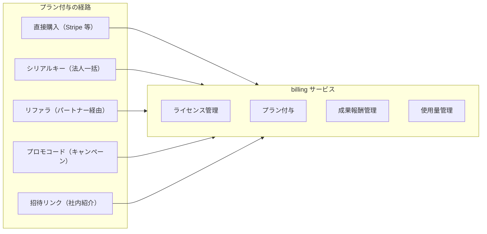
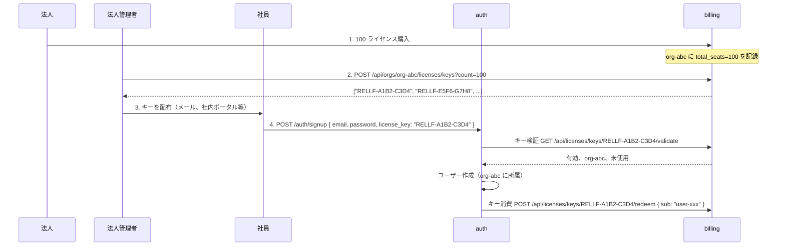
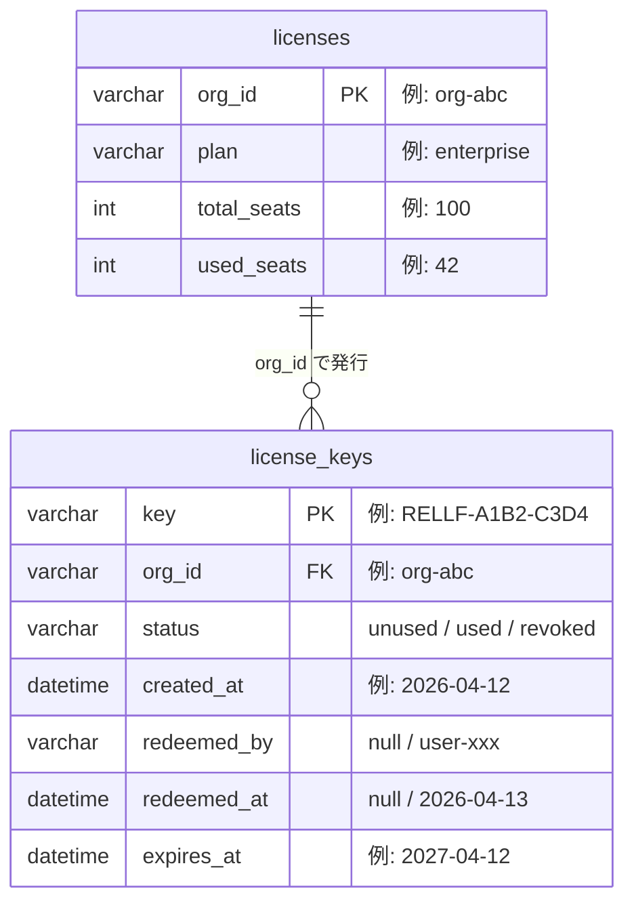
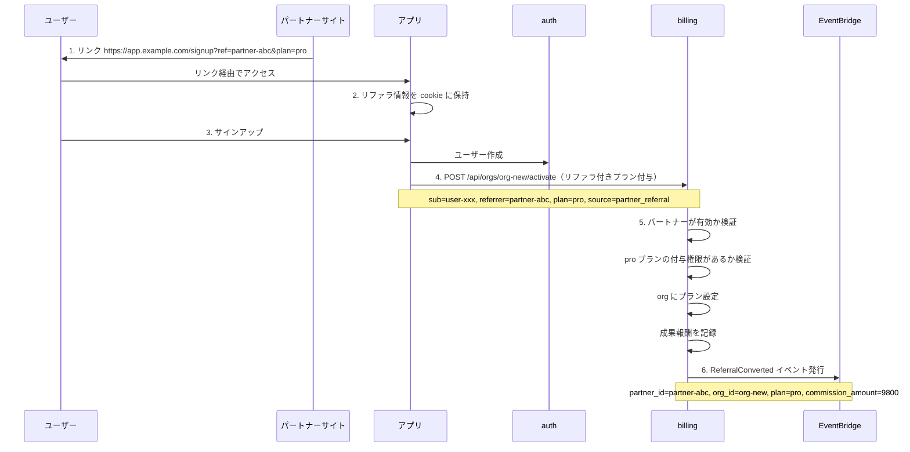
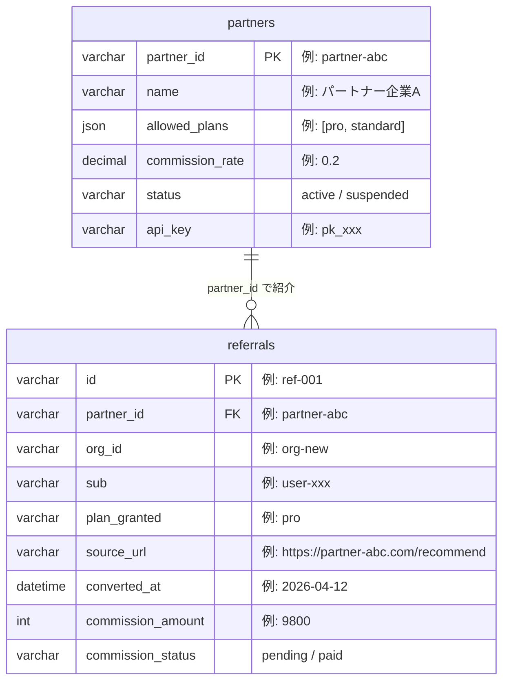
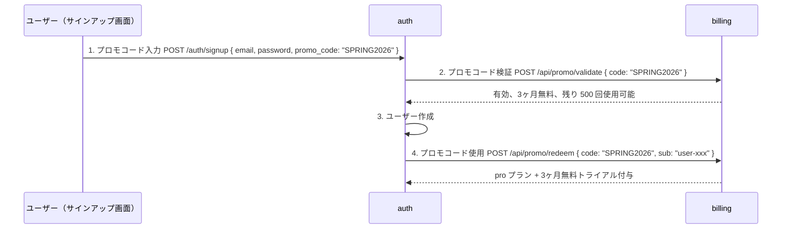
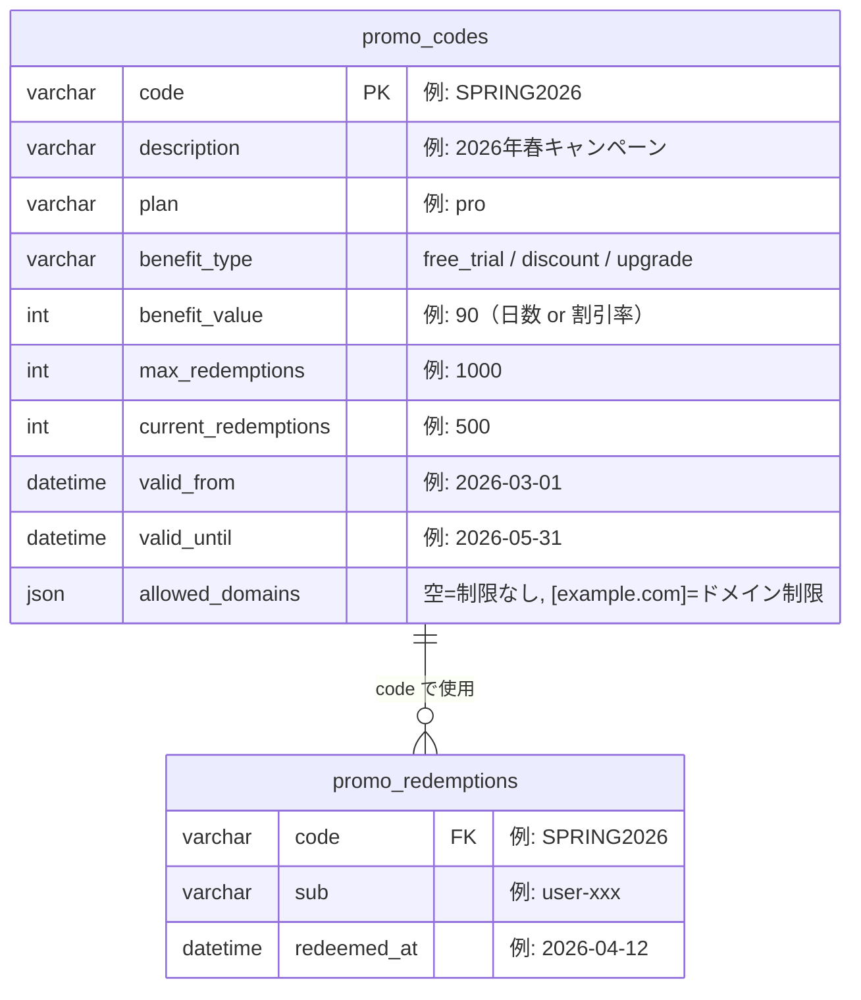

## はじめに

SaaS のプラン付与は「ユーザーが自分でプランを選んで決済する」だけではありません。実際には以下のような経路があります。

- **法人にライセンスを一括販売** → シリアルキーで社員に配布
- **パートナー経由の紹介** → リファラリンクで有料プランを自動付与
- **キャンペーン** → プロモーションコードで割引や無料期間を付与
- **社内紹介** → 紹介元ユーザーにクレジット付与

これらを個別に実装するとカオスになるので、**課金サービス（billing）の「プラン付与経路」として統一的に設計する**のが筋です。

## 全体像



すべての経路が最終的に billing の「プラン付与」に収束します。

## 1. シリアルキー（法人ライセンス配布）

### ユースケース

法人に 100 ライセンスを販売し、シリアルキーを渡す。法人の管理者がキーを社員に配布し、社員はキーを使ってサインアップする。

### フロー



### キーの設計

```
フォーマット: RELLF-XXXX-XXXX
  │      │      │
  │      │      └─ ランダム4文字（英数大文字）
  │      └──────── ランダム4文字
  └─────────────── プレフィックス（ブランド識別）

衝突確率: 36^8 ≒ 28億通り（十分）
```

人間が読みやすい・入力しやすい・電話で伝えやすい長さが重要です。

### データモデル



### 運用パターン

| パターン | 対応 |
|---------|------|
| キーの使い回し防止 | `status=used` で 1 回限り |
| キーの期限切れ | `expires_at` で検証 |
| 退職者のシート回収 | ユーザー削除 → キーを `revoked` → `used_seats` 減算 → 新キー発行可能 |
| 追加購入 | `total_seats` を増やす → 追加キーを発行 |
| ダウングレード | `total_seats` を減らす → 超過分は猶予期間付きで対応 |

### シリアルキー vs 招待リンク

| | シリアルキー | 招待リンク |
|---|---|---|
| 配布方法 | 紙、メール、口頭 | メール |
| 入力 | ユーザーが手入力 | リンクをクリック |
| オフライン配布 | 可能 | 不可 |
| 特定ユーザーへの紐付け | なし（誰でも使える） | メアドに紐付け |
| 横流しリスク | あり | 低い |

両方サポートするのが理想です。管理者が「この人に確実に渡したい」なら招待リンク、「まとめて配りたい」ならシリアルキー。

## 2. リファラ（パートナー経由）

### ユースケース

パートナー企業のサイトからリンク経由でサインアップすると、有料プランが自動付与される。パートナーには成果報酬が発生する。

### フロー



### データモデル



### リファラリンクの署名

リファラの偽装を防ぐために、パートナーの API キーで署名付きリンクを生成します。

```
https://app.example.com/signup?
  ref=partner-abc
  &plan=pro
  &ts=1712900000
  &sig=HMAC-SHA256(partner-abc:pro:1712900000, api_key)
```

billing がリンクの `sig` を検証して、正規のパートナーリンクかどうかを判定。

## 3. プロモーションコード

### ユースケース

期間限定キャンペーンで「このコードを入力すると 3 ヶ月無料」のような施策。

### フロー



### データモデル



### プロモコードの種類

| 種類 | 例 | benefit_type |
|------|-----|-------------|
| 無料期間延長 | 「3ヶ月無料で使えます」 | free_trial |
| 割引 | 「初年度 50% オフ」 | discount |
| プランアップグレード | 「pro プランにアップグレード」 | upgrade |
| クレジット付与 | 「5000円分のクレジット」 | credit |

## 4. 社内紹介

### ユースケース

既存ユーザーが友人・同僚を紹介すると、紹介元にクレジットが付与される。

### フロー

```
1. 既存ユーザーが紹介リンクを生成
   GET /api/me/referral-link
   → https://app.example.com/signup?invite=user-xxx

2. 友人がリンク経由でサインアップ

3. billing: 紹介元に 1000 円クレジット付与
```

これはパートナーリファラの簡易版で、`partners` テーブルの代わりにユーザー自身が紹介元になるだけです。

## 統一的な設計

4 つの経路は billing の中で以下のように統合されます。

### 共通の「プラン付与」インターフェース

```go
type PlanActivation struct {
    OrgID       string
    Sub         string
    Plan        string
    Source      ActivationSource  // direct | license_key | referral | promo | invite
    SourceRef   string            // キーID、パートナーID、プロモコード、紹介元sub
    BenefitType string            // full_price | free_trial | discount
    BenefitDays int               // 無料期間の日数（該当する場合）
}

func (s *BillingService) ActivatePlan(ctx context.Context, req PlanActivation) error {
    // 1. ソースの検証（キー有効？パートナー有効？プロモ有効？）
    // 2. プラン付与
    // 3. ソースの消費（キー使用済み、プロモ回数減算）
    // 4. 成果報酬の記録（該当する場合）
    // 5. イベント発行
}
```

すべての経路が `ActivatePlan` に収束します。

### billing API まとめ

| エンドポイント | 用途 |
|-------------|------|
| `POST /api/orgs/:id/licenses/keys` | シリアルキー一括発行 |
| `GET /api/orgs/:id/licenses/keys` | キー一覧 |
| `GET /api/licenses/keys/:key/validate` | キー検証 |
| `POST /api/licenses/keys/:key/redeem` | キー消費 |
| `POST /api/licenses/keys/:key/revoke` | キー無効化 |
| `POST /api/orgs/:id/activate` | リファラ付きプラン付与 |
| `GET /api/partners/:id` | パートナー情報 |
| `GET /api/partners/:id/referrals` | パートナー成果一覧 |
| `POST /api/promo/validate` | プロモコード検証 |
| `POST /api/promo/redeem` | プロモコード使用 |
| `GET /api/me/referral-link` | 紹介リンク取得 |

### イベント

| イベント | 発行タイミング |
|---------|-------------|
| `LicenseKeyRedeemed` | シリアルキーが使用された |
| `ReferralConverted` | パートナー経由でコンバージョン |
| `PromoCodeRedeemed` | プロモコードが使用された |
| `InviteConverted` | 社内紹介でコンバージョン |

## 不正防止

| リスク | 対策 |
|-------|------|
| シリアルキーの横流し | 1 キー 1 回限り、組織紐付け |
| リファラの偽装 | HMAC 署名付きリンク |
| プロモコードの乱用 | 使用回数制限、メールドメイン制限、期限 |
| 自己紹介（自分で紹介して報酬を得る） | 紹介元と紹介先のメールドメイン・IP 比較 |
| 同一ユーザーの複数利用 | 1 メールアドレス 1 回限り |
| 期限切れキー/コードの使用 | `expires_at` / `valid_until` で検証 |

## 認可との連携

ライセンスの種類やプロモの内容によって使える機能を変える場合、billing → authz の context で制御します。

```cedar
// enterprise ライセンスなら全機能
permit(
  principal,
  action,
  resource
) when {
  context.license_type == "enterprise"
};

// トライアル中はエクスポート不可
forbid(
  principal,
  action == App::Action::"export",
  resource
) when {
  context.is_trial == true
};

// プロモで付与された pro は一部機能制限
forbid(
  principal,
  action == App::Action::"api_access",
  resource
) when {
  context.plan == "pro" &&
  context.activation_source == "promo"
};
```

## auth 側の変更

サインアップフローにライセンスキー / プロモコードの検証を挟むだけ。auth 自体はプラン管理のロジックを持ちません。

```go
func (c *Client) SignUp(ctx context.Context, req SignUpRequest) (*SignUpOutput, error) {
    // ライセンスキーまたはプロモコードがあれば billing に検証
    if req.LicenseKey != "" {
        if err := c.billing.ValidateKey(ctx, req.LicenseKey); err != nil {
            return nil, fmt.Errorf("invalid license key: %w", err)
        }
    }
    if req.PromoCode != "" {
        if err := c.billing.ValidatePromo(ctx, req.PromoCode); err != nil {
            return nil, fmt.Errorf("invalid promo code: %w", err)
        }
    }

    // ユーザー作成
    result, err := c.createCognitoUser(ctx, req.Email, req.Password)
    if err != nil {
        return nil, err
    }

    // キー/プロモの消費は billing に委譲（アプリ側で ActivatePlan を呼ぶ）
    return result, nil
}
```

## まとめ

- シリアルキー、リファラ、プロモコード、招待リンクは billing の**「プラン付与経路」として統一的に管理**する
- すべての経路が `ActivatePlan` に収束する設計にすることで、新しい経路の追加が容易
- auth はキー/コードの検証を billing に問い合わせるだけ。プラン管理のロジックは持たない
- 不正防止は経路ごとに異なるので、個別の対策を設計しておく
- 認可（authz）との連携で、経路やライセンス種別に応じた機能制限も表現可能
