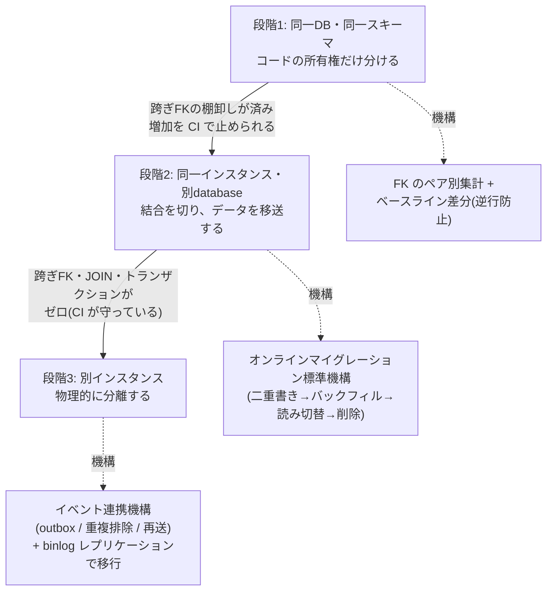
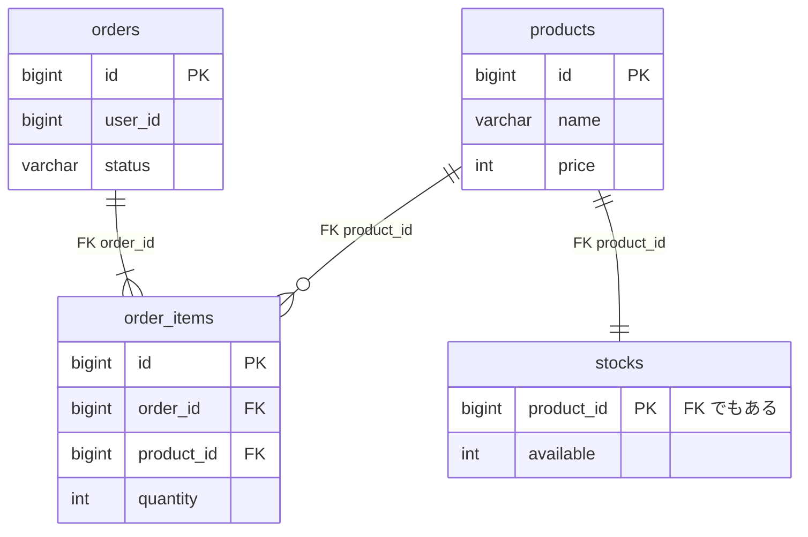
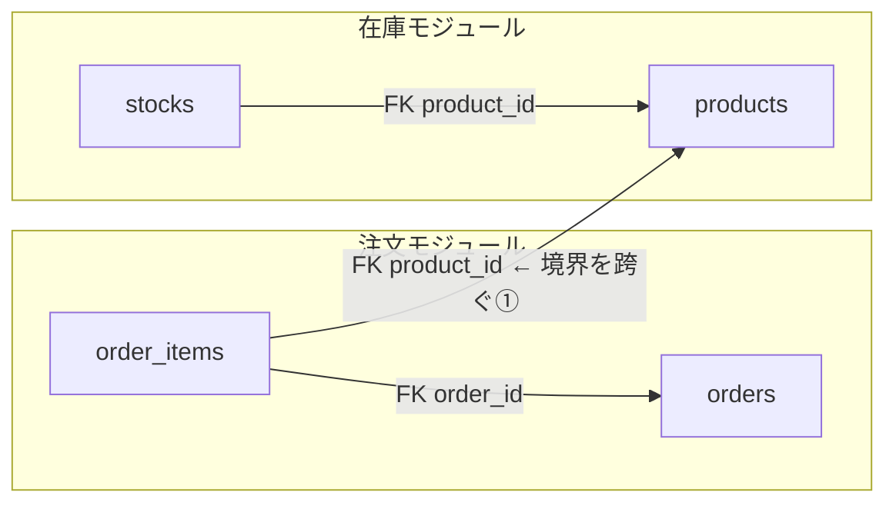
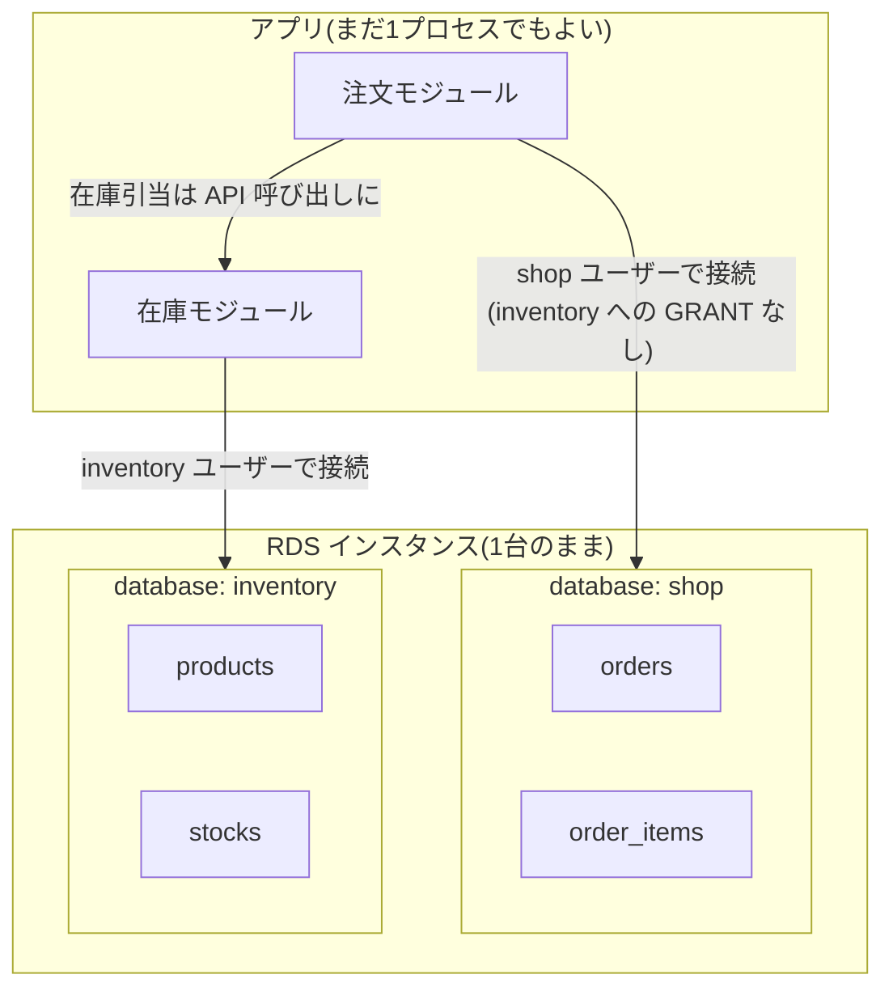
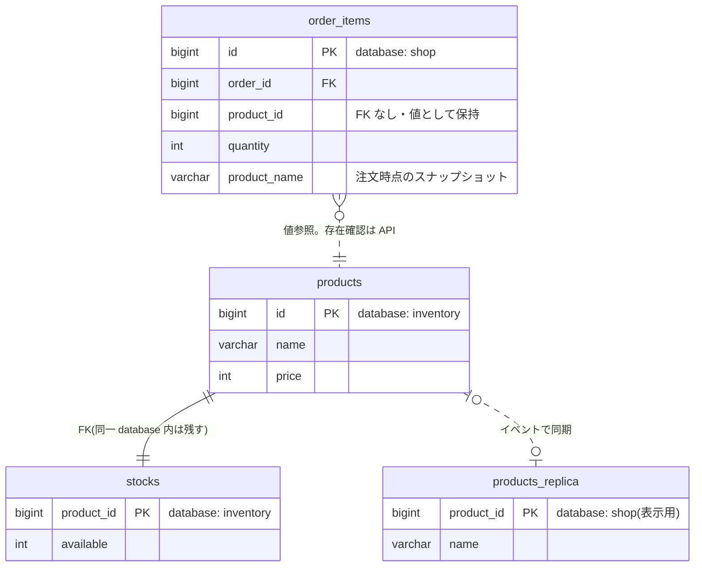
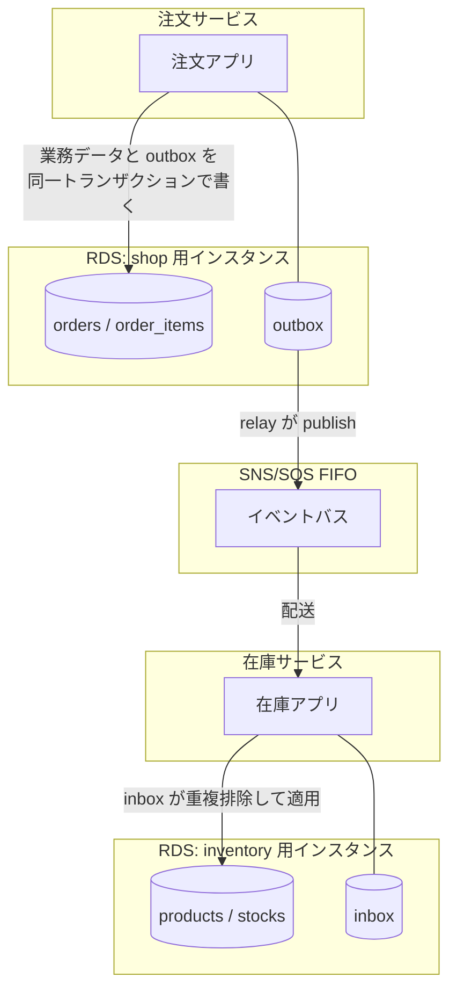
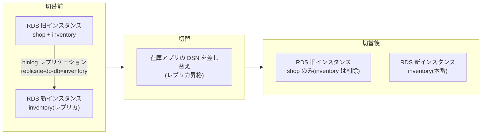

## はじめに

モノリスからサービスを切り出す話は、コードの分け方（モジュール境界、
ストラングラー・フィグ）として語られることが多い。しかし実際に手が止まるのは
データです。テーブルは JOIN と外部キーで絡み合っていて、しかも書き込みは
移行の間も止まらない。

この記事は、データの切り出しを**3段階**に分ける整理です。段階を分ける基準は
1つだけ:

> **1つのトランザクションが、新旧両方の置き場所に届くか。**

これが届く間は普通の道具で進められる。届かなくなった瞬間に、必要な機構が
一段重くなる。だから「どこまで届く状態を保ったまま、何を済ませておくか」が
移行設計のほぼすべてになります。

## 全体戦略

先に地図を出します。各段階でやること・使う機構・次へ進む条件はこうなります。



重要なのは矢印の条件です。段階2→3 の条件「跨ぎゼロ」が CI で守られている限り、
段階3は**いつでも実行できる移行**であって「いつか来るビッグバン移行」ではない。
以降、この地図を1段ずつ歩きます。

## 前提: 走る例

通販のモノリスを例にします。注文まわり（orders / order_items）と
商品・在庫まわり（products / stocks）が1つの database に同居していて、
在庫側を「在庫サービス」として切り出したい、という設定です。



注文確定のコードは今、こういう1トランザクションを張っています:

```sql
BEGIN;
INSERT INTO orders ...;
INSERT INTO order_items ...;
UPDATE stocks SET available = available - 3 WHERE product_id = 42;  -- 境界を跨ぐ更新
COMMIT;
```

この「注文と在庫引当が atomic」こそが、切り出しを難しくしている当のものです。

## 段階1: 同じ DB・同じスキーマのまま、コードだけ分ける

いわゆるモジュラーモノリス。コードの所有権（stocks に触ってよいのは
在庫モジュールだけ）を決めて守らせる段階で、**データは何も動かしません**。



線を引いてみて初めて、**境界を跨ぐ結合が数えられる**ようになります。この例では
跨ぎ FK は `order_items.product_id → products.id` の1本（+ 注文確定トランザクション
内の stocks 更新という「コードの跨ぎ」）。この段階の仕事は現状を測ることです:

- 跨ぎ FK をペア別に集計する — 「注文 → 在庫: 残り1本。これが切れれば独立できる」
- ベースラインを固定して**増加だけを CI で止める** — 移行の逆行を防ぎながら、
  削減を進捗として見る（[fk:check の警告モードとして実装した話](https://github.com/rikukaInoue/greenfield/issues/197)）

インフラは何も変わりません。アプリ1つ、RDS 1台、database 1つのままです。

## 段階2: 同じ DB インスタンスの中で、database を分ける

products / stocks を `inventory` database へ動かします。物理サーバは1台のまま。



ここが**一番おいしい段階**です。切り出しの難所を全部、「まだトランザクションが
張れる安全な場所」で済ませます。

**結合の切り方（ER の変化）**。跨ぎ FK は張れなくなる（別 database への FK は
移送後に物理的に消える）ので、`order_items.product_id` は**ただの値**になります。
商品名の表示のような読みは、在庫モジュールの API か、レプリカテーブルで解決します:



**注文確定トランザクションの分解**。冒頭の「注文と在庫引当が atomic」は
ここで捨てます。注文を pending で確定 → 在庫モジュールへ引当コマンド
（冪等キー付き）→ 結果で confirmed / rejected へ、という**ワークフロー**に
組み替える。これが切り出しの中で一番設計が要る箇所で、DB でなくドメインの
仕事です。段階2でやるのは、失敗してもまだ全部同じインスタンスにあって
検算も修復も安いから。

**テーブルの移送**。products / stocks を shop から inventory database へ動かす
作業は、[オンラインマイグレーションの標準機構](/blog/progressive-delivery-app-vs-db/)
（二重書き → バックフィル → 読み切替 → 旧側を削除）がそのまま使えます。
カラム改名と同じ型で、対象がテーブルに変わるだけ。**二重書きがまだ同一
トランザクションで書ける**（同一インスタンスなので atomic）ことが効いています。

注意が1つ。この段階では跨ぎのトランザクションが**技術的にはまだ張れて
しまう**。MySQL は database を跨ぐ FK も JOIN もエラーにしないので、
「張れるけど張らない」を文章でなく機械で守る必要があります。接続ユーザーを
database ごとに分けて GRANT で縛る + 跨ぎ FK の CI 検査、の二段です。
ここを規律で守れない場合、段階3に進んだ瞬間に「張れなくなって初めて発覚する
結合」が一斉に火を吹きます。

## 段階3: 別インスタンスに分ける

AWS で言えば **RDS インスタンス（Aurora ならクラスタ）をサービスごとに
別にする**段階です。紛らわしいのは Aurora のリーダー/ライター構成で、
同一クラスタ内のレプリカは書き込み1系統の同じトランザクションドメイン
なので段階3ではありません。「クラスタごと別」が段階3です。

| | AWS 上の形 | トランザクション | 障害・運用 |
|---|---|---|---|
| 段階2 | 1つの RDS インスタンスに複数 database | まだ張れる（規律で禁じる） | フェイルオーバー・メンテ・スケールが運命共同体 |
| 段階3 | サービスごとに別インスタンス/クラスタ | 物理的に張れない | 別々に落ち、別々にメンテでき、別々にスケールする |

機構が一段重くなる理由は、**二重書きが atomic でなくなる**ことです。段階2までは
「旧テーブルと新テーブルへの書き込み」を同一トランザクションに入れられた。
インスタンスが分かれると「旧側は成功、新側は失敗」が構造的に起こるので、
二重書きそのものが信用できない。代わりに outbox パターンを使います —
業務の書き込みと**同一トランザクションで** outbox テーブルに変更を積み、
relay が相手側へ運ぶ（at-least-once + 受信側 inbox の重複排除。
[実バスで検証した形](/blog/sns-sqs-queue-policy/)と同じ機構）。



ただし、段階2を経由していれば段階3の**移行自体**は「データの意味を変えない
移送」に縮んでいます。inventory database だけを binlog レプリケーションで
新インスタンスへレプリケーションで同期し、追いついたら DSN を切り替えるだけ:



DMS でも同じことができます。切替のリハーサルには [Aurora fast clone
（データ量非依存で5分半）](/blog/aurora-instant-ddl-fast-clone/)がそのまま使えて、
本番同等データで昇格と DSN 切替の予行ができます。

## 段階2で止まるのは撤退ではない

段階3に進むと、インスタンス台数分の固定費（db.t4g.medium でも1台 $80/月前後）と、
跨ぎトランザクション不能に伴うイベント連携機構の常設が付いてきます。
これに見合う要求は「別々に落ちてほしい」「別々にスケールしたい」
「チームごとに運用を分けたい」のどれかが現実になったときで、
それまでは**段階2 + 跨ぎ FK の CI 検査**で止まるのが合理的です。

大事なのは、段階2で止まっていても**段階3へのオプションを保ち続けている**こと。
跨ぎ FK ゼロ・跨ぎ JOIN ゼロ・跨ぎトランザクションゼロが CI で守られている限り、
段階3は「いつでも実行できる移行」であって「いつか来るビッグバン移行」ではない。
逆に規律が破れていると、オプションは静かに失効します — 破れたことは
段階3を試みるまで誰にも見えないので。

## まとめ

- 境目は「1つのトランザクションが新旧両方に届くか」。届く間（段階1〜2）に
  難所（FK 切り・JOIN 排除・atomicity の分解・データ移送）を済ませるのが移行設計の本体
- 段階1の道具は**棚卸しと逆行防止**（FK のペア別集計 + ベースライン差分）
- 段階2の道具は**オンラインマイグレーションの標準機構**（二重書き →
  バックフィル → 読み切替 → 削除）と GRANT 分離。まだ atomic に書けるうちに使う
- 段階3の道具は**outbox 以下のイベント連携機構**。二重書きが atomic でなくなる
  ことへの答えで、移行自体は段階2を経ていれば binlog レプリケーション +
  DSN 切替に縮む
- 段階2で止まるのは合理的。ただしオプション（跨ぎゼロの CI 検査）は保ち続ける
