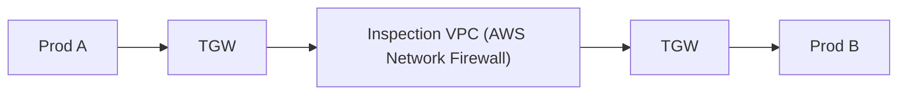
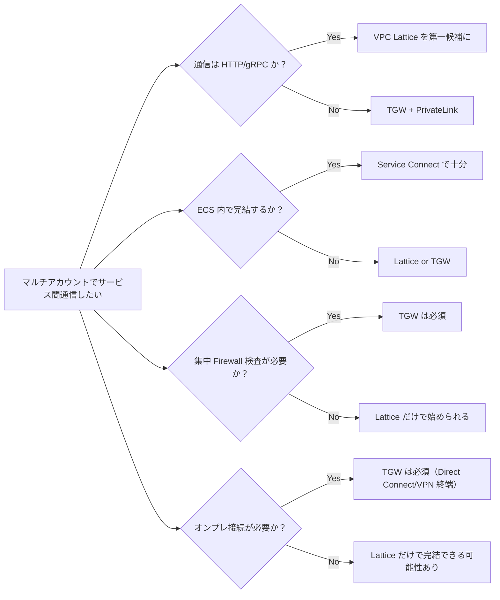
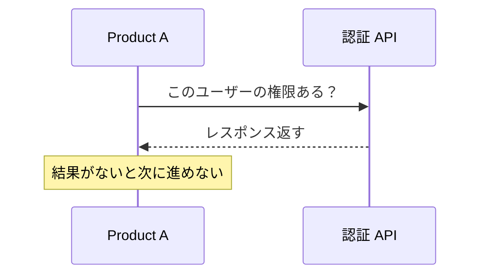
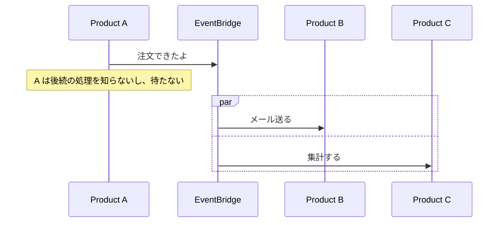

## 前提: 何を設計するのか

複数プロダクトがそれぞれ独立した AWS アカウントを持ち、stg/prd で環境を分離している。アカウント数は 10〜12。コンピュートは ECS と Lambda が混在。オンプレミス接続は不要。

この構成で **プロダクト間の通信基盤** をどう作るかを考えます。

```
Organizations
├── Shared Services
├── Product A - stg
├── Product A - prd
├── Product B - stg
├── Product B - prd
├── Product C - stg
├── Product C - prd
├── ...（5〜6 プロダクト × 2 環境）
```

## VPC 間通信の選択肢を整理する

まず全体像を把握します。マルチアカウントの VPC 間通信には、大きく 2 つのレイヤーがあります。

### L3/L4 — ネットワーク接続レイヤー

IP レベルでの到達性を確保する層です。

| パターン | 特徴 | ユースケース |
|---|---|---|
| **VPC Peering** | 1 対 1 接続。推移的ルーティング不可 | 少数アカウント間の直接通信 |
| **Transit Gateway (TGW)** | ハブ & スポーク型。推移的ルーティング可 | 多数の VPC/アカウントを集約 |
| **PrivateLink** | サービス単位の一方向公開 | 特定サービスだけを閉域で公開 |
| **AWS RAM** | リソース共有（サブネット等） | 共有 VPC パターン |

### L4/L7 — サービス間通信レイヤー

アプリケーション寄りの通信制御を担う層です。

| サービス | 何をするか | スコープ |
|---|---|---|
| **VPC Lattice** | サービス間の HTTP/gRPC/TCP 通信をマネージド化。認証・ルーティング・可観測性を統合 | クロスアカウント・クロス VPC 対応 |
| **ECS Service Connect** | ECS タスク間のサービスディスカバリ + ロードバランシング（Cloud Map 連携） | ECS クラスタ内〜同アカウント寄り |
| **App Mesh** | Envoy ベースのサービスメッシュ | 非推奨方向。Lattice に移行が推奨 |

マルチアカウントでプロダクト間通信を設計するなら、検討すべきは主に **VPC Lattice** と **Transit Gateway** の 2 つです。

## VPC Lattice とは何か

VPC Lattice はサービス間通信のマネージドレイヤーです。従来の「TGW でネットワークを繋いで、ALB を立てて、PrivateLink で公開して…」という構成を、1 つのサービスでシンプルにします。

### 従来構成: サービス A がサービス B を呼ぶ場合

```
Account A                          Account B
┌──────────┐    TGW/Peering    ┌──────────────┐
│ Service A │ ───────────────► │ NLB/ALB      │
│           │                  │   ↓          │
│           │                  │ Service B    │
└──────────┘                  └──────────────┘

必要なもの:
- TGW または Peering（ネットワーク到達性）
- NLB/ALB（ロードバランシング）
- PrivateLink（閉域公開したい場合）
- Security Group / NACL で制御
- Route 53 PHZ（DNS 解決）
```

### Lattice: 同じことをやる場合

```
Account A                          Account B
┌──────────┐                   ┌──────────────┐
│ Service A │ ── Lattice SN ──►│ Lattice Svc  │
│           │                  │   ↓          │
│           │                  │ Service B    │
└──────────┘                  └──────────────┘

必要なもの:
- Lattice Service Network（RAM で共有）
- Lattice Service（ターゲットグループ定義）
- IAM Auth Policy（認証認可）
- TGW/Peering は不要
```

TGW も Peering も ALB もなしで、クロスアカウント通信が成立します。

### Lattice の構成要素

```
Service Network（サービスネットワーク）
  ├── Service A（HTTP リスナー → ターゲットグループ → ECS タスク）
  ├── Service B（gRPC リスナー → ターゲットグループ → Lambda）
  └── Auth Policy（IAM ベースのアクセス制御）

各 VPC が Service Network に「参加」することで通信可能になる
```

- **Service Network** — サービスの集合体。RAM で他アカウントに共有する単位
- **Service** — 個々のサービス。リスナーとターゲットグループを持つ
- **Auth Policy** — IAM ベースで「誰がどのサービスを呼べるか」を制御

## Transit Gateway とは何か

Transit Gateway（TGW）は L3/L4 のネットワーク接続ハブです。すべての VPC を TGW に接続し、Route Table でルーティングを制御します。

### TGW の基本構成

```
                    ┌─────────────┐
                    │     TGW     │
                    │ (Network アカウント)
                    └──┬──┬──┬──┬─┘
                       │  │  │  │
          ┌────────────┘  │  │  └────────────┐
          ▼               ▼  ▼               ▼
      [Shared]      [Prod A] [Prod B]   [Inspection]
       VPC            VPC     VPC          VPC
                                        (Firewall)
```

### TGW の通信制御

TGW は **Route Table** で制御します。Lattice と違って L3/L4 の世界です。

```
TGW Route Table: prod-rt
  ├── 10.1.0.0/16 → Prod A VPC
  ├── 10.2.0.0/16 → Prod B VPC
  ├── 10.0.0.0/16 → Shared VPC
  └── 0.0.0.0/0   → Inspection VPC（全通信を検査）

TGW Route Table: stg-rt
  ├── 10.11.0.0/16 → Stg A VPC
  ├── 10.12.0.0/16 → Stg B VPC
  └── 10.10.0.0/16 → Shared-stg VPC
  （prd へのルートがない → 到達不可能）
```

### Inspection VPC パターン

TGW の定番構成として、全通信を Firewall 経由にする Inspection VPC パターンがあります。



Inspection VPC ではルールで検査します:

- 許可するドメイン
- 許可するプロトコル
- IDS/IPS ルール

これは Lattice にはない機能で、TGW の大きな強みです。

## Lattice vs Transit Gateway 比較

| | **VPC Lattice** | **Transit Gateway** |
|---|---|---|
| 制御の粒度 | サービス/ロール単位 | VPC/CIDR 単位 |
| 認証 | IAM ベース | なし（ネットワーク制御のみ） |
| 対応プロトコル | HTTP/HTTPS/gRPC/TCP | **全プロトコル** |
| 集中検査 | できない | Network Firewall 連携 |
| DNS | 自動（Lattice ドメイン） | 自前で設計（Route 53 PHZ） |
| CIDR 重複 | **問題にならない** | **絶対に重複不可** |
| コスト | 通信量ベース | **固定費あり**（時間課金 / アタッチメント） |
| DB 接続 | 不向き | 可能 |
| Lambda 対応 | ネイティブ | VPC Lambda 必須 |
| オンプレ接続 | 不可 | Direct Connect / VPN 終端 |

### どちらを選ぶか



## 今回の構成での設計判断

5〜6 プロダクト × stg/prd、ECS + Lambda、オンプレ不要 — この条件で整理します。

### TGW が必要な主な理由と今回の該当状況

```
✗ Direct Connect / VPN 終端  ← オンプレ不要
✗ 集中 Egress/Ingress       ← プロダクトごとに独立で良ければ不要
△ 広範な L3/L4 接続         ← Lattice で代替できる可能性大

→ TGW なしで始めて、必要になったら足す
```

### Lattice だけで始める理由

- **ECS + Lambda の組み合わせと相性が良い** — Lattice は両方をターゲットにでき、コンピュートの種類を意識せずサービス名でアクセスできる。TGW だと Lambda からの通信に VPC Lambda + ENI が必要で構成が重い
- **CIDR 設計が楽** — Lattice は CIDR の重複が問題にならない。TGW は全 VPC で CIDR が重複不可
- **固定費が小さい** — TGW は時間課金 + アタッチメント課金の固定費がある。Lattice は通信量ベース
- **段階的に接続を増やせる** — 必要なサービスだけ公開する形で導入できる
- **後から TGW を足しても競合しない** — 必要になったら併用できる

### 最小構成

```
Organizations
├── Shared Services
│   └── Lattice Service Network（RAM で各アカウントに共有）
│       └── 共通サービス（認証 API, etc.）
├── Product A - stg/prd
├── Product B - stg/prd
├── ...

プロダクト間の同期通信 → Lattice
プロダクト間の非同期連携 → EventBridge
DB 接続が跨ぐ場合だけ → PrivateLink（個別に）
```

## 通信制御の設計

Lattice 中心の構成での通信制御は 3 層で考えます。

### 制御レイヤーの全体像

```
              制御レイヤー              粒度
──────────────────────────────────────────────────
Service Network   誰がネットワークに参加できるか    アカウント単位
  └─ Auth Policy  誰がどのサービスを呼べるか      ロール/サービス単位
      └─ SG       ポート/プロトコル制限          L4
```

### 1. Service Network レベル — 参加自体の制御

Service Network への参加を RAM で共有する相手を絞ることで、そもそも見えない状態を作れます。

```
Service Network (prd用)
  ├── 参加許可: Product A-prd, B-prd, C-prd, Shared-prd
  └── Auth Policy: 全体のデフォルトルール

Service Network (stg用)
  ├── 参加許可: Product A-stg, B-stg, C-stg, Shared-stg
  └── Auth Policy: 全体のデフォルトルール
```

### 2. Auth Policy — サービス単位のアクセス制御

IAM ベースで「誰が」「どのサービスを」呼べるかを制御します。これがメインの制御レイヤーです。

```json
{
  "Effect": "Allow",
  "Principal": {
    "AWS": "arn:aws:iam::111111111111:root"
  },
  "Action": "vpc-lattice-svcs:Invoke",
  "Resource": "arn:aws:vpc-lattice:ap-northeast-1:222222222222:service/svc-xxx/*"
}
```

例えば「Product A の ECS タスクロールだけが認証 API を叩ける」といった制御ができます。

### 3. Security Group — L4 レベルの補助的制御

Lattice の VPC アソシエーションに Security Group を付けられます。ポートやプロトコルの制限に使えますが、Auth Policy で十分なことが多いので補助的な位置づけです。

### stg/prd の環境分離

ここは明確にしておくべきポイントです。

```
Option A: Service Network を環境ごとに分ける（推奨）
  - SN-prd → prd アカウントだけ参加
  - SN-stg → stg アカウントだけ参加
  → stg から prd のサービスが絶対に見えない

Option B: 1 つの SN で Auth Policy で分離
  → 設定ミスで stg→prd 通信が通るリスクがある
```

**Option A が安全です。** Service Network 自体の追加コストはないので、分けるデメリットが少ない。

### TGW の場合の通信制御（比較）

TGW は全て L3/L4 ベースで、IAM が絡みません。

```
              制御レイヤー              粒度
──────────────────────────────────────────────────
TGW Route Table   どの VPC 同士が到達可能か    VPC/CIDR 単位
  └─ NACL         サブネットレベルの制御      IP/Port
      └─ SG       インスタンス/タスクレベル   IP/Port
          └─ Network Firewall  DPI/IDS    L7 検査も可
```

Route Table を環境ごとに分けることで、prd と stg を分離します。

```
TGW 1 つで、Route Table を分ける:

  ┌─────────────────────────────┐
  │           TGW               │
  │  ┌──────────┐ ┌──────────┐ │
  │  │ prd-rt   │ │ stg-rt   │ │
  │  │ ProdA──┐ │ │ StgA──┐  │ │
  │  │ ProdB──┤ │ │ StgB──┤  │ │
  │  │ Shared─┘ │ │ Shared─┘ │ │
  │  └──────────┘ └──────────┘ │
  └─────────────────────────────┘
```

## VPC Lattice のプロトコル制限

Lattice を採用する前に、プロトコルの制限を理解しておく必要があります。

### 対応プロトコル

| プロトコル | 対応状況 |
|---|---|
| HTTP/1.1 | 対応 |
| HTTP/2 | 対応 |
| HTTPS | 対応 |
| gRPC | 対応 |
| TLS | 対応 |
| TCP | 対応（後から追加された） |

### 非対応プロトコル

| プロトコル | 備考 |
|---|---|
| UDP | 非対応 |
| WebSocket | 非対応 |
| SMTP | 非対応 |
| その他 L4 以下の独自プロトコル | 非対応 |

### 実際に困るケースと対処

ECS + Lambda の構成で引っかかりそうなポイントです。

- **RDS/ElastiCache への接続** — TCP 対応で通せるようにはなったが、PrivateLink の方が素直
- **SQS/DynamoDB 等の AWS サービス** — VPC エンドポイント（Gateway/Interface）を使うので Lattice は関係ない
- **リアルタイム通信（WebSocket, チャット等）** — Lattice では対応不可。API Gateway WebSocket や ALB を別途使う
- **ストリーミング的な長時間接続** — 最大接続時間 10 分の制限に注意

### Lattice では足りないとき

```
Lattice で対応不可な通信が出てきた場合:
  - DB 接続 → PrivateLink を個別に追加
  - UDP 通信 → TGW を追加
  - 集中 Firewall 検査 → TGW + Network Firewall を追加

Lattice と TGW は共存できるので、必要になってから足せばいい
```

## VPC Lattice のクォータ

設計時に把握しておくべき主要なクォータです。

### リソース上限（調整可能）

| 項目 | デフォルト上限 |
|---|---|
| Service Network / リージョン | 50 |
| Service / リージョン | 2,000 |
| Listener / サービス | 2 |
| ルール / リスナー | 10 |
| Target Group / サービス | 10 |
| ターゲット / Target Group | 1,000 |
| VPC association / Service Network | 500 |
| Service association / Service Network | 500 |
| Resource Configuration / Service Network | 500 |
| Resource Configuration / リージョン | 2,000 |

### リソース上限（調整不可）

| 項目 | 値 |
|---|---|
| **VPC あたりの Service Network** | **1** |
| Auth Policy サイズ | 10 KB |
| Security Group / association | 5 |

### パフォーマンス制限

| 項目 | 値 |
|---|---|
| 帯域 / サービス / AZ | 10 Gbps |
| RPS / サービス / AZ | 10,000 |
| MTU | 8,500 bytes |
| 接続アイドルタイムアウト（HTTP/gRPC） | 1 分 |
| 最大接続時間 | 10 分 |
| TCP 接続アイドルタイムアウト | 350 秒 |

### 設計に影響する制約

**VPC あたり Service Network は 1 つだけ。** これが最大の制約です。

```
Product A - prd の VPC は、1 つの Service Network にしか参加できない

→ 「共有基盤用 SN」と「プロダクト間用 SN」を分けて両方に参加、はできない
→ 1 つの Service Network に共有サービスもプロダクト間サービスもまとめる
```

5〜6 プロダクト × stg/prd の構成なら、現実的にはこうなります:

```
Service Network (prd) ← 全 prd アカウントが参加
  ├── 共有認証 API
  ├── Product A の公開 API
  └── Product B の公開 API
  → Auth Policy で「誰が何を呼べるか」を制御

Service Network (stg) ← 全 stg アカウントが参加
  └── 同上
```

VPC : SN = 1:1 の制約をクリアしつつ、環境分離もできる構成です。

## TGW を後から足すタイミング

Lattice だけで始めた後、以下の要件が出てきたら TGW の導入を検討します。

| トリガー | 理由 |
|---|---|
| **監査/コンプライアンス要件** | 「全通信をログに残して検査しろ」→ Inspection VPC + Network Firewall |
| **Egress 制御** | 外部への通信先を制限したい（特定ドメインだけ許可）|
| **IDS/IPS** | 不正な通信パターンを検知したい |
| **DB のクロスアカウント接続が大量** | PrivateLink の個別管理が辛くなったとき |
| **UDP 通信** | Lattice では非対応 |

逆に言えば、これらが出てこない限りは Lattice の Auth Policy + アクセスログで十分カバーできます。

## 同期通信と非同期連携の使い分け

プロダクト間の連携は、同期通信だけでなく非同期連携も検討します。

### 同期通信（Lattice）

サービス A がサービス B を呼んで、レスポンスを待つパターン。



### 非同期連携（EventBridge）

サービス A がイベントを投げて終わり。誰が受け取るか知らなくてもいい。



### 使い分けの基準

```
レスポンスが必要 → Lattice（同期 API 呼び出し）
投げっぱなしでいい → EventBridge（非同期イベント）
```

通信パターンが未定の段階では、まず Lattice だけ考えておけば十分です。EventBridge は必要になったときに足せます。

## まとめ: 設計判断の全体像

```
5〜6 プロダクト × stg/prd、ECS + Lambda、オンプレ不要

┌─────────────────────────────────────────────┐
│ 基盤: VPC Lattice                           │
│                                             │
│  Service Network (prd)                      │
│   ├── 共有サービス群                          │
│   ├── 各プロダクトの公開 API                    │
│   └── Auth Policy で通信制御                  │
│                                             │
│  Service Network (stg)                      │
│   └── 同構成（環境分離）                       │
│                                             │
│ 補助:                                       │
│  - EventBridge: 非同期連携が必要になったら      │
│  - PrivateLink: DB 接続が跨ぐ場合             │
│  - TGW: 集中検査/Egress 制御が必要になったら    │
└─────────────────────────────────────────────┘
```

最初から全部入りにしない。Lattice で始めて、要件に応じて足していく。後から TGW を足しても Lattice と競合しないので、段階的に進化させられる構成です。
