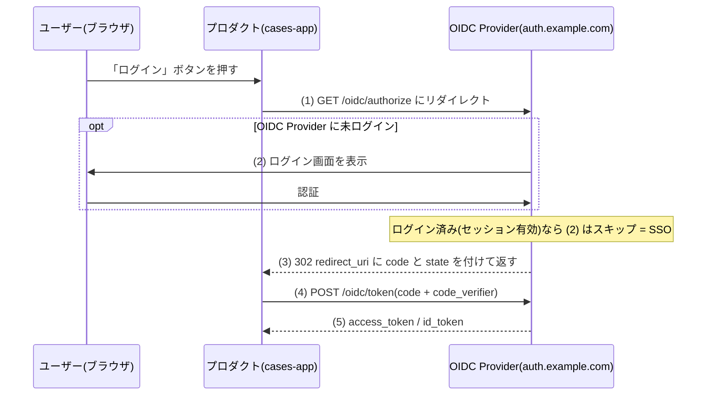
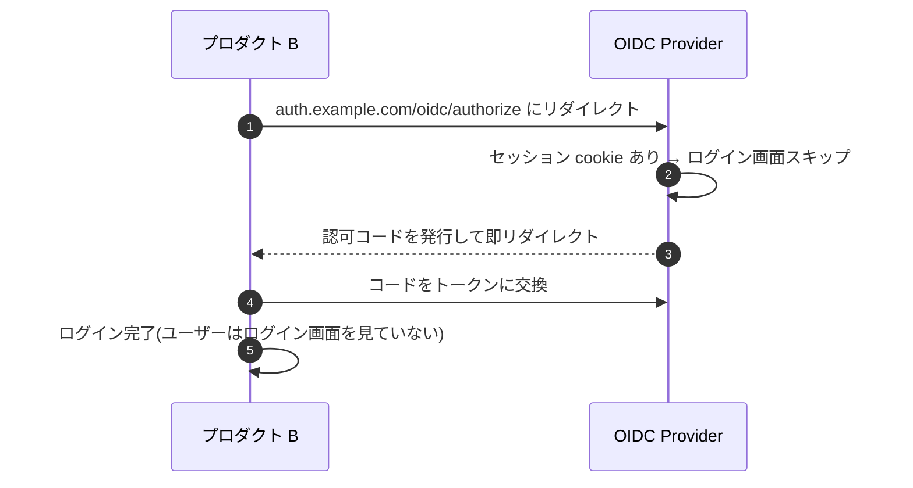
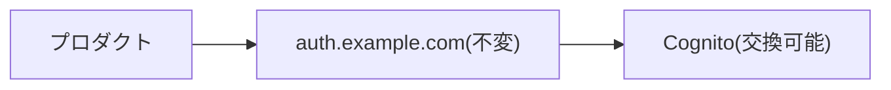

## はじめに

自社で複数のプロダクト（業務システム、CMS、管理ツール等）を運営していると、「1 つのアカウントで全プロダクトにログインしたい」という要件が出てきます。

これを実現するのが **自社 OIDC Provider による SSO（Single Sign-On）**です。Google や GitHub が外部サービスへのログインを提供しているのと同じ仕組みを、自社内に構築します。

この記事では、抽象的な説明ではなく **具体的なHTTPリクエスト、トークンの中身、実装時の判断ポイント** を整理します。

## 全体像

```
プロダクト A (cases.example.com)    ─┐
プロダクト B (docs.example.com)     ─┼─ OIDC ──→ 自社 OIDC Provider
プロダクト C (admin.example.com)    ─┘          (auth.example.com)
                                                      │
                                                      ▼
                                                ユーザーストア
                                                (Cognito / DB)
```

各プロダクトは OIDC Provider を「外部の認証サービス」として扱います。プロダクト側は OIDC のクライアントライブラリを使うだけで、ユーザー管理の詳細を知る必要がありません。

## Authorization Code Flow（具体的な HTTP）

OIDC で最も一般的な Authorization Code Flow を、実際の HTTP リクエストで追います。



### ステップ 1: プロダクトが認可リクエストを送る

ユーザーが「ログイン」ボタンを押すと、プロダクトは OIDC Provider にリダイレクトします。

```http
GET https://auth.example.com/oidc/authorize?
  response_type=code
  &client_id=cases-app
  &redirect_uri=https://cases.example.com/callback
  &scope=openid email profile
  &state=random-csrf-token
  &nonce=random-replay-prevention
  &code_challenge=E9Melhoa2OwvFrEMTJguCHaoeK1t8URWbuGJSstw-cM
  &code_challenge_method=S256
```

| パラメータ | 意味 |
|----------|------|
| `response_type=code` | Authorization Code を返してほしい |
| `client_id` | プロダクトの識別子（事前登録） |
| `redirect_uri` | 認証後の戻り先（事前登録と一致必須） |
| `scope` | 要求する情報の範囲 |
| `state` | CSRF 防止用のランダム値 |
| `nonce` | ID Token のリプレイ攻撃防止 |
| `code_challenge` | PKCE（認可コード横取り防止） |

### ステップ 2: OIDC Provider がログイン画面を表示

ユーザーがまだ OIDC Provider にログインしていなければ、ログイン画面を表示します。

```
┌─────────────────────────────────┐
│  auth.example.com               │
│                                 │
│  メールアドレス: [            ]  │
│  パスワード:     [            ]  │
│                                 │
│  [Google でログイン]             │
│                                 │
│         [ログイン]               │
└─────────────────────────────────┘
```

既にログイン済み（セッションが有効）なら、この画面はスキップされます。これが **SSO** の体験です。

### ステップ 3: 認可コードを返す

認証成功後、OIDC Provider はプロダクトの `redirect_uri` に認可コードを返します。

```http
HTTP/1.1 302 Found
Location: https://cases.example.com/callback?
  code=SplxlOBeZQQYbYS6WxSbIA
  &state=random-csrf-token
```

認可コードは短命（通常 5 分）で、1 回しか使えません。

### ステップ 4: プロダクトが認可コードをトークンに交換

プロダクトのバックエンドが、認可コードを OIDC Provider のトークンエンドポイントに送信します。

```http
POST https://auth.example.com/oidc/token
Content-Type: application/x-www-form-urlencoded

grant_type=authorization_code
&code=SplxlOBeZQQYbYS6WxSbIA
&redirect_uri=https://cases.example.com/callback
&client_id=cases-app
&client_secret=cases-app-secret
&code_verifier=dBjftJeZ4CVP-mB92K27uhbUJU1p1r_wW1gFWFOEjXk
```

### ステップ 5: トークンが返る

```json
{
  "access_token": "eyJhbGciOiJSUzI1NiIs...",
  "id_token": "eyJhbGciOiJSUzI1NiIs...",
  "token_type": "Bearer",
  "expires_in": 3600
}
```

## トークンの中身

### ID Token

**「このユーザーは誰か」** を証明するトークン。OIDC の核心。

```json
{
  "iss": "https://auth.example.com",
  "sub": "550e8400-e29b-41d4-a716-446655440000",
  "aud": "cases-app",
  "exp": 1712800000,
  "iat": 1712796400,
  "auth_time": 1712796400,
  "nonce": "random-replay-prevention",
  "email": "taishi@example.com",
  "email_verified": true,
  "groups": ["admin", "lawyer"],
  "amr": ["pwd"]
}
```

| クレーム | 意味 | 誰が使う |
|---------|------|---------|
| `iss` | 発行者（OIDC Provider の URL） | プロダクトが検証に使う |
| `sub` | ユーザーの一意 ID | プロダクトがユーザーを識別 |
| `aud` | 対象のクライアント ID | 自分宛のトークンか検証 |
| `exp` / `iat` | 有効期限 / 発行時刻 | トークンの鮮度確認 |
| `auth_time` | 実際に認証した時刻 | ステップアップ認証の判断 |
| `nonce` | リプレイ防止 | リクエスト時の値と一致確認 |
| `email` | メールアドレス | 表示・通知 |
| `groups` | ロール / グループ | 粗い認可判定 |
| `amr` | 認証手段 | 認証強度の確認 |

### Access Token

**「このユーザーは何にアクセスできるか」** を表すトークン。UserInfo エンドポイントや API 呼び出しに使います。

```json
{
  "iss": "https://auth.example.com",
  "sub": "550e8400-e29b-41d4-a716-446655440000",
  "aud": "cases-app",
  "exp": 1712800000,
  "iat": 1712796400,
  "scope": ["openid", "email", "profile"],
  "token_use": "access"
}
```

ID Token との違い:

| | ID Token | Access Token |
|---|---|---|
| 目的 | ユーザーの身元証明 | リソースへのアクセス許可 |
| 送信先 | プロダクト（クライアント） | API / UserInfo エンドポイント |
| フォーマット | JWT 必須（OIDC 仕様） | 任意（JWT でなくてもいい） |
| 含む情報 | ユーザー属性 | スコープ |

### Refresh Token（任意）

Access Token の有効期限が切れたときに、新しい Access Token を取得するためのトークン。

```http
POST https://auth.example.com/oidc/token
Content-Type: application/x-www-form-urlencoded

grant_type=refresh_token
&refresh_token=8xLOxBtZp8
&client_id=cases-app
&client_secret=cases-app-secret
```

Refresh Token を発行するかは OIDC Provider の設計判断です。セキュリティとのトレードオフ：

| | Refresh Token あり | なし |
|---|---|---|
| UX | セッションが長持ちする | 1 時間ごとに再ログイン |
| リスク | トークン漏洩時の影響が長期化 | 被害が限定的 |
| 推奨 | モバイルアプリ、長時間作業 | セキュリティ重視の管理ツール |

## クライアント登録

各プロダクトは OIDC Provider に「クライアント」として事前登録が必要です。

### クライアントの種類

| 種類 | 秘密鍵を安全に保持できるか | 例 |
|------|-------------------------|-----|
| **Confidential** | はい（バックエンドがある） | SSR の Web アプリ、API サーバー |
| **Public** | いいえ（コードが露出する） | SPA、モバイルアプリ |

Public クライアントは `client_secret` を持てないので、**PKCE 必須**です。

### 登録情報

```json
{
  "client_id": "cases-app",
  "client_secret": "cases-app-secret",
  "client_type": "confidential",
  "redirect_uris": [
    "https://cases.example.com/callback",
    "http://localhost:3000/callback"
  ],
  "allowed_scopes": ["openid", "email", "profile"],
  "token_endpoint_auth_method": "client_secret_basic"
}
```

### プロダクトごとのスコープ制御

プロダクトによって返す情報を変えられます。

```
cases-app:  scope=openid email profile groups  → フルアクセス
docs-app:   scope=openid email                 → メールだけ
admin-app:  scope=openid email profile groups   → フルアクセス + admin グループ必須
```

## プロダクト側の実装

### トークン検証（バックエンド）

プロダクトのバックエンドは、リクエストごとに JWT を検証します。

```go
// 1. JWKS を取得（キャッシュ推奨）
jwks := fetchJWKS("https://auth.example.com/oidc/jwks.json")

// 2. JWT の署名を検証
token := jwt.Parse(idToken, jwt.WithKeySet(jwks))

// 3. クレームを検証
assert(token.Issuer() == "https://auth.example.com")
assert(token.Audience() == "cases-app")
assert(token.Expiration().After(time.Now()))

// 4. ユーザー情報を取得
sub := token.Subject()
email := token.Get("email")
groups := token.Get("groups")
```

### SSO の体験

ユーザーがプロダクト A でログイン済みなら、プロダクト B にアクセスしたとき：



ユーザーからは「プロダクト B にアクセスしたら勝手にログインされた」ように見えます。これが SSO です。

## セッション管理

### 3 種類のセッション

マルチプロダクト OIDC では、セッションが 3 箇所に存在します。

| セッション | 場所 | 寿命 |
|----------|------|------|
| **OIDC Provider セッション** | auth.example.com の cookie | 長め（8 時間〜24 時間） |
| **プロダクトセッション** | cases.example.com の cookie | プロダクトが決める |
| **トークンの有効期限** | JWT の `exp` | 1 時間程度 |

### ログアウトの複雑さ

SSO のログアウトは「どこまで消すか」が問題になります。

| レベル | 内容 | 影響 |
|-------|------|------|
| プロダクトだけログアウト | プロダクト B の cookie を消す | 他のプロダクトはログインしたまま |
| OIDC Provider もログアウト | auth.example.com のセッションも消す | 次に別プロダクトにアクセスしたら再ログイン |
| 全プロダクトからログアウト | 全プロダクトに通知してセッション無効化 | OIDC Back-Channel Logout が必要（複雑） |

実務的には **「OIDC Provider もログアウト」** が一般的です。RP-Initiated Logout（OIDC の仕様）で実現できます。

```http
GET https://auth.example.com/oidc/logout?
  id_token_hint=eyJhbGciOiJSUzI1NiIs...
  &post_logout_redirect_uri=https://cases.example.com
  &state=random
```

全プロダクト同時ログアウトが必要な場合は Back-Channel Logout を実装しますが、初期段階では不要です。

## Discovery エンドポイント

OIDC Provider は `/.well-known/openid-configuration` で自分の情報を公開します。プロダクト側はこれを読むだけで接続先を把握できます。

```json
// GET https://auth.example.com/.well-known/openid-configuration
{
  "issuer": "https://auth.example.com",
  "authorization_endpoint": "https://auth.example.com/oidc/authorize",
  "token_endpoint": "https://auth.example.com/oidc/token",
  "userinfo_endpoint": "https://auth.example.com/oidc/userinfo",
  "jwks_uri": "https://auth.example.com/oidc/jwks.json",
  "scopes_supported": ["openid", "email", "profile"],
  "response_types_supported": ["code"],
  "grant_types_supported": ["authorization_code", "refresh_token"],
  "subject_types_supported": ["public"],
  "id_token_signing_alg_values_supported": ["RS256"],
  "claims_supported": [
    "sub", "iss", "aud", "exp", "iat", "auth_time",
    "email", "email_verified", "groups", "amr"
  ],
  "code_challenge_methods_supported": ["S256"]
}
```

## 自社 OIDC Provider を立てる利点

### 外部 IdP（Auth0、Firebase Auth 等）との比較

| | 自社 OIDC Provider | 外部 IdP |
|---|---|---|
| **コスト** | インフラ費のみ | MAU 課金（規模で高額に） |
| **カスタマイズ** | 完全自由 | プランによる制限 |
| **データの所在** | 自社 AWS アカウント | 外部サービス |
| **JWT クレームの自由度** | 任意のクレームを追加可能 | 制限あり |
| **運用負荷** | 自分で運用 | ほぼゼロ |
| **ベンダーロックイン** | なし | あり |

小〜中規模なら外部 IdP が楽ですが、「JWT のクレームを自由に設計したい」「ユーザーデータを外部に出したくない」「MAU 課金を避けたい」場合は自社構築が有利です。

### Cognito を直接使わず Proxy IdP にする理由

Cognito の JWT をそのままプロダクトに返すと、`iss` に Cognito の URL が露出します。将来 Cognito から別のユーザーストアに乗り換えたいとき、全プロダクトの JWT 検証ロジックを書き換える必要が出てきます。

Proxy IdP（自社 OIDC Provider）を挟むことで：



プロダクト側は `iss: https://auth.example.com` だけを信頼すればよく、裏のユーザーストアが何であるかを知る必要がありません。

## まとめ

- 自社 OIDC Provider は **Authorization Code Flow + PKCE** で実装する
- ID Token に `sub`, `email`, `groups`, `auth_time`, `amr` を含める
- プロダクトごとに **クライアント登録**（client_id / secret / redirect_uri / scope）
- SSO は **OIDC Provider のセッション cookie** が鍵
- ログアウトは **RP-Initiated Logout** で OIDC Provider セッションまで消す
- セッションは 3 箇所（Provider / プロダクト / トークン）に存在することを意識する
- Discovery エンドポイントでプロダクト側の接続設定を簡素化する
- Proxy IdP にすることで裏のユーザーストアを交換可能にする
