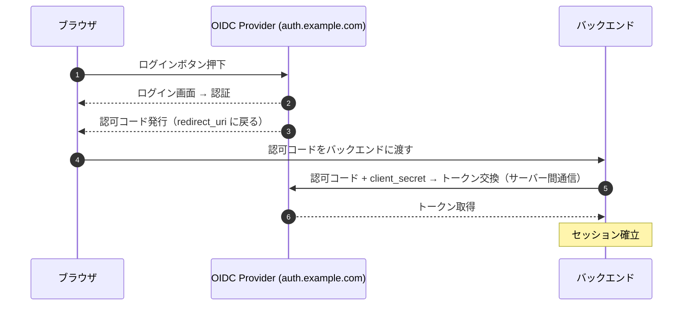
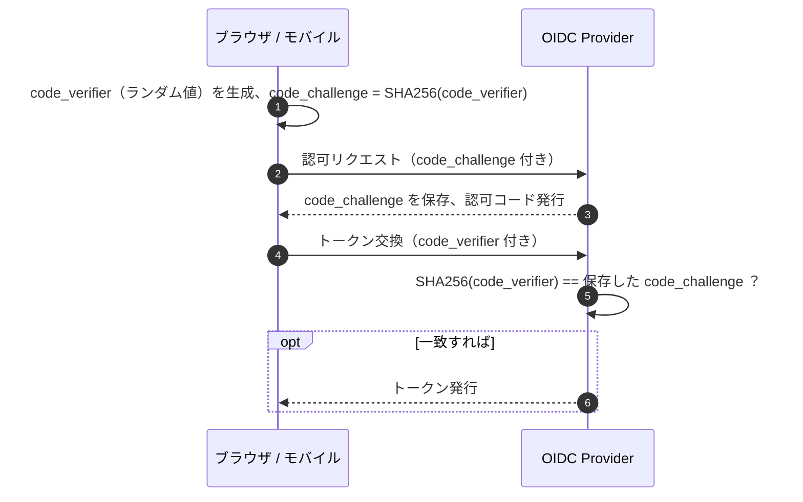
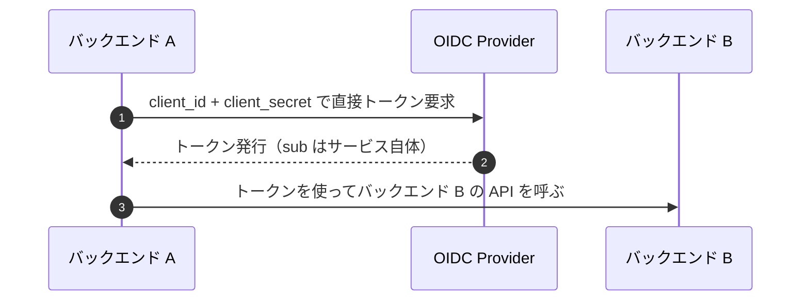
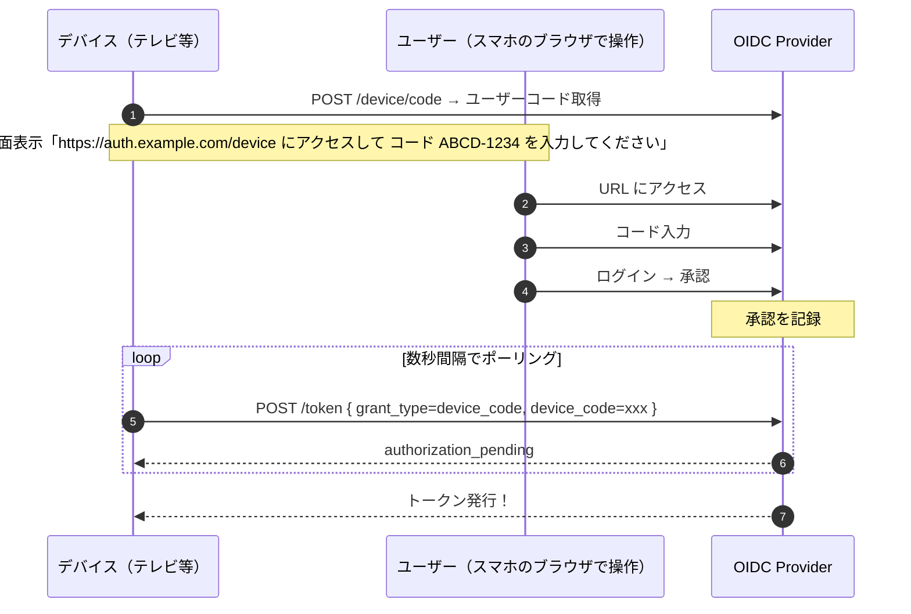
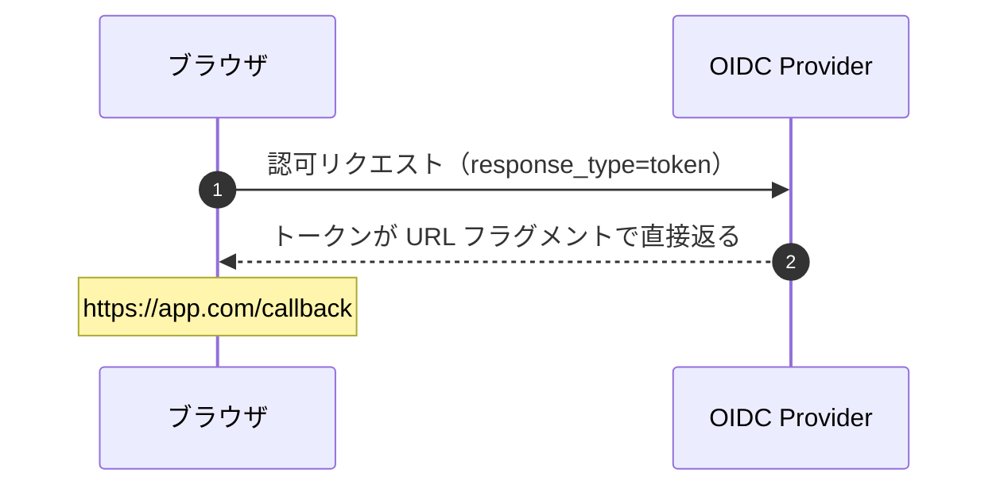
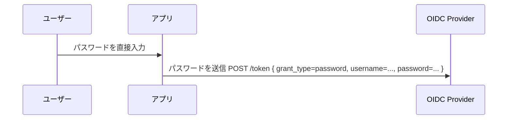
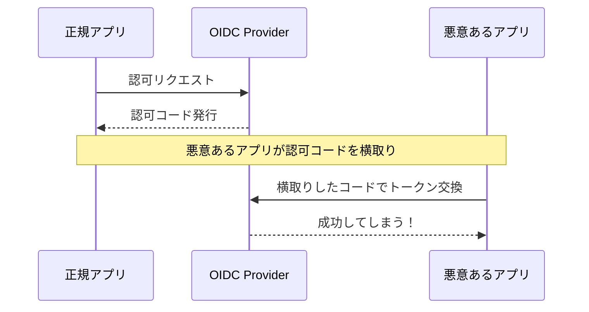
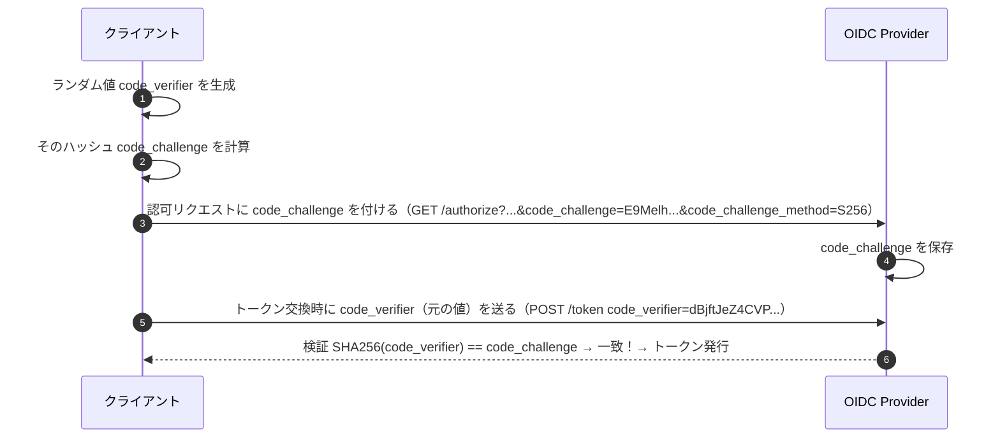
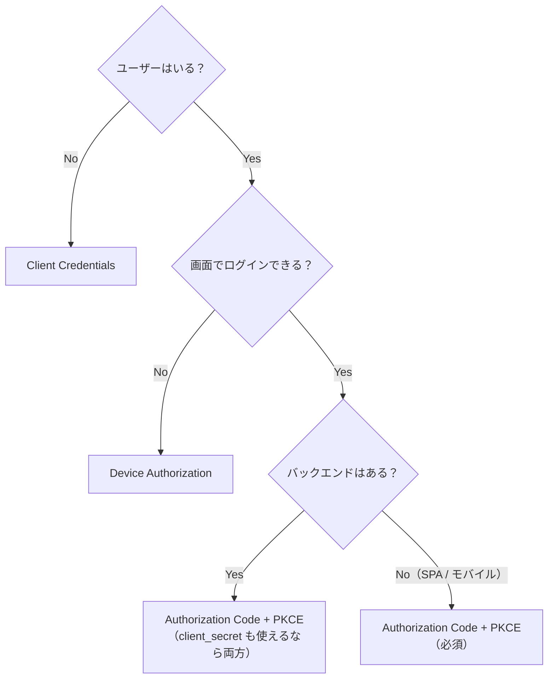

## はじめに

OAuth 2.0 / OIDC には複数の認証フローがあり、「どれを使えばいいのか」が最初の壁になります。この記事では、各フローの動き・用途・セキュリティ特性を整理し、判断フローチャートで選び方を示します。

## フロー一覧

| フロー | 一言で | 使う場面 | ステータス |
|-------|-------|---------|----------|
| **Authorization Code** | 一番安全、基本これ | サーバーサイドのある Web アプリ | 推奨 |
| **Authorization Code + PKCE** | ↑の Public クライアント版 | SPA、モバイル、CLI | 推奨 |
| **Client Credentials** | ユーザー不在、マシン間通信 | バックエンド同士の API 呼び出し | 推奨 |
| **Device Authorization** | 画面入力できないデバイス | テレビ、CLI、IoT | 推奨 |
| **Implicit** | トークン直接返却 | 昔の SPA | **非推奨** |
| **Resource Owner Password** | パスワード直送 | レガシー移行の一時しのぎ | **非推奨** |

## 各フローの動き

### Authorization Code

サーバーサイドのある Web アプリ向け。最も一般的で最も安全。



- 認可コードはブラウザを経由するが、**トークン交換はバックエンドで行う**
- トークンがブラウザに露出しない
- `client_secret` でクライアント認証

### Authorization Code + PKCE

SPA やモバイルアプリなど、`client_secret` を安全に保持できないクライアント向け。



`client_secret` の代わりに PKCE で「認可コードを要求した人 = トークン交換する人」を証明します。

### Client Credentials

ユーザーが介在しない、サービス間通信向け。



```http
POST /oidc/token
Content-Type: application/x-www-form-urlencoded

grant_type=client_credentials
&client_id=batch-service
&client_secret=xxx
&scope=api:internal
```

- ブラウザもリダイレクトも認可コードもない
- 1 リクエストでトークンが返る
- 夜間バッチ、Webhook、マイクロサービス間通信

### Device Authorization

キーボード入力が困難なデバイス向け。



- テレビ（Netflix 等）、CLI ツール、スマートスピーカー
- デバイスとブラウザが別なのが特徴

### Implicit（非推奨）



- トークン交換のステップがない → **トークンが URL に露出**
- ブラウザ履歴、リファラー、ログに漏れるリスク
- **PKCE の登場で存在意義がなくなった**
- OAuth 2.1 で正式に削除予定

### Resource Owner Password（非推奨）



- **アプリがユーザーのパスワードを見れてしまう**
- フィッシングと区別がつかない
- レガシーシステムの移行期に「一時的に」使うケース以外は不可

## PKCE の仕組み

PKCE（Proof Key for Code Exchange、ピクシーと読む）は、認可コードの横取り攻撃を防ぐ仕組みです。

### 何を防ぐか



特にモバイルアプリのカスタムスキーム（`myapp://callback`）は、別アプリが同じスキームを登録して横取りできます。

### PKCE がこれを防ぐ



例の値:

- `code_verifier = "dBjftJeZ4CVP-mB92K27uhbUJU1p1r_wW1gFWFOEjXk"`
- `code_challenge = BASE64URL(SHA256(code_verifier)) → "E9Melhoa2OwvFrEMTJguCHaoeK1t8URWbuGJSstw-cM"`
- 検証: `SHA256("dBjftJeZ4CVP...") == "E9Melhoa2Owv..."`

ハッシュの一方向性により：
- `code_challenge`（ハッシュ）を傍受しても `code_verifier` は逆算できない
- 認可コードを横取りしても、`code_verifier` がなければトークン交換できない

### 誰が使うべきか

| クライアント種別 | PKCE | client_secret | 推奨 |
|---------------|------|--------------|------|
| SPA | 必須 | 持てない | PKCE のみ |
| モバイル | 必須 | 持てない | PKCE のみ |
| CLI | 必須 | 持てない | PKCE のみ |
| SSR Web アプリ | 推奨 | 使える | **両方**（ベスト） |

OAuth 2.1 では **Confidential Client でも PKCE が必須**になる予定です。今から両対応にしておくのが無難。

## 判断フローチャート



**迷ったら Authorization Code + PKCE** が正解です。

## セキュリティ比較

| フロー | トークン露出リスク | client_secret 要否 | PKCE | 推奨度 |
|-------|------------------|-------------------|------|-------|
| Authorization Code | 低（バックチャネル） | 必須 | 推奨 | ◎ |
| Authorization Code + PKCE | 低 | 不要 | 必須 | ◎ |
| Client Credentials | 低（サーバー間） | 必須 | 不要 | ◎ |
| Device Authorization | 低 | 任意 | 不要 | ○ |
| Implicit | **高（URL に露出）** | 不要 | 不要 | ✗ |
| Resource Owner Password | **高（パスワード露出）** | 任意 | 不要 | ✗ |

## まとめ

- **Web アプリ** → Authorization Code（+ PKCE 推奨）
- **SPA / モバイル** → Authorization Code + PKCE（必須）
- **サービス間通信** → Client Credentials
- **テレビ / CLI** → Device Authorization
- **Implicit / Resource Owner Password** → 使わない
- **PKCE** はハッシュの一方向性で認可コード横取りを防ぐ。OAuth 2.1 で全クライアント必須化予定
