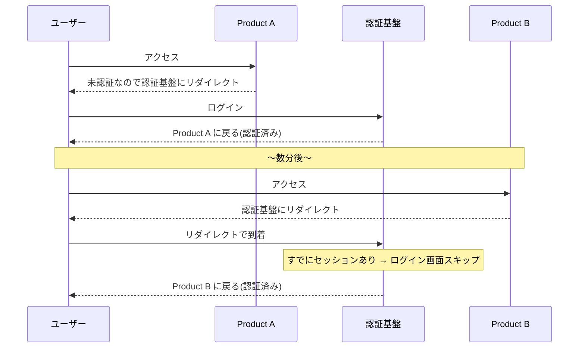

## はじめに

自社でプロダクトを複数展開していくとき、避けて通れないのが**認証基盤の設計**です。

プロダクトが1つのうちは「ログイン機能をつける」だけで済みますが、2つ目、3つ目と増えていくと「ユーザーはプロダクトごとにアカウントを作るのか？」「ログインは毎回必要なのか？」という問題が出てきます。

この記事では、マルチプロダクト戦略において **OIDC（OpenID Connect）** を認証基盤の軸に据えるべき理由を、他の選択肢との比較も交えて解説します。

## OIDCとは

OpenID Connect（OIDC）は、OAuth 2.0 の上に構築された**認証プロトコルの標準仕様**です。

Google、Microsoft、Appleなど、主要なIDプロバイダーはすべてOIDCに準拠しています。「Googleでログイン」ボタンの裏側で動いているのがOIDCです。

OIDCの主な役割は以下の3つです。

- **認証（Authentication）**: ユーザーが誰であるかを証明する
- **IDトークンの発行**: ユーザー情報をJWT形式で安全に渡す
- **標準化されたエンドポイント**: `/.well-known/openid-configuration` で設定情報を自動公開

## マルチプロダクトでOIDCを採用するメリット

### SSO（シングルサインオン）が自然に実現できる

OIDCの最大のメリットは、**1回のログインで全プロダクトを利用できる**ことです。



ユーザーから見ると「Product Bには一度もログインしていないのに使える」という体験になります。Google で Gmail にログインした後、Drive や Calendar をそのまま使えるのと同じです。

### 新プロダクトの追加コストが低い

OIDC を採用していれば、新しいプロダクトの追加は**OIDCクライアントを1つ登録するだけ**です。認証ロジックをゼロから実装する必要がありません。

各プロダクトは OIDC の Relying Party（RP）として認証基盤に接続するだけなので、認証まわりの実装はほぼテンプレート化できます。

### IdPの差し替えが容易

各プロダクトは OIDC の標準インターフェースしか知りません。つまり、裏側の Identity Provider（IdP）を Cognito から別のサービスに差し替えても、**プロダクト側の変更は最小限**で済みます。

これは長期的なベンダーロックイン回避として非常に重要です。

## アーキテクチャ

マルチプロダクトにおけるOIDC認証基盤の全体像は以下のようになります。

```
┌─────────────────────────────────────────────┐
│           認証基盤 (Identity Platform)        │
│  ┌───────────┐  ┌──────────┐  ┌───────────┐ │
│  │  Cognito   │  │ Go/Gin   │  │ Terraform │ │
│  │ (OIDC IdP) │  │ (Auth API)│  │  (IaC)    │ │
│  └─────┬─────┘  └────┬─────┘  └───────────┘ │
│        │              │                       │
│   OIDC Endpoints   ユーザー管理/権限          │
└────────┼──────────────┼───────────────────────┘
         │              │
    ┌────┴────┐    ┌────┴────┐    ┌──────────┐
    │Product A│    │Product B│    │Product C  │
    │(OIDC RP)│    │(OIDC RP)│    │(将来追加) │
    └─────────┘    └─────────┘    └──────────┘
```

ポイントは、認証基盤が OIDC IdP として振る舞い、各プロダクトは RP として接続するという**明確な役割分離**です。

## ユーザー体験の詳細

### ログイン画面は全プロダクト共通

OIDC を採用すると、ログイン画面はプロダクトごとではなく**認証基盤が1つ提供**します。

どのプロダクトからログインしても同じ画面に飛びます。ロゴやURLは自社の認証基盤のものになり、「Product Aのアカウント」ではなく「自社のアカウント」としてユーザーに認識されます。

### 同意画面は自社プロダクト間なら省略できる

OIDCには同意画面（Consent Screen）の仕組みがありますが、これは**必須ではありません**。

| ケース | 同意画面 | 理由 |
|---|---|---|
| 自社プロダクト同士 | 省略してOK | 同一組織が運営。データ管理主体が同じ |
| サードパーティ連携 | 必須 | 外部にユーザーデータを渡す。GDPR等の法規制上も必要 |

Googleで例えると、Gmail → Google Drive では同意画面は出ませんが、Gmail → Slack連携では「SlackがGoogleアカウントにアクセスします」と表示されます。

AWS Cognito の場合、App Client 単位で「信頼済み（同意スキップ）」を設定できます。ただし、プライバシーポリシーで自社プロダクト間のデータ共有を明記しておくことは忘れずに。

### ログアウトの設計

ログアウトには2つの方式があり、設計判断が必要です。

| 方式 | 体験 | 適するケース |
|---|---|---|
| Single Logout | 1つのプロダクトでログアウト → 全プロダクトからログアウト | セキュリティ重視（金融・医療） |
| Individual Logout | そのプロダクトだけログアウト | 利便性重視（一般的なSaaS） |

## OIDC以外の選択肢と比較

OIDCを採用しない場合の選択肢も検討しておきましょう。

### 共有トークン方式（独自SSO）

認証基盤で発行したJWTを各プロダクトが直接検証する方式です。OIDCの「プロトコル」には乗らず、トークンだけを共有します。

実装はシンプルですが、トークン検証ロジックを各プロダクトで自前で揃える必要があり、サードパーティ連携が必要になったとき作り直しになります。

### 各プロダクト独立認証

プロダクトごとに完全に独立した認証を持つ方式です。SSOなし、ユーザーはプロダクトごとにアカウントを作成します。

プロダクト間の関連性が薄い場合は成立しますが、後からSSO統合するのは非常に困難です。

### リバースプロキシ方式

共通のプロキシ層で認証を吸収し、各プロダクトは認証を意識しない方式です。

全プロダクトが同一ドメイン配下ならシンプルですが、ドメインが分かれるとCookie共有ができず破綻します。

### 比較表

| | OIDC | 共有トークン | 独立認証 | リバプロ |
|---|---|---|---|---|
| SSO体験 | ○ | △（自前実装） | × | ○ |
| 新プロダクト追加 | 低コスト | 中 | 高コスト | 低コスト |
| サードパーティ連携 | そのまま可 | 作り直し | 作り直し | 不可 |
| 標準準拠 | ○ | × | × | × |
| IdP差し替え | 容易 | 困難 | 困難 | 中 |

現実的な対抗馬は**共有トークン方式**ですが、OIDCとの実装差は実はそこまで大きくありません。Cognito が既に OIDC エンドポイントを持っているため、OIDCに「しない」ために余計な自前実装をするという逆転現象が起きます。

## AWS Cognitoでの実現

AWS Cognito は標準で OIDC Provider として機能します。

### そのまま活かせる強み

- `/.well-known/openid-configuration` の自動提供
- Google / GitHub 等のソーシャルログイン対応
- User Pool 1つで複数 App Client（= プロダクト）を登録可能
- JWTベースのためマイクロサービスとも相性が良い

### 注意が必要なポイント

| 課題 | 対策 |
|---|---|
| プロダクトごとの権限分離 | ID Tokenの `custom:claims` や API層で RBAC/ABAC を実装 |
| テナント管理 | B2B SaaS ならマルチテナント設計が必要。Cognito単体では弱いのでAPI層で補完 |
| トークン設計 | Access Token（API認可用）とID Token（ユーザー情報用）の役割を明確に分ける |
| Cognitoの上限 | API呼び出しレートリミットあり。大規模時は要検討 |

### 将来的な移行先

Cognito で限界が来た場合の移行先候補も、OIDC準拠であればスムーズに移行できます。

- **Ory Hydra / Kratos** — OSS、OIDC準拠、Go製
- **Keycloak** — 実績豊富、Java製だがDocker運用可
- **Auth0** — SaaS、導入は楽だが高コスト

## 段階的な導入ステップ

### Phase 1: 最初のプロダクト

- Cognito User Pool を「共通IdP」として設計する意識で構築
- App Client を1つ作成し、OIDC標準フローで認証
- Go/Gin API で ユーザー管理エンドポイントを実装

### Phase 2: 2プロダクト目の追加

- Cognito に 2つ目の App Client を追加
- 共通ログイン画面でSSO実現
- プロダクト横断の権限モデルを設計

### Phase 3: スケール

- 必要に応じて IdP の移行を検討
- Organization / Workspace 概念の導入

## まとめ

マルチプロダクト戦略において、OIDC は事実上の必須選択です。

- **SSO** が自然に実現でき、ユーザー体験が良い
- 新プロダクト追加が **OIDCクライアント登録だけ** で済む
- 標準準拠により **IdPの差し替えが容易** でベンダーロックインを回避できる
- AWS Cognito なら **既にOIDC Providerとして機能する** ため、追加コストが小さい

最初のプロダクトを作る段階から OIDC 前提で設計しておくことで、2プロダクト目以降の追加コストを大幅に下げることができます。
