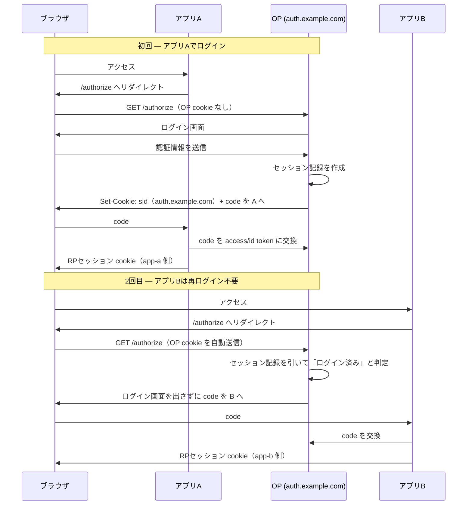

## そもそもの問い

自前の OIDC Provider を運用していて、ある時点で気づく問いがある。

> いろんなアプリから使われるとき、セッションってどこでどう共有されるんだ？

ステートレスに振り切った実装をしていると、この問いに答えられない。認可コードもリフレッシュトークンも暗号化した自己完結ペイロードにして、サーバ側にストレージを持たない設計は、Lambda のようなサーバレス環境では魅力的だ。しかしその設計のまま「SSO をやりたい」「ログアウトを効かせたい」と言い出すと、途端に詰まる。

理由はシンプルで、**セッションだけは失効が必須**だからだ。そして失効には状態がいる。

この記事では「OIDC のセッション」を3層に分解し、それぞれがどこに住み、どれがアプリ間で共有されるのかを整理する。結論を先に言うと、**共有されるのは OP 側のブラウザセッション1つだけで、アプリ同士はセッションを共有しない**。

## セッションを1個だと思うと混乱する

OIDC の文脈で「セッション」と一言で言うと混乱する。実際には性質の違う3層が存在する。

| 層 | どこに住む | アプリ間で共有? | ストレージ | 失効の必要性 |
|---|---|---|---|---|
| **RP セッション** | 各アプリのドメインの cookie | ❌ アプリごと独立 | 各アプリが持つ | 各アプリの責務 |
| **OP セッション（SSO セッション）** | OP（認証サーバ）のドメインの cookie | ✅ 暗黙的に共有 | **サーバ側ストア** | 必須 |
| **トークン** | RP ごとに発行（id / access / refresh） | ❌ audience ごと | JWT はステートレスで可 | refresh のみ要検討 |

混乱の正体は、この3つを「セッション」という1語で塗りつぶしてしまうことにある。分けて考えれば、それぞれの置き場所は自然に決まる。

### RP セッション

各アプリ（例: `app-a.example.com`, `app-b.example.com`）が、エンドユーザーとの間に持つログイン状態。OIDC のフローで OP からトークンを受け取った後、アプリは自分のドメインに `httpOnly` cookie を立てて、以降はそれでユーザーを識別する。

これは**各アプリのローカルな関心事**であり、他のアプリとは一切共有しない。アプリ A のセッションが切れてもアプリ B には関係ない。

### OP セッション（SSO セッション）

OP（`auth.example.com`）とユーザーのブラウザの間のセッション。**これが SSO の本体**であり、今回の主役。

ユーザーがアプリ A 経由で一度ログインすると、OP は自分のドメインに cookie を立てる。次にアプリ B が `/authorize` にリダイレクトしてきたとき、ブラウザはその cookie を自動で運ぶので、OP は「もうログイン済み」と判定してログイン画面を出さずに認可コードを返せる。

### トークン

OP が各 RP に対して発行する id / access / refresh token。audience（宛先の RP）ごとに別物で、共有されない。JWT で自己署名すればステートレスでよい（リフレッシュトークンだけは失効を考えるなら別途検討）。

## 「共有」の実体は cookie とサーバ側記録の2点だけ

「いろんなアプリから使われるとき、セッションはどこで共有されるのか」への答え:

> **共有されるのは OP 側のブラウザセッション（OP ドメインに立つ cookie）だけ。アプリ同士はセッションを共有しない。全アプリが同じ OP を経由するから、結果として SSO になる。**

ここで重要なアンチパターンを明示しておく。

- ❌ アプリ間で cookie ドメインを共有する（`.example.com` で共通 cookie 等）
- ❌ アプリ間でセッション DB を共有する

どちらもやらない。各アプリは完全に独立させ、**セッションの権威は OP 1箇所に集約する**。アプリは OP を信頼し、OP の判断（トークン）だけを受け取る。アプリ同士は互いを知らなくていい。これが疎結合な SSO の肝だ。

## SSO が成立する仕組み

具体的なフローで見る。



「共有」の実体は、図の中の2点だけだ。

1. **ブラウザが OP ドメインの cookie を運ぶ**（HTTP の仕組みそのもの）
2. **OP がサーバ側にセッション記録を持つ**（ここが状態）

アプリ A とアプリ B はお互いを一切知らない。それでも同じ OP を経由するから SSO になる。

## セッションの置き場所

### cookie には不透明な ID だけを入れる

OP のドメインに立てる cookie の中身は、**不透明な `session_id` 1個だけ**にする。ユーザー情報を cookie に詰めない。属性はサーバ側に置き、cookie はそれを引くための鍵に徹する。

```
Set-Cookie: sid=<opaque-random>;
            Domain=auth.example.com;
            HttpOnly; Secure; SameSite=Lax; Path=/
```

`SameSite` の選択は重要:

- **`Lax`**: RP からのトップレベルリダイレクト（`302` でのページ遷移）では cookie が送られる。通常の SSO はこれで足りる。
- **`None; Secure`**: iframe 経由のサイレント認証（`prompt=none` を hidden iframe で回す）までやるなら必要。ただし 3rd party cookie 規制の影響を受ける。

### サーバ側セッションストア

セッション記録はサーバ側に持つ。サーバレスなら DynamoDB のような KV が素直で、TTL による自動失効も使える。

```
PK: session_id (opaque random)
  sub          ユーザID
  auth_time    実際に認証した時刻（max_age 判定に使う）
  amr / acr    認証手段（password / mfa など）
  idp          上流 IdP（Google 等で入った場合）
  clients      このセッションを使った RP の一覧（+ 各 sid）
  created_at
  expires_at   TTL で自動失効
```

地味に効いてくるのが `clients` フィールドだ。**「ログアウトを誰に伝播するか」の宛先リスト**になる。後述のシングルログアウトで必要になる。

## なぜステートレスでは足りないのか

認可コードやアクセストークンと違って、セッションは**失効が必須**だ。暗号化した自己完結 cookie では「まだ有効か」をサーバが取り消せない。ステートレスを諦めてサーバ側ストアを持つ理由は、ほぼ全部「失効」に集約される。

| やりたいこと | サーバ側セッションが必要な理由 |
|---|---|
| **ログアウト** | `end_session_endpoint` で OP セッションを消す = レコードを消す/無効化する |
| **シングルログアウト** | OP セッションを消しても各 RP のローカルセッションは生きている。誰に伝播するか（`clients`）を知る必要がある |
| **`prompt=none`（サイレント認証）** | アプリが UI 無しで「まだログイン中?」を確認。OP がセッションを見て答える |
| **max_age / 強制再認証** | `auth_time` と現在時刻を比較して再認証を要求 |
| **admin による suspend** | ユーザー停止時に該当セッションを全 kill |
| **全デバイスからログアウト** | sub に紐づくセッションを列挙して消す |
| **同時セッション数制限・一覧表示** | セッションを列挙できる必要がある |

これらは全て、サーバ側にセッションの状態がないと実装できない。**トークンはステートレスでよいが、セッションはステートフルにすべき**、というのが責務分界の結論になる。

## ログアウトの伝播 — ここが一番難しい

OP セッションを消すこと自体は簡単だ。難しいのは「OP セッションを消しても、各 RP のローカルセッション（RP セッション）は生きている」という点。これを消すには RP に伝える必要がある。

### RP-initiated logout

RP がユーザーを OP の `end_session_endpoint` に送る。`id_token_hint` でどのセッションかを示し、`post_logout_redirect_uri` で戻り先を指定する。OP は自分のセッションを消す。

```
GET /oidc/logout
  ?id_token_hint=<id_token>
  &post_logout_redirect_uri=https://app-a.example.com/
```

### back-channel logout（推奨）

OP が、セッションに紐づく各 RP の `backchannel_logout_uri` に対して、**logout token（JWT）をサーバ間で POST** する。RP はそれを受けて自分のローカルセッションを消す。

- `sid`（セッションID）claim でどのセッションを消すか特定する
- だから id_token に `sid` を入れ、セッションレコードに `clients`（とその sid）を持っておく必要がある
- ブラウザに依存しないので堅牢

### front-channel logout

OP がログアウトページに hidden iframe を並べ、各 RP のログアウト URL を読み込ませてローカル cookie を消させる方式。実装は楽だが、3rd party cookie 規制で年々壊れやすくなっている。新規ならまず back-channel を選ぶ。

ここで効いてくるのが、さっきの `clients` フィールドだ。**「このセッションを使った RP はどこか」を記録していないと、誰に logout token を送ればいいか分からない**。SSO のセッション設計とログアウト設計は不可分だ。

## ライブラリとの責務分界 — fosite / zitadel-oidc / Hydra

自前で OIDC を実装していると、ある時点で「プロトコルの正しさをライブラリに任せたい」となる。ここで重要な注意点がある。

> **この OP セッション（SSO・login session）は、fosite を使っても自分で実装する部分**。fosite はトークン・コード・grant のプロトコルは担うが、**ブラウザの SSO セッションは持ってくれない**。zitadel/oidc も同様で、auth request の永続化は手伝ってくれるが、セッション cookie の管理は自分の責務だ。

逆に **Ory Hydra は、この login / consent / session 管理をやってくれるプロダクト**だ。つまり「自前 OIDC を運用していて一番面倒だと気づく部分」は、Hydra の存在意義そのものだったりする。

責務で整理するとこうなる。

| 関心事 | 自前 | fosite | zitadel-oidc | Hydra |
|---|---|---|---|---|
| 認可コード / トークン / grant のプロトコル | 自作 | ✅ ライブラリ | ✅ ライブラリ | ✅ サーバ |
| トークン署名・JWKS | 自作 | strategy 差込 | strategy 差込 | ✅ |
| **OP セッション（SSO cookie）** | **自作** | **自作** | **自作** | ✅ サーバ |
| login / consent UI | 自作 | 自作 | 自作 | 自作（別アプリ） |
| ユーザーストア | 自前（例: Cognito） | 自前 | 自前 | 自前（別サービス） |

判断軸はこうなる。

- **セッション管理まで自分で握りたい**（ユーザーストア連携も自前で続けたい） → fosite か zitadel-oidc + サーバ側セッションストアを自作する。SSO セッションの設計は自分で書く。
- **セッション・consent・logout の面倒を引き受けてほしい** → Hydra。ただし別サーバ + DB + login/consent provider アプリの分離コストを払う。

「fosite の方がやりたいことに近い」と感じるなら、それは**プロトコルだけ借りて、セッションは自分で設計したい**という意思表示に等しい。そしてそのセッション設計こそが、この記事で整理した OP セッション + サーバ側ストア + ログアウト伝播だ。コード量はそれほど多くないので、十分現実的な選択になる。

## まとめ

- OIDC の「セッション」は **RP セッション / OP セッション / トークン** の3層に分かれる。1語で塗りつぶすと混乱する。
- アプリ間で共有されるのは **OP 側のブラウザセッション1つだけ**。アプリ同士はセッションを共有しない。全アプリが同じ OP を経由するから SSO になる。
- 共有の実体は **ブラウザが OP cookie を運ぶ + OP がサーバ側にセッション記録を持つ**、この2点。
- cookie には **不透明な session_id だけ**を入れ、属性はサーバ側ストア（サーバレスなら DynamoDB + TTL）に置く。
- **トークンはステートレスでよいが、セッションはステートフルにすべき**。理由は失効（ログアウト・SLO・prompt=none・強制再認証・suspend）が全てサーバ側状態を要求するから。
- セッションに `clients` を記録することが、**ログアウト伝播（back-channel logout）の前提**になる。
- fosite / zitadel-oidc を使っても **OP セッションは自作**。それを丸ごと引き受けるのが Hydra。「fosite が近い」と感じるなら、セッション設計を自分で持つ覚悟とセットになる。
