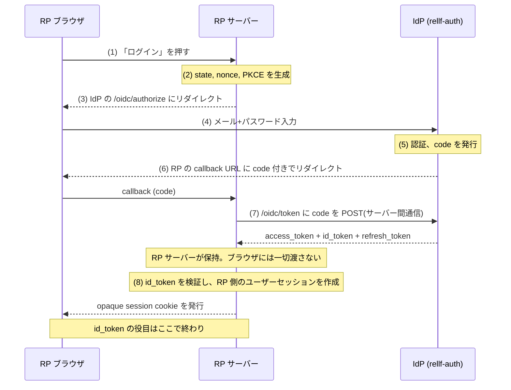
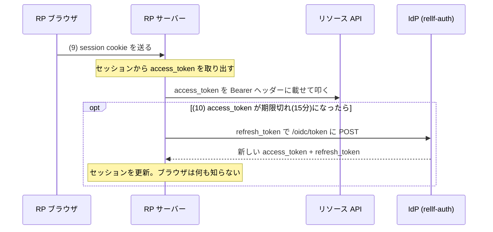
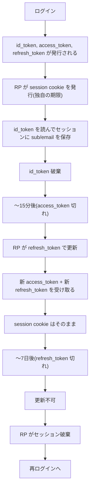
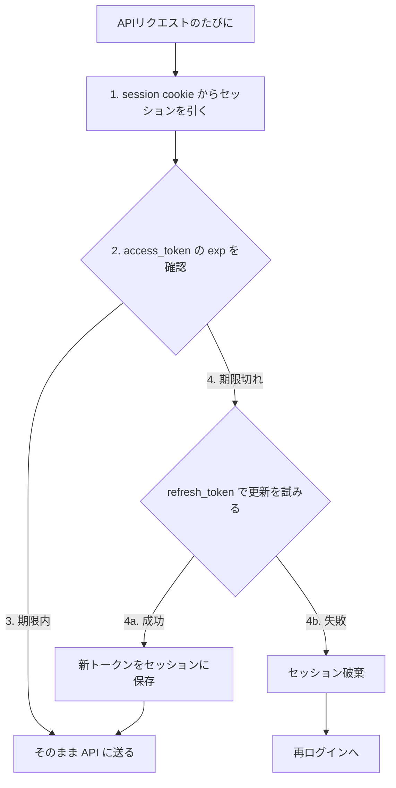

## そもそもの問い

自前の OIDC プロバイダーを運用していて、RP 側のトークン管理を設計する際に「localStorage vs cookie」の議論になった。しかしよく考えると、**その議論自体が前提を間違えている**。Confidential client なら生トークンはブラウザに出さず、サーバーサイドに保管して opaque な session cookie だけブラウザに渡すのが正道。

そこからトークンの役割・期限・更新の責務を改めて整理した。

## 4つのトークンの役割

| | session cookie | id\_token | access\_token | refresh\_token |
|---|---|---|---|---|
| **目的** | ブラウザ↔RPサーバーの紐付け | ユーザー属性の受け渡し | API アクセスの認可 | access\_token の更新 |
| **有効期限** | RP が決める（数時間〜数週間） | 短命（15分程度） | 短命（15分程度） | 長命（7日程度） |
| **保管場所** | ブラウザ (httpOnly cookie) | RP サーバーのメモリ（一時的） | RP サーバーのセッション | RP サーバーのセッション |
| **更新方法** | RP が自前で延長 | 更新しない | refresh\_token で IdP に POST | rotate: 使うたびに新しいものに差し替え |
| **無効化** | RP がセッション削除 | 使い捨て | 期限切れを待つ | 鍵ローテーション or blocklist |

## Authorization Code Flow の全体像

ログインまで（1〜8）:

(8) の id_token 検証の内訳:

- 署名検証 (JWKS)
- issuer, audience, nonce チェック
- sub, email, groups を読み取る

ログイン後のアクセスと更新（9〜10）:

**ブラウザにトークンが一切出ない**。ブラウザが触るのは opaque session cookie だけ。

## ID token と access token は別物

混同しやすいが、目的が違う。

| | ID token | Access token |
|---|---|---|
| 目的 | **この人は誰か**（認証） | **この API 操作を許可するか**（認可） |
| 送り先 | RP が受け取って中身を読む | リソースサーバーに送る |
| 中身 | sub, email, groups 等のユーザー属性 | scope, 権限、有効期限 |
| 使い方 | RP がセッションを作る材料（1回読んで終わり） | API の Bearer ヘッダーに載せる |

ID token を API の Bearer ヘッダーに入れるのは誤用。ID token は「RP がユーザー情報を受け取るための封筒」であって、API アクセスの認可には access token を使う。

## なぜ access token は短命で refresh token は長命か

**access token を短命にする理由**

access token は Bearer として色々な場所に送られる — RP のバックエンド API、リソースサーバー、場合によっては third-party API。送信先が多い分、漏洩の機会が多い（ログ、中間プロキシ、クライアント側の XSS 等）。JWT は stateless なので漏洩しても個別に revoke できない。短命にすることで被害の時間窓を狭める。

**refresh token を長命にする理由**

ユーザーに毎回ログインさせないため。refresh token の送信先は IdP の `/oidc/token` エンドポイント1箇所だけ。OIDC の仕様上、他のどこにも送らない。送信先が限られる分、漏洩面が access token より狭い。

**rotation する理由**

refresh token が盗まれた場合の検出。使うたびに新しいトークンに差し替えるので、正規ユーザーと攻撃者が同じ refresh token を使うと片方が無効になる。stateful なストア（DynamoDB 等）を持てば「使用済みトークンの再利用 = 盗難」と判定して token family ごと revoke することもできる。

## ライフサイクルの流れ

ユーザーが再ログインを求められる頻度は **refresh\_token の期限（7日）で決まり**、access\_token の期限（15分）はセキュリティ上の被害窓だけに影響する。

## 更新の責務 — IdP は何もしない

IdP（rellf-auth）は「エンドポイントを提供するだけ」で、更新のタイミング判断や実行は RP の責務。

| やること | 誰がやる |
|---|---|
| code → token 交換 | RP サーバー |
| id\_token の検証・ユーザー情報取得 | RP サーバー |
| session cookie の発行・管理 | RP サーバー |
| access\_token の期限切れ検出 | RP サーバー（`exp` を見るか、API の 401 で検出） |
| access\_token の更新実行 | RP サーバー（refresh\_token で POST） |
| refresh\_token の保存・差し替え | RP サーバー |
| refresh\_token 切れ → 再ログイン誘導 | RP サーバー |
| トークンの発行・署名 | IdP |
| JWKS の提供 | IdP |

RP 側の実装パターン:

## マルチプロダクトでの選択肢

RP ごとにこのフローを実装する必要があるが、全部手書きではない。

| 選択肢 | 内容 | いつ採用 |
|---|---|---|
| OIDC ライブラリを使う | `next-auth`, `go-oidc`, `omniauth` 等 | プロダクト少数のうち |
| 共通 SDK を作って配る | rellf-auth 用の認証ミドルウェアを1つ作る | 自社プロダクトが増えてきたら |
| API Gateway で集約 | 認証処理を Gateway に寄せ、RP は後ろにいるだけ | マイクロサービス化が進んだら |

IdP 側が OIDC 標準に準拠していれば、どの選択肢でも対応できる。

## grant type の整理

| grant type | 対応状況 | 用途 |
|---|---|---|
| `authorization_code` | ✅ 実装済み | ユーザーありのログインフロー |
| `refresh_token` | ✅ 実装済み | access\_token の更新 |
| `client_credentials` | 🔜 次に実装 | サービス間通信（ユーザー不在） |
| `device_code` | 将来検討 | CLI, TV 等ブラウザなしデバイス |
| `implicit` | ❌ 非対応 | 非推奨（OAuth 2.1 で廃止） |
| `password` (ROPC) | ❌ 廃止方向 | code flow に統一 |
