## TL;DR

1. **デプロイは一瞬で終わらない。** 新旧のバイナリが同時に動く時間が必ずあり、その間 DB は 1 つ。
   だから**スキーマ変更をアプリと同時に出すことはできない**
2. 答えは **1 回の変更を 3 回に割る**こと(expand / contract)。そして**切り替えだけをフラグに逃がす**。
   これで「デプロイする」と「ユーザーに出す」が分かれ、**戻すのにデプロイが要らなくなる**
3. モノレポで速く出すには、**何を検査・デプロイするかを手書きの表ではなく依存グラフから計算**し、
   **順序の保証をスクリプトではなくジョブグラフに置く**
4. 境界はマルチモジュールで守るが、**`go.work` は境界を守らない**(実測)。
   検査とリリースビルドは `GOWORK=off` に倒す。これが将来の**リポジトリ分離**の下準備にもなる

`caption` → `title` の改名を負荷をかけたまま完走させた記録(**1399 リクエスト・エラー 0 件・
新旧一致率 100%**)と、その過程で掘り当てたバグを書く。

---

# 1. なぜこんなものが要るのか

## デプロイは「瞬間」ではない

まずここが出発点になる。

アプリを更新するとき、**全部のプロセスが同時に切り替わることはない**。ローリング更新なら
1 台ずつ、ブルーグリーンでも切り替えの前後がある。つまり **新旧のバイナリが同時に動いている
時間**が必ずできる。

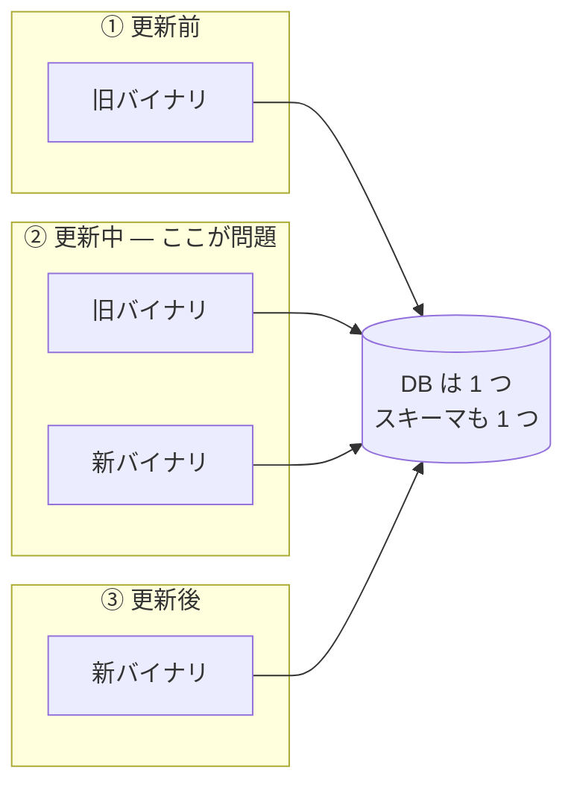

アプリは複数のプロセスに分かれて入れ替わるのに、**DB は分かれない**。
「新バイナリ用のスキーマ」と「旧バイナリ用のスキーマ」を同時に持つことはできない。

### 素直にやるとこう壊れる

`caption` というカラムを `title` に改名したい、とする。素直にやると
「`ALTER TABLE photos RENAME COLUMN caption TO title` を打って、同時に新コードを出す」。

これが②の瞬間にどうなるか:

| | 旧バイナリ(まだ残っている) | 新バイナリ |
|---|---|---|
| ALTER の前 | `caption` を読む → OK | `title` を読む → **カラムが無い** |
| ALTER の後 | `caption` を読む → **カラムが無い** | `title` を読む → OK |

**どちらに倒しても、必ず片方が 500 を返す。** しかも厄介なのは戻し方で、アプリだけ
ロールバックしてもスキーマは戻っていないので、旧バイナリが `caption` を探して壊れ続ける。

だから「メンテナンス時間を取って止める」になる。そこを止めずにやりたい、というのが
この話の動機になる。

## サービスが分かれると、問題が掛け算になる

サービスを分けると**デプロイ単位が増える**。つまり上の「②の瞬間」が、サービスの数だけ、
しかも**互いに独立したタイミングで**発生する。

さらにモノレポ(1 つのリポジトリに複数サービス)で運用していると、別の問題が乗る。
**リポジトリは 1 つなのにデプロイ単位は複数**という状態で素直に CI を書くと、こうなる。

- サービス A を 1 行直しただけで、**関係ない B と C のテストまで回る**(遅い)
- A を出したいのに、**B のデプロイが終わるまで待たされる**(詰まる)

サービスを分けた目的は「独立して出せること」なのに、**CI/CD の都合でその目的が消える**。
これが二本目の柱の動機になる。

## 開発生産性の歴史として見ると、同じ話をしている

この 2 つは、業界が 20 年やってきたことの延長線上にある。

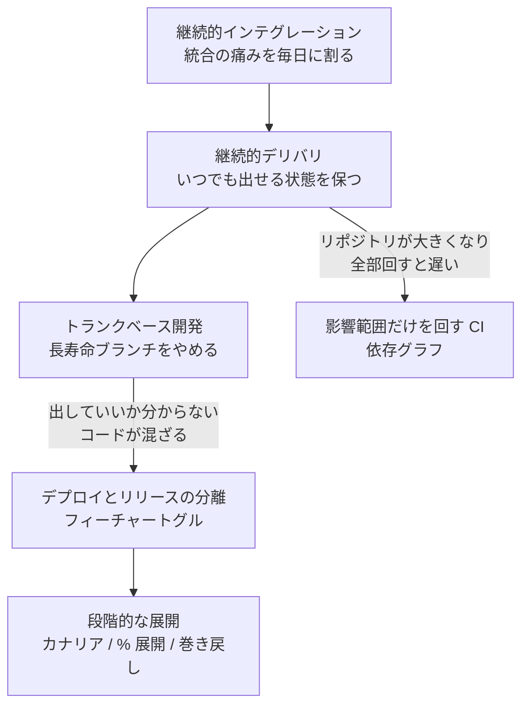

並べると、**大きい塊を小さく割り続けている**だけだと分かる。

| 何を割ったか | 結果 |
|---|---|
| 統合を割った | 継続的インテグレーション |
| リリースを割った | 継続的デリバリ、トランクベース |
| **「デプロイする」と「出す」を割った** | フィーチャートグル |
| 「出す」をさらに割った | カナリア、% 展開 |
| 「検査する」を割った | 影響範囲だけの CI |

この目で見ると、今回の二本柱はこうなる。

- **オンラインマイグレーション = スキーマ変更を割る。** 1 回でやろうとするから止めるしかない。
  3 回に割れば止めなくて済む
- **デプロイ分離 = 出す単位を割る。** リポジトリが 1 つでも、出す単位まで 1 つにする必要はない

同じ思想の適用先が違うだけなので、1 つの検証で両方扱う価値がある。

---

# 2. 柱 1: 止めずにカラムを改名する

## 定番の型がある — Parallel Change

自分で考える前に、これは**名前の付いた型**がある。**Parallel Change**(別名
expand / contract、あるいは expand-migrate-contract)と呼ばれるリファクタリングの型で、
「変更を、新旧が並存する期間を挟んだ 3 段階に割る」というもの。

DB に限らず API の変更などにも使う。今回はそれを DB スキーマに当てた形になる。

### gh-ost とは何が違うのか

ここで「それって `gh-ost` の仕事では?」と思う人がいると思う。自分も最初そう考えた。
結論から言うと、**解いている問題の層が違うので、置き換え関係ではなく直交する**。

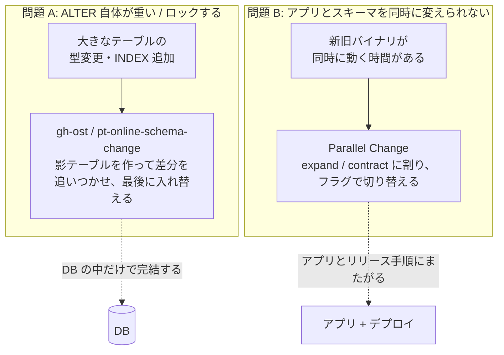

| | gh-ost / pt-online-schema-change | Parallel Change(今回) |
|---|---|---|
| 解く問題 | **ALTER が重い・ロックする** | **アプリとスキーマを同時に変えられない** |
| 影響範囲 | **DB の中だけ**。アプリは触らない | **アプリのコードとリリース手順**にまたがる |
| やること | 影テーブルを作り、コピーしつつ差分を追従(binlog / トリガ)、最後に入れ替え | 1 回の変更を 3 リリースに割り、途中は新旧を並存させる |
| 出番 | 型変更、巨大テーブルへの INDEX 追加、文字コード変更など | 参照している名前や意味が変わる変更すべて |

**重要なのは、gh-ost を使っても Parallel Change は要る**ということ。

たとえば gh-ost で `CHANGE COLUMN caption title ...` を実行したとする。ロックはしないし
時間もかからない。でも**入れ替わった瞬間、まだ動いている旧バイナリは `caption` を探して
壊れる**。gh-ost が解決したのは「ALTER 中に DB が詰まること」であって、
「アプリが古いこと」ではないからだ。

逆も言える。今回の `ADD COLUMN ... NULL` / `DROP COLUMN` は MySQL 8.0 の
`ALGORITHM = INSTANT` で**メタデータ更新だけで終わる**(テーブルを作り直さない)。
ここに gh-ost を持ち出す必要はない。

つまり住み分けはこうなる。

- **軽い DDL + アプリの変更** → INSTANT + Parallel Change(**今回の形**)
- **重い DDL + アプリの変更** → gh-ost で ALTER を流し、**その上で** Parallel Change
- **重い DDL だけ(アプリは無関係)** → gh-ost だけで足りる

実際、`MODIFY COLUMN` で型を縮める変更は INSTANT が使えず
`ERROR 1846 ... Need to rebuild the table` になることを実測した(後述)。
**この線を越えたら別の道具が要る**、という境界がはっきりしたのは収穫だった。

## 3 回に割る

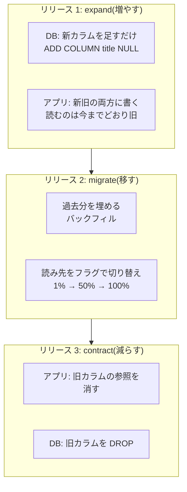

大事なのは、**どの時点でも新旧どちらのバイナリが動いていても壊れない**こと。
リリース 1 の直後を見てみる。

| | 書き込み | 読み取り |
|---|---|---|
| 旧バイナリ | `caption` だけに書く | `caption` を読む → **ある** |
| 新バイナリ | `caption` と `title` の両方に書く | `caption` を読む → **ある** |

どちらも成立している。これが「止めずに出せる」ということになる。

## 書き込みは常に両方、フラグで切るのは読みだけ

実装で一番のポイントがここ。

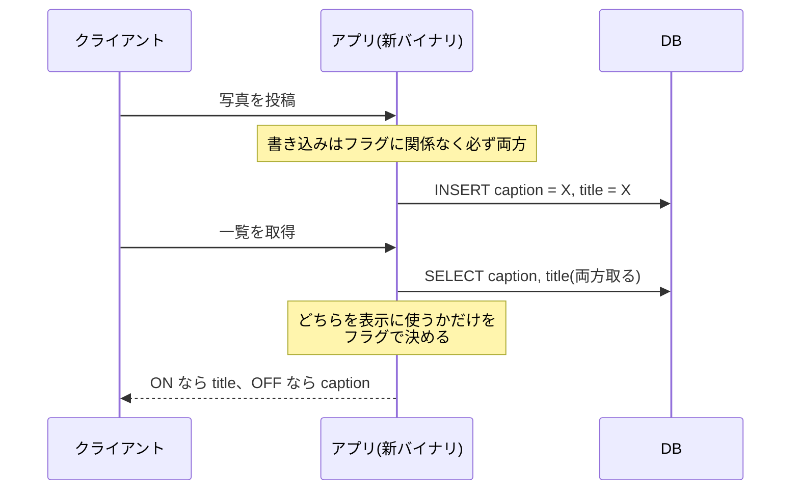

**書き込みをフラグで分岐させてはいけない。** 分岐させると「フラグが ON だった時間に
書かれた行だけ `title` が埋まっている」という**歯抜け**ができる。この状態でフラグを
OFF に戻すと、`caption` が空の行が生まれて壊れる。

常に両方へ書いておけば、**いつ巻き戻しても両方のカラムが正しい**。
フラグの役割は「読みの向きを変えること」だけに限定する。

もう 1 つ、読み側は **「フラグが ON でも `title` が空なら `caption` へ倒す」** 形にした。
こうすると**バックフィルが終わる前でもフラグを上げられる**。
展開とバックフィルの順序に依存しないため、運用の自由度が上がる。

## 過去分を埋める(バックフィル)

`title` を足しただけでは、**すでにある行は空のまま**。ここを埋める作業がバックフィル。

`photo backfill title --batch N --pause D` というサブコマンドを作った。設計は 3 つ。

- **分割する** — 主キー順に区切り、バッチごとに独立したトランザクションで確定する。
  1 トランザクションで全行更新すると、ロックを長く持って他を止めてしまう
- **冪等にする** — 条件を `title IS NULL` にする。何度流しても結果が変わらない
- **再開できる** — 上の 2 つの帰結として、途中で止めても続きから進む

「割る」という発想はここでも有効である。

## フラグは「再デプロイ不要のリリースレバー」

この検証で一番確かめたかったのは、**切り替えと巻き戻しにデプロイが要らない**ことだった。

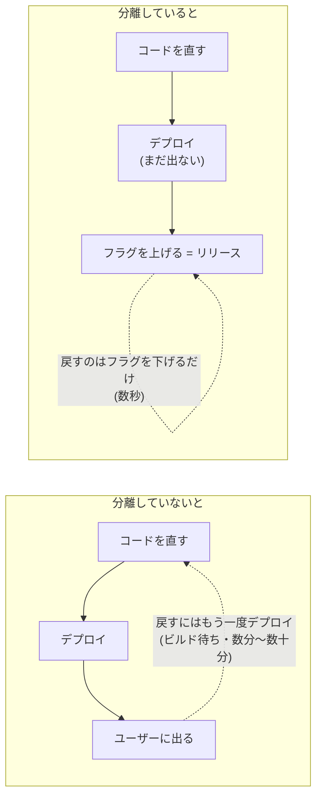

フィーチャートグルには用途別の分類があって、今回使っているのは
**リリーストグル**(未完成・切り替え中のコードを隠すための、短命なフラグ)に当たる。
だからフラグ名にも `release.` という接頭辞を付けている。**短命であることを名前で宣言する**、
という意図になる。

実測では **1% → 50% → 100% → OFF へ巻き戻し → 100% へ戻す**まで、
**フラグ定義ファイルの書き換えだけ**で完走した。再デプロイはゼロ。

### 設計で決めた 2 つのこと

**① 既定値は「フラグ基盤が落ちていても安全な側」にする。**

フラグを配る仕組み自体が落ちることはある。そのとき**どちらに倒れるか**を決めておく。
既定は常に「既存動作」にした。

実装では、入口のミドルウェアで宣言済みのフラグを 1 回だけ評価して `ctx` に積み、
ハンドラと usecase は `flags.Bool(ctx, name)` しか触らない。
**評価されていない `ctx` では false を返す**。

**評価できなかったときに新機能が露出すること**が最も避けるべき事態だからである。
「壊れたら止まる」ではなく「壊れたら今までどおり」に倒す。

**② 同じフラグを複数箇所で評価しない。**

フラグは「それで振る舞いが変わるデプロイ単位」だけが持つ。画面側(SSR)はフラグを
評価せず、**サービスが評価した結果を「できること」として API の応答で返す**。

フラグ名は API の契約に載せない。**フラグは消えるが、「できること」はフラグより長生きする**から。
フラグ名を契約に出すと、フラグを消すときに API の互換性の話になってしまう。

### どこで評価するか

ついでに調べ直して面白かった話。フラグの評価には**リモート評価**(サーバへ問い合わせる)と
**プロセス内評価**(定義を配ってアプリの中で判定する)がある。

| 製品 | 評価の場所 |
|---|---|
| AWS AppConfig | プロセス内 |
| GrowthBook | プロセス内(JSON を取得して SDK が評価) |
| LaunchDarkly | プロセス内 |
| flagd | **両方の口がある**(`rpc` / OFREP はリモート、flag sync はプロセス内) |

最初 flagd のリモート評価で組んでいたが、AWS 側を AppConfig にすると
**ローカルと本番で評価の場所が変わってしまう**ことに気づいた。
「REST か gRPC か」で考えていたのが誤りで、**軸はプロトコルではなく評価の場所**だった。
主流に合わせてプロセス内評価に寄せた。

## 最後の DROP をどう安全にするか

一番危ないのは最後の `DROP COLUMN`。**まだどこかが参照していたら本番が壊れる**。
人のレビューだけに頼らず、**機械が止める**形にした。

```mermaid
graph TB
    Want["旧カラムを DROP したい"] --> G1{"ゲート 1<br/>クエリからの参照がゼロか"}
    G1 -->|"残っている"| X1["sqlc generate が失敗<br/>column does not exist"]
    G1 -->|"通過"| G2{"ゲート 2<br/>対応するフラグは削除済みか"}
    G2 -->|"残っている"| X2["まだ切り替え中かもしれない"]
    G2 -->|"通過"| OK["DROP COLUMN"]
    OK --> Cmp["生成コードから型が消え<br/>参照が残っていればコンパイルエラー"]
```

**ゲート 1 は実測済み。** `sqlc`(SQL からコードを生成するツール)は、スキーマとクエリを
入力に取る。旧カラムを落としたスキーマで生成を回すと `column "caption" does not exist` で
**生成自体が通らない**。つまり**クエリから参照を外すまで先へ進めない**。

さらに DROP した後、生成された構造体からフィールドが消えるので、**まだ使っている箇所が
あればコンパイルエラーになる**。これが contract の安全確認そのものになっている。

ただし正直に書いておくと、**ゲート 2 には自動チェックがまだ無い**。
「対応する `release.` フラグが削除済みであること」は今のところ人が見ている。
検証ログにもその訂正を入れてある。

## ALTER は fail fast させる

スキーマ変更で本番を止める典型がこれ。**ALTER 自体は一瞬で終わるのに、
その手前で全部が詰まる**という事故になる。

何が起きるか順に見る。

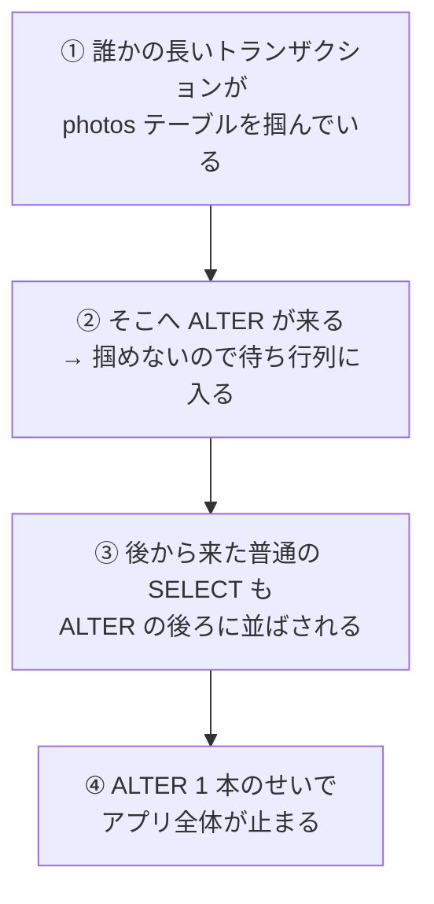

**③は直感に反する**。「ALTER が待っているだけなら、普通のクエリは
通ればいいのに」と感じるが、そうはならない。MySQL は ALTER のために**テーブル全体を
占有する権利**を確保しようとし、**その順番待ちの列に後続のクエリも並ぶ**からだ。
先頭の ALTER がいつまでも待っていると、列がどんどん伸びる。

結果、**ALTER の実行時間が 1 秒でも、その前の待ち時間の間ずっとアプリが停止する**。

### 対策: ALTER を fail fast + backoff にする

列を作らせなければよい。そのために **ALTER 側のセッションだけ、ロックを待つ上限を短くする**。
設定は 2 つあり、メタデータロックが `lock_wait_timeout`、行ロックが
`innodb_lock_wait_timeout`。今回は前者を 5 秒にした(既定は 31536000 秒 = 1 年)。

これで ALTER は 5 秒で fail fast する。失敗した時点で列は解消し、後ろに並んでいたクエリは
すぐ流れる。あとは backoff して投げ直せばよい。

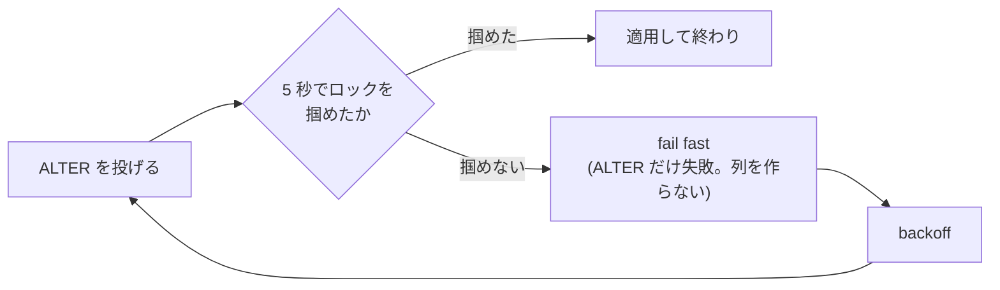

つまり **ALTER を fail fast させ、backoff して再試行する**。
**停止を ALTER 側に引き受けさせ、アプリは止めない**という交換になる。
デプロイが 1 回失敗してやり直しになるのは構わないが、**アプリが数十秒止まるのは困る**、
という優先順位をそのまま設定にした形。

実験した結果:

| 何を見たか | 結果 |
|---|---|
| 行をロックしたまま contract(DROP COLUMN)を投入 | ALTER が `Error 1205 Lock wait timeout exceeded` で**失敗**(想定どおり) |
| そのとき裏で流していたアプリのクエリ | **59 リクエスト、エラー 0**。停滞もなし |
| ロックを解放してからリトライ | **成功**(8 秒で完了) |

注目したいのは真ん中の行で、**ALTER がロック待ちで失敗している間も、
アプリのクエリは 1 件も失敗していないし遅くもなっていない**。列ができていない証拠になる。

## 実測

`caption` → `title` の改名を、負荷を流したまま完走させた結果。

| 段階 | 新旧カラムの一致率 |
|---|---|
| フラグ 50% | 100.00%(83 行) |
| フラグ 100% | 100.00%(96 行) |
| OFF へ巻き戻し → 100% へ戻す | — |
| 負荷終了後の最終検算 | **100.00%(324 行)** |

負荷の結果は **1399 リクエスト・エラー 0 件・全て 200**。
フラグ操作は定義ファイルの書き換えのみで**再デプロイなし**。

ここで効いたのは、**観測手段を先に作ったこと**だった。

- `dev/loadgen` — 連続して読み書きを流し、2xx 以外を失敗として数える。1 件でも exit 1
- `dev/columncheck` — 全行を `<=>`(NULL 安全な比較)で突き合わせ、新旧の一致率を出す

「たぶん大丈夫」を「エラー 0 件・一致率 100.00%」に変えるには、**先に数える道具**が要る。

## 掘り当てたもの

実際に動かさなければ表に出ないものが出た。検証ビルドの価値はここにある。

**① リトライは、書いただけでは有効になっていない。**
ロック待ちを判定するために `errors.As(err, &*mysql.MySQLError)` を使っていたが、
golang-migrate はドライバのエラーを独自の型で包み、**`Unwrap` を通さない**。
つまり判定が常に false で、**リトライは一度も動いていなかった**。
メッセージ中の `Error 1205` も見るようにして解決した。
**実際にロックを掛けて試すまで、リトライが有効かどうかは確認できない。**

**② 失敗すると golang-migrate は「dirty」を立て、そのままでは再試行できない。**
2 回目以降が `Dirty database version 1. Fix and force version.` で止まる。
1 つ前のバージョンへ `Force()` して dirty を解消してから再試行する処理を足した。
ここから **「1 ファイルに 1 文だけ書く」** という規約も導かれる ——
複数文を 1 ファイルに書くと**部分的に適用された状態**が起こりうるので、自動で戻せない。

**③ `INSTANT` には境界がある。**
`ADD COLUMN ... NULL` は `ALGORITHM = INSTANT` で一瞬で終わるが、
**型を縮める `MODIFY COLUMN` は `ERROR 1846 ... Need to rebuild the table`** になる。
「expand に置ける変更」と「置けない(=別の道具が要る)変更」の線がここにある。

**④ `sqlc` は同じ名前のパラメータを型の違う 2 カラムに使えない。**
`caption`(NOT NULL)と `title`(NULL 許容)に同じ `sqlc.arg` を共用しようとして
`incompatible types` になった。二重書きでは、呼び出し側が同じ値を 2 つの引数へ渡す形にする。

---

# 3. 柱 2: モノレポでサービスごとに速く出す

## 前提として、境界が守られていること

デプロイを分ける前に、**コードの境界が守られていること**が要る。
守られていないと、分けて出した瞬間に「別サービスの内部を直接呼んでいたので壊れた」が起きる。

この検証ビルドでは **go.work + マルチモジュール**(core / 各サービス / 各サービスの client)に
していて、**モジュールグラフそのものを依存規律にしている**。

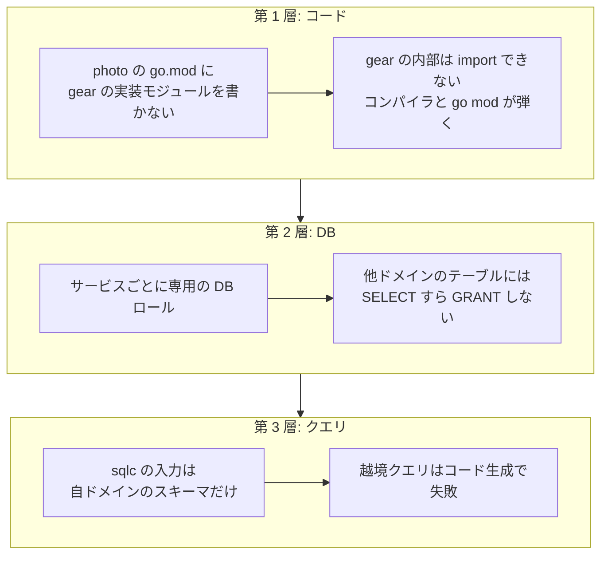

3 層にしてあるのは、**どれか 1 つをすり抜けても次で止まる**ようにするため。
「規約に書いてある」ではなく「構造上できない」に寄せる、という考え方になる。

**「読むだけなら直接 SELECT してもいいのでは」も禁止**している。読み取りでも相手のスキーマに
結合するので、相手がカラムを変えたら壊れるし、**将来 DB を分けることが不可能になる**。
他ドメインのデータが要るときは HTTP で取るか、イベント購読で複製を持つ。

### なぜ「初日から」マルチモジュールなのか

後からでもよさそうに見える。でも**変更コストが時間に対して非対称**だから初日にやる、
という整理になっている。

- モジュール分割の作業量は、**依存の絡まり(コード量)に比例して増える**
- CI/CD パイプラインは、**最初の構成に合わせて硬化する**
- 一方、`go.work` 内での境界の引き直しは**同じリポジトリ内の 1 PR で済む**(安い)

つまり「**先送りしてよいのは、待つほど安くなる変更か、可逆な変更だけ**」であって、
モジュール分割はどちらでもない。

### ところが `go.work` は境界を守らない

ここが実測して初めて分かったところ。

`go.work` は複数モジュールをまとめて扱うための仕組みで、開発時の利便性は高い。
ところが **`use` に載っているモジュールは、`go.mod` に依存を書いていなくても
import が解決してしまう**。

| ビルドのモード | `services/photo` から `services/gear/domain` を import |
|---|---|
| ワークスペース(普通に `go build`) | **成功してしまう**(越境が通る) |
| `GOWORK=off`(モジュール単体) | 失敗 `no required module provides package` |
| `GOWORK=off` + `gear-client` を依存に追加 | 成功(**client 経由のみ許可**) |

つまり**ワークスペースモードのビルドは、一番効かせたい検査を無効にしている**。

なので運用をこう分けた。

- **日常のビルドはワークスペース** — 速いし、横断的な変更が楽
- **検査は `GOWORK=off` で各モジュール単体** — CI はこちらを使う
- **デプロイ用の Docker イメージも `GOWORK=off` でビルド** — ワークスペースを効かせると、
  依存を書いていない import が通ったままイメージができる。つまり
  **「モノレポの中でしか動かないバイナリ」が本番に出てしまう**

代償として「**ローカルでビルドが通っても越境しているかもしれない**」状態になる。
`mise run check` を通すまで安心できない、というのは正直に受け入れている副作用。

副産物もあって、モジュール間の結線が `require v0.0.0` + `replace ../..` という形になるため、
**境界違反(client 以外への replace)が go.mod の差分として PR レビューに現れる**。

## 「何を回すか」を手で書かない

ここからが本題。モノレポで**影響範囲だけ CI を回す**というのは、よくある要求になる。

### 既存のやり方

この領域には成熟した道具がある。

| 道具 | やり方 |
|---|---|
| **Bazel / Pants / Buck** | ビルドグラフを持ち、変更から影響先を逆引きする(`rdeps` 等)。Go なら Gazelle が BUILD を生成 |
| **Nx / Turborepo**(JS 圏) | プロジェクト間の依存グラフを作り、`affected` だけを回す。結果のキャッシュも持つ |
| **`dorny/paths-filter` 等** | **パスのパターンを手で書く**。導入は一番軽い |

Bazel や Nx は強力だが、**ビルドシステムごと乗り換える**話になる。今回は Go の標準的な
ビルドのままでいたかったので、一番軽い paths-filter を検討した。が、これには弱点がある。

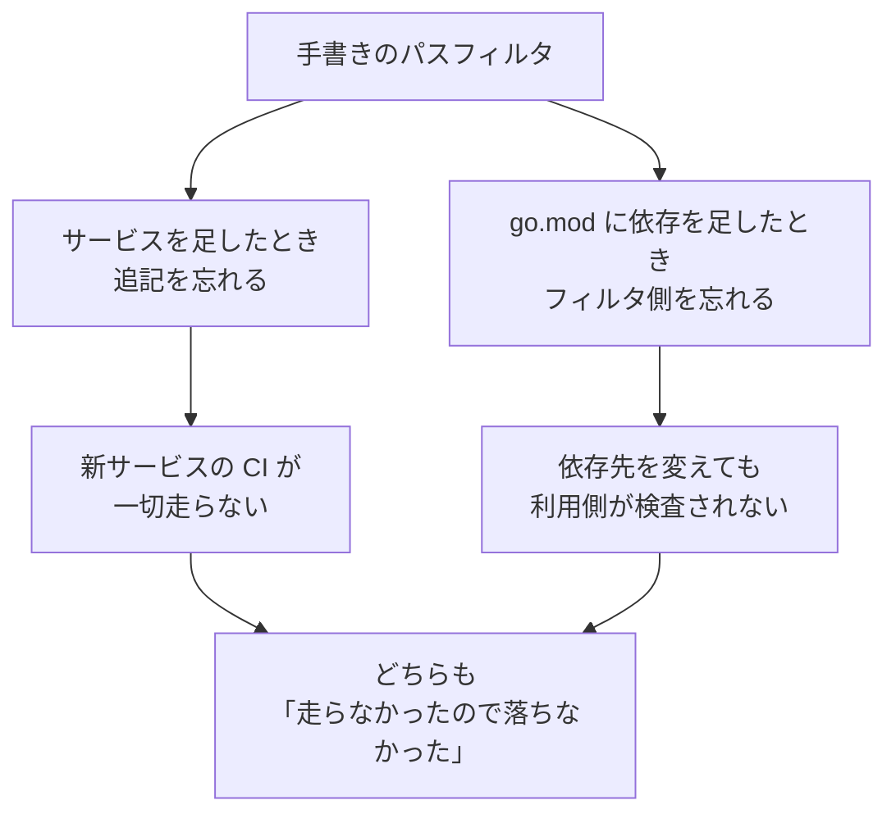

**「0 件で成功」は緑に見える。** 追記を忘れても誰も気づかない、というのがこの方式の弱点である。

### go.mod の replace から計算する

なので**依存グラフを、各モジュールの `go.mod` の `replace`(相対パス)から計算する**ことにした。
`dev/affected` が変更ファイルを受け取り、対象モジュールを JSON で返す。

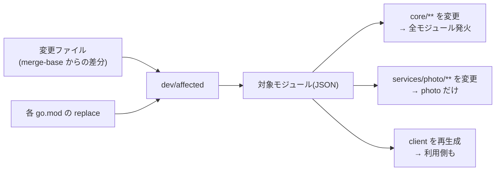

**手書きの対応表を持たない**ので、依存を足せば CI の発火範囲も自動的に変わる。
Bazel や Nx がやっていることの、**Go のモジュール機構だけで済ませる小さい版**という位置づけになる。

前節の `replace` がここで**二役**を担っている。
**境界を守る仕掛けが、そのまま CI の発火範囲の情報源**でもある。
真実が 1 箇所にしかないので、ずれようがない。

## 順序の保証は、スクリプトではなくジョブグラフに置く

デプロイは `migrate → release → healthcheck` の 3 段になる。
**マイグレーションが失敗したら、アプリを出してはいけない。**

これを 1 つのシェルスクリプトにまとめることもできる。
でも**まとめると、その保証は「スクリプトの制御フロー」になる**。
`set -e` の書き忘れや、`||` による握り潰しで簡単に破れる。

ジョブグラフ(CI の依存関係)に置けば、保証は**実行機構の側**に移る。
スクリプトを読まなくても成り立つ。

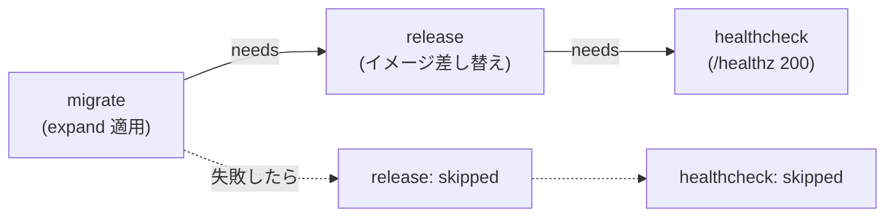

> これも定番のある領域で、Argo CD の sync wave や Helm の hook、
> Kubernetes で本体の前に Job を回す構成など、「マイグレーションを先に、
> 失敗したら進めない」を宣言で表す仕組みは各所にある。要点は同じで、
> **順序をスクリプトの中ではなく、外側の仕組みに持たせる**こと。

わざと壊して確かめた。存在しないカラムへ INDEX を張る expand を仕込むと:

| 確認 | 結果 |
|---|---|
| migrate | `failure`(`Error 1072 Key column ... doesn't exist`) |
| release / healthcheck | **`skipped`**(そもそも開始しない) |
| 環境は無傷か | **コンテナは同一 ID のまま動き続け**、`/healthz` は 200 |
| スキーマ | 壊れた INDEX は残っていない |

**失敗しても本番が無傷**、が確認できた形になる。

### この実験が掘り当てた致命的なバグ

一番大きかったのがこれ。dirty を解消する処理が、
**「dirty なバージョンが見つからない」を「失敗したのは最初のマイグレーションだ」と誤判定**し、
`Force(-1)` で**マイグレーション履歴を全消し**していた。

なぜ踏むかというと、**失敗した expand を消す・番号を変えるのは前方修正の普通の手順**だから。
そのとき「1 つ前のバージョン」は見つからない。旧コードはそれを最初のマイグレーションと読む。

結果、次の実行が `CREATE TABLE` から始まって `Error 1050 already exists` で落ち、
**以後どのデプロイも通らなくなる**。

直し方は「履歴の先頭と一致するか」で判定し、一致しなければ **dirty を残したまま、
理由と直し方を出して止める**。**推測でマイグレーション履歴を書き換えない。**

## 同一サービスは直列、別サービスは並列

GitHub Actions の `concurrency` グループを `deploy-<サービス名>` にする、というだけに見える。
実測すると挙動がはっきり出た。photo を 2 本、gear を 1 本、3 秒間隔で投げた結果:

```mermaid
gantt
    title デプロイの実測タイムライン(18:28:40 起点)
    dateFormat HH:mm:ss
    axisFormat %H:%M:%S
    section photo #1
    migrate      :a1, 18:28:44, 13s
    release      :a2, 18:29:01, 12s
    healthcheck  :a3, 18:29:15, 10s
    section gear
    migrate      :b1, 18:28:46, 12s
    release      :b2, 18:29:02, 16s
    healthcheck  :b3, 18:29:21, 11s
    section photo #2
    待ち(42秒)    :crit, c0, 18:28:46, 42s
    migrate      :c1, 18:29:28, 12s
    release      :c2, 18:29:43, 11s
    healthcheck  :c3, 18:29:57, 9s
```

- **別サービスは互いに待たない** — photo #1 と gear は全段が重なっている
- **同一サービスは追い越さない** — photo #2 は 18:28:46 に投入されたのに、migrate の開始は
  18:29:28。photo #1 の完了(18:29:25)の直後で、**42 秒待っている**

待たせたのがランナー不足ではないことも確認した。gear が終わった後もランナーは空いていて、
それでも photo #1 の完了を待っている。**`concurrency` が有効に機能している証跡**である。

### concurrency は「順番」しか分けてくれない

この実験が 2 つ目のバグを掘り当てた。**修正前は gear の release が落ちていた。**

```
Container greenfield-mysql Recreate
Error response from daemon: Conflict. The container name
"/..._greenfield-mysql" is already in use by container ...
```

`docker compose up` が `depends_on` を辿って**共有インフラ(mysql)の再作成に手を出す**ため、
photo と gear の release が同時に走るとコンテナ名を奪い合っていた。
`--no-deps` を付けて、release が触るのは自分のサービスだけにした。

教訓は明確で、**「別サービスは互いに待たない」と主張するなら、待たない状態で同時に走っても
壊れないことまでが主張の範囲**になる。ジョブグラフの宣言だけ見て緑にすると、この穴は残る。

もう 1 つ。**ランナーが 1 台ではこの検証自体ができない。** ジョブがランナー待ちで直列化するので、
「待っているのは concurrency なのかランナー不足なのか」が区別できない。2 台にして初めて
同じ条件で比較できた。**確かめたい性質に対して、環境が足りているかを先に見る**必要がある。

## 将来: リポジトリを分けるとき

この構成が最も効果を発揮するのは**切り出すとき**である。

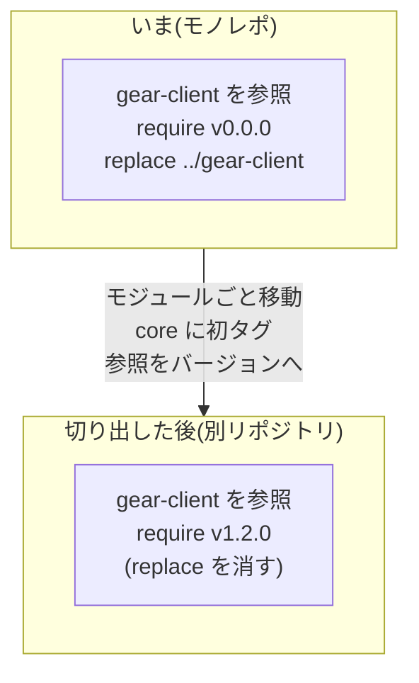

やることは、**モジュールごと移動して、`core` に初めてのタグを打ち、消費側の参照を
バージョン指定に切り替えるだけ**。差分としては `replace` を外す形になる。

狙いは**依存関係の調査を後回しにしないこと**。「切り出すときに初めて依存を解きほぐす」のを
避けるために、最初からこの形にしてある。

タグを打たないのも意図的で、**モジュールが外のリポジトリから使われるまでタグは打たない**。
外から使われて初めてバージョンが要る。

切り出しを容易にする仕組みは他にもある。

- **マイグレーションがモジュールに随伴する。** `services/<name>/migrations/` を `go:embed` で
  バイナリに埋め、`<name> migrate expand` というサブコマンドとして実行する。
  **リポジトリの外に状態を持たない**ので、モジュールごと移せば移行の仕組みも一緒に動く
- **サービス間通信は最初から HTTP。** ローカル開発用に全サービスを 1 プロセスで起動する
  バイナリもあるが、その場合も**通信は localhost 越しの HTTP** を通す。
  プロセス内呼び出しの近道を作らない
- **除却も機械的になる。** `go.work` から外した時点で、残っている参照がコンパイルエラーになる

一方で **リポジトリを分けること自体は「条件付きの先送り」**にしている。
切り出す価値が確定したモジュールに限る、という条件で、それまでは
**横断的な変更をまとめて行えるモノレポを維持する**。分けること自体が目的ではない。

---

# 4. 二本柱が噛み合うところ

別々に書いてきたが、組み合わせると 1 つの主張になる。

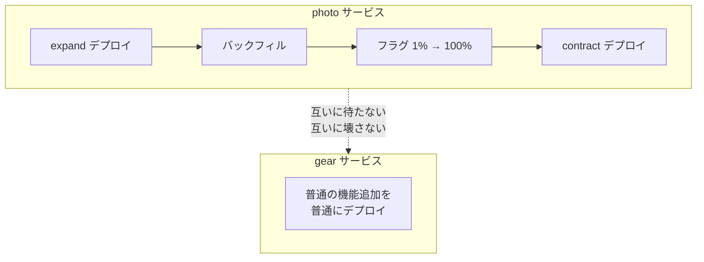

**photo がオンライン改名の最中でも、gear は普通にデプロイできる。**

これが「モノレポなのにサービスごとに独立して、安全に、速く出せる」ということで、
二本柱が交わる点になる。

## まとめ

- **デプロイは瞬間ではない。** 新旧が同時に動く時間があり、DB は 1 つ。
  だからスキーマ変更は 3 回に割るしかない(Parallel Change)
- 業界の流れは **大きい塊を割り続けること**。統合を割り、リリースを割り、
  **デプロイとリリースを割り**、出す単位を割り、検査する範囲を割る
- **書き込みは常に両方、フラグで切るのは読みだけ。** 書き込みを分岐させると巻き戻せなくなる
- **フラグの既定値は「基盤が落ちていても安全な側」。** 評価できなかったときに
  新機能が露出することが最も避けるべき事態になる
- **危険な操作は機械で止める。** DROP はコード生成の失敗とコンパイルエラーに守らせる
- **順序の保証はスクリプトではなくジョブグラフへ。** 保証が実行機構の側に移る
- **「0 件で成功」は緑に見える。** だから CI の対象は手書きの表ではなく依存グラフから計算する
- **`go.work` は便利だが境界を守らない。** 検査とリリースビルドは `GOWORK=off` に倒す
- **境界は「切り出すときに解く」のでは遅い。** 分割コストは絡まりに比例して増え、
  CI/CD は最初の構成に硬化する
- **推測で履歴を書き換えない。** 分からないときは、理由と直し方を出して止まるのが正しい

そして全体を通して一番効いたのは、**先に数える道具を作ったこと**と、**実際に壊して試したこと**。
リトライも、順序の保証も、並列性も、**「書いた」だけでは有効かどうか確認できない**。
