## TL;DR

1. **デプロイは一瞬では終わらない。** 新旧のバイナリが必ず同時に動く時間があり、その間 DB は 1 つ。
   ここを直視すると「スキーマ変更はアプリと同時に出せない」という結論になる
2. 解は **expand / contract(増やす → 移す → 減らす)を複数リリースに割り、
   切り替えだけをフィーチャーフラグに逃がす**こと。**デプロイとリリースを分ける**のが本質
3. モノレポで独立してデプロイするには、**「何を出すか」を手書きのパスフィルタではなく
   依存グラフから計算**し、**順序の保証をスクリプトではなくジョブグラフに置く**
4. 境界はマルチモジュールで**構造として**守る。ただし **`go.work` は境界を守らない**(実測)ので
   検査とリリースビルドは `GOWORK=off`。これが将来の**リポジトリ分離**の下準備にもなっている

実際に `caption` → `title` の改名を負荷をかけたまま完走させた(**1399 リクエスト・エラー 0 件・
新旧一致率 100%**)ときの記録と、そこで掘り当てたバグを書く。

## なぜこんなものが欲しくなるのか

### デプロイは「瞬間」ではない

まずここが出発点になる。ローリング更新でもブルーグリーンでも、**新旧のバイナリが同時に
動いている時間が必ずある**。

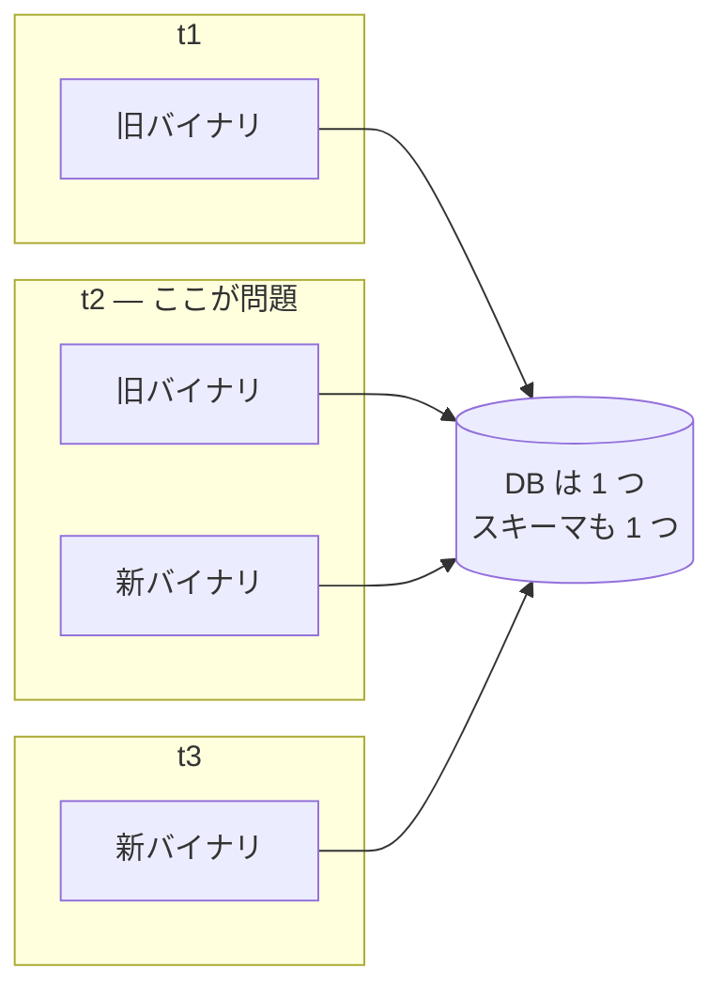

アプリは複数のプロセスに分かれて入れ替わるのに、**DB は分かれない**。だから
「新バイナリ用のスキーマ」と「旧バイナリ用のスキーマ」を同時に持つことはできない。

ここで素朴にやると事故になる。`ALTER TABLE ... RENAME COLUMN` をデプロイと同時に打つと、
t2 の瞬間に**旧バイナリが存在しないカラムを引いて 500 を返す**。ロールバックしようにも、
スキーマは戻っていないので余計に壊れる。

### 分散サービスだと、これが掛け算になる

サービスが分かれると、**デプロイ単位が増える**。つまり「t2 の瞬間」がサービスの数だけ、
しかも互いに独立したタイミングで発生する。

さらにモノレポで運用していると、別の問題が乗ってくる。**リポジトリは 1 つなのに
デプロイ単位は複数**という状態で、素直に CI を書くと「1 行直したら全サービスのテストが回る」
「関係ないサービスのデプロイまで待つ」になる。サービスを分けた目的(独立して出せること)が、
CI/CD の都合で消える。

### 開発生産性の歴史として見る

この 2 つの課題は、業界が 20 年かけて同じ方向に進んできた線の先にある。

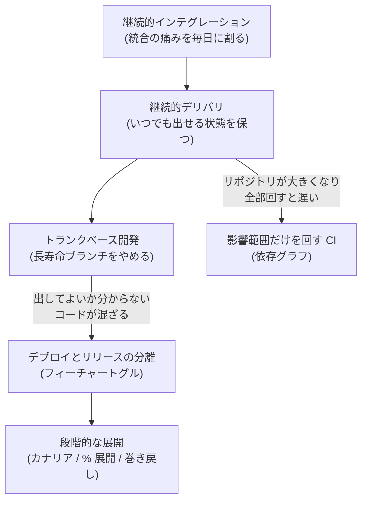

**大きい塊を小さく割り続ける**、という一本の流れだと思っている。

- 統合を小さく割る → CI
- リリースを小さく割る → CD、トランクベース
- **「デプロイする」と「ユーザーに出す」を割る** → フィーチャートグル
- **「出す」を割る** → カナリア、% 展開
- **「検査する」を割る** → 影響範囲だけの CI

この線で見ると、**オンラインマイグレーションは「スキーマ変更を割る」こと**になる。
1 回で終わらせようとするから止めるしかなくなるのであって、**3 回に割れば止めなくて済む**。

そしてもう一方の柱、**デプロイ分離は「出す単位を割る」こと**。どちらも同じ思想の適用先が
違うだけで、だから 1 つの検証ビルドで両方を扱う価値がある。

---

# 柱 1: オンラインマイグレーション

## expand / contract — 3 回に割る

やり方自体は確立していて、**増やす(expand)→ 移す → 減らす(contract)** に割る。

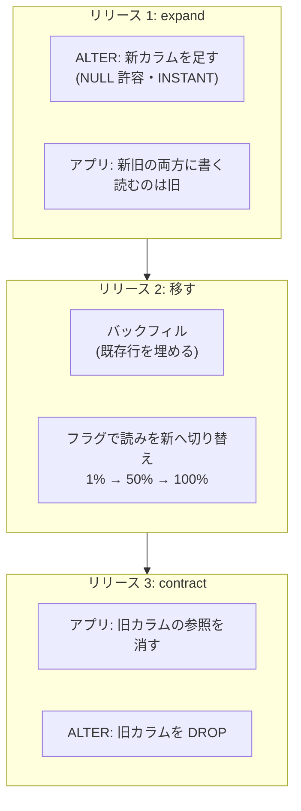

各段で**新旧どちらのバイナリが動いていても壊れない**のがポイント。
リリース 1 の後は、旧バイナリは旧カラムを読み書きし、新バイナリは両方に書く。
どちらも成立する。

### 書き込みは「常に両方」、読みだけフラグで切る

ここは実装上の要点なので具体的に書く。

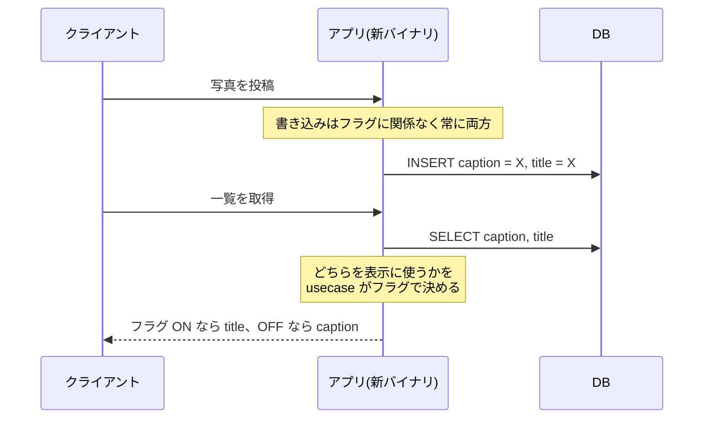

**書き込みをフラグで分岐させない**のが効く。分岐させると「フラグ ON の間に書いた行だけ
新カラムが埋まっている」という歯抜けができ、巻き戻したときに壊れる。
常に両方へ書けば、いつ巻き戻しても両方が正しい。

もう 1 つ、読み側は **「フラグ ON でも新カラムが空なら旧カラムへ倒す」** 形にした。
こうするとバックフィルが終わる前でもフラグを上げられる。**展開とバックフィルの順序に
依存しなくなる**ので、運用の自由度が上がる。

### バックフィルは分割・冪等・再開可能に

`photo backfill title --batch N --pause D` を作った。主キー順に区切り、
**バッチごとに独立したトランザクションで確定**する。条件が `title IS NULL` なので
**冪等**で、中断しても続きから進む。

大きなテーブルを 1 トランザクションで更新すると、ロックを長く持って他を止める。
「割る」はここにも効く。

## フラグは「再デプロイ不要のリリースレバー」

この検証で確かめたかったのは、**切り替えと巻き戻しにデプロイが要らない**ことだった。

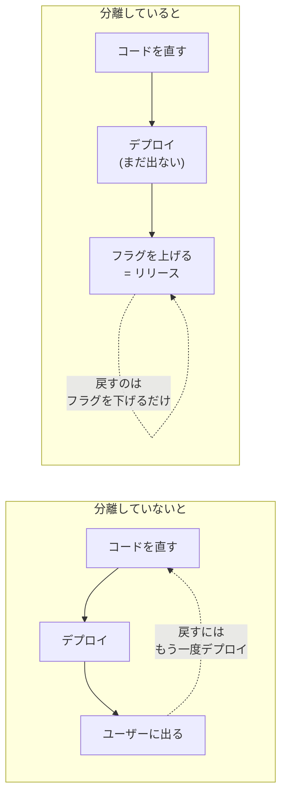

実測では、**1% → 50% → 100% → OFF に巻き戻し → 100% に戻す**まで、
**フラグ定義ファイルの書き換えだけ**で完走した。再デプロイはゼロ。

設計で決めたことが 2 つある。

**フラグの既定値は「フラグ基盤が落ちていても安全な側」にする。** つまり既存動作。
入口のミドルウェアで宣言済みのフラグを 1 回だけ評価して ctx に積み、
ハンドラと usecase は `flags.Bool(ctx, name)` しか触らない。
未評価の ctx では false を返す。**評価できなかったときに新機能が出てしまう**のが一番まずい。

**同じフラグを複数箇所で評価しない。** フラグは「それで振る舞いが変わるデプロイ単位」だけが
所有する。SSR(フロント)はフラグを評価せず、**サービスが評価した結果を「できること」として
API の応答で返す**。フラグ名は API 契約に載せない —— **フラグは消えるが「できること」は
フラグより長生きする**から。

余談だが、フラグの評価をどこでやるかは調べ直す価値があった。flagd には
リモート評価(`rpc` / OFREP)と**定義を配ってプロセス内で評価**(flag sync)の両方の口があり、
AWS AppConfig・GrowthBook・LaunchDarkly はいずれも**プロセス内評価**。
「REST か gRPC か」ではなく **軸は評価の場所**だと整理して、プロセス内評価に寄せた。

## contract を安全にする「ゲート」

一番危ないのは最後の `DROP COLUMN` で、**まだ誰かが参照していたら本番が壊れる**。
人のレビューだけに頼らず、**機械が止める**形にした。

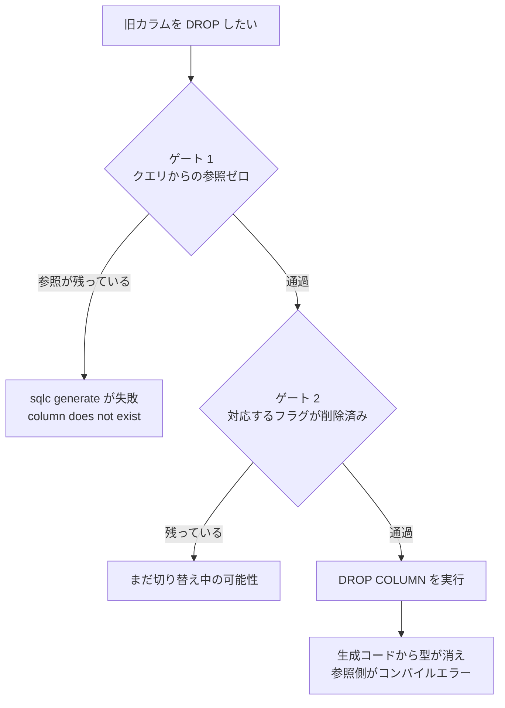

ゲート 1 は実測済み。旧カラムを落としたスキーマに対して `sqlc generate` を回すと
`column "caption" does not exist` で生成が通らない。**クエリから参照を外すまで前に進めない**。

そして DROP した後、生成された struct からフィールドが消えるので、**残っている参照側が
コンパイルエラーになる**。これが contract の安全確認そのものになっている。

ただし正直に書いておくと、**ゲート 2 には自動チェックがまだ無い**。
「対応する `release.` フラグが削除済みであること」は今のところ人が見ている。
検証ログにもそう訂正を入れてある。

## ロック待ちで「自分が退く」

スキーマ変更で本番を止める典型が**ロック行列**。長いトランザクションがロックを持っている
ところへ ALTER を投げると、ALTER がロック待ちに入り、**その後ろに来た普通のクエリが
全部詰まる**。

対策は「ALTER 側が短いタイムアウトで諦めて退く」。実験した。

| | 結果 |
|---|---|
| 1 回目(行をロックしたまま contract を投入) | `Error 1205 Lock wait timeout exceeded`(セッションの `lock_wait_timeout=5`) |
| そのとき動いていたアプリのクエリ | **59 リクエスト、エラー 0**(停滞なし) |
| ロック解放後のリトライ | 成功(8 秒で完了) |

**退く側を ALTER にすれば、アプリは止まらない。**

## 実測

`caption` → `title` の改名を、負荷スクリプトを流したまま完走させた結果。

| 段階 | 新旧カラムの一致率 |
|---|---|
| フラグ 50% | 100.00%(83 行) |
| フラグ 100% | 100.00%(96 行) |
| OFF へ巻き戻し → 100% へ戻す | — |
| 負荷終了後の最終検算 | **100.00%(324 行)** |

負荷の結果は **1399 リクエスト・エラー 0 件・全て 200**。フラグ操作は定義ファイルの
書き換えのみで**再デプロイなし**。

検算用に `dev/columncheck`(全行を `<=>` で NULL 安全比較)と
`dev/loadgen`(連続読み書き、2xx 以外を失敗として数え、1 件でも exit 1)を先に作った。
**観測手段を先に作る**のは、この手の検証では効果が大きい。

## 掘り当てたもの

やってみないと出ないものが出た。ここが検証ビルドの価値だと思う。

**リトライを書いただけでは効いていない。** ロック待ちのリトライ判定に
`errors.As(err, &*mysql.MySQLError)` を使っていたが、golang-migrate はドライバのエラーを
独自の型で包み **`Unwrap` を通さない**ので、常に false になっていた。
メッセージ中の `Error 1205` も見るようにして解決。
**実際にロックを掛けて確かめるまで、リトライが効いているかは分からない。**

**失敗すると golang-migrate は dirty を立て、そのままではリトライできない。**
2 回目以降が `Dirty database version 1. Fix and force version.` で止まる。
1 つ前のバージョンへ `Force()` して dirty を解消してから再試行する処理を足した。
なお **1 ファイル 1 文**で書く規約はここから導かれる —— 複数文を 1 ファイルに書くと
部分適用が起こりうるので、自動で戻せなくなる。

**INSTANT には境界がある。** `ADD COLUMN ... NULL` は `ALGORITHM = INSTANT` で通るが、
**型を縮める `MODIFY COLUMN` は `ERROR 1846 ... Need to rebuild the table`** になる。
expand に置ける変更と置けない変更の線がここにある。

**sqlc は同じ名前付きパラメータを型の違う 2 カラムへ使えない。**
`caption`(NOT NULL)と `title`(NULL 許容)に同じ `sqlc.arg` を共用しようとして
`incompatible types` で怒られた。二重書きでは呼び出し側が同じ値を 2 つの引数へ渡す。

---

# 柱 2: デプロイ分離

## 前提: 境界を「構造」で守る

デプロイを分ける前に、**コードの境界が守られていること**が要る。守られていないと、
分けて出した瞬間に「別サービスの内部を直接呼んでいたので壊れた」が起きる。

この検証ビルドでは **go.work + マルチモジュール**(core / 各サービス / 各サービスの client)に
していて、モジュールグラフそのものを依存規律にしている。

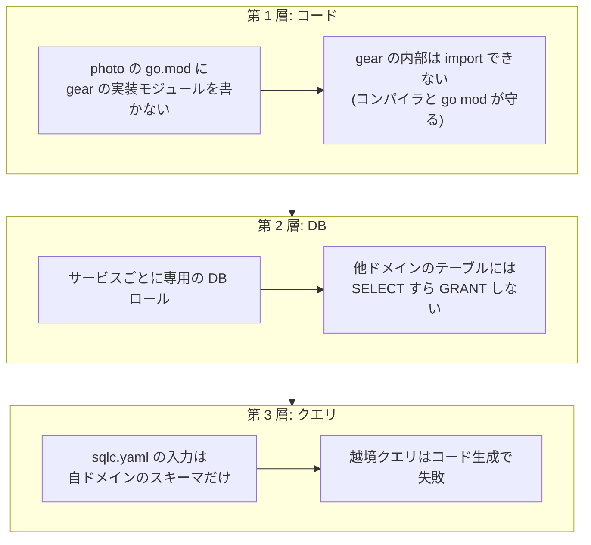

3 層にしているのは、**どれか 1 つをすり抜けても次で止まる**ようにするため。
規約としてではなく構造として強制する、という考え方になっている。

「読むだけなら直接 SELECT してもいいのでは」も禁止している。読み取りでも相手のスキーマに
結合し、相手のカラム変更で壊れ、**将来の DB 分離を不可能にする**から。他ドメインのデータが
要るときは HTTP で取るか、イベント購読で複製(ReplicaView)を持つ。

### なぜ「初日から」マルチモジュールなのか

後からでもよさそうに見えるが、**変更コストが時間に対して非対称**だからだと整理されている。

- モジュール分割の作業量は**依存の絡まり(コード量)に比例して増える**
- CI/CD パイプラインは**最初の構成に合わせて硬化する**
- 一方、`go.work` 内でのモジュール再編(境界の引き直し)は**同一リポジトリ内の 1 PR で済む**

つまり「先送りしてよいのは、**待つほど安くなる変更**(DB の物理分離など)か、**可逆な変更**だけ」で、
モジュール分割はどちらでもない。だから初日にやる。

### ところが go.work は境界を守らない

ここが実測して初めて分かったところで、**`go.work` の `use` に載っているモジュールは
`go.mod` に require が無くても import が解決してしまう**。

| モード | `services/photo` から `services/gear/domain` を import |
|---|---|
| ワークスペース(`go build`) | **ビルド成功**(越境が通ってしまう) |
| `GOWORK=off`(モジュール単体) | 失敗 `no required module provides package` |
| `GOWORK=off` + `gear-client` を require | 成功(**client モジュール経由のみ可**) |

つまり**ワークスペースモードのビルドは境界を守らない**。便利さと引き換えに、
一番効かせたい検査が無効になっている。

なので運用をこう分けた。

- **日常のビルドはワークスペース**(速いし、横断変更が楽)
- **検査は `GOWORK=off` で各モジュール単体**。CI はこちらを使う
- **デプロイ用の Docker イメージも `GOWORK=off` でビルド**する。ワークスペースを効かせると
  「require の無い import が通る」イメージができ、**モノレポだから動くだけのバイナリ**が
  本番に出てしまう

代償として「ローカルでビルドが通っても越境している可能性がある」状態になる。
`mise run check` を通すまで安心できない、というのは正直に受け入れている副作用。

副産物もあって、モジュール間の結線が `require v0.0.0` + `replace ../..` になるため、
**境界違反(client 以外への replace)が go.mod の差分として PR レビューに現れる**。

## 将来: リポジトリを分けるとき

この構成の効き目が一番出るのは**切り出すとき**だと思っている。

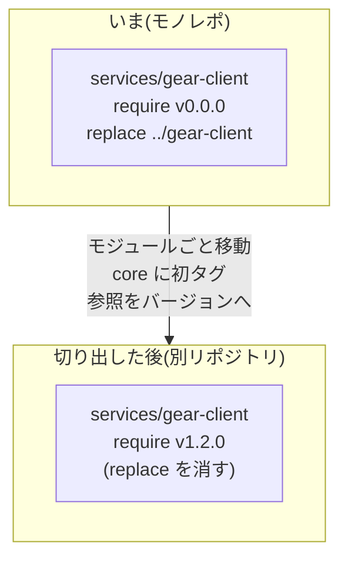

やることは **モジュールごと移動して、`core` に初タグを打ち、消費側の client 参照を
バージョン指定へ切り替えるだけ**。`replace` を外す差分になる。
**依存の考古学が発生しない**のが狙いで、逆に言えば「切り出すときに初めて依存を解きほぐす」
のを避けるために、今の形にしてある。

タグを打たないのも意図的で、**モジュールがリポジトリ外から消費されるまでタグは打たない**。
外から使われて初めてバージョンが要る。

切り出しに効く仕込みは他にもある。

- **マイグレーションがモジュールに随伴する。** `services/<name>/migrations/{expand,contract}/` を
  `go:embed` でバイナリに同梱し、`<name> migrate expand` として実行する。
  **リポジトリ外に状態を持たない**ので、モジュールごと移動すれば移行の仕組みも一緒に動く
- **サービス間通信は最初から HTTP。** ローカル開発用の allinone バイナリも、
  1 プロセスで全リスナーを起動しつつ**通信は localhost 越しの HTTP** を通す。
  in-process 呼び出しの近道を作らない
- **除却も機械的になる。** `go.work` から外した時点で残存参照がコンパイルエラーになる

一方で **マルチリポ化そのものは「条件付きの先送り」**にしている。切り出す価値が確定した
モジュールに限る、という条件で、それまでは**横断変更をアトミックに行えるモノレポを維持**する。
分けること自体が目的ではない、という線引きになっている。

## 「何を回すか」を手で書かない

モノレポで影響範囲だけ CI を回す、はよくある要求で、`paths-filter` 系でパスのパターンを
書くのが定番。ただしこれは**手書きの対応表**になる。

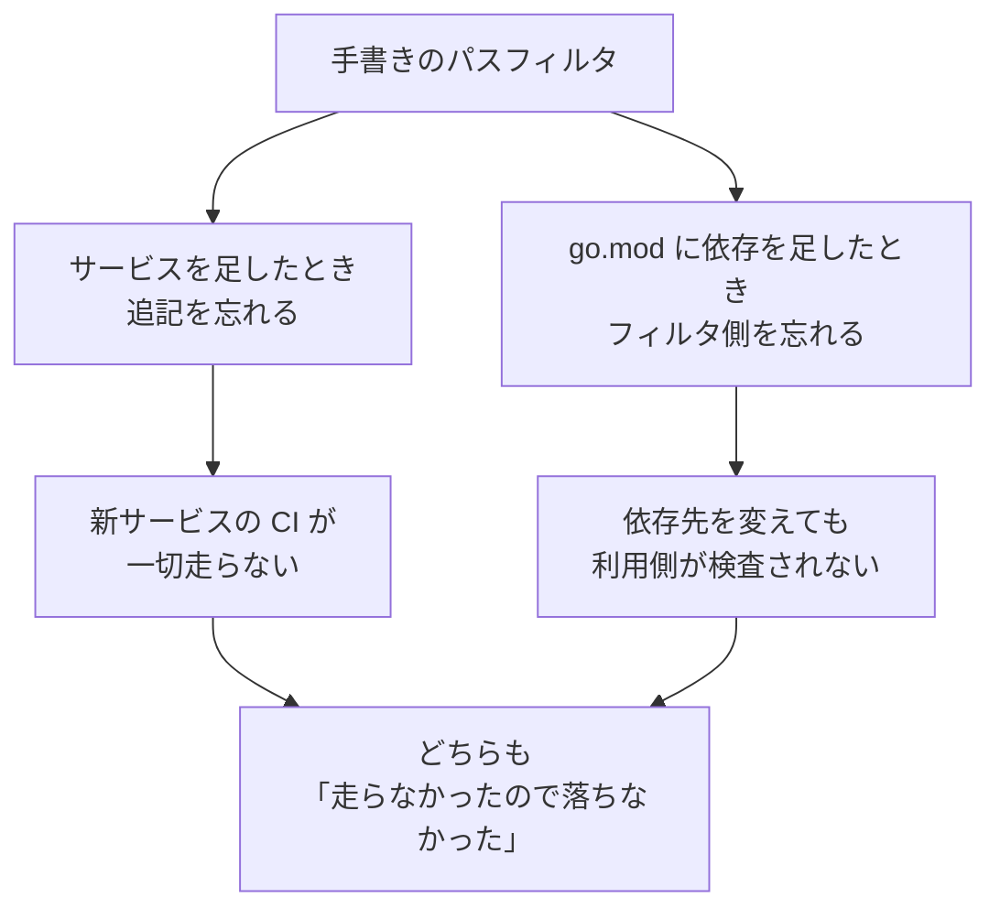

**「0 件で成功」は緑に見える。** ここが怖いところで、忘れても誰も気づかない。

なので**依存グラフを各モジュールの `go.mod` の `replace`(相対パス)から計算する**ことにした。
`dev/affected` が変更ファイルを受け取って対象を JSON で返す。**対応表を持たない**ので、
依存を足せば自動的に CI の発火範囲も変わる。

前節の `replace` がここで二役になっているのが気に入っている。**境界を守る仕掛けが、
そのまま CI の発火範囲の情報源**でもある。真実が 1 箇所にあるので、ずれようがない。

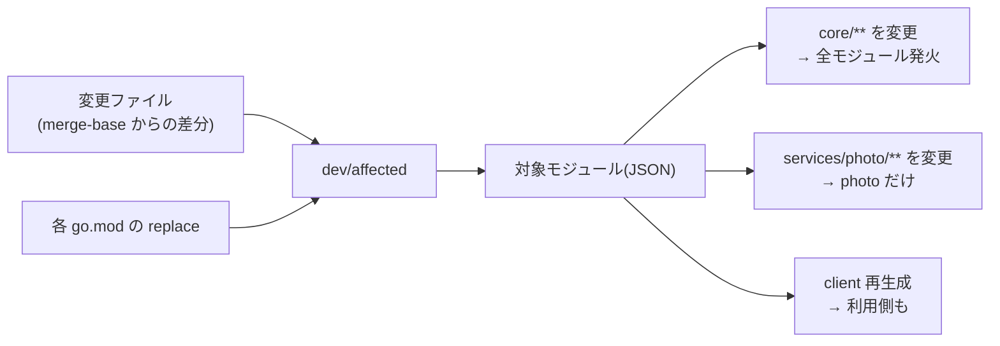

## 順序の保証は「スクリプト」ではなく「ジョブグラフ」に置く

`migrate → release → healthcheck` を 1 つのスクリプトにまとめることもできる。
でも**まとめると「migrate が落ちたら続きを走らせない」保証がスクリプトの制御フローになる**。
ジョブグラフに置けば、保証は**実行機構の側**になる。スクリプトを読まなくても成り立つ。

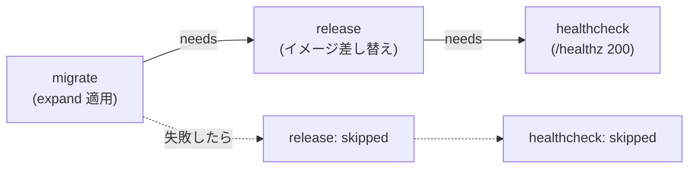

わざと壊して確かめた。存在しないカラムへ INDEX を張る expand を仕込むと:

| 確認 | 結果 |
|---|---|
| migrate | `failure`(`Error 1072 Key column ... doesn't exist`) |
| release / healthcheck | **`skipped`**(`needs` により開始しない) |
| 環境は無傷か | **コンテナは同一 ID のまま動き続け**、`/healthz` は 200 |
| スキーマ | 壊れた INDEX は残っていない |

**失敗しても本番が無傷**、が確認できた形。

### ここで見つかった致命的なバグ

この実験が掘り当てたものが一番大きい。dirty を解消する `resetDirty` が、
**「dirty なバージョンが source に無い」を「失敗したのが最初のマイグレーションだ」と誤判定**し、
`Force(-1)` で**履歴を全消し**していた。

失敗した expand を消す・番号を変えるのは前方修正の普通の手順で、そのとき前のバージョンは
「見つからない」を返す。旧コードはそれを最初のマイグレーションと読む。
結果、次の実行が `CREATE TABLE` から始まって `Error 1050 already exists` で落ち、
**以後どのデプロイも通らなくなる**。

直し方は「source の先頭と一致するか」で判定し、一致しなければ **dirty を残したまま
理由と直し方を出して止める**。**推測でマイグレーション履歴を書き換えない。**

## 同一サービスは直列、別サービスは並列

`concurrency: deploy-<service>` を置くだけ、に見える。実測すると面白いことが起きた。
photo を 2 本と gear を 1 本、3 秒間隔で同時に投げた結果:

```mermaid
gantt
    title デプロイの実測タイムライン(18:28:40 起点)
    dateFormat HH:mm:ss
    axisFormat %H:%M:%S
    section photo #1
    migrate      :a1, 18:28:44, 13s
    release      :a2, 18:29:01, 12s
    healthcheck  :a3, 18:29:15, 10s
    section gear
    migrate      :b1, 18:28:46, 12s
    release      :b2, 18:29:02, 16s
    healthcheck  :b3, 18:29:21, 11s
    section photo #2
    待ち(42秒)    :crit, c0, 18:28:46, 42s
    migrate      :c1, 18:29:28, 12s
    release      :c2, 18:29:43, 11s
    healthcheck  :c3, 18:29:57, 9s
```

- **別サービスは互いに待たない** —— photo #1 と gear は全段が重なっている
- **同一サービスは追い越さない** —— photo #2 は 18:28:46 に投入されたのに migrate の開始が
  18:29:28。photo #1 の完了(18:29:25)の直後で、**42 秒待っている**

待たせたのがランナー不足ではないことも確認した。gear が終わった後もランナーは空いていて、
それでも photo #1 の完了を待っている。**`concurrency` が効いている証跡**になる。

### concurrency group は「スケジューリング」しか分けない

この実験が 2 つ目のバグを掘り当てた。**修正前は gear の release が落ちていた。**

```
Container greenfield-mysql Recreate
Error response from daemon: Conflict. The container name
"/..._greenfield-mysql" is already in use by container ...
```

`docker compose up` が `depends_on` を辿って**共有インフラ(mysql)の再作成に手を出す**ため、
photo と gear の release が同時に走るとコンテナ名を奪い合う。`--no-deps` を付けて、
release が触るのは自分のサービスだけにした。

教訓は明確で、**「別サービスは互いに待たない」を主張するなら、待たない状態で同時に走っても
壊れないことまでが主張の範囲**。ジョブグラフの宣言だけ見て緑にすると、この穴は残る。

もう 1 つ。**ランナーが 1 台では、この検証はできない。** ジョブがランナー待ちで直列化するので
「待っているのは concurrency なのかランナー不足なのか」が区別できない。2 台にして初めて
同じ条件で比較できた。**検証したい性質に対して、環境が十分かを先に見る**必要がある。

---

## 2 つが噛み合うところ

ここまで別々に書いたが、組み合わせると 1 つの主張になる。

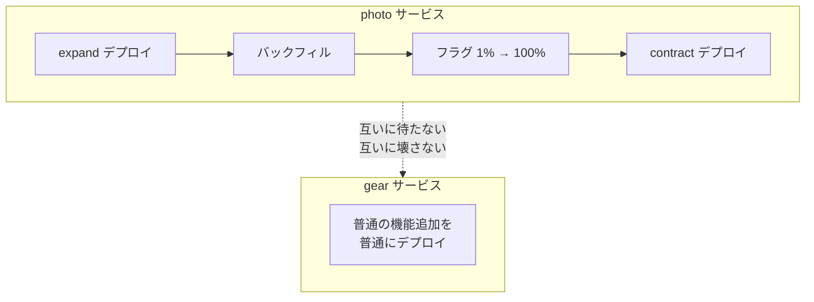

**photo がオンライン改名の最中でも、gear は普通にデプロイできる。**
これが「モノレポなのにサービスごとに独立して安全に出せる」ということで、
検証ビルドの最重要成果物 2 つが交わる点になる。

## まとめ

- **デプロイは瞬間ではない。** 新旧が同時に動く時間があり、DB は 1 つ。
  そこを直視すると「スキーマ変更を 3 回に割る」以外の道がない
- 業界の流れは **大きい塊を小さく割り続けること**。統合を割り、リリースを割り、
  **デプロイとリリースを割り**、出す単位を割り、検査する範囲を割る
- **書き込みは常に両方、読みだけフラグで切る。** 書き込みを分岐させると巻き戻せなくなる
- **フラグの既定値は「基盤が落ちていても安全な側」。** 評価できなかったときに新機能が
  出るのが一番まずい
- **危険な操作は機械で止める。** contract は sqlc の生成失敗とコンパイルエラーで守られる
- **順序の保証はスクリプトではなくジョブグラフに置く。** 保証が実行機構の側に移る
- **「0 件で成功」は緑に見える。** だから CI の対象は手書きの表ではなく依存グラフから計算する
- **`go.work` は便利だが境界を守らない。** 検査とリリースビルドは `GOWORK=off` に倒す
- **境界は「切り出すときに解きほぐす」のでは遅い。** 分割コストは絡まりに比例して増え、
  CI/CD は最初の構成に硬化する。先送りしてよいのは、待つほど安くなる変更か可逆な変更だけ
- **推測で履歴を書き換えない。** 分からないときは、理由と直し方を出して止まるのが正しい

そして全体を通して一番効いたのは、**観測手段を先に作ったこと**と、
**実際に壊して確かめたこと**だった。リトライも、順序の保証も、並列性も、
「書いた」だけでは効いているかどうか分からない。
