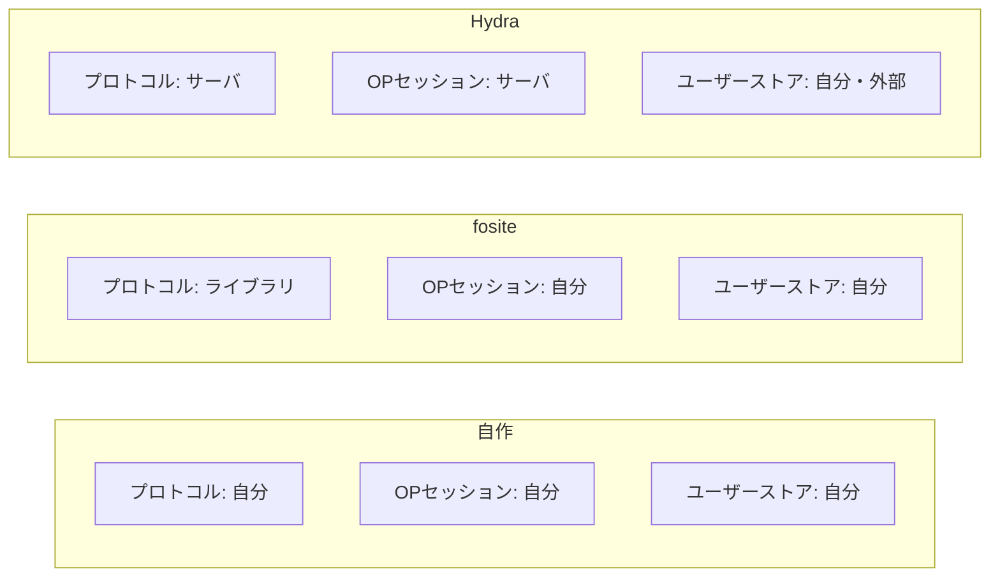
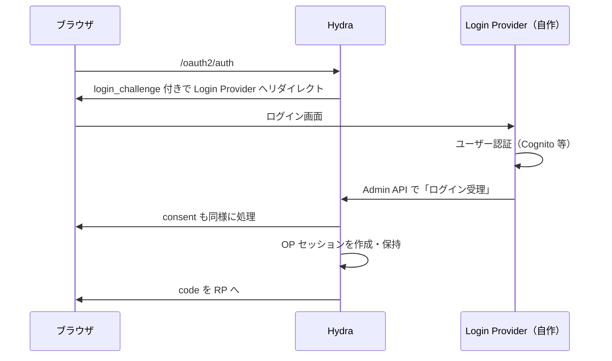

## 前提 — SSO は1点に収斂する

[前回](/blog/oidc-session-and-sso-design/)、OIDC のセッションを RP セッション / OP セッション / トークンの3層に分けた。そして結論はこう一点に収斂した。

> **SSO とは「OP が認証セッションを、ただ1つの権威として保持すること」。それだけ。**

cookie・サーバ側ストア・`prompt=none`・`max_age`・logout 伝播は、すべてこの1つの帰結だった。

```
       ┌─────────────────────────────────────┐
       │  OP セッション = 唯一の認証の権威      │
       └─────────────────────────────────────┘
          │          │           │          │
   cookie で参照  ストアで保持  短絡で再利用  失効で取消
```

だとすると、SSO を「実装する」とは **この OP セッションを実装すること**に等しい。そして実装の選択肢は、要するに「**OP セッションを誰が持つか**」で分かれる。本記事では自作・fosite・Ory Hydra の3つを、その一点に絞って比較する。

## 比較軸は「OP セッションの所有権」一本

機能の多寡で比較すると枝葉に埋もれる。軸を1本に固定する。



ポイントは中段、**OP セッションの行**だ。

- **自作と fosite は同じ**で、OP セッションは自分で書く。
- **Hydra だけが違う**。OP セッションを丸ごと引き受ける。

つまり「fosite を入れれば SSO が楽になる」は誤解で、fosite が肩代わりするのはプロトコル(コード・トークン・grant)であって、**SSO の本体である OP セッションは自作のときと同じだけ自分で書く**。ここを取り違えると選定を誤る。

## アプローチ1: 自作

OP セッションを含めて全部書く。具体的には、自前 OIDC Provider に次を実装することになる。

- セッションストア(`session_id → 記録`。サーバレスなら DynamoDB + TTL)
- OP ドメインの cookie(opaque な `session_id` のみ)
- `/authorize` の SSO 短絡(セッションがあればログイン画面を出さず即 code 発行)
- `prompt` / `max_age` の分岐
- `end_session_endpoint` と back-channel logout の送出
- id_token への `sid` claim

```go
// /authorize の心臓部 — これを自分で書く
sess := h.currentSession(c) // cookie → ストア
switch {
case prompt == "login":
    h.renderLogin(c, ...)              // 強制再認証
case sess != nil && freshEnough(sess, maxAge):
    h.issueCodeAndRedirect(c, sess...) // ← SSO 短絡。再ログインなし
case prompt == "none":
    h.redirectError(c, "login_required")
default:
    h.renderLogin(c, ...)
}
```

| | 評価 |
|---|---|
| 自由度 | ◎ 全部握れる。Cognito 連携・UI・トークン形式・セッション設計すべて思い通り |
| プロトコルの正しさ | △ PKCE・redirect_uri 検証・エラー応答・各種攻撃対策を**自分で正しく書く責任**。ここがリスク |
| サーバレス適性 | ◎ セッションストア以外はステートレスに保てる。Lambda にフィット |
| 学習・保守コスト | OP セッションは中コスト、プロトコル正しさの担保が高コスト |

**向くケース**: 既にユーザーストア(Cognito 等)と自前 UI があり、トークンやセッションを細かく制御したい。プロトコルの正しさを自前で検証し続ける覚悟がある。

## アプローチ2: fosite

[fosite](https://github.com/ory/fosite) は Ory が作る OAuth2/OIDC の**ライブラリ**(Hydra の土台)。サーバではない。今ある Go サービス1個のまま、**自分で書いたプロトコルの中身だけ**を、監査済み・OIDC 認定の実装に差し替えられる。

肩代わりしてくれるもの:

- 認可コード・アクセス/リフレッシュトークンの発行と検証
- PKCE、redirect_uri マッチング、scope 検証、spec 準拠のエラー応答
- grant type(authorization_code / refresh / client_credentials …)の合成
- JWT / opaque のトークン strategy

**自分に残るもの(重要)**:

- **OP セッション(SSO cookie)** ← 自作と同じだけ書く
- login / consent UI
- ユーザー認証(Cognito 連携)
- Storage インターフェースの実装(コード・トークンの永続化)

```go
// fosite は「このユーザーは認証済みか」を判断しない。
// 自分の OP セッションを見て、認証済みなら session を作って fosite に渡す。
sess := h.currentSession(c)          // ← OP セッションは自前のまま
if sess == nil { h.renderLogin(c); return }

ar, _ := provider.NewAuthorizeRequest(ctx, req)
oidcSession := &openid.DefaultSession{ /* sub, claims, auth_time... */ }
resp, _ := provider.NewAuthorizeResponse(ctx, ar, oidcSession) // ← プロトコルは fosite
provider.WriteAuthorizeResponse(ctx, w, ar, resp)
```

| | 評価 |
|---|---|
| 自由度 | ○ ユーザーストア・UI・セッションは自前のまま。プロトコルだけ借りる |
| プロトコルの正しさ | ◎ 監査済み・OIDC 認定。自作の最大リスクが消える |
| サーバレス適性 | △ **ストレージ前提**。コード/トークンの signature をサーバ側保存 → DynamoDB 必須。今までステートレスだった部分がステートフル化する |
| 学習・保守コスト | Storage インターフェースが多く配線が多い。ドキュメントが薄く Hydra のソースを読む場面あり。バージョン間で API が動く |

**注意点**: fosite を入れた瞬間、認可コードやトークンの保存が要る(=ステートレス設計を一部諦める)。ただしこれは**リフレッシュトークンのサーバ側失効が手に入る**という改善でもある。

**向くケース**: 自作の「プロトコルの正しさを自分で保証し続けるリスク」を消したいが、ユーザーストア連携と UI とセッションは自分で握りたい。今回の自前 OIDC Provider に最も思想が近い。

> fosite の代替として **[zitadel/oidc](https://github.com/zitadel/oidc)** の `op` パッケージも同じ枠。fosite より高レベルで配線が少なく採用が速い。OP セッションが自前なのは同じ。

## アプローチ3: Ory Hydra

[Hydra](https://github.com/ory/hydra) は OAuth2/OIDC の**サーバ**(認定済み)。headless で、ユーザー管理も login/consent UI も持たない。代わりに **OP セッションを丸ごと所有する**。

Hydra の login/consent フローはこう動く:



Hydra が引き受けるもの:

- **OP セッション(SSO cookie・記録・有効期限)** ← ここが自作/fosite との決定的差
- consent 管理、logout(RP-initiated / back-channel / front-channel)
- プロトコル全部

自分に残るもの:

- **login provider / consent provider アプリ**(Hydra からのリダイレクトを受けて認証する UI + Admin API 呼び出し)
- ユーザーストア(Cognito 等。Hydra の外)
- Hydra 自身の運用(別サーバ + DB)

| | 評価 |
|---|---|
| 自由度 | △ セッション/consent/logout は Hydra の流儀に従う |
| プロトコルの正しさ | ◎ 認定済み。SSO・logout まで実装済みで提供 |
| サーバレス適性 | ✗ **別サーバ + DB(Postgres 等)前提**。常駐サービス。Lambda 中心の構成とは噛み合わない |
| 学習・保守コスト | login/consent provider の実装 + Hydra 運用。部品が増える |

**向くケース**: SSO・consent・logout の面倒を製品に丸投げしたい。常駐サーバ + DB を運用できる。「自前 OIDC で一番面倒な OP セッション」を**買う**判断。

## 3アプローチ責務マトリクス

| 関心事 | 自作 | fosite | Hydra |
|---|---|---|---|
| 認可コード / トークン / grant | 自作 | ✅ ライブラリ | ✅ サーバ |
| トークン署名・JWKS | 自作 | strategy 差込 | ✅ |
| **OP セッション(SSO)** | **自作** | **自作** | ✅ **サーバ** |
| consent | 自作 | 自作 | ✅(provider は自作) |
| logout / back-channel | 自作 | 自作 | ✅ |
| login UI | 自作 | 自作 | 自作(別アプリ) |
| ユーザーストア(Cognito 等) | 自前 | 自前 | 自前・外部 |
| デプロイ形態 | 1サービス | 1サービス | 別サーバ + DB |
| サーバレス適性 | ◎ | △ | ✗ |

## どう選ぶか

判断は「OP セッションを自分で持ちたいか、買いたいか」の一点に帰着する。

- **OP セッションを自分で持ちたい**(ユーザーストア連携・UI・トークン形式を握りたい、Lambda 中心) → **自作 or fosite**。
  - プロトコルの正しさを自前で保証できる/したい → 自作
  - そのリスクをライブラリに移したい(ステートレスを一部諦める代わり) → fosite / zitadel-oidc
- **OP セッションを買いたい**(SSO/consent/logout を製品に任せ、常駐サーバ + DB を運用できる) → **Hydra**。

Cognito を内部に隠した自前 OIDC Provider を Lambda で運用している場合、Hydra は**思想が逆**になる(常駐サーバ + DB + ユーザーストア外部化)。現実的な二択は **自作 か fosite**。そして両者の差は「OP セッションを書くかどうか」ではなく(どちらも書く)、**プロトコルの正しさを自分で背負うか、ライブラリに移すか**だけだ。

## まとめ

- SSO 実現 = **OP セッションの実装**。選択肢は「OP セッションを誰が持つか」で分かれる。
- **自作と fosite は OP セッションを自分で書く点で同じ**。違うのはプロトコルの正しさを自前で保証するか、ライブラリに移すか。
- **Hydra だけが OP セッションを引き受ける**。代償は常駐サーバ + DB + login/consent provider。サーバレス + 既存ユーザーストア構成とは噛み合わない。
- 「fosite を入れれば SSO が楽になる」は誤解。fosite が消すのはプロトコルのリスクであって、SSO の本体(OP セッション)は自作のときと同じだけ残る。
- Cognito 隠蔽 + Lambda の自前 Provider なら、現実解は **自作 or fosite**。次はこのどちらかで OP セッションを実装する。
