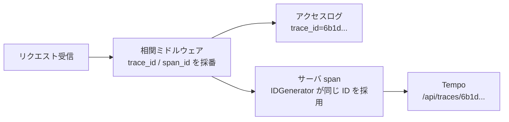

## はじめに

[検証リポジトリ](https://github.com/rikukaInoue/greenfield)の Go のサービス群には、最初から**1リクエスト1行の構造化ログ**があり、各行に `trace_id` と `span_id` が付いています。サービス間の呼び出しでは W3C Trace Context の `traceparent` ヘッダで ID を引き継いでいるので、ログを `trace_id` で絞れば複数サービスにまたがる1リクエストの記録が集まります。

足りないのは**時間の内訳**でした。ログは「このリクエストは 800ms かかった」とは言えても、「そのうち DB が何 ms、下流のサービスが何 ms」とは言えません。そこで OpenTelemetry（OTel）の分散トレーシングを後から入れました。

後から入れるときに一番避けたかったのは、**ログの ID とトレースの ID が別物になる**ことです。別物だと「このエラーログのリクエストのトレースを見たい」ができず、相関の主キーが2つに増えます。この記事の中心はそこをどう揃えたかです。

## 方針: 伝播でなく「採番の向き」を揃える

OTel を入れる素直な方法は、既存の自前伝播を捨てて OTel の伝播（propagator）に置き換えることです。ただしこのリポジトリでは、ID を扱う共通パッケージ（`core`）に OTel の SDK を入れない方針を先に決めていました。全サービスがエクスポータとその依存を抱えることになるためです。

そこで逆にしました。**ID を採番するのは既存のログ側のまま**にして、OTel の SDK にその ID を使わせます。OTel には span の ID をどう作るかを差し替える口（`IDGenerator`）があります。

```go
// Correlate(既存の相関ミドルウェア)が採番した ID を、span の ID としてそのまま使う
func (corrIDGenerator) NewIDs(ctx context.Context) (trace.TraceID, trace.SpanID) {
	if c, ok := middleware.FromContext(ctx); ok {
		tid, err1 := trace.TraceIDFromHex(c.TraceID)
		sid, err2 := trace.SpanIDFromHex(c.SpanID)
		if err1 == nil && err2 == nil {
			return tid, sid
		}
	}
	// 相関情報の外で始まる span(バックグラウンド処理)は乱数で採番する
	return randTraceID(), randSpanID()
}
```

これでアクセスログの `trace_id` / `span_id` と、サーバ span の ID が同じ値になります。



`core` 側は OTel を知らないままです。持っているのは「観測用のミドルウェアを差し込む口」（ただの関数型）だけで、実装は別モジュールの `telemetry` にあり、各サービスの起動処理が注入します。

## 配線

| span の種類 | 入れ方 | 置き場所 |
|---|---|---|
| サーバ span | 自前のミドルウェア | 相関ミドルウェアの直後・**認証より前**（401 で落ちるリクエストにも span を付けるため） |
| クライアント span | `otelhttp.NewTransport` で `http.DefaultTransport` を包む | 各サービスの起動処理 |
| DB span | `otelsql`（`database/sql` のラッパー） | DB 接続を開く関数 |

送り先は Tempo（Grafana のトレース用バックエンド）で、ローカルは docker compose で立てています。`OTEL_EXPORTER_OTLP_ENDPOINT` が未設定なら何も送らず、ミドルウェアは素通しになります。計測の有無でアプリの動作が変わらないようにするためです。

## 実測

写真サービスへの投稿（内部で機材サービスへ紐付けを依頼する）を1回投げ、アクセスログに出た `trace_id` をそのまま Tempo の API に渡しました。

```sh
curl http://localhost:3200/api/traces/6b1d1b158a791ea4064d5cb514f0c09f
```

| 確認 | 結果 |
|---|---|
| ログの `trace_id` で Tempo から取得 | 取得できる |
| ログの `span_id` とサーバ span の ID | 一致（Tempo の JSON は ID を base64 で返すので、16進に直して比較） |
| span の親子 | 写真サービスのサーバ span → クライアント span → 機材サービスのサーバ span |
| 1リクエストの span 数 | 25（両サービスの SQL とフラグ評価を含む） |

エラーログを見つけたら、その行の `trace_id` を Tempo に貼るだけで内訳が出る状態になりました。

## トレースが静かに消える罠4つ

どれも「エラーにならず、トレースが出ないか間違った形で出る」ものでした。

**1. semconv の版がずれると初期化が失敗し、トレースだけが消える。** OTel の SDK は「サービス名」などの属性を semantic conventions（`semconv` パッケージ）の版つきで持ちます。SDK 既定のリソースと、自分で指定したリソースの版が違うと、両者を合成する `resource.Merge` が `conflicting Schema URL` で失敗します。このアプリは「トレースの初期化に失敗したら警告を出して無効のまま動く」設計なので、**アプリは正常に動き、トレースだけが一切出ない**状態になりました。semconv は SDK の既定と同じ版を import します。

**2. グローバルの TracerProvider は、1プロセスに複数サービスが同居すると後から設定したものになる。** 開発時は全サービスを1プロセスで動かしています（[その話](/blog/local-dev-hostname-optional/)）。OTel のグローバル設定（`otel.SetTracerProvider`）は1プロセスに1つなので、写真サービスの DB span が**機材サービス**の名前で記録されました。DB やクライアントの計測にはプロバイダをグローバル経由でなく明示的に渡します。

**3. グローバルの propagator は既定で何もしない。** `otel.SetTextMapPropagator(propagation.TraceContext{})` を呼ばないと、`otelhttp` は `traceparent` ヘッダを付けません。このリポジトリでは既存のクライアントが自前で `traceparent` を付けていたため、**トレース自体は繋がって見え**、クライアント span だけが親子関係から外れていました。気づいたのは親子関係を1本ずつ確認したときです。

**4. 応答したのが意図したプロセスとは限らない。** 検証中、OTel を有効にしたはずの起動で span が1つも届きませんでした。原因は、新しいプロセスがポートの取得に失敗して即座に終了し、**前回から残っていた OTel なしのプロセス**がリクエストに 201 を返していたことです。[fail open の記事](/blog/checks-fail-open/)の事例3と同じ形で、「201 が返った」は「意図した版が返した」を意味しません。

## まとめ

- 既存の相関 ID があるなら、OTel を入れるときは**ID の採番元を既存側に揃える**（`IDGenerator` の差し替え）。ログとトレースの主キーが1つのままになる
- 共通パッケージに OTel を持ち込まず、差し込み口だけを持たせる設計でも後から入れられる
- OTel は設定の漏れがエラーにならず「トレースが出ない」「親子が崩れる」として現れる。semconv の版、グローバルのプロバイダと propagator の3点は、最初に明示しておく
