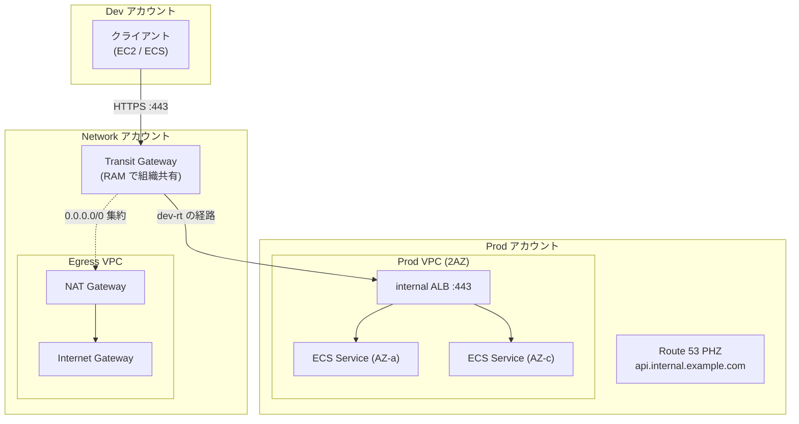
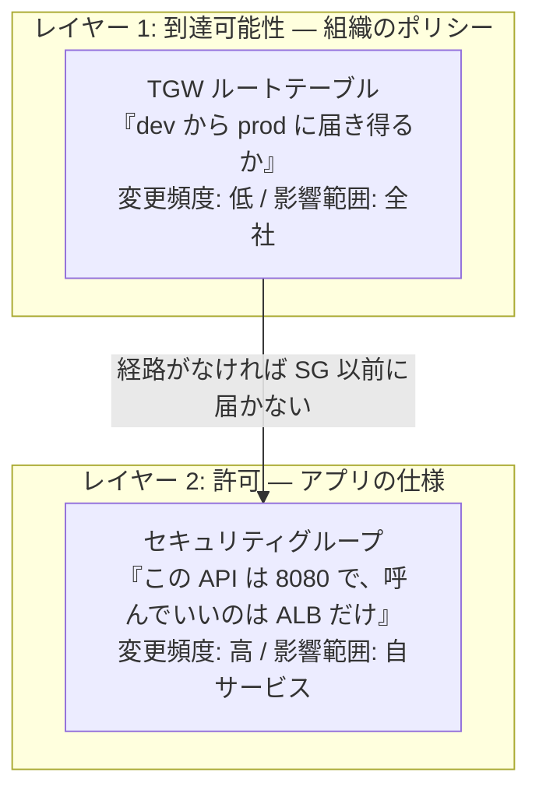
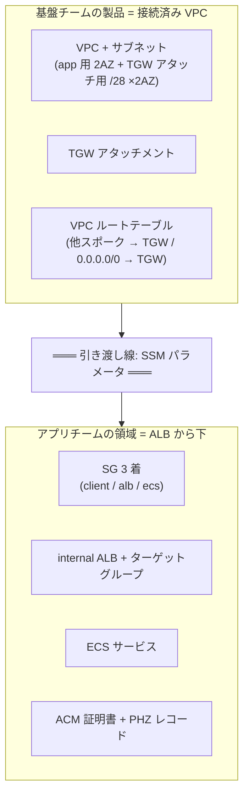
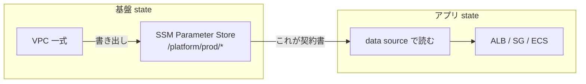
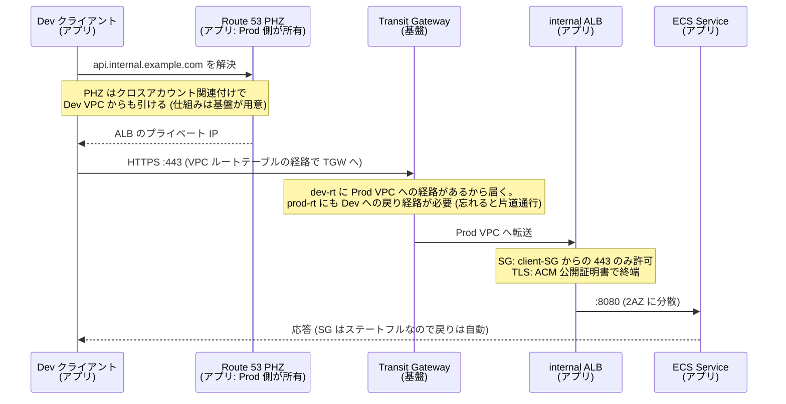
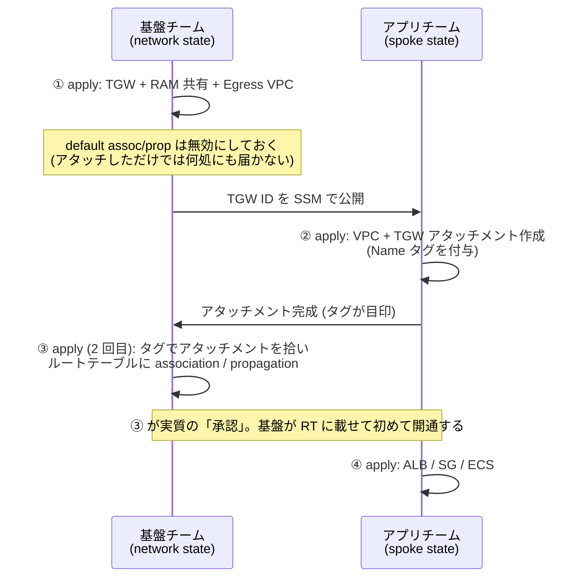
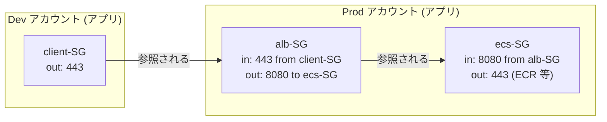
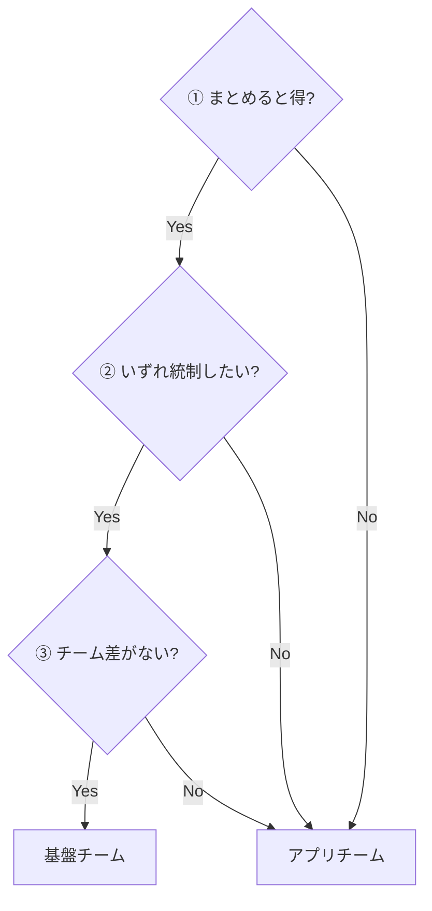

## 問い: 「どこまでが基盤チームの仕事か」

マルチアカウント AWS でネットワークを [Transit Gateway (TGW) で繋ぐ設計](/blog/multi-account-aws-design/)や、[TGW 上のアクセス制御を多層で積む話](/blog/security-group-nacl-over-transit-gateway/)は以前書きました。今回はその続きで、技術レイヤーではなく**チーム境界**の話をします。

問いはシンプルです。

> 共通基盤チームとして担当するのは、どこまでにするのが良いか?

これは技術の問題に見えて、実際は**「変更のたびに誰に依頼が飛ぶか」の設計**です。境界を間違えると、ポートを 1 つ開けるたびにチケットが飛ぶ組織になります。

題材として、次の構成を使います。Dev アカウントのクライアントから、Prod アカウントの internal ALB で受けるプライベート API を呼ぶ、マルチアカウントの定番構成です。



## 原則: 「届き得るか」と「許可するか」は別のレイヤー

境界を引く前に、通信制御が 2 層に分かれていることを押さえます。TGW ルートテーブルとセキュリティグループ (SG) は、どちらも「通信を制御するもの」に見えますが、性質がまったく違います。



- **到達可能性 (ルートテーブル)** は環境分離そのもの。「dev は prod に届かない」は全社ルールであり、変更頻度は低く、間違えたときの影響は全アカウントに及びます。
- **許可 (SG)** はアプリの仕様。ポートも呼び出し元もデプロイのたびに変わり得ます。

この 2 層の切れ目が、そのままチームの境界になります。

> **基盤チーム = 到達可能性まで。アプリチーム = 許可から。**

逆に言うと、**SG を基盤チームが持ってはいけない**。SG はアプリ仕様なので、基盤が握ると全アプリチームの変更が基盤チームのキューに並びます。環境分離はルートテーブルで既に担保されている (dev から prod へは**そもそも経路がない**) のだから、SG はアプリに委ねて安全です。

## 基盤チームの製品は「接続済み VPC」

この原則を Terraform の構造に落とすと、基盤チームが提供する「製品」の形が決まります。**もう繋がっている VPC** です。



この切り方は AWS の文脈で **VPC vending** と呼ばれるパターンです。嬉しさは 2 つあります。

1. **アプリチームがルーティングを壊せない。** ルートテーブルもアタッチメントも基盤の state にあるので、アプリ側の誤 apply で「戻り経路が消えて全断」という事故が構造的に起きません。
2. **障害の一次切り分けが境界と一致する。** 「VPC 内で通らない → アプリ」「VPC を出て通らない → 基盤」。責任境界とデバッグ境界が同じ線になります。

### 引き渡しの契約書は SSM パラメータ

境界を引いたら、境界をまたぐ受け渡しを**契約**として明文化します。基盤は VPC 払い出し後に SSM パラメータを公開し、アプリチームは**それだけを読む**。基盤の state やリソースを直接参照しません。

```text
/platform/<env>/vpc_id
/platform/<env>/private_subnet_ids   # ALB / ECS 用 (2AZ)
/platform/<env>/vpc_cidr
```



「SSM が契約書」という形にしておくと、基盤が内部構造を変えても (サブネットの切り直しなど)、パラメータの互換さえ守ればアプリチームは無風です。remote state の直接参照にしないのは、state の内部構造 (output 名やモジュール構成) への密結合を避けるためです。

トレードオフも明記しておきます。この方式では**サブネットの IP 枯渇や追加サブネットの要望が基盤へのリクエストになる**。だから VPC の標準形 (サブネットサイズ・AZ 数) を最初に固めて「製品のバリエーション」として管理する必要があります。ここが雑だと結局チケット地獄になるので、vending 方式の成否は VPC 標準形の設計次第です。

## リクエストが通るまで — 責任境界をフローで見る

1 本のリクエストが通るまでの流れを、どのステップが誰の管轄かと合わせて追います。



DNS・SG・ALB はアプリの管轄、TGW の経路は基盤の管轄。途中の Note に書いたとおり、このフローが崩れる典型は「戻り経路の入れ忘れ」と「PHZ 関連付け忘れ (ping は通るのに名前が引けない)」で、どちらが起きたかで問い合わせ先が変わることもフローから読み取れます。

## 構築フロー — apply 順序がそのまま承認フローになる

この構成の面白いところは、Terraform の apply 順序が**チーム間の承認フローとして機能する**ことです。ハブ (TGW) はスポークの存在を知らないと経路を書けないため、初回構築は次の順序になります。



ポイントは②と③の間です。TGW の default route table association / propagation を無効にしてあるので、**スポークがアタッチしただけでは、どこにも届きません**。ルートテーブルへの関連付けは TGW 所有者 = 基盤チームにしかできない。つまり「繋ぎたい」というアプリチームの意思表示 (アタッチ) と、「この環境ポリシーで繋ぐ」という基盤の判断 (RT 関連付け) が、**IAM とリソース所有権のレベルで分離**されています。

申請書やレビュー会ではなく、**アーキテクチャで統制する**。これがこの構成の一番の価値だと思っています。

「network を 2 回 apply」は一見ダサいですが、ハブ&スポークの構造的な性質 (ハブはスポークを知らないと経路を書けない) の素直な表現なので、受け入れて CI で直列に流すのが正解です。

## SG はアプリチームのもの — 3 着のチェーン

引き渡し線の下、アプリチーム側の SG 設計も図にしておきます。基本形は**別 SG + 参照のチェーン**です。



SG には「**着る**」(そのリソースの身分証になる) と「**参照する**」(ルールの相手欄に書く) の 2 つの役割があり、このチェーンは「alb-SG は client-SG **を着た者**からの 443 だけ受ける」という参照の連鎖です。IP アドレスが 1 つも登場しないので、スケールしても IP が変わっても追従します。

ここで 1 つアップデートの補足を。以前は「TGW 越えの SG 参照は不可なので CIDR で書く」が定石でしたが、**2024 年 9 月に TGW 越えの SG 参照が GA になりました**。使うための条件があります。

| 項目 | 内容 |
|---|---|
| TGW 本体 | `SecurityGroupReferencingSupport` を有効化 (**デフォルト無効**) |
| VPC アタッチメント | 同設定が必要 (こちらはデフォルト有効) |
| 方向 | **インバウンドルールのみ** (アウトバウンドは非対応) |
| 範囲 | 同一リージョン・同一 TGW に接続された VPC 間 |
| クロスアカウント | `"account-id/sg-id"` 形式で参照 |
| 料金 | 追加なし |

運用としては、まず CIDR で通してから SG 参照に切り替えるのがおすすめです。SG 参照が通らないとき (有効化漏れ・リージョンまたぎ・provider が古い) に、SG のせいかルーティングのせいかを切り分けやすくなります。

## グレーゾーンの判定 — リトマス試験紙

境界の原則を決めても、個別の判断で迷うものは残ります。そのときは次の 3 条件で判定します。

> **① まとめると得をする ② いずれ統制したくなる ③ チームごとの差がない — 3 つ揃ったら基盤に引き取る**



| 対象 | ① 集約効果 | ② 統制欲求 | ③ 無差別性 | 判定 |
|---|---|---|---|---|
| Egress (NAT 集約) | ○ NAT 費用 | ○ 出口統制は必ず来る | ○ 「外に出たい」だけ | **基盤** |
| VPC エンドポイント (各 VPC 配置) | △ | △ | ○ | アプリ (モジュールのオプション) |
| ACM / 証明書 | × | △ 規約のみ | × ドメインはアプリ固有 | アプリ (発行規約は基盤が決める) |
| SG | × | × (RT で担保済み) | × アプリ仕様そのもの | **アプリ** |
| 監視ベースライン (フローログ・必須タグ) | ○ | ○ | ○ | 基盤 |

Egress は 3 条件が綺麗に揃う代表例です。NAT 集約の節約効果は全チーム分をまとめて初めて生まれ、「外向き通信を絞りたい」は監査の文脈でほぼ確実にやってきて、そのとき出口が 1 箇所なら基盤側だけの変更で済む。逆に SG は 3 条件とも満たさないので、どれだけ「ネットワークっぽく」見えてもアプリ側です。

## まとめ

- 通信制御は**到達可能性 (ルートテーブル) と許可 (SG)** の 2 層。この切れ目がチーム境界になる — 基盤は到達可能性まで、アプリは許可から
- 基盤チームの製品は**「接続済み VPC」**。引き渡しは SSM パラメータの契約にして、state の内部構造に依存させない
- TGW の default association/propagation を無効にすると、**apply 順序が承認フローになる**。アタッチ (アプリの意思表示) と RT 関連付け (基盤の判断) が権限レベルで分離される
- SG は基盤が持たない。境界に迷ったら「集約効果・統制欲求・無差別性」の 3 条件で判定する
- 統制は申請書ではなく**アーキテクチャで表現する**。境界設計とはチケットの流れの設計である

1 人で全部やっている環境でも、この線で state を切っておくと「基盤の自分」と「アプリの自分」が分離できて、将来チームに分かれるときそのまま渡せます。
