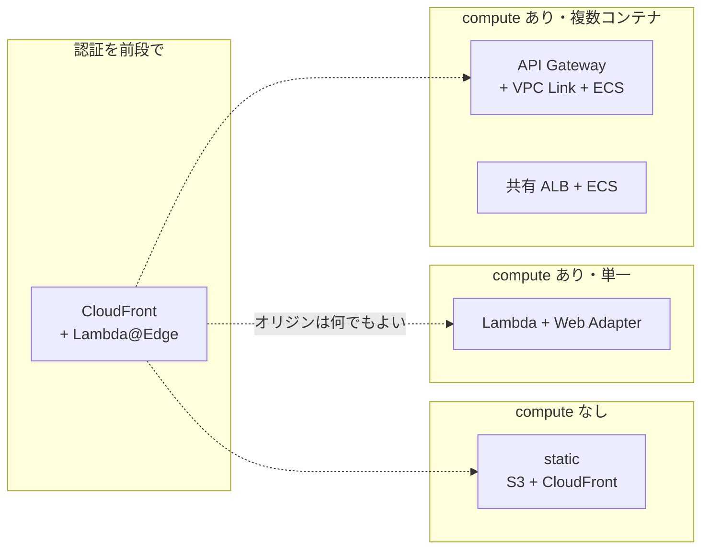
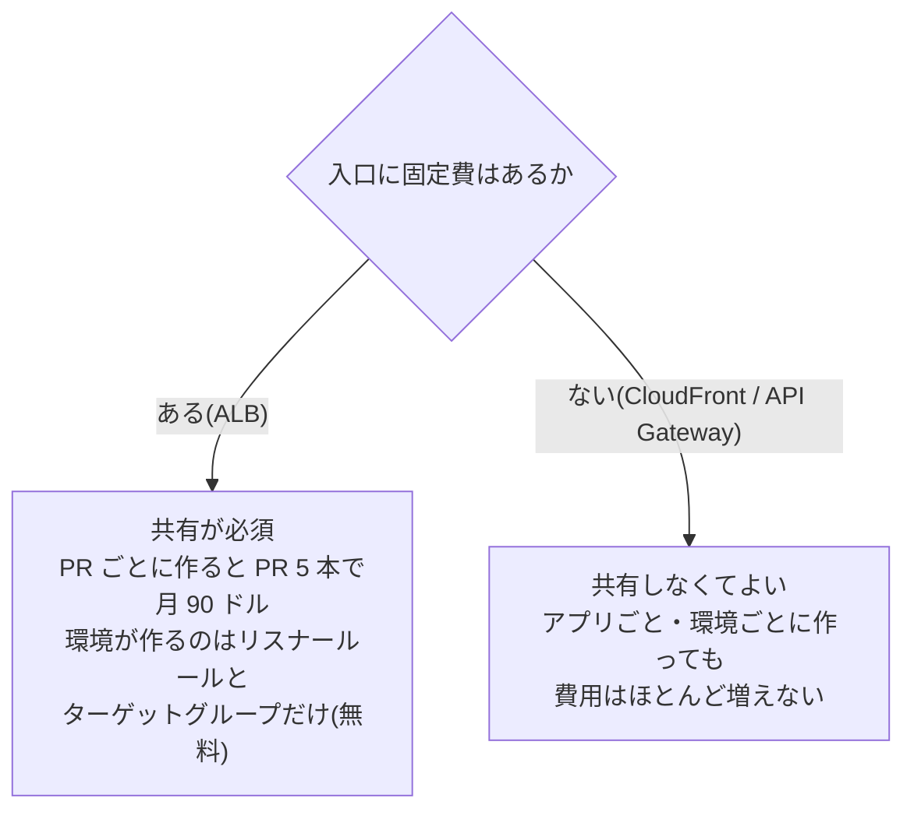
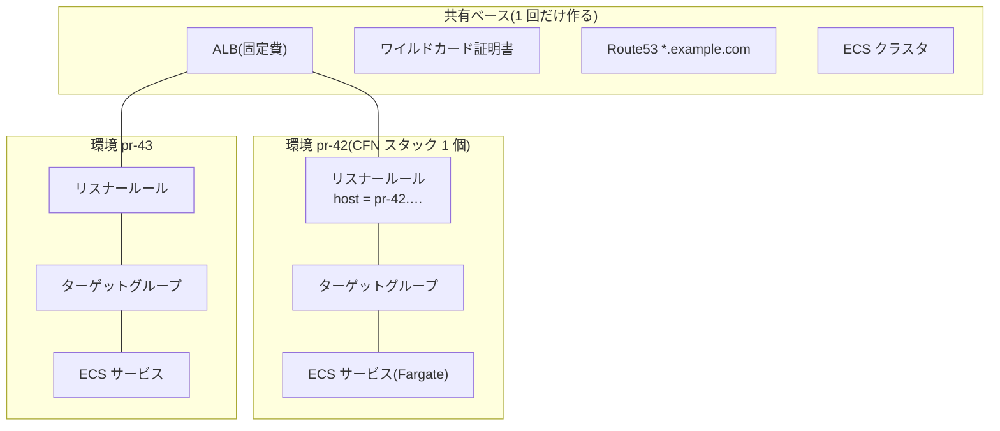
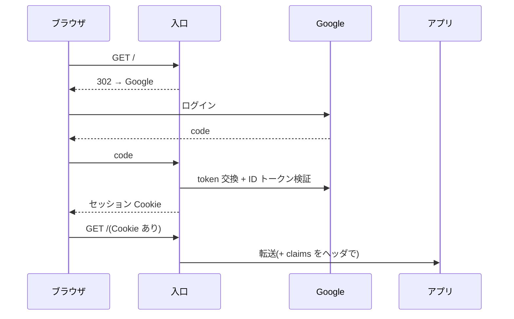
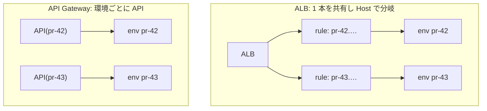
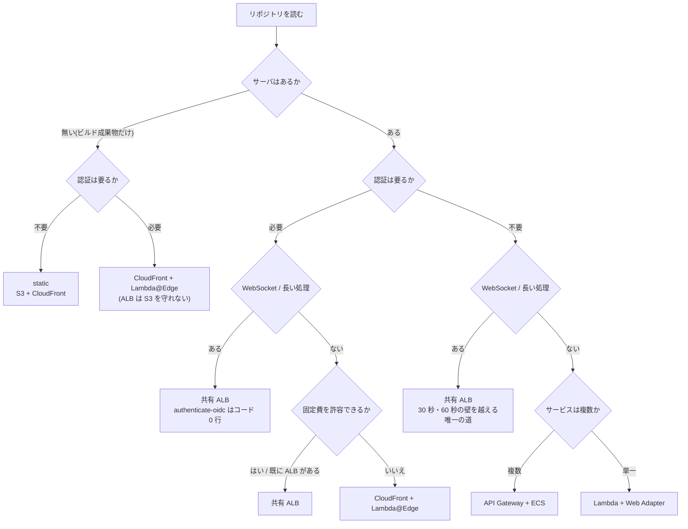
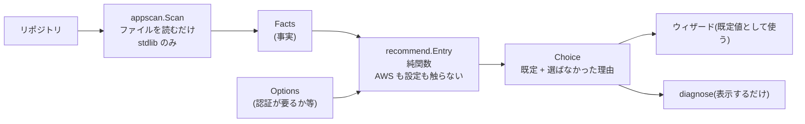

## 今北産業

1. コンテナで動くアプリの**開発用環境をどう組むか**は、毎回同じ判断を人がやり直している。
   これを**ツールに埋め込めないか**、という話
2. 判断の中身は **課金形態・タイムアウト上限・認証方式・ルーティングの単位** の 4 軸で、
   とくに **「共通基盤を共有すべきか」は入口の課金形態が決める**
3. **リポジトリを読めば 8 割は自動で決まる**。残りは人に聞く。
   実装は「走査 → 判定(純関数)→ 提示」に分け、診断コマンドとして単体でも使えるようにした

## 何を支援したいのか

PR ごと・E2E ごとに**使い捨てのコンテナ環境**を AWS に立てる、という文脈。
毎回「Lambda に包むか、ECS で動かすか」「入口は ALB か API Gateway か」「認証はどうするか」を
考え直しており、しかも**判断の根拠が暗黙知**になっている。ここをツールが引き受けたい。

本番と違って、開発用環境には以下の性質がある。本番構成の縮小コピーが最適解にならないのは
このためで、**判断基準そのものが本番とは別物**になる。

- **短命**(数時間〜数日)。TTL で勝手に消える
- **同時に何個も**立つ(PR の数だけ)
- **アイドルが長い**。レビュアーが見る数分以外は誰も触らない
- **社内限定**が普通。公開したくない

この 4 つが、後で効いてくる。

## ツールが選ぶ対象: 入口は 5 通り



実測を並べるとこうなる(東京リージョン、環境 1 つあたり)。

| 入口 | 固定費 | 環境作成 | 環境削除 | リクエスト上限 |
|---|---|---|---|---|
| static(S3+CloudFront) | なし | 数十秒 | 数秒 | — |
| Lambda + LWA | なし | 2〜3 分 | 2〜3 分 | 15 分 |
| API Gateway + ECS | なし | 3 分 40 秒 | 2 分 18 秒 | **30 秒** |
| 共有 ALB + ECS | **約 18 ドル/月** | 2 分 46 秒 | 3〜4 分 | 4000 秒 |
| CloudFront + Lambda@Edge | なし | (前段のみ) | — | 約 60 秒 |

## 判断基準 1: 課金形態が「共有すべきか」を決める

ここが一番大きい。**固定費があるかどうかで、ベース(共通基盤)の設計が反転する。**



CloudFront は従量課金、ACM は無料、Route53 レコードは事実上ゼロ。**per-app でベースを
増やしても増えるのは初回の証明書検証 + 配信作成の待ち時間(約 15 分)だけ**で、
月額はほぼ変わらない。だから「アプリごとに 1 つ」が既定でよい。

ALB は逆で、置いておくだけで課金される。プレビュー環境と両立させるには
**ALB・証明書・DNS・ECS クラスタを共有**し、環境が作るのはリスナールールと
ターゲットグループ(どちらも無料)だけにする。



## 判断基準 2: タイムアウト上限が構成を殺すことがある

意外に見落としやすいのがこれ。**WebSocket や長い処理があると、入口の候補が一気に減る。**

| 入口 | 上限 | WebSocket |
|---|---|---|
| API Gateway HTTP API | **30 秒** | 実質不可(別途 WebSocket API が要る) |
| CloudFront | 約 60 秒(オリジン応答) | 通せるが長時間は不利 |
| ALB | 4000 秒まで設定可 | ✅ |
| Lambda | 15 分 | 単一コンテナなら可 |

つまり **WebSocket / SSE / 長いバッチ API があるなら、固定費を払ってでも ALB**、という
判断になる。逆にリクエストが常に短いなら、固定費ゼロ側を選ばない理由が無い。

## 判断基準 3: 認証方式 — 開発環境は社内限定が普通

「Google Workspace の社員だけ入れる」はよくある要件で、**これが入口の選択を一番強く
縛る**。ブラウザのログインリダイレクト(OIDC の認可コードフロー)を誰が担うかが
入口ごとに違うからだ。



この「E」を誰がやるか:

| 入口 | ブラウザのログイン | 実装量 |
|---|---|---|
| **ALB** | `authenticate-oidc` アクションで**標準搭載** | **コード 0 行**(設定のみ) |
| **CloudFront + Lambda@Edge** | viewer-request で自前実装 | コードあり。ただし **static も守れる** |
| API Gateway HTTP API | **できない**(JWT オーソライザーはトークン検証のみ) | 前段に CloudFront が要る |
| S3 単体 | できない | 同上 |

ALB の月 18 ドルは、この文脈では **「認証をコード 0 行で買う値段」** という意味を持つ。
一方 Lambda@Edge は固定費ゼロで、**静的配信にも同じ認証をかけられる**唯一の選択肢。
代わりに環境変数が使えない(シークレットをコードに焼くか SSM から読む)、
デプロイ伝播が数分かかる、という運用コストを払う。

### `hd` はヒントであって強制ではない

Google の OIDC で「Workspace のドメインだけ」を実現するとき、認可リクエストに
`hd=example.com` を付ける方法がよく紹介される。**これは UI のヒントで、強制ではない。**
きちんと締めるなら **ID トークンの `hd` クレームを検証する**。ALB なら
`x-amzn-oidc-data`(署名付き JWT)がアプリに渡ってくるので、そこを見る。

## 判断基準 4: ルーティングの単位 — URL を変えないために

プレビューの URL をパス型にすると、アプリ側に影響が出る。

```
https://preview.example.com/pr-42/...   ← basePath 対応、Cookie スコープ、
                                           SPA ルーティングが全部影響を受ける
https://pr-42.app.example.com/...       ← 本番とほぼ同じ挙動
```

**Host ベースにするのが基本**。ここで入口ごとの制約が出る:

- **ALB**: リスナールールの条件に **host-header** が使える → 1 本の ALB を共有しつつ
  Host で環境を分けられる
- **API Gateway HTTP API**: ルートキーは **メソッド + パス**で、**Host を見ない**。
  1 つの API を共有すると全環境が `ANY /{proxy+}` を取り合って衝突する →
  **環境ごとに API を持つ**(固定費ゼロなので問題ない)
- **CloudFront + Lambda@Edge**: origin-request で Host を見てオリジンを差し替えられる →
  1 つの配信で何環境でも捌ける



ちなみにワイルドカード証明書は **1 ラベルしか覆えない**。`*.example.com` は
`pr-42.example.com` に一致するが `pr-42.todo.example.com` には**一致しない**。
1 つのドメインを複数アプリで共有したいなら、`todo--pr-42.example.com` のように
**project を同じラベルに畳む**か、アプリを足すたびに証明書へ SAN を追加することになる。

## 4 軸を 1 枚のフローに落とす

ここまでの判断基準を、ツールが実行できる形にするとこうなる。



原則は **「安くて早い方から降り、その構成では無理な理由があるときだけ次へ」**。
プレビュー環境は本番と同じ構成である必要がないので、本番が ALB でもプレビューは
API Gateway で足りることは多い。

## 入力はリポジトリから取れる

ツール化で一番効いたのはここで、**判定の入力はほとんどリポジトリに書いてある**。

| 判定に要る事実 | どこから読むか |
|---|---|
| サーバがあるか | Dockerfile / `EXPOSE` / compose の ports |
| サービス数 | compose の services / `cmd/*/main.go` / Dockerfile の数 |
| WebSocket / SSE | `gorilla/websocket`, `socket.io`, `EventSource` などの依存 |
| listen ポート | `EXPOSE`(マルチステージなら最後)/ compose |
| DB を使うか | `mysql2`, `pg`, `go-sql-driver/mysql` などの依存 |

逆に**リポジトリからは絶対に分からないこと**もある。

- ALB の固定費を許容できるか(組織の事情)
- 社内限定にする必要があるか
- ドメインをどこまで使ってよいか

だから **自動判定ではなく「検出で既定を決める推薦」** にするのが正しい。
機械が決めるのは既定値だけで、決められない部分は聞く。そして**選ばなかった選択肢の
理由を見せる**ことが大事で、「なぜ Lambda ではなく ECS なのか」が分からないまま
生成されるより、1 行の理由がある方がずっといい。

## 実装: 走査・判定・実行を分ける

[kagerou](https://github.com/rikukadev/kagerou)(PR や E2E で使い捨てるコンテナ環境を
作る OSS)に実装した。**支援ツールとして成立させる鍵は、層を分けること**だった。



**事実の収集・判定・実行を分けておく**と、判定だけを単体で使える。実際
`kagerou diagnose` は、どのリポジトリでも**ファイルを 1 つも書かず AWS も呼ばずに**
実行できる:

```
$ kagerou diagnose --dir ../some-app
kagerou diagnose  acme/shop

detected
  framework    go
  services     3
  port         8080
  dockerfile   yes

recommended
❯ apigateway  複数サービスを固定費ゼロで動かせる(リクエストは 30 秒まで)
  alb         上限は無いが、月 18 ドル前後の固定費がかかる
  lambda      単一コンテナ向け(複数サービスを検出)

no files were written and no AWS calls were made.
```

仮定を変えて試せるのも実用的で、`--auth` を付けると既定が入れ替わる:

```
$ kagerou diagnose --dir ../some-app --auth
❯ edge        固定費ゼロ。static も同じ認証で守れる(認証は自前実装)
  alb         認証はコード 0 行だが、月 18 ドル前後の固定費がかかる
  apigateway  ブラウザのログインリダイレクトができない
```

判定が純関数なので、テストは表で書ける。これが一番の利点だと思う——
「WebSocket があるなら API Gateway を既定にしない」のような**設計判断そのものを
テストで固定**できる。

## まとめ

コンテナ開発環境の構成を決める作業は、思ったより機械化できる。

- 判断基準は 4 軸に整理できる: **課金形態・タイムアウト上限・認証方式・ルーティングの単位**
- **固定費の有無が共通基盤を共有すべきかを決める**。ALB だけが共有必須
- **タイムアウト上限は静かに構成を殺す**。WebSocket があるだけで候補が 1 つに絞られる
- **認証を前提にすると ALB と Lambda@Edge の一騎打ち**になる。「コード 0 行」と
  「固定費ゼロ + static も守れる」のトレードオフ
- 実装は **走査 → 判定 → 実行**に分ける。判定を純関数にしておくと、
  設計判断そのものをテストで固定でき、診断だけを切り出して他リポジトリでも使える

支援ツールとして大事なのは、**決められることは決め、決められないことは聞き、
選ばなかった理由を残す**こと。全部自動にしようとすると、リポジトリからは分からない
組織の事情(固定費を許容できるか、社内限定にするか)で必ず破綻する。

関連: [PR ごとに現れて消える環境を OSS にした](/blog/kagerou-ephemeral-environments/)、
[信頼ポリシーが正しいのに OIDC が拒否される](/blog/github-actions-oidc-id-sub-claim/)
