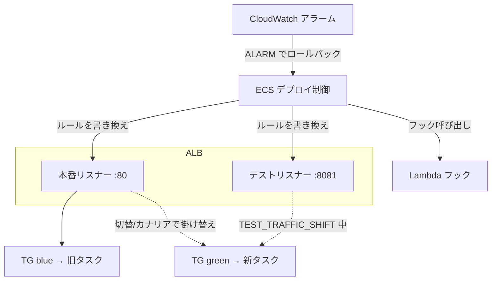
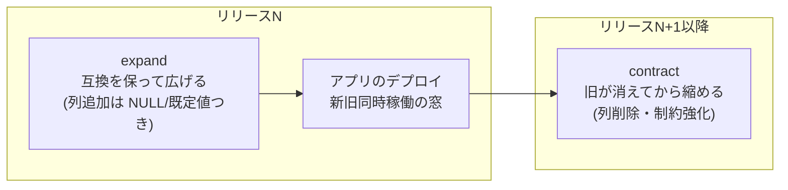
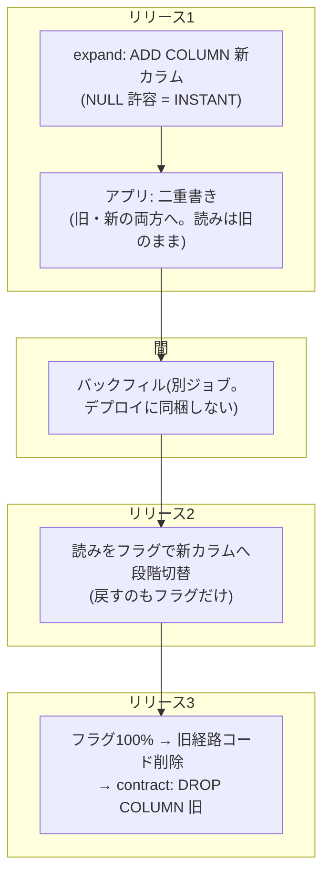

## はじめに

[前編](/blog/progressive-delivery-intro/)で、プログレッシブデリバリーを「置く・当てる・見せる」に分解しました。この記事はその実装編で、**アプリ層と DB 層ではプログレッシブの意味がまったく違う**、という話をします。

- **アプリ層**: トラフィックは割合で割れる。20% だけ新版に当てる、駄目なら戻す、が**空間的に**できる
- **DB 層**: スキーマは1つしかない。「20% のリクエストだけ新スキーマ」はできないし、`ALTER` の巻き戻しは高くつく。だから**時間的に**分ける — 互換を保って先に広げ、旧版が消えてから縮める

前半でアプリ層、後半で DB 層、最後に両者の噛み合わせを、それぞれ実測値つきで書きます。検証環境は Go + ECS Fargate + ALB + MySQL/Aurora です。

## アプリ層: トラフィックを空間で割る

### 仕組み — ECS がロードバランサを掛け替える

CodeDeploy を使わない ECS ネイティブのデプロイ（2025-10 GA）は、**ALB のリスナールールの forward 先を、ECS 自身が2枚のターゲットグループ（TG）の間で掛け替える**ことで成立します。



```hcl
load_balancer {
  target_group_arn = aws_lb_target_group.photo.arn        # 本番用
  advanced_configuration {
    alternate_target_group_arn = aws_lb_target_group.photo_alt.arn # 2枚目
    production_listener_rule   = aws_lb_listener_rule.photo.arn    # default_action 不可。明示ルール必須
    role_arn                   = aws_iam_role.ecs_infra.arn        # ECS が ELB を操作するロール
  }
}
deployment_configuration {
  strategy             = "BLUE_GREEN"   # CANARY / LINEAR は別 strategy
  bake_time_in_minutes = 2
}
```

測る前提として、**「どの版が応答したか」を外から見る観測口**が要ります（同じイメージの新旧タスクは応答から区別できない）。全応答に `X-Service-Revision` ヘッダを載せる数行を、認証より外側に入れました。これが無いと検証は「重みを設定した」で止まります。

### 実測 — 同じ壊れた版を3つの防衛層で

切替の無停止は確認済み（0.5秒間隔の可用性ループで、B/G 切替をまたぐ **503 リクエスト非200 ゼロ**。カナリアでは `200/800` = 20% の重みを ALB 上で観測）。その上で、**同じ壊れた版**（healthz は正常・書き込みだけ 500）を3つの層でデプロイして被弾数を測りました。

**① 昇格ゲート — 被弾 0 / 1,679。** `TEST_TRAFFIC_SHIFT` 段階では本番トラフィックを1件も流す前に、テストリスナー経由で新版にテストトラフィックが当たります。そこに Lambda フックを置く:

```python
# healthz だけでは「書き込みのみ壊れる版」を素通しする。書き込みまでやる
def check():
    for _ in range(3):
        urlopen(base + "/healthz")     # 到達性(base はテストリスナー)
    POST(base + "/v2/photos", ...)     # 書き込み(DB 経路まで通す)

def handler(event, context):
    return {"hookStatus": "SUCCEEDED" if check() else "FAILED"}
```

壊れた版はフックの書き込み検証で捕捉され（`verdict: create 500`）、103秒で自動ロールバック。デプロイ全体をまたいで流し続けた実 API 負荷 1,679 リクエストは**エラー0**。**ゲートの価値は検証の深さで決まります** — healthz だけ見るフックならこの版は素通りしていた。

**② カナリア + アラーム — 被弾 69 / 2,880（2.4%）。** ゲートを外して（テストで検知できない壊れ方の代役）CANARY 20% + ALB 5xx アラーム連動で流すと、発火と同刻にロールバック開始、4分50秒で復旧。被弾 69 件の正体は「メトリクス集計60秒 + 計測遅延」という**検知の窓そのもの**です。

```json
"deploymentConfiguration": {
  "strategy": "CANARY",
  "canaryConfiguration": { "canaryPercent": 20.0, "canaryBakeTimeInMinutes": 3 },
  "alarms": { "alarmNames": ["target-5xx"], "enable": true, "rollback": true }
}
```

**③ stopDeployment — 32秒。** bake 中に `aws ecs stop-service-deployment --stop-type ROLLBACK` を1発で、本番の応答が旧版に戻るまで32秒。bake 中は旧タスクが生きているので、戻すのは TG の向き先変更だけ。**bake はロールバック先を温存する保険料**です。

アプリ層のまとめ: 3層は直列で、テストで落とせる壊れ方は本番に触らせず（0/1,679）、抜けたものをカナリアが 2.4% に閉じ、それも抜けたら32秒で戻す。

## DB 層: スキーマを時間で分ける

### なぜ割合で割れないか

上の全部 — B/G の並走、カナリアの窓、bake — は**新旧のバイナリが同じ DB に同時接続する時間**を作ります。スキーマは1つ。つまりアプリ層のプログレッシブは、「新旧どちらのバイナリでも動くスキーマ」という前提の上にしか成立しません。

そこで DB のマイグレーションを expand / contract の2系統に分けます。



「旧バイナリが expand 済みスキーマで本当に動くのか」は実測で確認しました。**列追加「前」のコミットからビルドした旧イメージを、追加「後」のスキーマに接続** → 書き込み 201・一覧 200・新列は既定値の NULL。互換が守られている限り、アプリ側は何段構えのデプロイでもできます。

### expand に置いてよい DDL を機械で縛る

expand が「互換を保つ」だけでは足りず、**オンラインで安全に流せる**必要もあります。MySQL の `ALTER TABLE` には3方式あり、影響が桁で違います。

| 方式 | 何をするか | 所要 |
|---|---|---|
| INSTANT | メタデータのみ | 数十 ms、行数非依存 |
| INPLACE | 再構築するが並行 DML は概ね可 | 行数に比例 |
| COPY | テーブル丸ごと作り直し | 行数に比例して長い + DML 制限 |

指定しなければ MySQL は通る方式へ**黙って**落とします。軽いつもりの DDL が COPY で流れても「成功」する — だから `ALGORITHM=INSTANT` を明示する規約にし、CI が検査します。明示すれば通らない方式は `ERROR 1845` で失敗し、**判定そのものが結果として返る**。

この判定は手元の MySQL 8.4 と Aurora（8.4互換版）で**1行も違いません**でした。COPY にしかならない DDL（`ADD CHECK` 等）は 2M 行で **56秒** — 1億行なら45分超の見積もりで、これはデプロイ戦略でなく計画（gh-ost / 保守時間）の問題です。その計画に使えるのが Aurora fast clone: copy-on-write なのでデータ量に依存せず**約5分半**で本番同等の使い捨て DB が出ます。デプロイの部品ではなく、COPY 系 DDL のリハーサル用です。

### 読み替えはフラグ、contract はフラグ 100% の後

expand で列を足しただけでは何も変わりません。新しい列を**読む**側の切り替えはデプロイでなくフィーチャーフラグでやります（切替は実測 14 秒・再起動なし）。切替に失敗してもフラグを戻すだけで、デプロイもマイグレーションも巻き戻さない。フラグが 100% に到達して旧経路のコードを消した後、はじめて contract（旧カラムの削除）を実行します。読みと書きがコード上で分かれていると、二重書きと読み切替を独立に進められます（[CQS がスキーマを動かすときに効く](/blog/cqs-pays-off-at-migration/)）。

### 実例: カラム改名を3リリースに割って無停止で通す

部品を並べただけでは絵空事なので、**カラム改名**を止めずに通した実測を置きます。`RENAME COLUMN` 一撃は互換の窓を壊す（旧バイナリが旧名で読み書きした瞬間に死ぬ）ので、3リリースに割ります。



割り方の理由: 二重書きが先でないとバックフィル済みの行に差分が生まれ続ける／バックフィル（行数比例）をリリースのクリティカルパスに置かない／読み切替の失敗をフラグ1本で戻せる形にする／contract は旧経路が消えた後でのみ安全。負荷を流し続けながらの通し実行で**リクエストエラー 0 件・新旧カラムの一致率 100%** でした。この型（Parallel Change）の深掘りは[無停止移行の記事](/blog/online-migration-and-deploy-isolation/)へ。

## 噛み合わせ: 順序も機械で守る

2つの層の接続部も実測しました。

- **migrate が失敗したらデプロイを始めない**: 壊れた DSN で migrate タスクを流す → exit 1 → ジョブグラフが release 工程をスキップ → サービスのタスク定義は不変。expand 先行という順序が、人の注意力でなく実行機構で守られる
- **旧バイナリ × 新スキーマ**（前述）: expand/contract の互換が、B/G の同時稼働窓・カナリア窓・bake というアプリ側の全戦略の前提条件になっている

つまり「DB は互換を保って先に広げ、アプリは何段構えでも安全に切り替え、失敗はどの層でも縛った範囲に閉じる」という全体像が、両層の実測でつながります。

## 踏んだ罠

- **Terraform provider の fail open**: 無効なデプロイ設定（BLUE_GREEN + canary_configuration）を黙って捨てる。API なら1秒で弾かれるミスが plan/apply とも「成功」で通り、重みが出ないという観測からしか発覚しない
- **healthz を信じすぎる**: ゲートの検証は業務の書き込みまで通す。healthz は壊れた版でも緑
- **IaC が知らない設定は IaC に剥がされる**: フックやアラーム連動を CLI で付けると、次の tf apply が黙って消す。どちらを正にするか決めてから運用に入る
- **DDL の方式は明示しないと分からない**: ローカルで速かった ALTER が本番で COPY に落ちても、エラーは出ない
- **プロセスを kill する検証は事故のもと**: 生き残った旧プロセスが結果を静かに汚す。「停止中」はプロセス操作でなく起動順で作る

## まとめ

| 層 | プログレッシブの形 | 鍵の実測 |
|---|---|---|
| アプリ | トラフィックを**空間**で割る（ゲート → カナリア → bake） | 被弾 0/1,679 vs 69/2,880、stopDeployment 32秒 |
| DB | スキーマを**時間**で分ける（expand → 同時稼働窓 → contract） | 旧バイナリ×新スキーマが正常動作、INSTANT 判定は Aurora でも一致、COPY 2M行56秒 |
| 読み替え | フラグで切替、contract はフラグ 100% の後 | 切替 14 秒。改名一式エラー 0 件で完走 |
| 接続部 | 順序は実行機構で守る | migrate 失敗 → release 不開始 |

一言でまとめると: **アプリは割合で出す。DB は段階的には出せないから、互換の窓で参加し、窓に置けるもの（INSTANT）を機械で選別し、置けないもの（COPY）は窓の外で計画する。**

では、これらの部品をどの変更にどう組み合わせ、誰が判断するのか — [選び方、そして選ばせない運用](/blog/deploy-strategy-selection/)に続きます。

## 参考

- [Amazon ECS canary deployments — lifecycle stages](https://docs.aws.amazon.com/AmazonECS/latest/developerguide/canary-deployment.html)
- [Gradual deployments in Amazon ECS](https://aws.amazon.com/blogs/containers/gradual-deployments-in-amazon-ecs-with-linear-and-canary-strategies/)
- [MySQL 8.4: Online DDL Operations](https://dev.mysql.com/doc/refman/8.4/en/innodb-online-ddl-operations.html)
