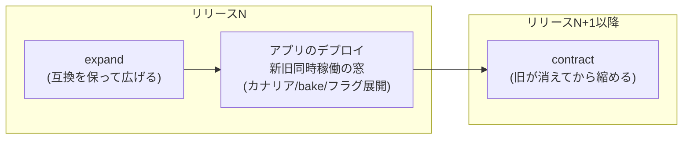
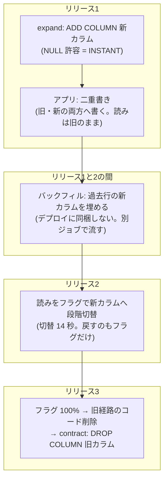

## はじめに

プログレッシブデリバリー — カナリア、Blue/Green、フィーチャーフラグ — の話は、
ほとんどアプリ側の話として語られます。実測もアプリ側から始めました。

- [ECS ネイティブ B/G・カナリアの実測と使い分け](/blog/ecs-native-bluegreen-canary/)
- [カナリアは失敗を消さない — ECS 3層防衛の実測](/blog/ecs-deployment-gates-measured/)（被弾 0/1,679 vs 69/2,880）
- [リリースの巻き戻しはデプロイと別のレバー — フラグ実測14秒](/blog/feature-flag-release-lever/)
- [B/G とカナリアの選び方、そして選ばせない運用](/blog/deploy-strategy-selection/)（総集編）

この記事はその**DB 側**です。出発点は単純な非対称にあります。
アプリは新旧を並べて 10% だけ新版に流せる。しかし **DB は1つで、
「スキーマの 10% だけ新しい」は存在しない**。カナリア中も、bake 中も、
フラグ 50% 展開中も、新旧のアプリは**同じスキーマ**を読み書きしています。

つまり DB はプログレッシブデリバリーに「割合」では参加できない。
参加する形は別にあって、それを直近の DB 系の検証（INSTANT DDL 判定、
Aurora との突き合わせ、migrate ゲート、fast clone）の実測値でまとめます。

## 新旧バイナリが同じ DB を使う時間を、expand / contract で支える

アプリ側のどの戦略を選んでも、必ず**新旧のバイナリが同じ DB に同時接続する時間**が
生まれます。カナリアの窓、B/G の bake、フラグの段階展開 — 全部そうです。
DB の仕事はこの窓を支えること、つまり**新旧どちらのバイナリでも動くスキーマで
あり続けること**です。

だからマイグレーションは expand / contract の2系統に分けます。先に互換を保って
広げ（expand）、旧バイナリが完全に消えてから縮める（contract）。
「旧バイナリが expand 済みスキーマで本当に動くのか」は言葉でなく実測で
確認しました — 列追加**前**のコミットからビルドした旧イメージを、追加**後**の
スキーマに接続して、投稿も一覧も正常に動く。この互換が守られている限り、
アプリ側は好きな戦略で何段構えにでもできます。

この窓を安全に保つ部品が4つあり、それぞれ実測値を持っています。

## 部品1: expand の DDL は ALGORITHM=INSTANT で通るものに限る

窓の間、DDL は**動いている本番テーブル**に当たります。そこで expand に同梱できる
DDL を `ALGORITHM=INSTANT` で通るものに制限します。INSTANT はメタデータ書き換えのみで
行数に依存せず、数十 ms で終わる。

この規約の要は「INSTANT で通るか」が**測れば白黒つく**ことです。ALGORITHM を
明示すると、通らない方式は `ERROR 1845` で失敗する — 判定そのものがエラーの有無として
返ってきます。だから CI に置けて、開発者が判断する必要がない。

判定は DB 実装を跨いでも同じか？ [Aurora MySQL（8.4 互換版）と手元の MySQL 8.4.11 で
突き合わせた](/blog/aurora-instant-ddl-fast-clone/)結果、**どの方式が通るかは
1行も違いませんでした**。列追加・DEFAULT 変更・列削除は INSTANT、ADD CHECK だけが
COPY のみ。規約は RDS でも Aurora でもそのまま持ち込めます。

## 部品2: migrate が失敗したらデプロイを始めない

expand はアプリのデプロイの**前**に、独立したジョブとして流します。ここが
ゲートになる: **migrate が失敗したらデプロイを始めない**。

ECS では one-off タスクの exit code がそのままゲートになります。わざと壊れた
DSN で migrate タスクを流す実験では、exit 1 → release 工程がスキップされ、
サービスのタスク定義は不変 — 環境は無傷のまま止まりました。
「migrate は成功したがデプロイで壊れた」はアプリ側の防衛層（ゲート付き B/G）が
受け持ち、「migrate 自体が壊れている」はそこまで到達させない。層の分担です。

## 部品3: 読みの切り替えはフラグ、contract はフラグ 100% の後

expand で列を足しただけでは何も変わりません。新しい列を**読む**側の切り替えは
デプロイではなくフィーチャーフラグでやります（[実測 14 秒・再起動なし](/blog/feature-flag-release-lever/)）。
切り替えに失敗したらフラグを戻すだけで、デプロイのロールバックは要らない。

フラグが 100% に到達して旧経路のコードを消した後、はじめて contract
（旧カラムの削除）を実行します。切り替えを単純に保てるかはコードの形にも
依存していて、読みと書きが分かれていると、二重書き（書き側）と読み切替（読み側）を
独立に進められる — これは [CQS がスキーマを動かすときに効く](/blog/cqs-pays-off-at-migration/)
という話として別に書きました。

## 部品4: COPY にしかならない DDL は clone でリハーサルして計画で解く

ADD CHECK のように COPY にしかならない DDL は、どのデプロイ戦略を選んでも
吸収できません。2M 行で 56 秒（db.t4g.medium 実測）は、1億行なら 45 分超の
テーブルコピーです。これは窓の中でやる話ではなく**計画の問題**として例外運用に
回します: 本番同等データでリハーサルして所要を測り、保守時間か gh-ost /
pt-online-schema-change を選ぶ。

リハーサル環境は Aurora の fast clone が担えます。copy-on-write なので所要は
データ量に依存せず、**接続可能まで 5 分 34 秒**（うち 8 割はインスタンスの
プロビジョニング）。clone への書き込みは元に波及しないことも実測済みなので、
「壊す予行」も安全にできます。逆に、この 5〜6 分 + インスタンス課金という数字は、
clone を**毎回のデプロイの部品にはしない**判断の根拠でもあります。

## 実例: カラム改名を3リリースに割って無停止で通す

部品を並べただけでは絵空事なので、**カラム改名**を止めずに通した実測を置きます。
改名は `RENAME COLUMN` 一撃だと互換の窓を壊す（旧バイナリが旧名で読み書きした瞬間に
死ぬ）ので、オンラインマイグレーションとして**3リリースに割ります**。

3つに割る理由はそれぞれ明確です。

- **書きを先に両方へ**向けておかないと、バックフィルが終わった端から新しい書き込みで
  差分が生まれる。二重書きが先、埋めるのは後
- **バックフィルをデプロイに同梱しない**のは、行数に比例する処理をリリースの
  クリティカルパスに置かないため。migrate ゲート（部品2）が守るのは「速い expand」
  だけでよい
- **読み切替をフラグにする**（部品3）ことで、切替の失敗はフラグを戻すだけになる。
  デプロイもマイグレーションも巻き戻さない
- **contract は旧経路のコードが消えた後**。旧バイナリも旧経路も存在しない状態で
  初めて DROP が安全になる

この一連を、負荷スクリプトでリクエストを流し続けながら通しで実行した結果が
**リクエストエラー 0 件・新旧カラムの一致率 100%** です。どのリリースの瞬間にも
新旧のバイナリが同居し、そのすべての瞬間でスキーマは両方と互換 — 冒頭の
「互換の窓」が実際に機能していることの通し検証になっています。
なぜこの型（Parallel Change）に落ち着くのか、gh-ost との違いやバックフィルの
評価方法まで含めた深掘りは[無停止移行の記事](/blog/online-migration-and-deploy-isolation/)に
書きました。

## 部品と実測値の対応

| 部品 | 役割 | 実測値 |
|---|---|---|
| expand / contract | 新旧同時稼働の窓を互換で支える | 旧バイナリ×新スキーマで正常動作 |
| INSTANT 制約 | 窓の間の DDL を無害に保つ | 判定は ERROR 1845 で機械化。Aurora と判定完全一致 |
| migrate ゲート | 壊れた expand をデプロイ前に止める | exit 1 → デプロイ不開始・環境無傷 |
| フラグ切替 → contract | 読み替えと縮小を分離する | 切替 14 秒。改名一式エラー 0 件で完走 |
| fast clone | 例外 DDL のリハーサル | 5 分 34 秒・データ量非依存・書き込み独立 |

アプリ側の総集編が「選べる機構の上に、選ばせない運用を組む」だったのに対し、
DB 側の結論はこうなります: **DB は段階的には出せない。だから互換の窓で参加し、
窓に置けるもの（INSTANT）を機械で選別し、置けないもの（COPY）は窓の外で計画する。**

## まとめ

- プログレッシブデリバリーの間、DB は常に1つ。参加の形は「割合」でなく
  **「新旧どちらでも動く互換の窓」**（expand / contract）
- 窓に置いてよい DDL は INSTANT で通るものだけ。判定はエラーの有無として返るので
  CI で機械化でき、Aurora でも判定は変わらない（実測で1行も差なし）
- migrate はデプロイの前段ゲート。失敗したらデプロイ自体が始まらない
- 読み替えはフラグ（14 秒）、縮小（contract）はフラグ 100% の後
- COPY にしかならない DDL はデプロイの語彙から外し、clone（5 分 34 秒）で
  リハーサルして計画で解く
