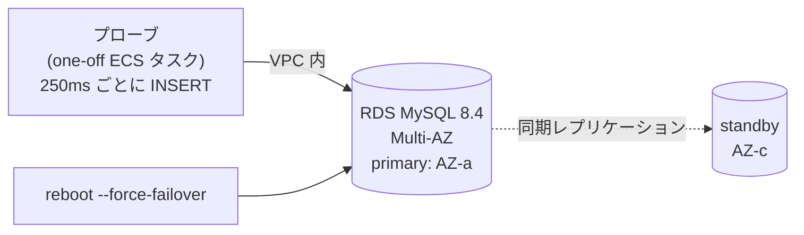

## はじめに

Blue/Green やカナリアの検証はさんざんやったのに、DB のフェイルオーバーは一度も測っていない——検証環境の棚卸しで見つけた穴です。「Multi-AZ にしてあるから大丈夫」は、フェイルオーバー中にアプリから何が見えるかを一度も観測していない状態では、宣言であって知識ではありません。

そこで使い捨てスタック（RDS MySQL 8.4 Multi-AZ、db.t4g.micro）を立てて `reboot --force-failover` を計4回撃ち、250ms 間隔の書き込みプローブと、実行中の DDL で挙動を観測しました。バックアップからの復元（RPO/RTO）も同じスタックで実測しています。全部あわせて **$2 未満**です。

先に一番大事な発見を書きます。

**フェイルオーバーの瞬間、確立済みのコネクションは「切断エラー」を返さない。無言で凍結する。**

## 実測1: プローブが10分間ハングした

構成はこうです。VPC 内の使い捨てコンテナ（one-off ECS タスク）から、250ms 間隔で `INSERT` を打ち続け、1回ごとに結果と所要時間を記録します。

1回目のプローブは `--connect-timeout=2` だけを設定していました。接続に2秒でタイムアウトするなら、障害中は2秒おきにエラーが出るだろう、という想定です。

結果: **フェイルオーバー開始の瞬間から、プローブは1行もログを出さなくなり、10分以上ハングしました。**

原因は分解するとこうなります。

1. `--connect-timeout` が効くのは**新規接続の確立**だけ。すでに確立したコネクションには何の関係もない
2. フェイルオーバーの瞬間、確立済み TCP はリセットパケットをもらえず**ブラックホール化**する（相手が消えたことを TCP 層は知らない）
3. MySQL クライアントの read timeout は**既定で無限**。だから返事を永遠に待つ

つまり障害は「エラーの山」ではなく「**返ってこないスレッドの山**」として現れます。エラーハンドリングをどれだけ丁寧に書いても、エラーにならないのだから発動しません。監視も「エラー率」を見ていたら何も出ません——出るのはレイテンシの天井張り付きと、プールの枯渇です。

対策はひとつで、**呼び出し自体に締め切りを掛ける**こと。Go なら DSN に `readTimeout=10s&writeTimeout=10s`（go-sql-driver）、または全クエリに context の deadline。接続プールの `ConnMaxLifetime` を短くしても救えません——寿命の判定はコネクションが**返却されたとき**に行われ、ハング中のコネクションは返却されないからです。

## 実測2: 締め切りを付けて測り直すと、窓は11秒だった

呼び出し全体に3秒の締め切りを付けて再計測した結果です。

| 観測 | 値 |
|---|---|
| プローブ総数 / 成功 / 失敗 | 1,074 / 1,045 / **29** |
| エラー窓（最初の失敗 → 最後の失敗） | **11.2 秒** |
| 最長の成功間隔（実効ダウンタイム） | **14.9 秒** |
| 失敗の内訳 | 28 × `ERROR 2003`（接続拒否、即時失敗）+ **1 × 凍結（3秒締め切りが回収）** |
| DNS が新プライマリを指すまで | フェイルオーバー指示から約 15 秒 |

29件の失敗のうち28件は接続拒否で**ミリ秒で返る**「行儀のよい失敗」です。即時に返るからリトライ戦略に乗せられる。危険なのは残り1件の凍結で、これは締め切りがなければ永遠でした。**フェイルオーバー対策の本体はリトライではなく締め切り**です。リトライは締め切りが機能して初めて意味を持ちます。

もうひとつ面白かったのは AWS 側イベントとの時差です。RDS のイベントログが「failover completed」を打つのは指示から44秒後でしたが、アプリの書き込みは**その20秒前に既に回復**していました。復旧判断をイベントで待つ運用は、実測より悲観的になります。

## 実測3: migrate 実行中に落とすとどうなるか

うちのデプロイは expand（互換を保つ DDL）を先行ジョブで流します。では **DDL の実行中に**フェイルオーバーが起きたら？

1,670万行のテーブルに `ALTER TABLE ... ADD CONSTRAINT ... ALGORITHM=COPY`（ベースライン105秒）を流し、開始20秒後にフェイルオーバーを撃ちました。

- DDL は**エラーにならずハング**した（実測1と同じ凍結。こちらは900秒の締め切りで回収）
- 中断後のテーブルは**無傷**: 制約は付いておらず、行数も 16,777,216 のまま。MySQL 8 の atomic DDL は中途半端な状態を残さない
- **再実行は素直に成功**（105秒）

結論として、migrate ジョブに必要なのは複雑な復旧手順ではなく、**ジョブ全体の締め切りと再実行**の2つだけでした。整合性は atomic DDL とマイグレーションツールのバージョン管理が持ってくれます。逆に締め切りの無い migrate ジョブは、フェイルオーバー1回で「終わらないデプロイ」に化けます。

おまけの発見: フェイルオーバーを短時間に連打すると、APIは即座に `rebooting` を返すのに、実際の切替開始まで**68秒遅延**したケースがありました（間隔を置けば11〜15秒）。ゲームデイで「今から N 秒後に落ちる」を前提にした台本は組めません。

## 実測4: バックアップは「復元して検算するまで」存在しない

同じスタックでバックアップ→復元も測りました。フェイルオーバー（15秒で戻る、AZ 障害向け）とバックアップ復元（分オーダー、誤 DDL・誤削除向け）は**守る障害クラスが違う**ので、両方の数字が要ります。

| 工程 | 実測 |
|---|---|
| PITR の最新復元可能時刻の遅れ（= RPO 上限） | **251 秒** |
| 手動スナップショット作成 | 454 秒 |
| スナップショットから新インスタンスが使えるまで | **396 秒** |
| PITR 復元が使えるまで | **577 秒** |

RPO ≈ 5分（binlog のアップロード間隔）は**設定だけで買える**下限で、それより短い要求はバックアップでなくレプリケーションの設計問題です。RTO は「インスタンス再作成を含む復元は分でなく**十分のオーダー**」と覚えておくと計画がずれません。

そして検算。元・スナップショット復元・PITR 復元の3台に同じ照合を流し、行数（16,777,216）・`CHECKSUM TABLE`・制約の有無まで**3台とも完全一致**を確認して、初めて「バックアップがある」と言えます。available になっただけでは、それは「起動した何か」です。

## 自分の環境で測るには

この実測は丸ごと再現できます。手順の骨子:

1. 使い捨ての VPC + RDS Multi-AZ（micro で十分）+ one-off コンテナを Terraform で立てる
2. プローブは「短い間隔の書き込み + **呼び出し全体の締め切り** + 1行1結果のログ」。締め切りを忘れると実測1を追体験します（それはそれで学びですが）
3. `aws rds reboot-db-instance --force-failover` を撃ち、ログからエラー窓・失敗の内訳・DNS フリップを読む
4. スナップショット→復元→**検算**→削除。所要を全部記録する
5. `terraform destroy` して残置ゼロを確認する

かかる費用は micro 数時間で $2 未満。「Multi-AZ にしてある」を「フェイルオーバー中に何が起きるか知っている」に変える値段としては安いはずです。

## まとめ

- フェイルオーバー時、確立済みコネクションは切断エラーでなく**凍結**する。対策の本体は締め切り（DSN の readTimeout / context deadline）で、`ConnMaxLifetime` では救えない
- 締め切りがあれば、エラー窓は **11.2秒**・失敗の96%は即時に返るリトライ可能な形だった
- DDL 中のフェイルオーバーは atomic DDL が後片付けしてくれる。migrate ジョブに要るのは**締め切りと再実行**だけ
- バックアップの数字: RPO ≈ 5分は設定で買える、復元 RTO は十分オーダー。**復元して検算するまでバックアップは存在しない**
