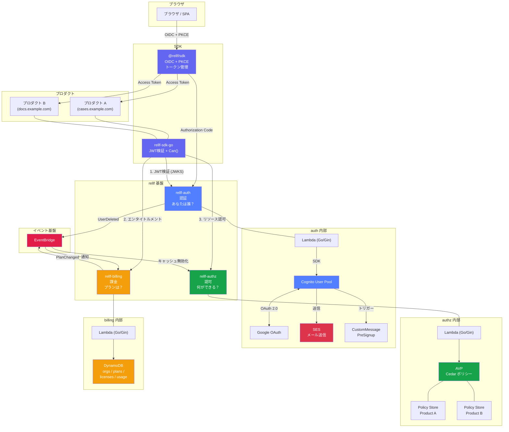
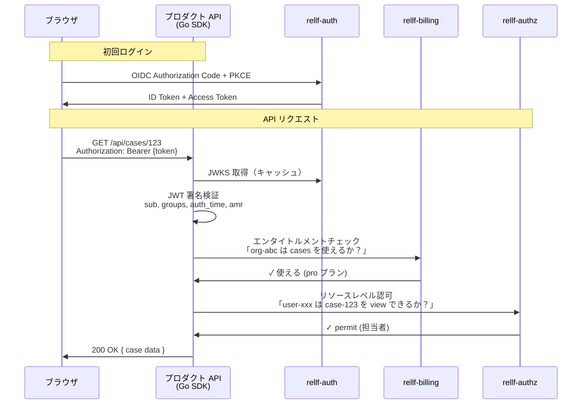
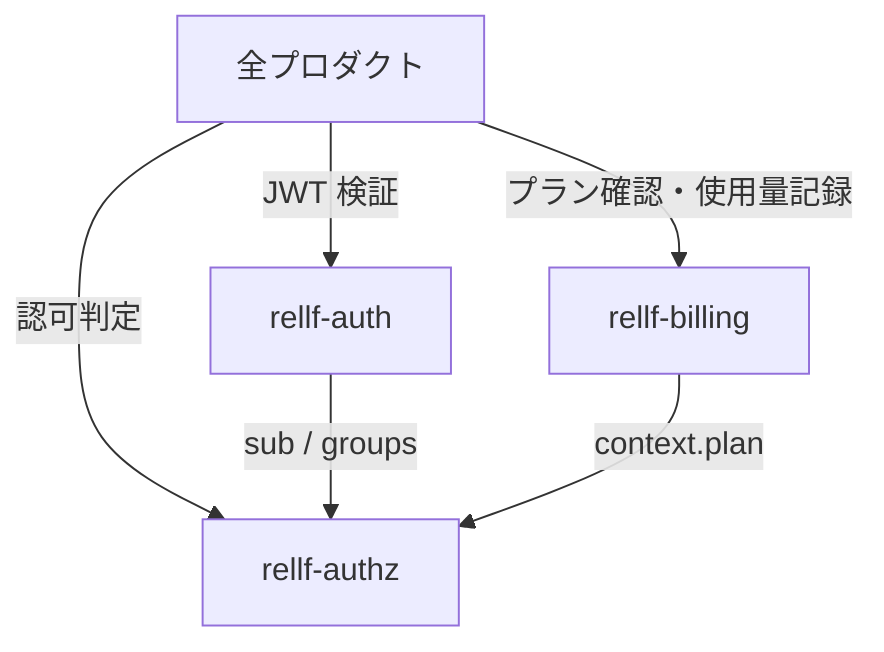
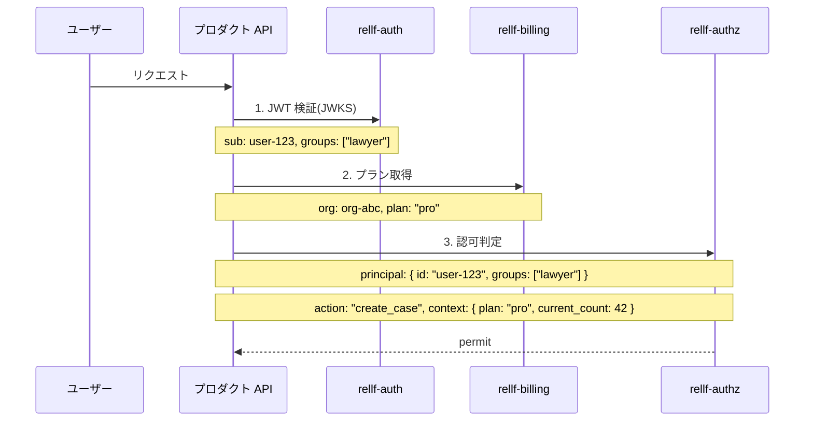

## はじめに

複数のプロダクトを運営するとき、認証・認可・課金は各プロダクトで個別に実装するのではなく、共通基盤として切り出す方が効率的です。

ただし「共通基盤」が 1 つの巨大なサービスになると、変更のリスクが高く、リリースサイクルも遅くなる。この記事では、3 つのサービスに責任を分離する設計を整理します。

## 3 サービスの全体像



### リクエスト処理の流れ



### 各サービスの責任

| サービス | 責任 | 持つデータ | 他プロダクトへの提供 |
|---------|------|----------|-------------------|
| **rellf-auth** | 認証、ユーザー ID 発行 | sub, email, groups, MFA | JWT (OIDC) |
| **rellf-authz** | リソースレベル認可判定 | Cedar ポリシー | IsAuthorized API |
| **rellf-billing** | 契約・プラン・エンタイトルメント・使用量 | org, plan, 上限, ライセンスキー | エンタイトルメント API |

### 判定の 2 段階

| 段階 | 担当 | 問い | 例 |
|------|------|------|-----|
| 1. エンタイトルメント | billing | このプランでこのプロダクト/機能が使えるか？ | pro なら cases は使える |
| 2. リソースレベル | authz | このユーザーはこのリソースに対して操作できるか？ | この案件の担当者か |

billing がプロダクトレベルの**ゲート**、authz がリソースレベルの**細かい判定**。プラン変更は billing のエンタイトルメント更新だけで即反映され、Cedar ポリシーの変更は不要。

## なぜ 3 つに分けるか

### 異なるライフサイクル

| サービス | 変更頻度 | ダウンの影響 |
|---------|---------|------------|
| auth | 低い（認証方式を頻繁に変えない） | 全プロダクト停止 |
| authz | 中（ポリシー追加は日常的） | 権限判定が止まる |
| billing | 高い（プラン変更、料金改定、機能追加） | 課金が止まる |

変更頻度が最も高い billing の改修で、auth が巻き込まれるのは避けたい。

### 異なるデータ特性

| サービス | データの性質 |
|---------|-----------|
| auth | ユーザー単位。高い可用性と一貫性が必要 |
| authz | ポリシー単位。読み取りが大部分 |
| billing | 組織単位。金銭に関わるので正確性が最優先 |

### 循環依存がない



- auth は誰にも依存しない（最上流）
- authz は auth の JWT を信頼するだけ
- billing は auth の sub で組織を紐付けるだけ
- **authz と billing は直接依存しない**（プロダクトが context として繋ぐ）

この「直接依存しない」のがポイントです。認可エンジンが課金 DB を直接見に行く設計にすると密結合になり、どちらかの障害がもう一方に波及します。

## 契約プランに応じた認可

「pro プランなら案件数無制限、free プランなら 10 件まで」のような制御をどう実現するか。

### 3 つの関心事を分離する

| 関心事 | 問い | 管理場所 |
|-------|------|---------|
| **契約プラン** | この組織はどのプランか？ | rellf-billing |
| **エンタイトルメント** | このプランで何が使えるか？ | rellf-billing（設定） |
| **認可判定** | このユーザーは今この操作ができるか？ | rellf-authz |

### データフロー



プロダクトが 3 つのサービスから情報を集め、context として認可エンジンに渡す。**組み立ての責任はプロダクト側にある**のがポイントです。

### Cedar ポリシーの例

```cedar
// pro 以上ならレポート機能にアクセス可能
permit(
  principal,
  action == App::Action::"view_reports",
  resource
) when {
  context.plan in ["pro", "enterprise"]
};

// free プランは案件数 10 件まで
forbid(
  principal,
  action == App::Action::"create_case",
  resource
) when {
  context.plan == "free" &&
  context.current_case_count >= 10
};
```

## JWT にプラン情報を入れるべきか

| | メリット | デメリット |
|---|---------|----------|
| **入れる** | 毎回課金 DB を引かなくていい | プラン変更が JWT 再発行まで反映されない |
| **入れない** | プラン変更が即反映 | 毎リクエスト課金 DB を引く |

**入れない方がいい**です。理由：

- プランは**組織単位**、JWT は**ユーザー単位**で粒度が合わない
- プラン変更（アップグレード・ダウングレード）は即座に反映したい
- JWT の TTL（1 時間等）の間、古いプランで動くのは体験が悪い

プロダクト側で数分の TTL でキャッシュすれば十分です。

## rellf-billing のスコープ

### 最小構成（初期）

| 機能 | エンドポイント |
|------|--------------|
| 組織のプラン取得 | `GET /api/orgs/:id/plan` |
| プラン変更 | `POST /api/orgs/:id/plan` |
| 使用量記録 | `POST /api/orgs/:id/usage` |
| 使用量取得 | `GET /api/orgs/:id/usage` |
| エンタイトルメント取得 | `GET /api/plans/:plan/entitlements` |

### 将来の拡張

| 機能 | 追加タイミング |
|------|-------------|
| Stripe 連携 | 外部ユーザーへの課金が必要になったとき |
| 請求書発行 | 法人契約が始まったとき |
| 使用量アラート | 上限に近づいたら通知 |
| トライアル管理 | 無料試用期間を提供するとき |

最初は「組織 × プランのマッピング + エンタイトルメント取得」だけで十分です。

## 技術スタックの統一

3 つとも同じ構成にすることで、開発・運用のオーバーヘッドを最小化できます。

| | rellf-auth | rellf-authz | rellf-billing |
|---|---|---|---|
| 言語 | Go / Gin | Go / Gin | Go / Gin |
| 実行環境 | Lambda (arm64) | Lambda (arm64) | Lambda (arm64) |
| API | API Gateway v2 | API Gateway v2 | API Gateway v2 |
| IaC | Terraform | Terraform | Terraform |
| ドメイン | auth.rikuka.dev | authz.rikuka.dev | billing.rikuka.dev |
| データストア | Cognito | AVP (Cedar) | DynamoDB |

## プロダクト側の SDK

3 サービスを毎回個別に呼ぶのはプロダクト側の負担になるので、共通の SDK（Go パッケージ）を提供するのが理想です。

```go
// プロダクト側のコード
client := rellf.NewClient(rellf.Config{
    AuthJWKS:    "https://auth.rikuka.dev/oidc/jwks.json",
    AuthzURL:    "https://authz.rikuka.dev",
    BillingURL:  "https://billing.rikuka.dev",
})

// ミドルウェアで JWT 検証
router.Use(client.Auth.Middleware())

// ハンドラーで認可判定（プラン情報も自動で取得）
allowed, err := client.Can(ctx, rellf.AuthzRequest{
    Principal: user.Sub,
    Action:    "create_case",
    Resource:  "Case",
})
```

SDK が内部で auth → billing → authz の順にデータを集めて判定する形にすれば、プロダクト側は `client.Can()` 1 行で済みます。

## まとめ

- マルチプロダクト基盤は **認証・認可・課金の 3 サービス**に分離する
- 3 つの間に**循環依存がない**のが設計のポイント
- 契約プランの情報は billing が持ち、認可判定時に **context として authz に渡す**
- JWT にプラン情報は入れない（即時反映のため）
- 技術スタックを統一し、SDK を提供してプロダクト側の負担を減らす
- billing は最小構成から始めて段階的に拡張する
