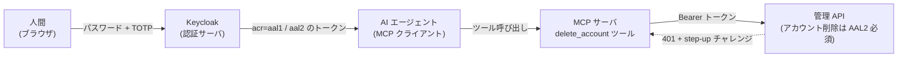

## はじめに

AI エージェントに社内の管理 API を触らせたい。ただし「アカウント削除」のような取り返しのつかない操作だけは、人間が確認してからにしたい。いわゆる **human-in-the-loop**（人間を判断の輪に入れる）の要件です。

これを「エージェントに確認ダイアログを出させる」「プロンプトで禁止する」で実装すると、エージェント側の実装やモデルの振る舞いに安全性を預けることになります。エージェントが確認を飛ばせば、それで終わりです。

この記事では、同じ要件を **認証の強さ（AAL）** で作りました。危険操作はパスワードに加えて TOTP（ワンタイムパスワード）まで済ませたトークンでしか通らないようにし、エージェントはそのトークンを自分では手に入れられない、という構成です。[検証リポジトリ](https://github.com/rikukaInoue/greenfield)で実際に動かした結果を書きます。

先に結論を書くと、**human-in-the-loop はアプリに実装した機能ではなく、認証サーバの設定から出てくる性質**になりました。アプリ側に書いたのは「この操作には AAL2 が要る」という1行だけです。

## 前提: AAL とステップアップ認証

**AAL（Authenticator Assurance Level）** は「どれだけ確かにその人か」の段階です。NIST SP 800-63B の定義で、ここでは2段階だけ使います。

- **AAL1**: パスワードのみでログインした状態
- **AAL2**: パスワードに加えて、もう1要素（ここでは TOTP）で確認した状態

**ステップアップ認証**は、普段は AAL1 で使わせ、危険な操作の直前にだけ AAL2 を要求する仕組みです。要求の出し方は **RFC 9470（OAuth 2.0 Step-Up Authentication Challenge Protocol）** が決めていて、API は次の応答を返します。

```http
HTTP/1.1 401 Unauthorized
WWW-Authenticate: Bearer error="insufficient_user_authentication", acr_values="aal2"
```

「トークンは有効だが、認証の強さが足りない。`aal2` で取り直してこい」という意味です。クライアントはこの `acr_values` を付けて認可をやり直し、認証サーバは不足分（TOTP）だけを追加で求めます。AAL の概念そのものは[ログイン強度の記事](/blog/oidc-aal-acr-amr/)で整理したので、ここでは実装と実測に絞ります。

## 構成

登場するのは4つです。



- **Keycloak**: 認証サーバ。トークンの `acr` クレームに AAL を載せる
- **管理 API**: アカウント削除エンドポイントが AAL2 を要求する
- **MCP サーバ**: 管理 API を「ツール」としてエージェントに公開する。MCP（Model Context Protocol）は AI エージェントが外部ツールを呼ぶための共通プロトコル
- **AI エージェント**: MCP 経由でツールを呼ぶ。手元にあるのは AAL1 のトークンだけ

## 実装1: 認証サーバに AAL の段階を作る

Keycloak には「どの段階ならどの認証手段を要求するか」を条件分岐で書ける認証フローがあります。設定は JSON で git 管理しています（realm-as-code）。

```json
{
  "attributes": { "acr.loa.map": "{\"aal1\":1,\"aal2\":2}" },
  "browserFlow": "browser-loa"
}
```

`acr.loa.map` は「クライアントが `acr_values=aal2` と言ってきたら段階 2」という対応表です。フローは次の形にしました。

| 段階 | 要求する認証 | 補足 |
|---|---|---|
| 1 | パスワード | 通常のログイン |
| 2 | パスワード + TOTP | `loa-max-age = 0`（段階 2 は毎回 TOTP を求める） |

`loa-max-age = 0` にしたのは、「一度 TOTP を通したら当分 AAL2 のまま」を避けるためです。危険操作のたびに人間の確認を挟みたいので、毎回求めます。

## 実装2: アプリは1行書くだけ

削除ハンドラの中身はこうです。

```go
func (h *handlers) adminDeleteAccount(ctx context.Context, in *Input) (*Output, error) {
	if err := h.deps.Assurance.RequireAAL(ctx, authz.AAL2); err != nil {
		return nil, err // 401 + WWW-Authenticate(RFC 9470)になる
	}
	// ... 権限確認と削除
}
```

`RequireAAL` はトークンの `acr` を見て、足りなければ RFC 9470 の 401 を返すだけです。エージェント向けの特別扱いは一切ありません。

## 実装3: MCP サーバはチャレンジをそのまま返す

MCP サーバのツールは、管理 API が 401 を返したら**そのチャレンジを結果としてエージェントに返します**。

```go
case http.StatusUnauthorized:
	return toolText(true, "この操作には人間の再認証(step-up)が必要です。"+
		"エージェントは自力で昇格できません。\n"+
		"WWW-Authenticate: "+resp.Header.Get("WWW-Authenticate"))
```

MCP のツール結果には「エラーかどうか」のフラグ（`isError`）があり、ここを true にすると、エージェントはツールが失敗したと認識します。ここで人間に引き継ぐ以外の道はありません。

## 実測

使ったスクリプトはリポジトリにあり、ブラウザのログインフォーム送信を curl で再現しています。TOTP の値は RFC 6238 どおりに計算して入力しています。

### ステップアップ認証そのもの

| 手順 | 結果 |
|---|---|
| パスワードだけでログイン | `acr=aal1` のトークン |
| そのトークンで削除 API | **401** + `error="insufficient_user_authentication", acr_values="aal2"` |
| `acr_values=aal2` で認可をやり直す | **TOTP だけを追加で求められ**、`acr=aal2` のトークン（パスワードの再入力なし） |
| 新しいトークンで削除 API | **200** |
| 古い AAL1 トークンで再度 | **401** のまま |

最後の行が大事で、TOTP を一度通しても、AAL1 のトークン自体が昇格するわけではありません。昇格した状態は新しいトークンにしか宿りません。

### エージェント経由

| 手順 | 結果 |
|---|---|
| エージェントが AAL1 トークンで `delete_account` を呼ぶ | ツールは **isError** で止まり、チャレンジを返す |
| エージェントが自分で AAL2 を取ろうとする（パスワードグラントに `acr_values=aal2`） | トークンは出るが **`acr=aal1` のまま** |
| 人間が TOTP で AAL2 トークンを取得し、同じツールを呼ぶ | **成功** |

2行目が human-in-the-loop の要です。エージェントは TOTP のシークレットを持たず、認証サーバは非対話のグラントで AAL2 を出しません。エージェントがどう振る舞おうと、危険操作は人間の TOTP 入力を経由しないと通りません。**安全性がエージェントの実装やモデルの判断に依存していない**のが、この構成の価値です。

## 監査には client_id でなく azp を使う

「誰が危険操作を試みたか」を記録するため、削除ハンドラに監査ログを足しました。試行（attempt）・拒否（challenged）・完了（completed）の3種類で、**AAL の判定より前に** attempt を出します。止められた試行こそ記録に残したいからです。

ここで1つ罠がありました。最初は「どのアプリが叩いたか」をトークンの `client_id` クレームで取ろうとしましたが、エージェントのトークンには `client_id` が入っていませんでした。

| トークンの取り方 | `client_id` クレーム | `azp` クレーム |
|---|---|---|
| client_credentials（サービス間通信） | あり | あり |
| 人間のログイン経由（認可コード / パスワード） | **なし** | あり（`agent`） |

Keycloak では `client_id` クレームはサービスアカウントのトークンにしか付きません。**azp（authorized party = トークンを取得したクライアント）** はどの取り方でも付くので、監査のクライアント識別子は azp で取るのが正解でした。監査ログはこうなります。

```json
{"msg":"audit","audit.event":"admin.account.delete.challenged",
 "actor.subject":"b54e...","actor.client_id":"agent","actor.aal":1,"target":"probe"}
```

「人間の alice のアカウントで、agent というアプリが、AAL1 のまま削除を試みて止められた」が1行で分かります。

## 検証中に踏んだ罠

どちらも**認証なしのリクエストでは見えない**種類でした。

**1. TOTP を設定ファイルに書くと、パスワードまで壊れる。** 検証用ユーザーの TOTP を realm の JSON に直接書いたところ、TOTP ではなく**パスワードのログインが** `invalid_user_credentials` で失敗するようになりました。エラーがパスワード側に出るので原因に気づきにくいです。設定ファイルに TOTP を書くのをやめ、初回のステップアップ時に Keycloak が出す TOTP 登録画面からシークレットを読み取って、その場で登録する形にしました。登録手順まで含めて検証できるので、実際の利用に近くなりました。

**2. パスの不一致がログインの 401 に隠れる。** 削除 API は `/accounts/{subject}:delete` という形で、`{subject}` にコロンを含む値（`user:probe`）を渡すとルーティングが一致せず 404 になります。ところが**トークンなしで叩くと、認証のミドルウェアがルーティングより先に 401 を返す**ため、404 が見えません。手元で「401 が返るからパスは合っている」と判断し、トークン付きで初めて 404 に気づきました。手前の層の応答が奥の層の問題を隠す形で、[fail open の記事](/blog/checks-fail-open/)で分類したものと同じ構造です。

## まとめ

- ステップアップ認証（RFC 9470）は、アプリ側では「この操作には AAL2 が要る」を書くだけで成立する。段階と要求手段は認証サーバの設定で持つ
- AI エージェントの human-in-the-loop は、エージェントに確認させるのではなく、**エージェントが自力で AAL2 を取れない**ことから作れる。安全性がエージェントの実装やモデルの判断に依存しない
- 監査のクライアント識別子は `client_id` でなく `azp`。`client_id` はサービス間通信のトークンにしか付かない
