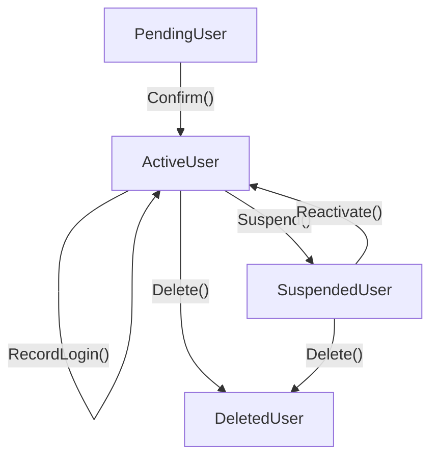

## ライフサイクル管理が必要な理由

認証基盤を作っていると、ユーザーは単に「存在する/しない」の二値ではないことに気づきます。


各状態で「何ができるか」が異なります。仮登録ユーザーにログインさせてはいけないし、一時停止中のユーザーのグループを変更する意味はない。

これをコード上でどう表現するか。3 つのアプローチを検討しました。

## アプローチ 1: 状態ごとに別の struct

```go
type PendingUser struct {
    ID, Email string
}
func (u *PendingUser) Confirm() *ActiveUser { ... }

type ActiveUser struct {
    ID, Email string
    Groups    []string
}
func (u *ActiveUser) Suspend(reason string) *SuspendedUser { ... }
```

**メリット:** 不正な遷移がコンパイルエラーになる。`PendingUser` に `Suspend` メソッドはない。

**デメリット:** 全ユーザーを一覧表示したい時に `[]User` のような共通の型がない。状態ごとに別のスライスを持つか、`interface{}` で扱うことになる。

## アプローチ 2: 1 つの struct + 状態フィールド

```go
type User struct {
    ID     string
    Status UserStatus
    Groups []string
    Reason string
}

func (u *User) Suspend(reason string) error {
    if u.Status != StatusActive {
        return fmt.Errorf("cannot suspend: user is %s", u.Status)
    }
    u.Status = StatusSuspended
    u.Reason = reason
    return nil
}
```

**メリット:** シンプル。`[]User` で一覧が自然に扱える。

**デメリット:** 不正な遷移がランタイムエラー。`SuspendedAt` は Active 状態では意味がないのに常にフィールドとして存在する。

## アプローチ 3: 参照は interface、更新は struct（採用）

```go
// 参照用: 状態に関係なく横断的に使える
type User interface {
    UserID() string
    UserEmail() string
    UserStatus() UserStatus
}

// 更新用: 状態ごとに型が異なる
type ActiveUser struct { ... }
func (u *ActiveUser) Suspend(reason string) *SuspendedUser { ... }
func (u *ActiveUser) Delete(reason string) *DeletedUser { ... }

type SuspendedUser struct { ... }
func (u *SuspendedUser) Reactivate() *ActiveUser { ... }
func (u *SuspendedUser) Delete(reason string) *DeletedUser { ... }

type PendingUser struct { ... }
func (u *PendingUser) Confirm() *ActiveUser { ... }

type DeletedUser struct { ... }
// メソッドなし — 終端状態
```

### なぜこの設計か

**参照と更新で求められることが違う。**

参照（一覧表示、監査ログ、検索）では、状態に関係なくすべてのユーザーを同じように扱いたい。`User` interface があれば `[]User` でまとめられる。

更新（状態遷移）では、不正な操作を防ぎたい。`PendingUser` に `Suspend` は呼べない。`DeletedUser` には何も呼べない。これは型で制約される。

### 状態遷移図



`DeletedUser` は終端状態です。遷移メソッドを持たないことで、コンパイル時に「削除済みユーザーに対する操作」が不可能になります。

### 各 struct のフィールド設計

状態ごとに「その状態で意味のあるフィールドだけ」を持ちます。

```go
type PendingUser struct {
    ID        string
    Email     string
    CreatedAt time.Time
    // Groups は持たない（まだ確認されていない）
}

type ActiveUser struct {
    ID          string
    Email       string
    Groups      []string     // 有効なユーザーだけがグループを持つ
    LastLoginAt *time.Time   // ログイン実績
    ActivatedAt time.Time
    CreatedAt   time.Time
}

type SuspendedUser struct {
    ID          string
    Email       string
    Groups      []string     // 復帰時に戻すために保持
    SuspendedAt time.Time    // いつ停止されたか
    Reason      string       // なぜ停止されたか
    CreatedAt   time.Time
}

type DeletedUser struct {
    ID        string
    Email     string
    DeletedAt time.Time
    Reason    string
    CreatedAt time.Time
    // Groups は持たない（もう不要）
}
```

`SuspendedUser` が `Groups` を保持しているのは、復帰時に `Reactivate()` でそのまま `ActiveUser` に戻せるようにするためです。

### Cognito データからの復元

永続化層（Cognito）から取得したデータを適切な型に復元する関数も用意しています。

```go
func FromCognito(id, email, status string, ...) (User, error) {
    switch UserStatus(status) {
    case StatusPending:
        return &PendingUser{...}, nil
    case StatusActive:
        return &ActiveUser{...}, nil
    case StatusSuspended:
        return &SuspendedUser{...}, nil
    case StatusDeleted:
        return &DeletedUser{...}, nil
    default:
        return nil, fmt.Errorf("unknown status: %s", status)
    }
}
```

返り値は `User` interface なので、参照系の処理はそのまま使えます。更新が必要な場合は型アサーションで具体的な struct に変換します。

```go
user, _ := FromCognito(...)

// 参照: そのまま
fmt.Println(user.UserID(), user.UserStatus())

// 更新: 型アサーション
if active, ok := user.(*ActiveUser); ok {
    suspended := active.Suspend("inactive 90 days")
}
```

## 検討したが不採用にしたアプローチ

### 更新系を interface にする案

```go
type Suspendable interface {
    Suspend(reason string) (*SuspendedUser, error)
}
```

小さい interface を組み合わせる Go らしいアプローチですが、呼び出し側で毎回 `if s, ok := user.(Suspendable)` と型アサーションが必要になり煩雑でした。

### 参照を状態ごとの struct、更新を interface にする案

参照と更新の責務が逆転するパターンも検討しましたが、参照で横断的に扱えないデメリットの方が大きかったため不採用。

## まとめ

| 観点 | 選択 | 理由 |
|---|---|---|
| 参照 | `User` interface | 一覧・ログ・検索で横断的に扱える |
| 更新 | 状態ごとの struct | 不正な遷移をコンパイル時に防ぐ |
| 終端状態 | `DeletedUser` にメソッドなし | 操作不可を型で表現 |
| 永続化からの復元 | `FromCognito()` → `User` | interface で返して参照系はそのまま使える |

「参照は interface、更新は struct」という分離は、Go の型システムの強みを活かしつつ実用性を両立できる設計だと思います。
